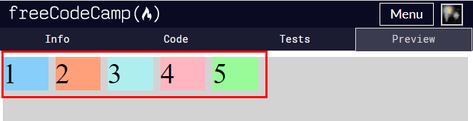
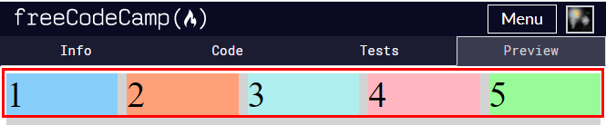
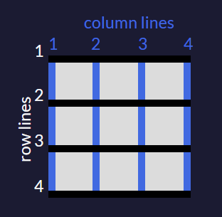

# Learning CSS3 Essentials
Took below courses and summarized essentials. 

- [Free code camp : CSS Flexbox](https://www.freecodecamp.org/learn/responsive-web-design/#css-flexbox) 
- [Free code camp : CSS Grid](https://www.freecodecamp.org/learn/responsive-web-design/#css-grid) 

## Tablet of Contents 
- [Learn by doing]()
- [CSS Flexbox]()
- [CSS Grid]()

## Learn by doing 
Summarized what I learned in a block quote form. 

### Basics
> CSS : selector { declaration }
```css
h1 {
    color: red;
}
```

You can **chain class name** to find a specific html element. 

```css
/* find p tag that has "test" class */
p.test {
    color: green;
}

/* find a p tag that has "test" and "experiment" class */
p.test.experiment {
    color: orange;
}
```

> Cover is often used for background-size property. It **scales the image as large as possible**. Image will be stretched if needed.

```css
h1 { 
    background-size: cover;
}
```

> position in CSS : 1) static(default) 2) fixed 3) absolute 4) relative 
> position: relative - the element now can move.
> position: absolute - search **parent element that has a relative position**.

> **Box model** in CSS: a box that wraps a HTML element around. 1. border : added to define space between elements 2. margin : outside the border 3. padding : inside the border 4. content : text and image 

> box-sizing default: **content-box**. Set box size as much as content size. **border-box**: box size bocomes content + padding + border.

> Setting **width and height in CSS** means setting the width and height of **content area**. Thus, a full size of an element becomes all the sum of the element(content), margin, padding, border

### Responsive design
> PPI : pixel per inch, DIP : dots per inch. Image might be seen as **lower PPI in high resolution display device** such as iMac and MacBook Pro. Simplest way to tackle this is half your image width and height. 

```css
img { 
    /* half original sizes */
    width: 100px; 
    height: 100px;
}
```

> Making images responsive with CSS is actually very simple. The **max-width of 100%** will make sure the image is never wider than the container it is in, and the **height of auto** will make the image keep its **original aspect ratio**.

```css
.responsive-img { 
    max-width: 100%;
    height: auto;
}
```

> **Media Queries** are a new technique introduced in **CSS3** that change the presentation of content based on different viewport sizes.

```css
p {
    font-size: 20px;
}
@media screen and (max-height: 800px) {
    p {
        font-size: 10px;
    }
}
```

> **Viewport** units are relative to the **viewport dimensions** (width or height) of a device, and **percentages** are relative to the size of the **parent** container element. 
> **vmin** (viewport minimum): 70vmin would be 70% of the **viewport's smaller dimension** (height or width)

```css
h2 { 
    width: 80vw;
}
p { 
    width: 75vmin;
}
```

> Vendor-prefixed properties are set to integrate inconsistencies between each browsers:  1) -webkit(Chrome, Safari) 2) -moz(FireFox) 3) -o(Opera) 4) -ms(Internet explorer)

```css
* {
    box-sizing: border-box;
    -moz-box-sizing: border-box;
    -webkit-box-sizing: border-box;
}
```

> Inline property **ignores the height and width** even when they are set. inline-block recognizes the height and width unlike inline property.

```css
.myProps { 
    display:inline-block;
    width: 40px;
    height: 40px;
}
```

> Positive margin farthers each element. **Negavtive margin closes each element**.

```css
.myProps { 
    margin : -1rem;
}
```
> Units in CSS : absolute unit, relative unit. 
- Relative units - em(by capital M width), ex(by lowercase x height), px, %(by default font), **rem : root element's font size**. fr: shrots for fraction. set available space within grid container as fraction. 

```css
.myProps { 
    font-size: 1em;
}

/* first column : auto, second : 100px, third : 1fr(1/3), fourth : 2fr(2/3) */
.gridContainer {
    grid-template-columns : auto 100px 1fr 2fr;
}
```

> **Cascading priority** in CSS : Inline style(strong) >>>> id >>>> class name >>>> tag(weak)  
```css
/* Add "!important" keyword to increase priority to the first. */
li  { 
     color: powderblue !important;
 }
```

> If a content has margin/padding/border set, measuring the content's size becomes somewhat difficult. Thus box-sizing property has become important.

```css
/* box-sizing:border-box is more convenient to align each element that has different box properties. */
.myProps { 
    box-sizing : border-box;
    color : blue;
}
```

> parent margin > child margin => parent margin. child margin > parent margin => child margin 

> Note that pseudo element like ::before, ::after do not work in SEO. **Search engine will ignore the pseudo elements' content**. Do not give a space between pseudo class and selector in CSS.

```css
/* correct */
.myProps::before {
    content: "hello";
    color: tomato;
}
/* incorrect */
.myProps ::before {
    content: "hello";
    color: tomato;
}
```

> float : Other element around the image will not penetrate the image. 
> clear : ignoring the float effect.

## CSS flex box
> Flexbox is a powerful, well-supported layout method that was introduced with the latest version of CSS, CSS3. With flexbox, it's easy to center elements on the page and create dynamic user interfaces that shrink and expand automatically. 

> Adding display: flex to an element turns it into a flex container. This makes it possible to align any children of that element into rows or columns. You do this by adding the flex-direction property to the parent item and setting it to row or column. Creating a row will align the children horizontally, and creating a column will align the children vertically.

```css
.container {
    display : flex;
}
```

Note that **container property** and **item property** are divided.

### Container property
#### Justify-content
> Sometimes the flex items within a flex container do not fill all the space in the container. It is common to want to tell CSS how to align and space out the flex items a certain way. Fortunately, the justify-content property has several options to do this. 

> space-between: aligns items to the center of the main axis, with extra space placed between the items. **The first and last items are pushed to the very edge of the flex container**. For example, in a row the first item is against the left side of the container, the last item is against the right side of the container, **then the remaining space is distributed evenly among the other items**.

> space-around: similar to space-between but the first and last items are not locked to the edges of the container, the space is distributed around all the items with a half space on either end of the flex container.

> space-evenly: Distributes space evenly between the flex items with a full space at either end of the flex container

#### Align-items
> CSS offers the align-items property to align flex items along the cross axis. For a row, it tells CSS how to push the items in the entire row up or down within the container. And for a column, how to push all the items left or right within the container.

> **stretch**: stretch the items to fill the flex container. For example, rows items are stretched to fill the flex container top-to-bottom. This is **the default value** if no align-items value is specified.

> baseline: align items to their baselines. Baseline is a text concept, think of it as the line that the letters sit on.

#### Flex-wrap
> CSS flexbox has a feature **to split a flex item into multiple rows (or columns)**. By default, a flex container will fit all flex items together. For example, a row will all be on one line.

> However, using the flex-wrap property tells CSS to wrap items. **This means extra items move into a new row or column**. The break point of where the wrapping happens depends on the size of the items and the size of the container.

> 1 ) **nowrap**: this is the default setting, and does not wrap items. 2) **wrap**: wraps items onto multiple lines from top-to-bottom if they are in rows and left-to-right if they are in columns 3) **wrap-reverse**: wraps items onto multiple lines from bottom-to-top if they are in rows and right-to-left if they are in columns.

### Item property
#### Flex-shrink
> When it's used, it allows an item to shrink if the flex container is too small. Items shrink **when the width of the parent container is smaller than the combined widths of all the flex items within it**.

> The flex-shrink property takes numbers as values. The higher the number, the more it will shrink compared to the other items in the container. For example, if one item has a flex-shrink value of 1 and the other has a flex-shrink value of 3, the one with the value of 3 will shrink three times as much as the other.

```css 
.box1 { 
    flex-shrink : 1;
}
.box2 { 
    flex-shrink : 2;
}
```

#### Flex-grow
> The opposite of flex-shrink is the flex-grow property. Recall that flex-shrink controls the size of the items when the container shrinks. The **flex-grow property controls the size of items when the parent container expands**.

```css 
.box1 { 
    flex-grow : 1;
}
.box2 { 
    flex-grow : 2;
}
```

#### Flex-basis
> The flex-basis property **specifies the initial size of the item before CSS makes adjustments with flex-shrink or flex-grow**. The units used by the flex-basis property are the same as other size properties (px, em, %, etc.). The value auto sizes items based on the content.

```css
.box1 { 
    flex-basis : 5rem;
}
.box2 { 
    flex-basis : 10rem;
}
```

#### Flex shorthand
> There is a shortcut available to set several flex properties at once. The flex-grow, flex-shrink, and flex-basis properties can all be set together by using the flex property. For example, 

```css
.box1 {
    /* flex-grow : 1, flex-shrink : 0, flex-basis : 10px */
    flex: 1 0 10px;
}
```

The default property settings are flex: 0 1 auto;. Be careful not to add white space between flex and semicolon. 

```css
.box1 { 
    /* incorrect */
    flex : 1 0 10px; 

    /* correct */
    flex: 1 0 10px;
}
```

#### Order
> The order property is used to tell CSS the order of how flex items appear in the flex container. By default, items will appear in the same order they come in the source HTML. The property takes numbers as values, and negative numbers can be used.

```css
.item1{
    order: 1;
} 
.item2{
    order: 2;
} 
```

#### Align-self
> The final property for flex items is align-self. This property allows you to adjust each item's alignment individually, instead of setting them all at once. This is useful since other common adjustment techniques using the CSS properties float, clear, and vertical-align do not work on flex items.

> align-self accepts the same values as align-items and **will override any value set by the align-items** property.

```css
.item1 { 
    align-self : center; 
}
```

## CSS grid
### What is CSS grid model? 
As flex box in CSS gets more universal and commonly used, more advanced form of flex box came out - CSS grid model for two-dimensional grid-based layout. It has been standardized by W3C(World Wide Web Consortium - global organization for web standard). 

[Check the latest CSS grid standard by W3C here](https://www.w3.org/TR/css-grid-1/)

> repeat(number of columns/rows, the column width we want);

## How is it different from CSS flex box? 
Flex box distributes its box items by main axis - when there is no more space to use in the axis, the container moves the next items based on cross axis. Compared to Flex box, **Grid allows developers to set each item location from the very first place** using grid-template-columns(rows) property. Developers can designate width, height, and etc when needed. Both layout can be applied and used altogether in one program - they are not exclusive. 

## Grid units
> fr: sets the column or row to a fraction of the available space
> auto: sets the column or row to the width or height of its content automatically,
> %: adjusts the column or row to the percent width of its container.

### Grid container
#### Grid-template columns/rows
> The number of parameters given to the grid-template-columns/rows property indicates the number of columns/rows in the grid, and the value of each parameter indicates the width of each column/rows.

```css
.container {
  display: grid;
  grid-template-columns: 50px 50px;
  grid-template-rows : 50px 50px;
}
```

##### Repeat
> Let's say you want a grid with 100 rows of the same height. It isn't very practical to insert 100 values individually. Fortunately, there's a better way - by using the repeat function to specify the number of times you want your column or row to be repeated, followed by a comma and the value you want to repeat.

```css
.container { 
    grid-template-columns: repeat(2, 1fr 50px) 20px;
    /* above equal to */
    grid-template-columns : 1fr 50px 1fr 50px 20px;
}
```

##### Minmax
> There's another built-in function to use with grid-template-columns and grid-template-rows called minmax. It's **used to limit the size of items** when the grid container changes size. To do this you need to specify the acceptable size range for your item

```css
.conatiner { 
    grid-template-columns : 1fr minmax(100px 200px);
}
```

##### Auto-fill and auto-fit
> The **repeat** function comes with an **option called auto-fill**. This allows you to automatically insert as many rows or columns of your desired size as possible depending on the size of the container. You can create flexible layouts when combining auto-fill with minmax. If your container can't fit all your items on one row, it will move them down to a new one.

```css
.container { 
    grid-template-columns : repeat(auto-fill, minmax(100px 2fr))
}
```



> auto-fit works almost identically to auto-fill. The only difference is that when the container's size exceeds the size of all the items combined, **auto-fill keeps inserting empty rows or columns** and pushes your items to the side, while **auto-fit collapses those empty rows or columns and stretches your items** to fit the size of the container.

```css
.container { 
    grid-template-columns : repeat(auto-fit, minmax(100px 2fr))
}
```



#### Grid-template-areas
> You can group cells of your grid together into an area and give the area a custom name. Do this by using grid-template-areas on the container like this:

```css
.container {
    grid-template-areas : 
        "header header header"
        "body body body"
        "footer footer footer";
}
```

> Every word represents a cell and every pair of quotation marks represent a row.

> you can place an item in your custom area by referencing the name you gave it. To do this, you use the grid-area property on an item like this:

```css 
.item1 {
  grid-area: header;
}
```

> This lets the grid know that you want the item1 class to go in the area named header. 
> If your grid doesn't have an areas template to reference, you can create an area on the fly for an item to be placed like this:

```css
.item1 { 
    /* grid-area: horizontal line to start at / vertical line to start at / horizontal line to end at / vertical line to end at; */
    grid-area : 1/1/3/4;
}
```

#### Grid gap
> Sometimes you want a gap in between the columns. To add a gap between the columns, use the grid-column-gap property like this:

```css
.container {
    grid-column-gap : 10px;
    grid-row-gap : 10px;
}

/* Or use shorthand grid-gap like below */
.container { 
    grid-gap : 10px 10px;
}
```

#### Justify-items 
> Sometimes you want all the items in your CSS Grid to share the same alignment. ...  you can align them all at once horizontally by using justify-items on your grid container.

```css
.container { 
    /* center, end, start */
    justify-items : center;
}
```

#### Align-items
> Using the align-items property on a grid container will set the vertical alignment for all the items in our grid.

```css
.container { 
    /* center, end, start */
    align-items : center;
}
```

### Grid item
#### Grid-column
> **The hypothetical horizontal and vertical lines that create the grid** are referred to as lines. These lines are numbered starting with 1 at the top left corner of the grid and move right for columns and down for rows, counting upward.



> To control the number of columns an item will consume, you can use the **grid-column property in conjunction with the line numbers** you want the item to start and stop at.

```css
.item2 { 
    /* assume 4x4 grid */
    grid-column : 3/5;
}
```

#### Grid-row
> you can make items consume multiple rows just like you can with columns. You define the horizontal lines you want an item to start and stop at using the grid-row property on a grid item.

```css
.item2 { 
    /* assume 4x4 grid */
    grid-row : 3/5;
}
```

#### Justify-self 
> In CSS Grid, the content of each item is located in **a box which is referred to as a cell**. You can align the content's position within its cell horizontally using the justify-self property on a grid item. **By default**, this property has a value of **stretch**, which will make the content fill the whole width of the cell. This CSS Grid property accepts other values as well:
> start: aligns the content at the left of the cell,
> center: aligns the content in the center of the cell,
> end: aligns the content at the right of the cell.

```css
.item1 { 
    justify-self : center;
}
```

#### Align-self
> Just as you can align an item horizontally, there's a way to align an item vertically as well. To do this, you use the align-self property on an item. This property accepts all of the same values as justify-self from the last challenge.

```css
.item1 {
    align-self : center;
}
```

## Reference 
- [Free code camp : CSS Flexbox](https://www.freecodecamp.org/learn/responsive-web-design/#css-flexbox) 
- [Free code camp : CSS Grid](https://www.freecodecamp.org/learn/responsive-web-design/#css-grid) 