# 컴퓨터 네트워크 기초
아래 강좌들을 수강 후 중요 내용을 요약 및 정리함. 대부분의 요약은 한국어로 진행되나 편의상 영문으로 옮길 때가 있음. 

- [Udemy - Networking Concepts for Beginners (ENG)](https://www.udemy.com/course/networking-concepts-for-beginners/learn/lecture/6060530?start=15#overview)
- [Neso academy - Computer network (ENG)](https://www.udemy.com/course/networking-concepts-for-beginners/learn/lecture/6060530?start=15#overview)

## Udemy - 비기너를 위한 네트워킹 컨셉 
강좌 전체 내용은 아래 링크에서 찾아볼 수 있음. 

- [Udemy - Networking Concepts for Beginners (ENG)](https://www.udemy.com/course/networking-concepts-for-beginners/learn/lecture/6060530?start=15#overview)

### Networking fundamentals
아래와 같은 내용들을 다룸. 

1. LAN/WAN protocols
2. Packets, IP, TCP, DNS
3. Routers
4. Physical security
5. Information assurance
6. Computer security
7. Contingency and continuity
8. Password management

### 네트워크 타입 : LAN과 WAN
- LAN(Local Area Network) - 통신과 자원(프린터, 저장 공간 등)을 공유하는 **여러 개의 컴퓨터와 주변 기기가 서버에 연결**된 것이다.
- WAN(Wide Area Network) - **여러 개의 LAN**이 모여 더 넓은 지역을 커버함.

### LAN 프로토콜
LAN에 참여하는 **네트워크 기기들의 통신 방법**을 정해놓은 규약. 컴퓨터 네트워킹 프로토콜은 대개 **패킷 스위칭** 기법을 사용함. 

<details>
    <summary>패킷이란?(펼쳐보기)</summary>

패킷이란 **네트워크 상에서 한 번에 전송할 데이터의 크기**를 나타내는 말이다. 네트워크 종류에 따라 패킷의 크기가 달라진다. 패킷은 전송 시작 전 번호가 부여되고 나눠지며(A데이터 => 1,2,3,4, ...) 전송 완료 이후 다시 번호대로 정렬되고 복구된다(1,2,3,4 ... => A데이터). **데이터 분할 전송(패킷 단위)을 통해 전송 상의 이점**을 챙기기 위해 사용됨(여러 컴퓨터에게 동시 전송, 대용량 데이터 분할 전송 등).  
</details>

<details>
<summary>패킷 스위칭이란? (펼쳐보기)</summarr>

> a mode of data transmission in which a message is broken into a number of parts which are sent independently, over whatever **route is optimum for each packet**, and reassembled at the destination.
</details>

#### LAN 프로토콜의 종류
1. **Ethernet** - 가장 광범위하게 사용되는 LAN 프로토콜. 네트워크 기기들은 **반드시 물리적 케이블을 통해 연결**되어 무선 LAN 기술보다 **강한 보안 수준**을 자랑함. Star, Bu, Tree와 같은 토폴로지를 사용

<details>
    <summary>Ethernet 종류(펼쳐보기)</summary>


- Fast Ethernet - **구리 재질** Ethernet 케이블(초당 100 메가 비트 데이터 전송 속도)
- Gig Ethernet - **광섬유 재질** Ethernet 케이블 (초당 10억 비트 데이터 전송 속도. 엔터프라이즈용 네트워크에 주로 사용됨)
</details>

2. WiFi - **WLAN(Wireless LAN)**. 데이터 캡슐화를 위해 **전자기파 범주의 주파수**를 사용함.

<details>
<summary>와이파이란? (펼쳐보기)</summarr>

> **The name Wi-Fi has no further meaning**, and was never officially a shortened form of "Wireless Fidelity". Nevertheless, the Wi-Fi Alliance used the advertising slogan "The Standard for Wireless Fidelity" for a short time after the brand name was created.
</details>

3. **ATM LANE** - Asynchronous Transfer Mode(비동기 전송 모드). 다른 LAN 프로토콜과 달리 **데이터를 고정된 사이즈의 패킷으로 전송함**(초당 155 메가 비트 이상의 데이터 전송 속도)

### WAN 프로토콜
LAN보다 훨씬 큰 크기의 네트워크에서 기기들의 통신 방법을 정해놓은 규약. **광역 통신망 WAN은 서로 다른 지역의 근거리 통신망 유저들이 통신**하도록 도와주는 역할을 한다. LAN과 WAN의 상관 관계는 아래와 같다.


<details>
    <summary>영역별 네트워크 종류(펼쳐보기)</summary>

1. PAN(방 단위)
2. LAN(건물 단위)
3. CAN(캠퍼스 단위)
4. MAN(도시 단위)
5. WAN(광역 단위)

WAN 프로토콜의 종류는 아래와 같다. 

- X.25, Frame Relay, ISDN, DSL 등

WAN 프로토콜 종류에 대해서는 다루는 내용의 범위가 필요 이상을 넘었다고 판단하여 여기에서는 생략한다.
</details>

### 네트워크 기기
네트워크 기기들은 네트워크 상에서 데이터를 받거나 만들어내는 역할을 한다. 네트워크 기기 종류는 아래와 같다.

1. HUB - Star 토폴로지를 사용하는 **네트워크상에서 중앙 연결점이 되는 기기**(통상 Concentrator라고 명칭함). 여러 개의 독립적인 포트를 가지고 있는 하드웨어. One to many connections. 기기 A가 기기 C에게 패킷1을 전달하고 싶을 경우 **패킷 1은 허브를 통해 모든 기기들에게 뿌려짐**.

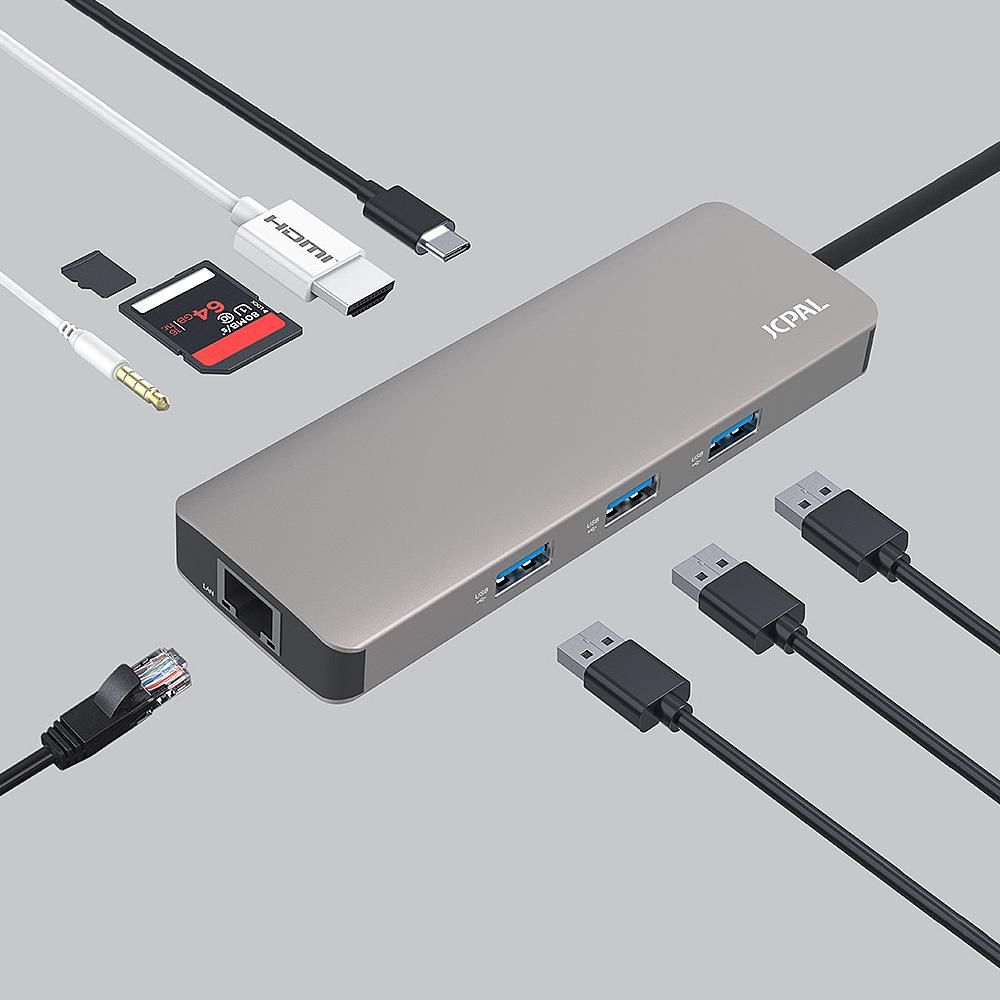

2. Switches - 네트워크 부하를 낮추고 속도를 높이기 위해 특정 레이어를 추가해서 사용하는 HUB의 한 종류. One to one conneciton.

3. Routers - **패킷 데이터를 전송**하는 역할. 패킷에는 발신자, 데이터 유형, IP 주소 등 여러 식별 정보가 포함되어 있다. 라우터는 이 레이어를 읽어 우선 순위를 설정하고, **우선 순위에 맞추어 패킷 전송에 사용할 최적 라우트를 선택**한다.

<details>
    <summary>라우터 작동 원리(펼쳐보기)</summary>

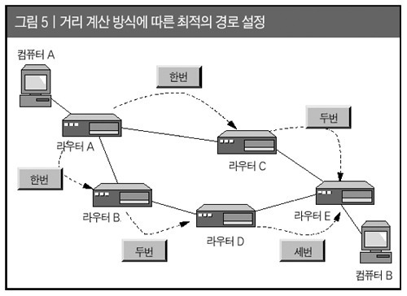
</details>

4. NIC - Network Interface Card. 컴퓨터 내에 **네트워크 통신을 위해 설치된 하드웨어 카드**. 네트워크 케이블과 연결할 **포트를 하나 이상 제공**하고, 컴퓨터 역시 네트워크 어댑터를 컨트롤 하기 위한 드라이버를 제공한다.

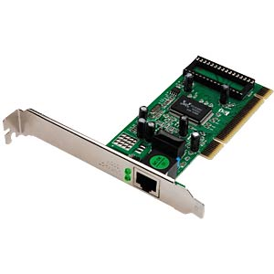

### 네트워크 토폴로지
**토폴로지(망 구성 방식)란 컴퓨터 네트워크를 연결해놓은 방식**을 의미한다. LAN의 경우 물리적/논리적 토폴로지 둘 다 보여줄 수 있다. 

- 물리적 토폴로지 : 노드들을 물리적으로 배치하는 것(e.g 노드 A, B는 건물 4층에 위치, 노드 C,D는 건물 입구에 배치)
- 논리적 토폴로지 : 노드끼리의 데이터 흐름을 관리.


### 토폴로지 종류
1. Bus - 모든 컴퓨터와 주변 기기가 하나의 케이블로 연결되고 2개의 엔드포인트를 가짐. **하나의 메인 케이블로 연결**되어 있기 때문에 지점 A의 데이터를 지점 D에게 보내기 위해서는 B,C를 거쳐야 한다는 단점이 있음.

2. Star - 중앙 집권적. 하나의 허브 노드(컴퓨터 또는 서버)가 존재하고 **모든 컴퓨터와 주변 기기가 허브로 연결**되는 구조. 버스 토폴로지와 다르게 데이터 전송 시 모든 워크스테이션을 거치지 않아도 된다는 장점이 존재.

3. Ring - 닫힌 루프 구조. 각각의 컴퓨터는 정확히 2개의 이웃 기기와 연결됨.

4. Mesh - 모든 네트워크 노드가 서로에게 연결되어 있음. Full mesh와 partial mesh 구조로 나뉠 수 있으며, full mesh에서 필요 없는 노드 연결을 끊을 경우 partial mesh 구조로 변함.

5. Tree - 하나의 루트 노드가 존재하고, 하위 노드들이 계층 구조를 이룸. 적어도 3개의 계층이 필요함. Star 토폴로지 + Bus 토폴로지

6. Hybrid - **서로 다른 토폴로지가 합쳐서 새로운 토폴로지를 구성**함. 새로운 컴포넌트를 추가해 네트워크의 크기를 키우는 데 유리하며, fault detection/trouble shooting이 용이하다는 장점이 있음.

### IP(Internet Protocol)
네트워크 상에서 **컴퓨터의 위치를 특정**하고 **기기 간 데이터를 전송**하는 방법을 명시한 통신 규약. **컴퓨터들의 우편 시스템**. 주로 TCP 프로토콜과 함꼐 사용되며 인터넷 상 각각의 컴퓨터(호스트)는 적어도 하나의 IP주소를 할당 받게 됨.

TCP/IP 프로토콜을 통해 기기 간 통신을 할 경우 IP 주소가 필요함. **IP 주소는 4개의 숫자로 구성되고 숫자의 크기에 따라 IPv4/IPv6로 구별**됨. IP 패킷을 주고 받는 기기를 **IP host**라고 부르며, IP 주소를 사람이 알아보기 쉽게 네이밍 하는 역할을 DNS(Domain Name System)가 맡아줌. 

각각의 IP 주소가 가지는 의미는 기초 수준 이상의 내용을 담고 있다고 판단 이하 생략함. 
- e.g. 클래스 E 주소 : 240.0.0.0.0 ~ 255.255.255.254. 

<details>
    <summary>IP 주소란? (펼쳐보기)</summary>

네트워크 상에서 **특정 컴퓨터 기기를 식별하기 위해 사용되는 주소**로, 32비트 4개의 숫자로 이루어져 있다. 각 숫자들은 .(dot)으로 구별한다. 일반적으로 십진수를 사용하는 버전 4, 즉 **IPv4가 보편화**되어 있으며 0.0.0.0. ~ 255.255.255.255 범위 내에 IP 주소가 존재한다. 

- 존재 가능한 IPv4 주소 개수 : 2^32 => 4,294,967,296개(43억개)

일부 번호들은 특정 목적을 위해 선 예약되어 있다. 예를 들어 127.0.0.1의 경우 localhost(로컬 호스트, 루프백(loopback))로 자기 자신을 가리킨다. **32 비트로 모든 단말기의 수를 지정하기 힘들어지자 IPv6에서는 주소 길이를 128비트로 늘리게 되었다**. 

- IPv6 예시 -  1050:0000:0000:0000:0005:0600:300c:326b
> IPv6 uses 128-bit (2128) addresses, allowing 3.4 x 1038 unique IP addresses. This is equal to 2^128, 340 trillion trillion trillion IP addresses.

</details>

자기 자신의 PC IP 주소는 아래의 명령어로 확인할 수 있다(Windows 기준)

```shell
$ipconfig
```

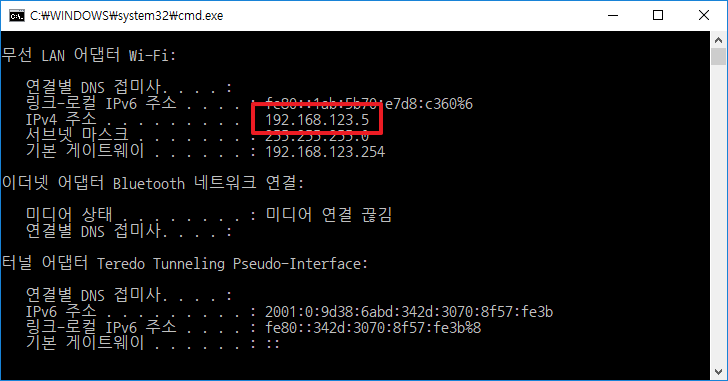

### TCP/IP
TCP/IP 크게 1) HTTP 2) HTTPS 3) FTP 3가지로 구성되어 있다. HTTPS와 달리 HTTP는 보안상 검증된(secure) 데이터 전송을 지원하지 않는다. **HTTPS의 경우 웹 사이트-웹서버간의 인증(authentication)을 지원해 HTTP에 security를 의미하는 s를 덧붙여 HTTPS** 라고 명칭한다. 

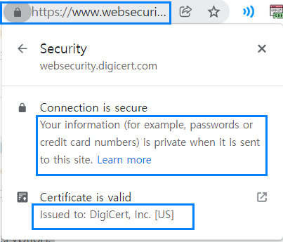

FTP(File Transfer Protocol)는 2개 이상의 **컴퓨터 기기 사이에서 데이터를 주고 받는 방법**을 명시한 프로토콜이다. **클라이언트<=>서버 아키텍쳐**를 차용하며, **SSL/TLS**와 같은 보안을 활용한다.

<details>
    <summary>SSL/TLS이란? (펼쳐보기)</summary>

SSL, 즉 **Secure Socket Layer**은 옛 명칭으로 현재는 TLS, **Transport Layer Security**로 정식 명칭이 바뀌었다. **웹 브라우저와 웹 서버 간의 암호화 통신**을 위해 TCP/IP 계층에서 동작하는 프로토콜을 의미하며 아래와 같은 역할을 수행한다. 

- 인증, 암호화, 변조 방지
</details>

### TCP와 UDP의 비교
UDP(User Datagram Protocol)의 경우 패킷 전송 시 **손실된 패킷을 무시하고 전송하므로 TCP보다 전송률이 좋다**는 장점이 있다. 따라서 소량의 패킷 손실이 치명적이지 않은 **스트리밍 서비스, 실시간 방송** 등에 사용된다. 단순한 요청-응답 통신을 필요로 하는 곳에 적합하며 3 handshake 과정을 거치지 않는다.  

### TCP dump
**네트워크와 이더넷의 이상 유무를 체크하기 위해 패킷 헤더를 체크**하고 기준에 부합하는지 확인하는 오픈 소스 CLI 툴. 주로 유닉스 운영체제에서 호환되며 윈도우에서는 Windump로 대체 사용. 네트워크 상의 모든 기기는 유니크한 IP 주소를 가지고 있고 **이 IP 주소를 통해 자원이 전달**됨.  

<details>
    <summary>ICMP란? (펼쳐보기)</summary>

인터넷 제어 메세지 프로토콜(ICMP)이란 Internet Control Message Protocol의 줄임말으로 **IP 상에서 통신이 비정상적으로 종료**될 경우(호스트가 꺼져 있거나, 선이 끊겨 있거나), 출발지 호스트에게 **오류/에러 메세지를 전송**하는 데 주로 사용된다. 인터넷 프로토콜(IP)의 주요 구성원 중 하나로 IP에 의존하여 작업을 수행한다. 

- [좀 더 자세히 알아보기](http://www.deadfire.net/tcpip/tcpip16.html)
</details>

### 라우터
**라우터는 네트워크 기기**로, 하나의 네트워크가 또 다른 네트워크를 만나는 지점에 위치하여 **네트워크들을 연결하고 전달하려는 패킷을 보낼 최적의 루트를 찾으려 노력**한다. 무선 라우터(와이파이)의 경우 모뎀에 선을 연결하지 않고도 기기를 네트워크에 연결시켜 준다. 해당 라우터에 설정한 비밀번호를 바르게 입력한 기기들은 모두 네트워크 이용이 가능하다. 흔히 가정에서 사용하는 **공유기는 라우터의 기능 중 일부를 특화시켜 인터넷 사용이 가능하도록 만든 기기**이다.

#### 라우팅
라우팅이란 네트워크 상에서 데이터 **패킷을 출발지에서 도착지로 보내는 프로세스**를 의미한다.

- 디폴트 라우팅 : 모든 라우터를 단일 라우터로 보내도록 구성
- 정적 라우팅 : 라우팅 테이블의 경로를 수동으로 추가
- 동적 라우팅 : 라우팅 테이블의 경로를 자동으로 조정. 하나의 경로가 다운되면 네트워크 대상에 도달되도록 자동으로 조정됨. 

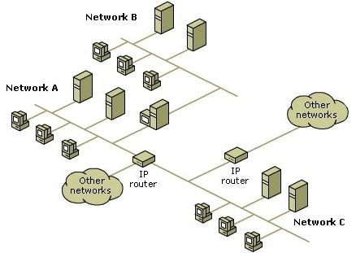

### Access control 프로토콜
라우터 업데이트, 트래픽 흐름 관리, 네트워크 접근 설정 관리 등을 정해놓은 규약. 네트워크 보안 유지를 위해 설정하며 **어떤 아이피, 즉 어떤 호스트에게 네트워크 접근을 허용할 것인지** 설정함.  

### 물리적 보안(Pysical security)
도난, 화재, 침수 등을 방지하기 위한 기기 및 데이터 보안의 첫 번째 출발선. 

<li>자연 발생적 위험 - 지진, 화재 등</li>
<li>인위적 위험 - 도난, 부주의로 인한 손상 등 : CCTV, 지문 인식, 외부인 출입 금지 등으로 대응 </li>

### 심층 방어(Defense in depth)
기업의 정보 자산을 보호하기 위한 다수의 보안 대책을 복합적으로 사용하는 것을 의미. 여러 보안 레이어를 섞어 사용함으로써 보안성을 높임. 

### 계층 보안 (Layered security)
다수의 보안 레이어(A, B, C ....)를 만들어 중요한 정보를 보호하는 방식. 각 레이어 간 상호 작용하며 보안성을 지키는데 기여함. **해커(공격자)의 경우 레이어 A,B,C ... 를 모두 돌파해야 정보를 탈취할 수 있음**. 계층보안 전략은 정보 자산을 지키는 데 중요한 역할을 함. 

### 위험 모델(Risk model)
보안상 위험 요소들을 그 위험 정도에 따라 분류하고, 해당 위험으로 인해 발생할 미래 결과(주로 경제적 수치로 표시)를 예상하는 작업.

### 인증(Authentification)과 권한 부여(Authorization)
유저 네임과 패스워드를 통해 유저를 식별하는 작업.

 - 인증 : Who are you?
 - 권한 부여 : What can you do?

### 암호화(Encryption)
- SSH(Secure Shell) : 암호학적 네트워크 프로토콜 중 하나이다. 주로 시스템 관리자가 보안화가 되지 않은 네트워크의 **호스트에게 안전하게 접속할 수단을 제공**하고, **원격으로 시스템/어플리케이션을 조작**할 수 있도록 도와준다. 클라이언트(세션 표시) - 서버(세션 실행) 모델을 사용한다.

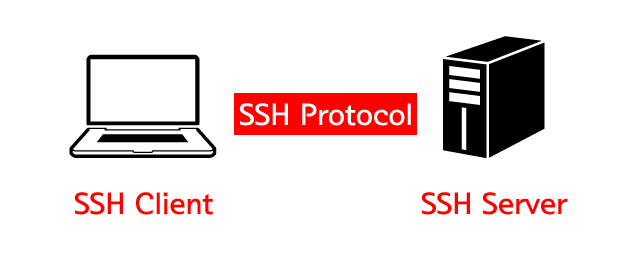

- 로그인 세션 : 세션이란 특정 시간 동안 벌어지는 일련의 작업들을 일컫는다. **로그인 세션은 유저 로그인 ~ 유저 로그아웃시 벌어지는 일련의 작업**들을 지칭한다. 

### 컴퓨터 보안 정책
네트워크 접속시 지켜야 할 정책들을 의미함.

- 유저 정책 : 비밀 번호 정책, 모뎀 사용 제한 등
- IT 정책 : IT 부서들이 지켜야할 일반 정책들을 의미함. e.g : 백업 정책, 유저 공지 정책, 방화벽 정책(사용 가능 포트 구분 및 제한)
- 일반 정책

<details>
    <summary>스코프란? (펼쳐보기)</summary>

Scope란 정책이 적용되는 범위를 의미하며, **적용되는 범위와 되지 않는 범위에 대한 불확실성을 제거**해야 한다. e.g : acceptable use policy, disaster recovery policy
</details>

### 비밀번호 관리
**비밀번호는 계층 보안의 시작점**과도 같으므로 올바른 비밀번호 정책의 마련과 여러 개의 계정을 하나의 비밀번호로 통일하지 않는 등과 같은 조치가 필요하다. 비밀 번호 **해킹은 매칭되는 결과가 있을 때까지 계속 시도하는 brutal force** 방식 등이 이용된다. 

#### 인증 방식
1. 토큰 인증 : 유저 네임과 비밀번호를 입력 => 일정 기간 후 사라지는 토큰 발급 => 토큰 사용 및 웹 사이트 접근 및 이용 
2. 신체 인증 : 지문 인식이 가장 대표적. 
3. 홍채 인증 : 망막의 혈관 패턴을 식별자로 삼고 패턴 매칭이 될 경우 인증이 성공함. **복제가 어렵다는 장점**이 있으므로 **핵 원자로, 군사 시설** 등 높은 보안이 요구되는 곳에 사용됨. 
4. 통합 인증 (Single sign-on, single log out) : **하나**의 아이디와 비밀 번호로 **여러 곳**의 어플리케이션에 로그인.로그아웃을 하는 방식.

<details>
    <summary>데이터베이스와 서버는 어떻게 다른가? (펼쳐보기)</summary>

**데이터베이스는 백엔드 데이터를 모아서 가공하는 소프트웨어**이며 **서버는 네트워크 상에서 자원을 관리하며 중앙화된 저장 공간을 제공**하는 하드웨어이다. 

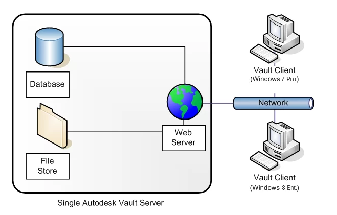

</details>

## Neso academy - 컴퓨터 네트워크 개론
강좌 전체 내용은 아래 링크에서 찾아볼 수 있음. 

- [Neso academy - Computer network (ENG)](https://www.udemy.com/course/networking-concepts-for-beginners/learn/lecture/6060530?start=15#overview)

### 네트워크의 이해
컴퓨터 네트워크란 **데이터를 주고 받는 것이 가능한 기기(Node)**들이 모종의 **연결(communication links or media)**을 통해 이루어진 **결합**을 말한다. 여기서 Node란 컴퓨터, 프린터 등 데이터 통신이 가능한 모든 기기를 의미한다. 

노드 간의 연결은 1) 유선 또는 2) 무선으로 진행된다. 아래 그림에서 알 수 있듯, 네트워크 기기들은 데이터 유통 단계에 따라 intermidiary node, end device 등으로 구분할 수 있다. 

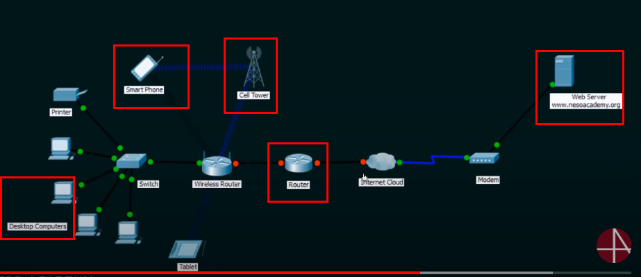

|End devices|Intermediary nodes|
|:---------:|:----------------:|
|Desktop    |Switch            |
|Smartphone |Wireless router,  |
|Tablet     |Router, internet cloud |
|Printer    |Modem             |
|Web server |cell tower        |

이와 같은 **네트워크는 자원의 공유를 목적**으로 만들어진다. 

### 컴퓨터 네트워크의 특성
모든 컴퓨터 네트워크는 다음과 같은 4가지의 기본 특성을 가져야 한다.

- Fault tolerance : 네트워크 내에서 어떤 실패/오류가 발생하더라도 1) 네트워크 자체는 **지속해서 동작**해야 하며, 2) 서비스의 중단이 없어야 한다.  
- Scalability : 네트워크는 1) 필요에 따라 **확장이 가능**해야 하며, 2) 확장 이후의 퍼포먼스가 보장되어야 한다. 
- Quality of Service(QoS) : 네트워크는 데이터의 우선 순위를 설정해 **중요한 데이터를 선처리**할 수 있어야 한다. e.g => VoIP(리얼타임) 데이터 > 이메일 데이터 
- Security : 네트워크는 비인가된 접근을 금지하고, 데이터 위조를 방지할 수 있어야 한다. 이를 위해 초기 전송된 데이터는 해커가 알아볼 수 없고, **송/수신자만이 이해할 수 있도록 전환되어 전송**되어야 한다. 

<details>
<summary>VoIP 휴대폰이란?(펼쳐보기)</summary>

> A VoIP phone is a kind of **telephone that uses IP technology to transmit calls**. It can come either in the form of specialized digital hardware or a program (running on a computer or mobile device) that performs the same functions.

> With its microphone and receiver, **a VoIP telephone takes the sound you generate and converts it into packets of data**, which it sends over the network and out through the internet. On the other end, the phone decompresses the data and plays it back for the other person to hear.
</details>

네트워크 상 모든 노드들은 데이터를 송신하기 이전 아래와 같은 절차를 거쳐야 한다. 

1. Attach source/destination IP address - 네트워크 상 송/수신 노드 위치 논리적 식별
1. Attach source/destination MAC address - 네트워크 상 송/수신 노드 이름 물리적 식별 
1. Attach source/destination port number - 네트워크 상 송/수신 노드의 프로세스 논리적 식별(포트 번호 범위 : 0 ~ *65,535*)

<details>
<summary>65535 in computing</summary>

> 65535 occurs frequently in the field of computing because it is {\displaystyle 2^{16}-1}{\displaystyle 2^{16}-1} (one less than 2 to the 16th power), which is the highest number that can be represented by an unsigned 16-bit binary number. Some computer programming environments may have predefined constant values representing 65535, with names like MAX_UNSIGNED_SHORT.

> In Internet protocols, 65535 is also the number of TCP and UDP ports available for use, since port 0 is reserved.
</details>

### 네트워크 기기의 연결
**미디어(media)은 네트워크 노드들을 연결**하는 역할을 한다. 미디어의 종류는 1) 유선 2) 무선으로 나뉘어진다. 

#### 유선 미디어(Wired meidum)
- Ethernet straight-through cable : 서로 다른 네트워크 기기들을 연결
- Ethernet crossover cable : 서로 같은 네트워크 기기들을 연결
- Fiber optic cable : 데이터가 light waves의 형태로 전송됨. 유선 미디어 중 가장 빠름. 
- Coaxial cable : 오디오/비디오 활용에 사용됨. 
> Coaxial cable is a type of **electrical cable consisting of an inner conductor surrounded by a concentric conducting shield**, with the two separated by a dielectric (insulating material); many coaxial cables also have a protective outer sheath or jacket. The term coaxial refers to the **inner conductor and the outer shield sharing a geometric axis**.
- USB cable : Universal serial bus. 컴퓨터와 다른 기기를 연결하기 위해 사용됨. 

#### 무선 미디어(Wireless meidum)
유선 미디어 상에서 네트워크 기기들은 유선 케이블을 통해 데이터를 전송하고 연결된다. 반면, 무선 미디어는 파장(wave)을 이용해 데이터를 전송하고 연결된다. 

- infrared wave(적외선) : TV 리모콘
- radio wave(전파) : 블루투스, 와이파이(근거리)
- microwave (전자기파) : 셀룰러(celluar) 시스템(장거리)
> denoting or relating to **a mobile telephone system** that uses a number of **short-range radio stations** to cover the area that it serves, the signal being automatically switched from one station to another as the **user travels around**.
- satellite : GPS.

아래 그림 상에서 사용된 케이블 연결은 아래와 같다. 
- 파란색 사각형 : ethernet straight-through 케이블 (이종 기기 연결)
- 빨간색 사각형 : ethernet crossover 케이블 (동종 기기 연결)
- 하얀색 사각형 : radio wave, micro wave 연결. 

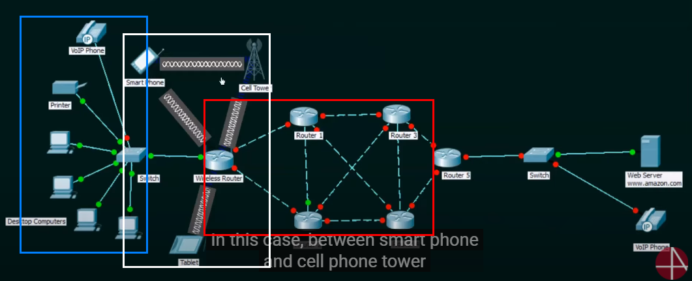

<details>
<sumamry>Bring your own device(BYOD) 정책이란?(펼쳐보기)</summary>

>There are two major contexts in which this term is used. One is in the mobile phone industry, where it refers to carriers allowing customers to activate their existing phone (or other cellular device) on the network, rather than being forced to buy a new device from the carrier.[2][3][4]

> The other, and the main focus of this article, is in the workplace, where it refers to a policy of permitting employees to bring personally owned devices (laptops, tablets, smartphones, etc.) to work, and to use those devices to access privileged company information and applications.[5] This phenomenon is commonly referred to as IT consumerization.[6]
</details>

### MAC addressing
LAN 상의 모든 노드는 MAC(Media Access Control) 주소로 구별된다. IP 주소가 노드의 위치를 식별한다면, MAC 주소는 노드의 이름을 식별하는 역할을 한다. 

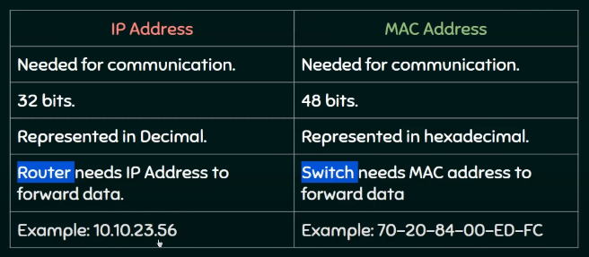

- IP : highlight with blue rectangle, router-friendly, idenfity a node in network. a logical address that can be changed.

- MAC : highlight with red rectangle, switch-friendly, identify a node in LAN(local area network). a physical address that can not be changed(manufacturer decides this). Example of MAC address => 70-20-84-00-ED-FC (48 bits).

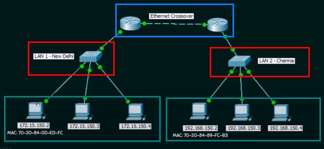

아래 명령어로 자신의 MAC 주소를 확인할 수 있다. ipconfig 명령어 뒤 공백은 생략될 수 없다. 

```shell
$ipconfig /all
```

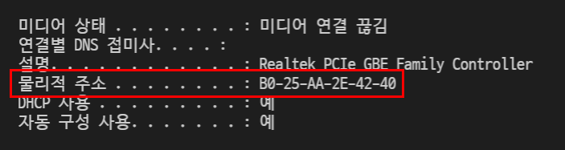

### Port addressing
포트는 커뮤니케이션 엔드 포인트(communication endpoint)라고도 불리우며 하나의 노드에서 생성되는 여러 개의 **프로세스를 식별하는 라벨링** 역할을 한다. 

- 포트 번호의 범위 : 0 ~ 65,535 

IP, MAC, port의 역할은 아래와 같이 나눌 수 있다. 

- IP : 네트워크 상에서 기기의 위치를 논리적으로 식별함
- MAC : 네트워크 상에서 기기의 이름을 물리적으로 식별함 
- Port : 기기의 프로세스/프로그램을 논리적으로 식별함

IP, MAC, port의 역할 흐름은 아래와 같이 진행된다. 

- 노드 A가 노드 B에게 프로그램 a를 요청 =====> IP & MAC 주소 ====(네트워크 상 노드의 위치와 이름을 식별)=====> Port 번호 =====(식별된 PC 상에서 응용 프로그램의 목적지를 식별) ====> 노드 B가 포트 번호 확인 후 응용 프로그램 a를 활성화.

포트는 네트워크 상에서 노드 간 데이터를 주고 받을 때 올바른 프로세스를 식별할 수 있게 도와준다.

> A port number is **the logical address of each application or process that uses** a network or the Internet to communicate. A port number uniquely **identifies a network-based application on a computer**. Each application/program is allocated **a 16-bit integer port number**. This number is **assigned automatically by the OS**, manually by the user or is set as a default for some popular applications.

> A port number primarily aids in **the transmission of data between a network and an application**. Port numbers work in collaboration with networking protocols to achieve this. For example, in an incoming message/packet, **the IP address is used to identify the destination computer/node, whereas the port number further specifies the destination application/program in that computer**. Similarly, all outgoing network packets contain application port numbers in the packet header to enable the receiver to distinguish the specific application.

> Port numbers are **mainly used in TCP and UDP based networks**, with an available range of 65,535 for assigning port numbers. Although an application can change its port number, some commonly used Internet/network services are allocated with global port numbers such as Port Number **80 for HTTP**, 23 for Telnet and 25 for SMTP.

#### 포트 번호 확인하기
현재 기기에서 할당된 포트 번호를 확인하기 위해서 터미널에서 아래 커맨드를 입력한다. 

```shell
# resmon : short for resource monitor 
$resmon
```

크롬 브라우저의 확인된 포트 번호는 아래와 같다.

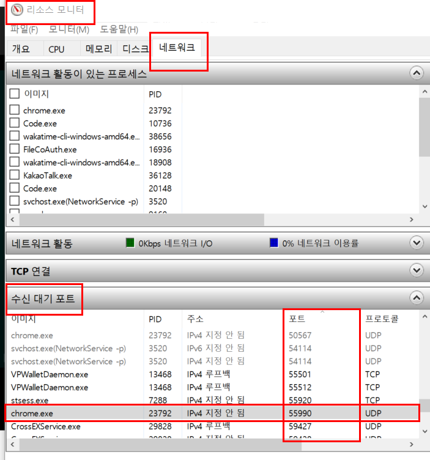

### 스위칭 기법
네트워크 상에서 스위칭이란 데이터 전송을 위해 최적의 경로를 찾는 것을 의미한다. 

1. circuit switching : 송/수신자 사이 전용 경로(dedicated path)가 요구됨. 데이터 전송 이전에 전용 경로를 통해 연결이 확립됨. 

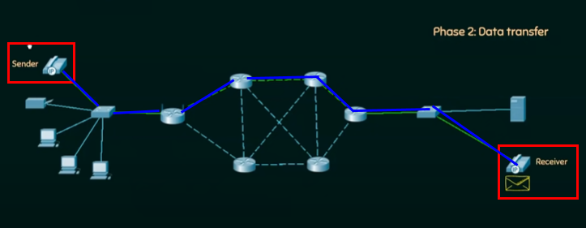

1. message switching : message is transferred as a complete unit and forwarded using store and forward mechanism at the intermediary node. 메시지는 여러 조각으로 분할되어 중간자 노드에 전달됨. 스트리밍 또는 실시간 프로그램에는 적합하지 않음. 

1. packet switching : 인터넷에 사용되는 스위칭 기법. 메세지는 packet으로 IP/MAC/Port number가 식별된 상태로 분할되어 개별적으로 다음 노드에게 전달됨. **개별적으로 packet이 전달되기 때문에 packet의 sequence가 중요**해지고, 이를 위해 sequence number도 함께 부착되어 전달됨. 

#### 패킷 스위칭 - datagram
datagram 패킷 스위칭 기법은 데이터 전송 경로가 정해져 있지 않으므로 connectionless라고도 불린다. 전송된 패킷들은 목적지에서 sequence number를 통해 재조립된다. 

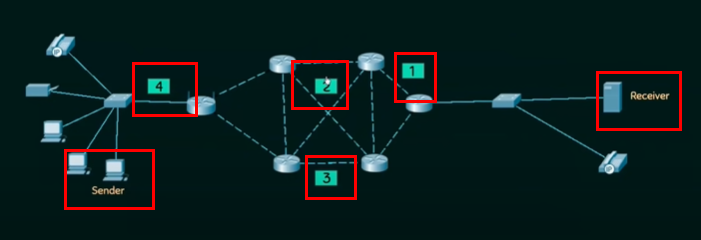

#### 패킷 스위칭 - virtual circuit
virtual circut 패킷 스위칭 기법은 데이터 전송 경로가 사전에 정해지므로 connection-oriented라고도 불린다. 전송된 패킷들은 목적지에서 sequence number를 통해 재조립된다. 

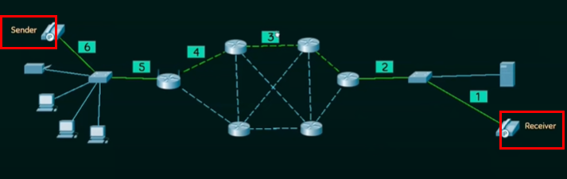

### OSI(Open Systems Interconnection model) 모델 
OSI 모델은 서로 다른 시스템 간 하드웨어/소프트웨어의 규격(논리)을 바꾸지 않더라도 소통이 가능하도록 도와주는 이론적 모델을 의미한다. TCP/IP 모델이 프로토콜인 것과는 달리, OSI 모델은 프로토콜이 아닌 **가이드라인**이다. OSI 모델의 7개 레이어 구성은 **순서가 중요**하며, 아래와 같은 형태를 취한다. 

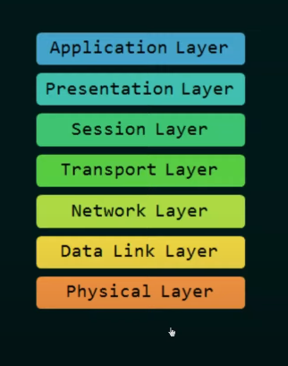

두문자 기억법(Please Do Not Throw Sausage Pizza Away)으로 OSI 레이어 순서를 기억하는 것도 좋은 trick이 된다. 


OSI 모델을 이용한 두 노드간의 데이터 송/수신 순서는 아래와 같이 이루어진다. 

1. 노드 A의 데이터 송신 : 레이어 7(Application) => 6(Presentation) => 5(Session) => 4(Transport) => 3(Network) => 2(Data link) => 1(Physical)
1. (노드 A, B간 중간자 노드들을 타고 데이터가 송신 중)
1. 노드 B의 데이터 수신 : 레이어 1(Physical) => 2(Data link) ... => 7(Application)

<details>
<summary>Layering이란?(펼쳐보기)</summary>

- Layering : 네트워크 구성 요소를 컨트롤 하기 쉬운 작은 단위(layer)로 분해하는 것
</details> 

#### OSI 모델 레이어별 역할 
각각의 레이어는 다음과 같은 역할을 수행한다. 

1. Application layer: 유저의 네트워크 자원 접근을 허용함 (e.g 파일 전송 및 접근, 메일, 디렉토리)
1. Presentation layer: 시스템 간의 교환되는 정보의 문법과 시맨틱을 체크함(e.g 데이터 형 전환, 암호화, 압축)
1. Session layer: 노드간 상호 작용을 관리함(e.g 단/양방향 소통, 동기화)
1. Transport layer: 상호 작용을 위해 사용되는 프로세스들을 관리함(e.g 포트 관리, 대용량 데이터의 분할 및 재조합, 연결 컨트롤(connected or connectionless)end-to-end flow 컨트롤(노드 간 서로 다른 데이터 송/수신 속도를 싱크화), 에러 핸들링)
1. Network layer: 네트워크 상에서 데이터 전달을 담당함(e.g, 논리 주소 부여, 라우팅)
1. Data link layer: 노드 간 데이터 전달을 담당함(framing, 물리 주소 부여, 에러 핸들링, 접근 컨트롤)
1. Physical layer: 전송 수단을 통해 비트를 전달함(e.g 전송 수단(유/무선)의 물리적 특성 관리, 인코딩, 초당 전송률, line configuration(point to point, point to multi-point), 물리적 토폴로지)

### 네트워크 명령어(Network command)
네트워크에서 사용 가능한 기본적인 명령어는 아래와 같다. 

1. ipconfig
1. ipconfig/all
1. nslookup
1. ping
1. tracert

#### 터미널 세팅
가독성을 위해 터미널 폰트 색상을 변경할 수 있다.

```shell
# check colors available
help color 

# set bg : black, font : light green
color 0b
```

터미널 언어를 영어로 변경할 수 있다. 

```shell 
chcp 437
```

#### ipconfig
현재 컴퓨터에 저장된 ip configuration을 확인하기 위해 아래 명령어를 입력한다. 

```Shell
$ipconfig
```

ipconfig 명령어로 확인할 수 있는 정보는 OSI 모델 중 Layer3, 즉 네트워크 레이어에 해당하는 정보이다(논리 주소 부여, 라우팅). 

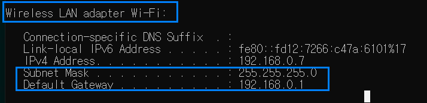

- default gateway : 현재 네트워크 => 다른 네트워크로 데이터 전송시 만나게 되는 첫 번째 **라우터의 ip 주소**.

#### ipconfig/all
ipconfig/all 명령어로 OSI 모델 중 Layer2(데이터 링크 레이어, 물리 주소 부여-MAC)에 해당하는 정보를 확인할 수 있다.

```shell
ipconfig/all
```

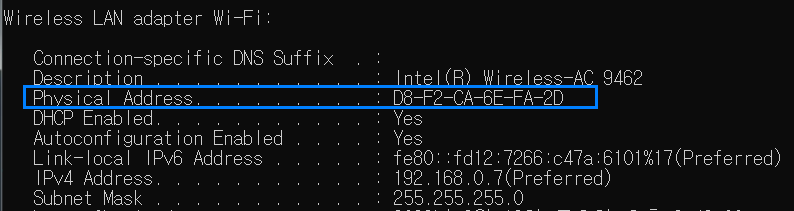

#### Nslookup
nslookup(name server lookup) 명령어는 DNS(Domain Name System) 서버에게 특정 서버의 ip 주소를 요청하는 명령어이다.  

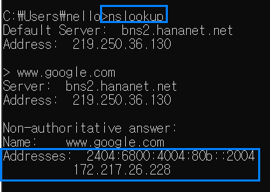

대개 유저가 브라우저 창에서 입력하는 url(e.g www.google.com)의 실제 ip 주소 변환은 DNS 서버가 담당한다. 

네트워크 상의 노드 간의 데이터 송/수신은 mac(데이터 링크 레이어), ip(네트워크 레이어) 정보 모두를 필요로 하므로, 유저가 url만을 입력하더라도 DNS 서버가 IP주소를 찾아서 제공하므로 송/수신이 가능해진다.  

#### Ping
> A ping (Packet Internet or Inter-Network Groper) is a basic Internet program that allows a user to test and verify if a particular destination IP address exists and can accept requests in computer network administration. The acronym was contrived to match the submariners' term for the sound of a returned sonar pulse.

> Ping is also used diagnostically to ensure that a host computer the user is trying to reach is operating. Any operating system (OS) with networking capability, including most embedded network administration software, can use ping.

Pining in network means that you check if the host you are trying to reach is reachable from your computer(host).

```shell
$ping <ip address you try to reach>
```

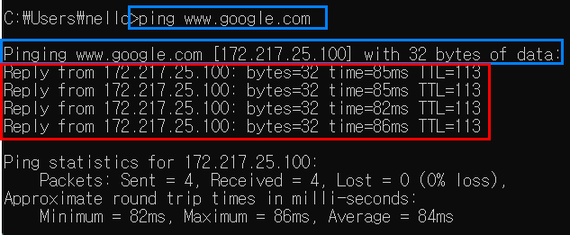

#### Tracert(trace root)
> When you connect with a website, the data you get must travel across multiple devices and networks along the way, particularly routers. A traceroute provides a map of how data on the internet travels from its source to its destination. 

> A traceroute plays a different role than other diagnostic tools, such as packet capture, which analyzes data. Traceroute differs in that it examines how the data moves through the internet. Similarly, you can use Domain Name System time to live (DNS TTL) for tracerouting, but DNS TTL addresses the time needed to cache a query and does not follow the data path between routers.

tracert 명령어는 A 호스트(default gateway)에서 B 호스트로 패킷(데이터)이 전달되기까지 거쳐가는 라우터의 목록을 보여준다(tracing). 

1. ipconfig/all 명령어로 현재 default gateway를 확인한다(192.168.0.1).
1. nslookup 명령어로 목적지 호스트 ip를 확인한다(www.google.com, 142.250.207.36)
1. tracert 명령어로 default gateway ~ www.google.com 간의 패킷 루트를 추적한다. 

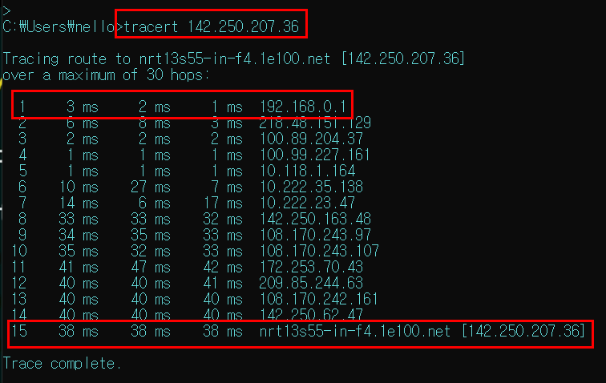

### Cisco Packet Tracer
> Cisco Packet Tracer as the name suggests, is a tool built by Cisco. This tool provides a network simulation to practice simple and complex networks.

> Engineers prefer to test any protocols on Cisco Packet Tracer before implementing them. Also, Engineers who would like to deploy any change in the production network prefer to use Cisco Packet Tracer to first test the required changes and proceed to deploy if and only if everything is working as expected.

### Router
라우터는 네트워크 상에서 다른 네트워크로 패킷(데이터)을 전송하는 네트워크 기기이다. 라우터가 지원하는 네트워크 연결은 아래와 같다. 

1. LAN과 LAN을 연결 또는 LAN과 WAN을 연결
1. LAN과 ISP(Internet Service Provider)를 연결

라우터와 스위치는 네트워크 기기라는 점은 동일하다.

라우터는 OSI 모델 레이어3(네트워크 레이어, IP주소)에 속하고 서로 다른 네트워크를 연결한다.

스위치는 레이어2(데이터 링크 레이어, MAC주소)에 속하고, 서로 다른 기기를 하나의 네트워크에 연결한다. 

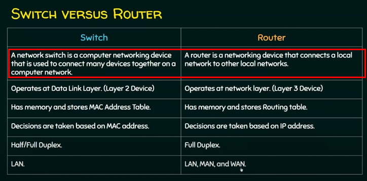

> Every device has an IP address with two pieces: the client or host address and the server or network address. IP addresses are either configured by a DHCP server or manually configured (static IP addresses). The subnet mask splits the IP address into the host and network addresses, thereby defining which part of the IP address belongs to the device and which part belongs to the network.

> The device called a gateway or default gateway connects local devices to other networks. This means that when a local device wants to send information to a device at an IP address on another network, it first sends its packets to the gateway, which then forwards the data on to its destination outside of the local network.


### Subnet mask 
> A subnet mask is a 32-bit number created by setting host bits to all 0s and setting network bits to all 1s. In this way, the subnet mask separates the IP address into the network and host addresses.

> When organizations need additional subnetworking, subnetting divides the host element of the IP address further into a subnet. The goal of subnet masks are simply to enable the subnetting process. The phrase “mask” is applied because the subnet mask essentially uses its own 32-bit number to mask the IP address.

### 브릿지
브릿지는 동일 프로토콜 상의 LAN을 연결하는 반면, 라우터는 이종 프로토콜 상의 LAN을 연결한다는 것이 차이점이다. 또한 브릿지는 MAC 주소를 관리하는 데이터 링크 레이어(layer 2)이지만, 라우터의 경우 IP 주소를 관리하는 네트워크 레이어(layer 3) 기기에 해당된다.

> A network bridge is a computer networking device that creates a single, aggregate network from multiple communication networks or network segments. This function is called network bridging.[1] Bridging is distinct from routing. Routing allows multiple networks to communicate independently and yet remain separate, whereas bridging connects two separate networks as if they were a single network.

### 네트워크 기기
네트워크는 종료와 목적에 따른 다양한 기기들로 구성된다. 

1. repeater 
> Repeaters are network devices operating at physical layer of the OSI model that amplify or regenerate an incoming signal before retransmitting it. They are incorporated in networks to expand its coverage area. They are also known as signal boosters.

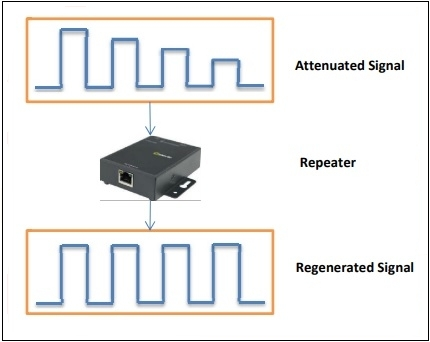

1. hub : LAN & layer1 기기, 수신 받은 것을 송신하는 역할()

1. switch : LAN & layer2 기기, hub와 달리 MAC 주소에 기반해 패킷 송/수신 가능(MAC 주소 테이블 저장)

1. bridge : layer 2, 동일 프로토콜을 네트워크 상에서 연결 (repeater + MAC 주소 읽기)

1. router : layer 3, 패킷을 IP 주소에 기반해 전송, 이종 프로토콜을 네트워크 상에서 연결

1. multi-layer switch : layer 3, 기존의 스위치 + 라우터 기능이 섞인 것.

1. brouter : bridge + router

1. modem(Modulator-Demodulator) : 
> A modulator-demodulator, or simply modem, is a computer hardware device that converts data from a digital format into a format suitable for an analog such as telephone or radio. A modem transmits data by modulating one or more carrier wave signals to encode digital information, while the receiver demodulates the signal to recreate the original digital information. 
> The goal is to produce an electrical signal that can be transmitted easily and decoded reliably. Modems can be used with almost any means of transmitting analog signals, from light-emitting diodes to radio.

1. firewall : filters data packets sent based on port number and such.
> In computing, a firewall is a network security system that monitors and controls incoming and outgoing network traffic based on predetermined security rules.[1] A firewall typically establishes a barrier between a trusted network and an untrusted network, such as the Internet.[2]

> Firewalls are categorized as a network-based or a host-based system. Network-based firewalls can be positioned anywhere within a LAN or WAN.[8] They are either a software appliance running on general-purpose hardware, a hardware appliance running on special-purpose hardware, or a virtual appliance running on a virtual host controlled by a hypervisor

<details>
<summary>Proxy란 무엇인가? </summary>

> In computer networking, a proxy server is a server application that acts as an intermediary between a client requesting a resource and the server providing that resource.[1]

> Instead of connecting directly to a server that can fulfill a requested resource, such as a file or web page, the client directs the request to the proxy server, which evaluates the request and performs the required network transactions. This serves as a method to simplify or control the complexity of the request, or provide additional benefits such as load balancing, privacy, or security. 

> Proxies were devised to add structure and encapsulation to distributed systems.[2] A proxy server thus functions on behalf of the client when requesting service, potentially masking the true origin of the request to the resource server.

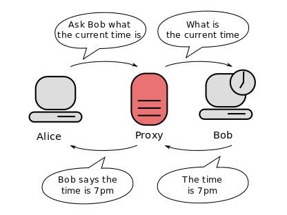
</details>

### Physical layer (layer 1)
다음 과정은 두 명의 스마트폰 사용자가 whatsapp을 통해 원거리 통신을 시행할 때 레이어간 데이터 전환 과정을 OSI 모델에 근거해 설명한 것이다. 

1. application : 사용자 데이터(음성)를 수집, presentation 레이어에 전달
1. presentation : 전달받은 데이터를 암호화, 압축
1. session : 노드간 상호작용 관리, 동기화
1. transport : 전달받은 데이터를 분할 후 TCP/UDP 헤더에 부착
1. network : 전달받은 데이터에 Network 헤더 부착 ===> 패킷
1. data link : 전달받은 데이터에 header/trailer 부착 ===> 프레임(0과 1로 표현됨, 비트)
1. physical : 비트를 시그널로 전환해 데이터 전송 수단(스마트폰)을 통해 수신자 노드에게 전송함.

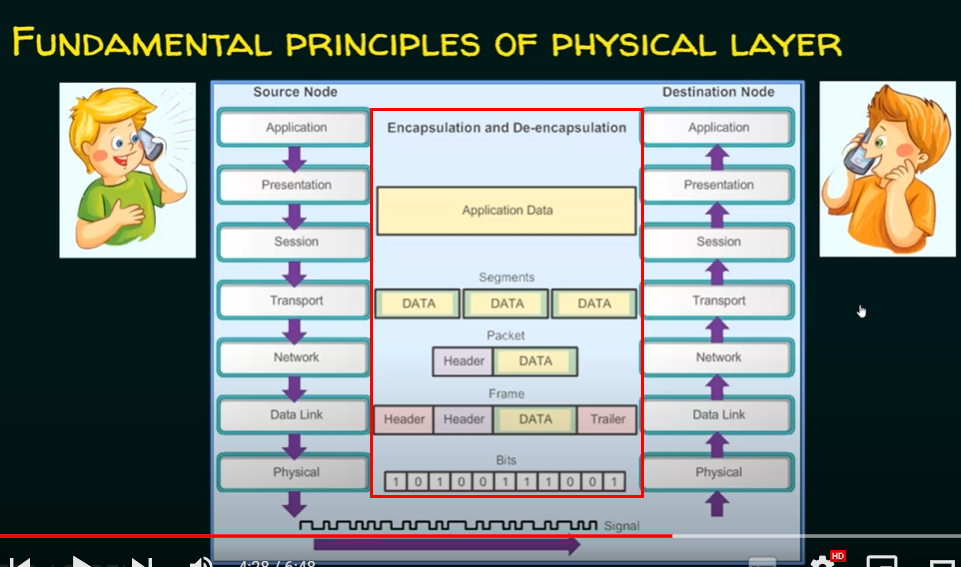

#### 시그널
시그널은 아날로그와 디지털 2가지 종류로 나뉘어진다. 

1. 아날로그 시그널 : 지정된 범위 내에 어떠한 값이라도 취할 수 있다는 것이 특징(연속성).

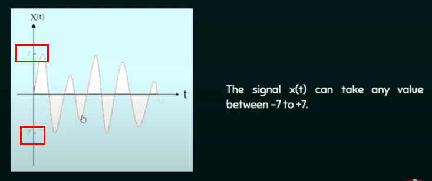

1. 디지털 시그널 : 지정된 범위 내에 단 하나의 값만 취할 수 있다는 것이 특징(비연속성).

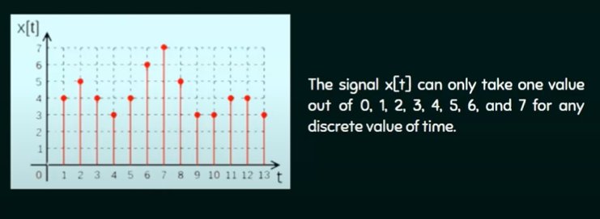

#### 라인 구성(Line configuration)
physical layer(layer 1)은 data link layer(layer 2)에서 전송한 frame 데이터(비트)를 전송 수단(medium)을 통해 수신자 노드에게 전송하는 역할을 한다.

- data link layer ===(bits)===> physical layer
- physical layer ===(signal, medium)===> recipient node

라인 구성(line configuration)이란 네트워크 상 노드 간의 연결을 가상의 선으로 구성하고, 이를 조정하는 것을 말한다. 

- node A ----(imaginary line)---- node B 

라인 구성은 1) point-to-point 2) multipoints의 방식으로 구분된다. 

##### Point-to-point 
point to point 라인 구성 방식은 두 노드 간 전용 링크(dedicated link)를 설치하는 것을 말한다. 해당 링크의 수용 능력은 두 노드에 국한된다.

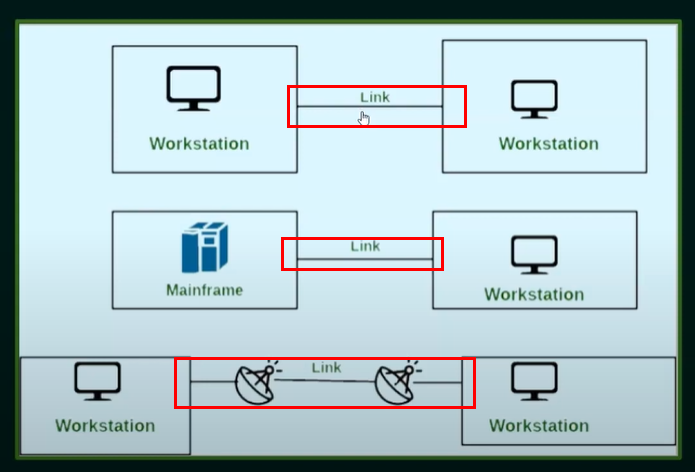

##### Multi-point 
multi-point 라인 구성 방식은 여러 노드가 하나의 링크를 공유하는 것을 말한다. 하나의 링크가 공유되어 있으므로 기기간 데이터를 보내는 순서를 지정해 데이터 충돌이 일어나지 않도록 주의한다. 

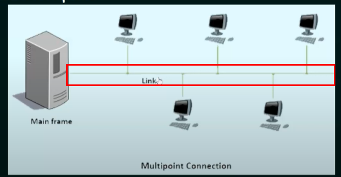

### Data link layer(layer 2)
데이터 링크 레이어(link layer for short)는 네트워크 레이어로부터 

1. 전달받은 packet에 header와 trailer를 부착하고(packet becomes a frame)
1. 데이터를 캡슐화 한 뒤(physical address 등)
1. 해당 frame을 다른 node에게 forward 하는 역할을 담당한다. 

링크 레이어의 핵심 역할은 다음과 같다. 

#### Framing
framing이란 링크 레이어의 핵심 역할 중 하나로, 네트워크 레이어로부터 전달받은 패킷(0,1로 구성된 비트)을 구분자(delimeter)를 통해 구별하는 작업을 의미한다. 

> A frame is a unit of communication in the data link layer. Data link layer takes the packets from the Network Layer and encapsulates them into frames. If the frame size becomes too large, then the packet may be divided into small sized frames.

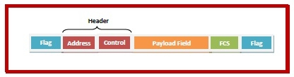


## 레퍼런스
- [Wikipedia : Wi-Fi](https://en.wikipedia.org/wiki/Wi-Fi)
- [Cnet : modem-vs-router-whats-the-difference (Eng)](https://www.cnet.com/home/internet/modem-vs-router-whats-the-difference/)
- [위험 모델 더 알아보기(영문)](https://www.bitsight.com/blog/cyber-security-risk-modeling)
- [로그인 세션](https://velog.io/@junhok82/%EB%A1%9C%EA%B7%B8%EC%9D%B8%EC%9D%80-%EC%96%B4%EB%96%BB%EA%B2%8C-%EC%9D%B4%EB%A3%A8%EC%96%B4%EC%A7%88%EA%B9%8CCookie-Session) 
- [difference-between-database-and-server (Eng)](https://anydifferencebetween.com/difference-between-database-and-server/)
- [What is a VoIP Phone and how it works?](https://www.ringcentral.com/what-is-a-voip-phone.html#ring-s-off)
- [Wikipedia : Coaxial cable](https://en.wikipedia.org/wiki/Coaxial_cable)
- [Wikipedia : Bring your own device](https://en.wikipedia.org/wiki/Bring_your_own_device)
- [TechTarget : Ping](https://www.techtarget.com/searchnetworking/definition/ping)
- [Fortinet : What is Traceroute: What Does it Do & How Does It Work?](https://www.fortinet.com/resources/cyberglossary/traceroutes)
- [Geeks for geeks : What is Cisco Packet Tracer](https://www.geeksforgeeks.org/what-is-cisco-packet-tracer/)
- [Wikipedia : bridge](https://en.wikipedia.org/wiki/Bridging_(networking))
- [Wikipedia : modem](https://en.wikipedia.org/wiki/Modem)
- [Wikipedia : firewall](https://en.wikipedia.org/wiki/Firewall_(computing))
- [Tutorials point : What are Repeaters in Computer Network?](https://www.tutorialspoint.com/what-are-repeaters-in-computer-network)
