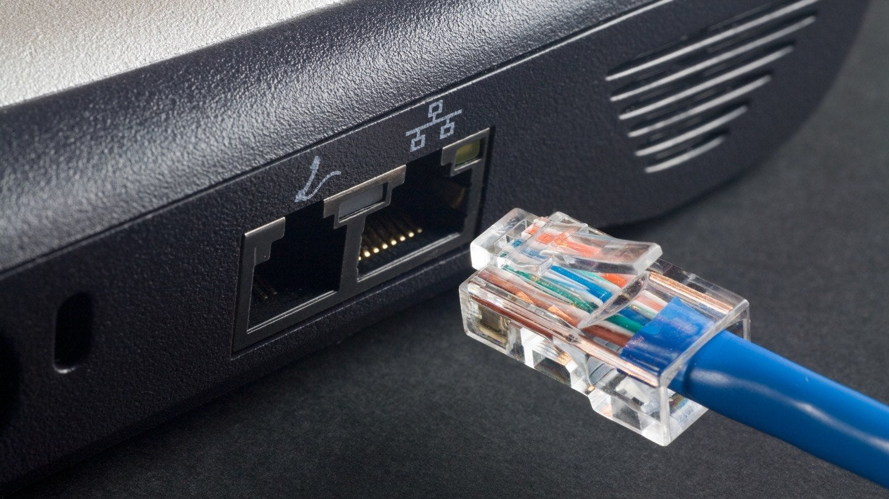
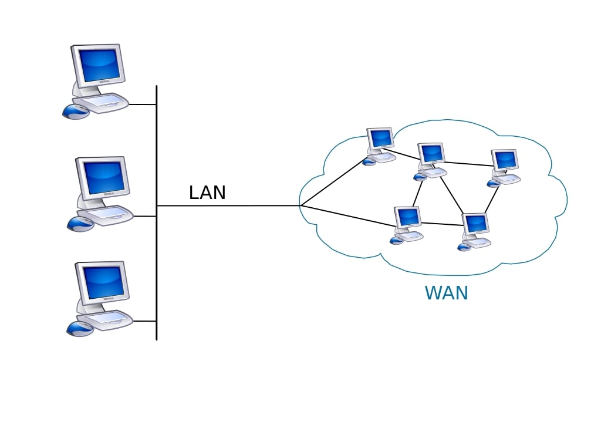

# Content editor : @developerasun
# 비기너를 위한 네트워킹 컨셉
아래 강좌를 수강 후 중요 내용을 요약 및 정리함. 영문 강의이며 총 길이는 1시간 6분으로 길지 않은 편. 

[유데미 - 네트워크 기초](https://www.udemy.com/course/networking-concepts-for-beginners/learn/lecture/6060530?start=15#overview)

핵심 목차는 아래와 같음. 

<span><b> Section 1 : Networking fundamentals</b></span>
<li>LAN/WAN protocols</li>
<li>Packets, IP, TCP, DNS</li>
<li>Routers</li>
<li>Physical security</li>

<span><b> Section 2 : Defense in-depth</b></span>
<li>Information assurance</li>
<li>Computer security</li>
<li>Contingency and continuity</li>
<li>Password management</li>

# 네트워크 타입 : LAN과 WAN
<li>LAN(Local Area Network) - 통신과 자원(프린터, 저장 공간 등)을 공유하는 여러 개의 컴퓨터와 주변 기기가 서버에 연결된 것이다.</li>
<li>WAN(Wide Area Network) - 여러 개의 LAN이 모여 더 넓은 지역을 커버함.</li> 

## LAN 프로토콜
LAN에 참여하는 네트워크 기기들의 통신 방법을 정해놓은 규약. 컴퓨터 네트워킹 프로토콜은 대개 패킷 스위칭 기법을 사용함. 

<span><b>LAN 프로토콜의 종류</b></span><br/>
<li>Ethernet - 가장 광범위하게 사용되는 LAN 프로토콜. 네트워크 기기들은 반드시 물리적 케이블을 통해 연결되어 무선 LAN 기술보다 강한 보안 수준을 자랑함. Star, Bu, Tree와 같은 토폴로지를 사용</li>

<details>
    <summary>Ethernet 종류(펼쳐보기)</summary>
    
    <li>Fast Ethernet - 구리 재질 Ethernet 케이블(초당 100 메가 비트 데이터 전송 속도)</li>
    <li>Gig Ethernet - 광섬유 재질 Ethernet 케이블 (초당 10억 비트 데이터 전송 속도. 엔터프라이즈용 네트워크에 주로 사용됨)</li>
</details>

<li>WiFi - WLAN(Wireless LAN). 데이터 캡슐화를 위해 전자기파 범주의 주파수를 사용함.  </li>
<li>ATM LANE - Asynchronous Transfer Mode(비동기 전송 모드). 다른 LAN 프로토콜과 달리 데이터를 고정된 사이즈의 패킷으로 전송함(초당 155 메가 비트 이상의 데이터 전송 속도) </li>

## WAN 프로토콜
LAN보다 훨씬 큰 크기의 네트워크에서 기기들의 통신 방법을 정해놓은 규약. 광역 통신망 WAN은 서로 다른 지역의 근거리 통신망 유저들이 통신하도록 도와주는 역할을 한다. 통신망의 영역 범위는 아래와 같다.

<span><b>LAN과 WAN의 상관 관계</b></span><br/>



<details>
    <summary>영역별 네트워크 종류(펼쳐보기)</summary>
    PAN(방 단위) => LAN(건물 단위) => CAN(캠퍼스 단위) => MAN(도시 단위) => WAN(광역 단위)
</details>


<span><b>WAN 프로토콜의 종류</b></span>
<li>X.25</li>
<li>Frame Relay</li>
<li>ISDN</li>
<li>DSL</li>

WAN 프로토콜 종류에 대해서는 다루는 내용의 범위가 필요 이상을 넘었다고 판단하여 여기에서는 생략한다.

## 네트워크 기기
네트워크 기기들은 네트워크 상에서 데이터를 받거나 만들어내는 역할을 한다. 

<span><b>네트워크 기기 종류</b></span>
<li>HUB - Star 토폴로지를 사용하는 네트워크상에서 중앙 연결점이 되는 기기(통상 Concentrator라고 명칭함). 여러 개의 독립적인 포트를 가지고 있는 하드웨어. One to many connections. 기기 A가 기기 C에게 패킷1을 전달하고 싶을 경우 패킷 1은 허브를 통해 모든 기기들에게 뿌려짐.</li>

<details>
    <summary>패킷이란?(펼쳐보기)</summary>
    패킷이란 네트워크 상에서 한 번에 전송할 데이터의 크기를 나타내는 말이다. 네트워크 종류에 따라 패킷의 크기가 달라진다. 패킷은 전송 시작 전 번호가 부여되고 나눠지며(A데이터 => 1,2,3,4, ...) 전송 완료 이후 다시 번호대로 정렬되고 복구된다(1,2,3,4 ... => A데이터). 데이터 분할 전송(패킷 단위)을 통해 전송 상의 이점을 챙기기 위해 사용됨(여러 컴퓨터에게 동시 전송, 대용량 데이터 분할 전송 등).  
</details>


<span><b>HUB와 포트</b></span><br/>


<li>Switches - 네트워크 부하를 낮추고 속도를 높이기 위해 특정 레이어를 추가해서 사용하는 HUB의 한 종류. One to one conneciton.</li>
<li>Routers - 패킷 데이터를 전송하는 역할. 패킷에는 발신자, 데이터 유형, IP 주소 등 여러 식별 정보가 포함되어 있다. 라우터는 이 레이어를 읽어 우선 순위를 설정하고, 우선 순위에 맞추어 패킷 전송에 사용할 최적 라우트를 선택한다. </li>

<details>
    <summary>라우터 작동 원리(펼쳐보기)</summary>
    
</details>

<li>NIC - Network Interface Card. 컴퓨터 내에 네트워크 통신을 위해 설치된 하드웨어 카드. 네트워크 케이블과 연결할 포트를 하나 이상 제공하고, 컴퓨터 역시 네트워크 어댑터를 컨트롤 하기 위한 드라이버를 제공한다. </li>

# 네트워크 토폴로지
토폴로(망 구성 방식)란 컴퓨터 네트워크를 연결해놓은 방식을 의미한다. LAN의 경우 물리적/논리적 토폴로지 둘 다 보여줄 수 있다. 

<li>물리적 토폴로지 : 링크와 노드들의 상관 관계</li>
<li>논리적 토폴로지 : 노드끼리의 데이터 흐름</li>

<span><b>토폴로지</b></span><br/>


## 토폴로지 종류
<li>Bus - 모든 컴퓨터와 주변 기기가 하나의 케이블로 연결되고 2개의 엔드포인트를 가짐. 하나의 메인 케이블로 연결되어 있기 때문에 지점 A의 데이터를 지점 D에게 보내기 위해서는 B,C를 거쳐야 한다는 단점이 있음.</li>
<li>Star - 중앙 집권적. 하나의 허브 노드(컴퓨터 또는 서버)가 존재하고 모든 컴퓨터와 주변 기기가 허브로 연결되는 구조. 버스 토폴로지와 다르게 데이터 전송 시 모든 워크스테이션을 거치지 않아도 된다는 장점이 존재.</li>
<li>Ring - 닫힌 루프 구조. 각각의 컴퓨터는 정확히 2개의 이웃 기기와 연결됨.</li>
<li>Mesh - 모든 네트워크 노드가 서로에게 연결되어 있음. Full mesh와 partial mesh 구조로 나뉠 수 있으며, full mesh에서 필요 없는 노드 연결을 끊을 경우 partial mesh 구조로 변함. </li>
<li>Tree - 하나의 루트 노드가 존재하고, 하위 노드들이 계층 구조를 이룸. 적어도 3개의 계층이 필요함. Star 토폴로지 + Bus 토폴로지</li>
<li>Hybrid - 서로 다른 토폴로지가 합쳐서 새로운 토폴로지를 구성함. 새로운 컴포넌트를 추가해 네트워크의 크기를 키우는 데 유리하며, fault detection/trouble shooting이 용이하다는 장점이 있음.</li>

# IP(Internet Protocol)
<p>
인터넷상에서 컴퓨터의 위치를 특정하고 기기 간 데이터를 전송하는 방법을 명시한 통신 규약. 컴퓨터들의 우편 시스템. 주로 TCP 프로토콜과 함꼐 사용되며 인터넷 상 각각의 컴퓨터(호스트)는 적어도 하나의 IP주소를 할당 받게 됨.
</p>
<p>
TCP/IP 프로토콜을 통해 기기 간 통신을 할 경우 IP 주소가 필요함. IP 주소는 4개의 숫자로 구성되고 숫자의 크기에 따라 IPv4/IPv6로 구별됨. IP 패킷을 주고 받는 기기를 IP host라고 부르며, IP 주소를 사람이 알아보기 쉽게 네이밍 하는 역할을 DNS(Domain Name System)가 맡아줌. 
</p>
<p>
각각의 IP 주소가 가지는 의미는 필요 이상의 내용을 담고 있다고 판단, 생략한다. 
e.g. 클래스 E 주소 : 240.0.0.0.0 ~ 255.255.255.254. 
</p>

<details>
    <summary>IP 주소란? (펼쳐보기)</summary>
    네트워크 상에서 특정 컴퓨터 기기를 식별하기 위해 사용되는 주소로, 32비트 4개의 숫자로 이루어져 있다. 각 숫자들은 .(dot)으로 구별한다. 일반적으로 십진수를 사용하는 버전 4, 즉 IPv4가 보편화되어 있으며 0.0.0.0. ~ 255.255.255.255 범위 내에 IP 주소가 존재한다. 일부 번호들은 특정 목적을 위해 선 예약되어 있다. 예를 들어 127.0.0.1의 경우 localhost(로컬 호스트, 루프백(loopback))로 자기 자신을 가리킨다. 32 비트로 모든 단말기의 수를 지정하기 힘들어지자 IPv6에서는 주소 길이를 128비트로 늘리게 되었다. IPv6 예시 -  1050:0000:0000:0000:0005:0600:300c:326b
</details>

<span><b>터미널 명령어로 IP 주소 확인하기</b></span><br/>
```
ipconfig
```


# TCP/IP
<p>
TCP/IP 크게 1) HTTP 2) HTTPS 3) FTP 3가지로 구성되어 있다. HTTPS와 달리 HTTP는 보안상 검증된(secure) 데이터 전송을 지원하지 않는다. HTTPS의 경우 웹 사이트-웹서버간의 인증(authentication)을 지원해 HTTP에 security를 의미하는 s를 덧붙여 HTTPS 라고 명칭한다. 
</p>
<p>
FTP(File Transfer Protocol)는 2개 이상의 컴퓨터 기기 사이에서 데이터를 주고 받는 방법을 명시한 프로토콜이다. 클라이언트<->서버 아키텍쳐를 차용하며, SSL/TLS와 같은 보안을 활용한다. 
</p>

<details>
    <summary>SSL/TLS란? (펼쳐보기)</summary>
    SSL, 즉 Secure Socket Layer은 옛 명칭으로 현재는 TLS, Transport Layer Security로 정식 명칭이 바뀌었다. 웹 브라우저와 웹 서버 간의 암호화 통신을 위해 TCP/IP 계층에서 동작하는 프로토콜을 의미하며 아래와 같은 역할을 수행한다. 

<li>인증</li>
<li>암호화</li>
<li>변조 방지</li>
</details>

## TCP와 UDP의 비교
UDP(User Datagram Protocol)의 경우 패킷 전송 시 손실된 패킷을 무시하고 전송하므로 TCP보다 전송률이 좋다는 장점이 있다. 따라서 소량의 패킷 손실이 치명적이지 않은 스트리밍 서비스, 실시간 방송 등에 사용된다. 단순한 요청-응답 통신을 필요로 하는 곳에 적합하며 3 handshake 과정을 거치지 않는다.  

## TCP dump
네트워크와 이더넷의 이상 유무를 체크하기 위해 패킷 헤더를 체크하고 기준에 부합하는지 확인하는 오픈 소스 CLI 툴. 주로 유닉스 운영체제에서 호환되며 윈도우에서는 Windump로 대체 사용. 네트워크 상의 모든 기기는 유니크한 IP 주소를 가지고 있고 이 IP 주소를 통해 자원이 전달됨.  

<details>
    <summary>ICMP란? (펼쳐보기)</summary>
    인터넷 제어 메세지 프로토콜(ICMP)이란 Internet Control Message Protocol의 줄임말으로 IP 상에서 통신이 비정상적으로 종료될 경우(호스트가 꺼져 있거나, 선이 끊겨 있거나), 출발지 호스트에게 오류/에러 메세지를 전송하는 데 주로 사용된다. 인터넷 프로토콜(IP)의 주요 구성원 중 하나로 IP에 의존하여 작업을 수행한다. 

[좀 더 자세히 알아보기](http://www.deadfire.net/tcpip/tcpip16.html)
</details>

# 라우터
라우터는 네트워크 기기로, 하나의 네트워크가 또 다른 네트워크를 만나는 지점에 위치하여 네트워크들을 연결하고 전달하려는 패킷을 보낼 최적의 루트를 찾으려 노력한다. 무선 라우터(와이파이)의 경우 모뎀에 선을 연결하지 않고도 기기를 네트워크에 연결시켜 준다. 해당 라우터에 설정한 비밀번호를 바르게 입력한 기기들은 모두 네트워크 이용이 가능하다. 흔히 가정에서 사용하는 공유기는 라우터의 기능 중 일부를 특화시켜 인터넷 사용이 가능하도록 만든 기기이다.

## 라우팅
라우팅이란 네트워크 상에서 데이터 패킷을 출발지에서 도착지로 보내는 프로세스를 의미한다.

<li>디폴트 라우팅 - 모든 라우터를 단일 라우터로 보내도록 구성</li>
<li>정적 라우팅 - 라우팅 테이블의 경로를 수동으로 추가 </li>
<li>동적 라우팅 - 라우팅 테이블의 경로를 자동으로 조정. 하나의 경로가 다운되면 네트워크 대상에 도달되도록 자동으로 조정됨. </li>

<details>
    <summary>라우터와 네트워크 (펼쳐보기)</summary>
    

[무선 라우터 검색 - 쿠팡](https://www.coupang.com/np/search?component=&q=%EB%AC%B4%EC%84%A0+%EB%9D%BC%EC%9A%B0%ED%84%B0&channel=user)

[참고 기사 Modem vs Router(영문)](https://www.cnet.com/home/internet/modem-vs-router-whats-the-difference/)
</details>

## Access contrl 프로토콜
라우터 업데이트, 트래픽 흐름 관리, 네트워크 접근 설정 관리 등을 정해놓은 규약. 네트워크 보안 유지를 위해 설정하며 어떤 아이피, 즉 어떤 호스트에게 네트워크 접근을 허용할 것인지 설정함.  

# 물리적 보안(Pysical security)
도난, 화재, 침수 등을 방지하기 위한 기기 및 데이터 보안의 첫 번째 출발선. 

<li>자연 발생적 위험 - 지진, 화재 등</li>
<li>인위적 위험 - 도난, 부주의로 인한 손상 등 : CCTV, 지문 인식, 외부인 출입 금지 등으로 대응 </li>

# 심층 방어(Defense in depth)
기업의 정보 자산을 보호하기 위한 다수의 보안 대책을 복합적으로 사용하는 것을 의미. 여러 보안 레이어를 섞어 사용함으로써 보안성을 높임. 

## 계층 보안 (Layered security)
다수의 보안 레이어(A, B, C ....)를 만들어 중요한 정보를 보호하는 방식. 각 레이어 간 상호 작용하며 보안성을 지키는데 기여함.  해커(공격자)의 경우 레이어 A,B,C ... 를 모두 돌파해야 정보를 탈취할 수 있음. 계층보안 전략은 정보 자산을 지키는 데 중요한 역할을 함. 

# 위험 모델(Risk model)
보안상 위험 요소들을 그 위험 정도에 따라 분류하고, 해당 위험으로 인해 발생한 미래 결과(주로 경제적 수치로 표시)를 예상하는 작업.

[위험 모델 더 알아보기(영문)](https://www.bitsight.com/blog/cyber-security-risk-modeling)


# 인증(Authentification)과 권한 부여(Authorization)
유저 네임과 패스워드를 통해 유저를 식별하는 작업.

<li> 인증 : Who are you?</li>
<li> 권한 부여 : What can you do?</li>

# 암호화(Encryption)

<details>
    <summary>SSH란 무엇인가? (펼쳐보기)</summary>
    SSH(Secure Shell)이란 암호학적 네트워크 프로토콜 중 하나이다. 주로 시스템 관리자가 보안화가 되지 않은 네트워크의 호스트에게 안전하게 접속할 수단을 제공하고, 원격으로 시스템/어플리케이션을 조작할 수 있도록 도와준다. 클라이언트(**세션** 표시) - 서버(세션 실행) 모델을 사용한다.
<br/>


<details>
    <summary>로그인 세션이란 무엇인가? (펼쳐보기)</summary>
    세션이란 특정 시간 동안 벌어지는 일련의 작업들을 일컫는다. 로그인 세션은 유저 로그인 ~ 유저 로그아웃시 벌어지는 일련의 작업들을 지칭한다. 

    [로그인 세션](https://velog.io/@junhok82/%EB%A1%9C%EA%B7%B8%EC%9D%B8%EC%9D%80-%EC%96%B4%EB%96%BB%EA%B2%8C-%EC%9D%B4%EB%A3%A8%EC%96%B4%EC%A7%88%EA%B9%8CCookie-Session) 
</details> 

</details>
