# 데이터베이스 기초
아래 강좌를 듣고 중요 내용을 요약함. 

- [유튜브 - 데이터베이스 (영문)](https://www.youtube.com/playlist?list=PLBlnK6fEyqRi_CUQ-FXxgzKQ1dwr_ZJWZ) 

## Tablet of Contents
- [introduction to DBMS]()
- [introduction to DBMS]()
- [introduction to DBMS]()
- [introduction to DBMS]()
- [introduction to DBMS]()

## 데이터베이스의 이해
### 용어
- data : facts that are not processed yet => Jake, 28
- information : the data is processed => Jake is 28 this year.
- database : a collection of related data
- meta-data : data that describes the database. DB definition. Stored in DB catalogue. 
- database management system : a series of programs that manage the database

### 특성
- database reflects a real world to some extent.
- data in the database is locally related.
- database is designed and built for a specific purpose.

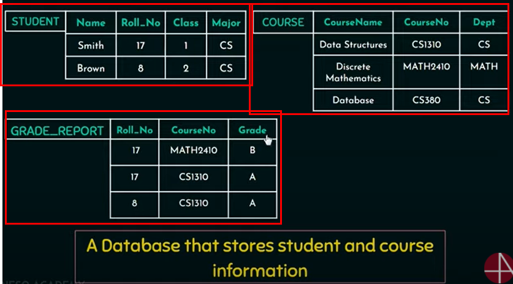

## 파일 시스템의 이해
DBMS를 활용하기 이전에는 데이터를 저장하기 위해서 파일 시스템을 주로 활용했다. 서로 다른 목적을 가지는 일련의 데이터들은 서로 다른 파일에 저장되어야했다.

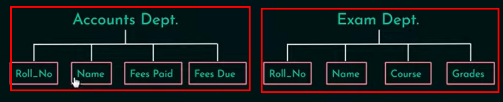

위 그림에서 알 수 있듯, 서로 다른 파일에서도 Roll_No, Name과 같은 동일한 데이터를 찾을 수 있다. 이는 저장 공간의 비효율적 활용으로 이어진다. 

DBMS의 경우 하나의 저장소에 관련된 모든 데이터들이 저장되고, 유저는 각자의 필요에 따라 필요한 데이터를 접근하기만 하면 되어 이점이 있다. 

## Understanding DBMS characteristics

- DBMS is self-explanatory : DMBS catalog lets you know what's inside and how it is constructured.

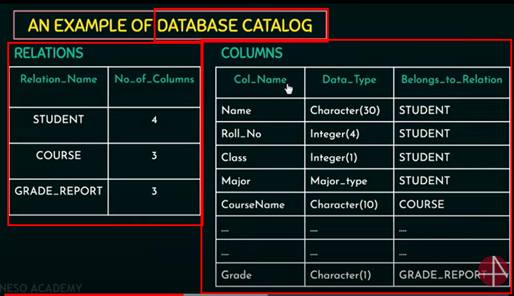

- Program and data is independent each other in DBMS, meaning that unlike file system even when data is changed or added, the program will not be affected by that. This characteristic of DBMS is called <bold>data abstraction</bold>. DBMS provdies a conceptual representation of data. 

- DBMS allows many users to access a database at the same time. In order to achieve this, DBMS must include concurrency model and address OLTP(Online Transaction Processing). 

    
온라인 트랜잭션 처리란?(펼쳐보기)

여러 PC에서 동시에 발생되는 트랜잭션을 DBMS가 처리하고, 트랙잭션의 결과를 해당 PC들에게 실시간으로 정확하게 전송하는 과정. 각각의 트랜잭션은 아래와 같은 성질을 가짐. 

- isolation : 트랜잭션이 한 명의 유저에게 할당되었다면, 다른 유저는 해당 트랜잭션을 수행할 수 없다. 
- atomicity : 트랜잭션은 100% 완벽하게 처리되었거나, 0% 불완전한 것으로 본다. 

## DBMS 활용 및 주의점
### 활용
- 데이터베이스 관리자(DBA)는 데이터베이스 유저에 대한 표준을 정의함으로써 조직 내 소통 및 운영을 용이하게 한다. 

- controlling unauthorized access : DBA(database administrator)에 의해 서로 다른 유저는 서로 다른 타입의 접근 권한이 주어진다. 

- DBMS를 활용함으로써 어플리케이션 개발 속도를 높이고 기존 프로그램에 저장된 데이터에 영향을 주지 않고도 데이터베이스 구조를 변경하는 것이 가능하다.

- providing persistent storage : 기존의 파일 시스템은 프로그램 종료시 프로그램에 사용되었던 변수들이 사라진다. DBMS는 프로그램 변수들이 오브젝트의 형태로 계속 보관되며, 프로그래밍 언어들의 자료 구조를 인식한다. 

- availability of up-to-date info : 한 명의 유저가 업데이트될 때 모든 유저가 그 업데이트를 확인할 수 있다. 

### 주의점
- providing storage structures for efficient query processing : 데이터베이스는 디스크에 저장된다. 따라서 DBMS는 빠른 디스크 서칭에 필요한 데이터 구조(인덱스)를 제공해야만 한다.

- providing backup/recovery : 모종의 이유로 하드웨어/소프트웨어가 crash 될 경우 DBMS는 백업 시스템을 제공해야 한다. 이때, crash가 일어난 지점 이전까지 복구되어야 하거나, 일어난 지점부터 실행 재개가 가능해야 한다. 

- enforcing integrity constraints : DBMS는 데이터 타입 및 유일성을 지정해야 한다. 

- DBMS는 초기 비용 투자가 큰 편이고 지속적으로 간접 비용이 발생한다. 따라서 어플리케이션이 비교적 작고 간단하며, 다수의 유저가 사용하지 않을 경우 DBMS를 사용하지 않고 파일 시스템을 사용해도 무방하다. 

## 데이터베이스 모델
1. hierarchical database model
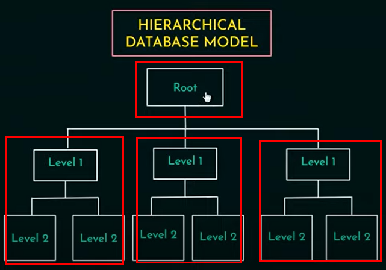

2. network database model 
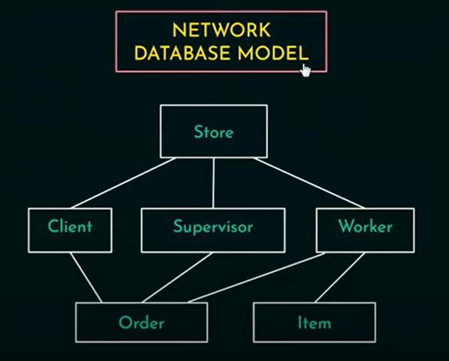

3. relational database model : organizes data into tables and high-level query language is introduced. 

4. object-oriented database model : mainly used in specialized applications such as engineering design and manufacturing system

## 데이터베이스 펀더멘털
- 데이터 모델
- 용어 정리

### 데이터 모델
데이터 모델은 데이터베이스의 구조를 묘사하기 위해 사용되며, 데이터 추상화에 도움을 준다. 데이터 추상화란 데이터베이스 사용자 입장에서는 불필요한 세부 내용을 숨기고, 인터페이스만을 제공하는 것을 의미한다. 

데이터 모델은 데이터를 가지고 오거나 업데이트 하는 등의 기본적인 데이터베이스 운영에 필요한 내용을 정의한다. 

#### 데이터 모델의 종류
- High-level / conceptual data model : close to real world user => 1) entities 2) attributes 3) relationships
- Low-level / physical data model : describes how data should be stored in the database

### 용어 정리
- database state(instance/snapshot) : the data in database at a particular moment

## 3단계 스키마 구조
3단계 데이터베이스 구조는 아래와 같이 이루어진다. 

|구분|내용|추상화 수준|
|:--:|:--:|:---------:|
|외부 스키마(External schema)|개개인의 유저가 직접 접근하며(view), 사용자에 관련된 개체만이 포함된다. 전체 데이터베이스의 일부분을 표시함.|최상|
|개념 스키마(Conceptual schema)|모든 응용 시스템/사용자들이 필요하는 전체 데이터를 종합하여 표현함. 외부 스키마는 개념 스키마로부터 생성되며, 개체, 개체간 관계, 규칙 명세등도 포함된다.|중간|
|내부 스키마(Internal schema)|개념 스키마에 대한 저장 구조를 실제로 정의함. 자료 구조의 형식, 인덱싱 등을 포함함. 물리적 데이터베이스보다 상위 단계.|최하| 

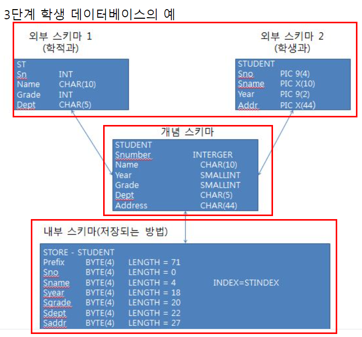

각각의 스키마들은 데이터 독립성을 지켜야 한다. 데이터 독립성이란 하위 레벨의 스키마가 바뀌더라도 상위 레벨의 스키마를 수정할 필요가 없도록 스키마를 구성하는 것을 의미한다. 

- 논리적 데이터 독립성 : 외부 스키마와 개념 스키마 사이 적용됨. 개념 스키마를 변경하더라도 외부 스키마에 영향이 없어야 함. 
- 물리적 데이터 독립성 : 개념 스키마와 내부 스키마 사이 적용됨. 내부 스키마는 데이터베이스의 퍼포먼스 향상을 위해 변경되어야 할 수 있고, 이때 내부 스키마를 변경하더라도 개념 스키마에 영향이 없어야 함. 

## DBMS 언어와 access path
### DBMS 언어
DBMS 언어는 위의 3단계 데이터베이스 구조에 맞게 아래와 같이 나뉘어진다. 

- 외부 스키마 : View Definition Language(VDL)
- 개념 스키마 : Data Definition Language(DDL)
- 내부 스키마 : Stroage Definition Language(SDL)

추가적으로, 데이터의 CRUD를 결정하는 Data Manipulation Language(DML)이 있다. VDL과 DDL, 그리고 DML을 합쳐 데이터베이스 SQL 언어라고 부른다. 

    
access path란 무엇인가?(펼쳐보기)

Access path는 데이터베이스 내 데이터를 불러오는 path를 결정한다. 예를 들어, 

- 데이터 파일을 순서대로 스캔함(a sequential scan of a data file)
- 생성한 쿼리 조건에 맞는 인덱스 순서대로 스캔함(an index scan with a matching selection condition)

## 데이터베이스 모듈 구성 
1. 데이터베이스 디자인이 끝나면 데이터베이스 관리자(DBA)와 데이터베이스 디자이너에 의해 각 단계에 맞는 스키마가 구성된다 => DDL 컴파일러는 정의된 스키마를 처리하고 DBMS 카탈로그에 저장한다. 
2. 데이터베이스에 저장된 데이터를 불러오기 위해 쿼리를 생성한다(access path : indexing) => pre-compiler는 DML 커맨드를 응용 프로그램에서 추출한다 => 쿼리 컴파일러는 해당 쿼리를 컴파일한다.   
3. 데이터베이스 사용자가 데이터베이스에 접근한다 => runtime database processor는 해당 접근을 관리한다. 

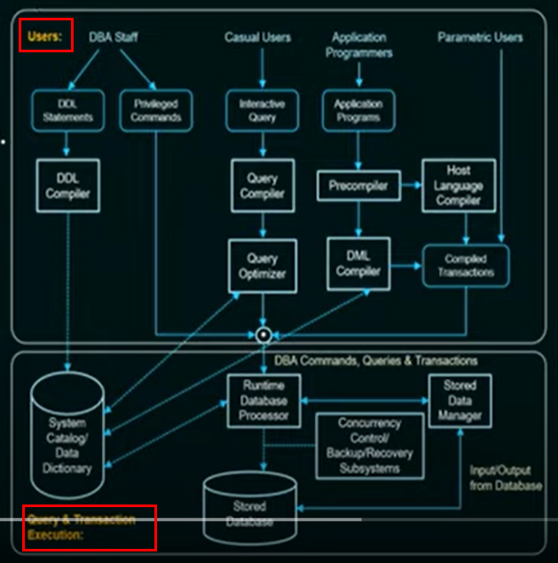

## 데이터베이스 시스템 유틸리티
- Loading : loads existing data files into database
- Backup : Incremental backups are often used

    
Incremental backup이란 무엇인가?(펼쳐보기)

Incremental backup이란 이전 백업이 이루어진 이후, 새롭게 발생한 업데이트를 포함한 콘텐츠에 대해서만 백업을 진행하는 것. (모든 콘텐츠를 매번 백업하는 것은 매우 큰 저장 공간을 요구하므로) 

## DBMS 아키텍처 
1. 초기의 DBMS 아키텍처는 중앙집중형으로 이루어졌다. 원격 메인 컴퓨터가 모든 시스템 처리를 담당하고, 데이터베이스 사용자는 터미널로 접근해 메인 컴퓨터가 처리한 정보만을 볼 수 있었다. 

2. 클라이언트-서버 아키텍처 : 클라이언트-서버 모델은 네트워크 상에서 특정 기능을 수행하는 서버를 만들어내기 위해 도입되었다. 
- 클라이언트 : 1) diskless client 2) client with disk로 나뉘어지며, 서버에게 특정 서비스를 요청한다. 
- 서버 : 클라이언트에게 특정 서비스를 제공한다. 

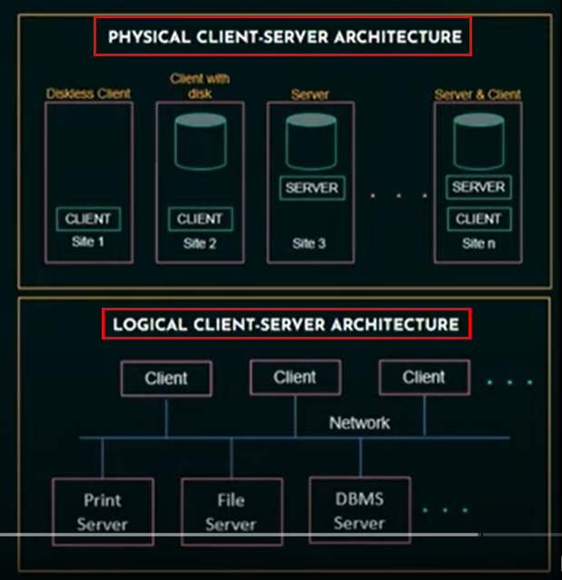

클라이언트-서버 아키텍처는 아래와 같은 두 가지 타입으로 나뉜다. 
1. Two-Tier Client-Server 아키텍처 => 클라이언트 사이드에서 ODBC(Open Database Connectivity)에서 제공하는 API를 통해 직접적으로 DBMS를 요청할 수 있음. 
2. Three-Tier Client-Server 아키텍처 : 현재 대부분의 웹 어플리케이션에 적용됨. 클라이언트와 서버 사이에 웹 서버가 추가된 구조.

## 데이터베이스 디자인의 이해
데이터베이스 디자인은 아래와 같은 프로세스로 이루어진다. 

1. 요구 조건 수집 및 분석 : 데이터베이스 디자이너가 데이터베이스 유저의 요구 조건(data requirement, functional requirement을 이해하고 기록한다. 

2. 개념 스키마(conceptual schema) 작성 : 개체와 개체간 관계, 제약 조건을 작성한다. 

3. 논리적/물리적 디자인 작성 : DBMS를 활용해 실제 데이터베이스의 1) 논리적 디자인을 구성하고, 디스크 서칭을 위한 인덱싱, 데이터를 불러오는 access path 등을 결정하는 2) 물리적 디자인을 구성함.   

Entity-Relationship 모델에 기반한 데이터베이스 ER 다이어그램을 살펴보자. 

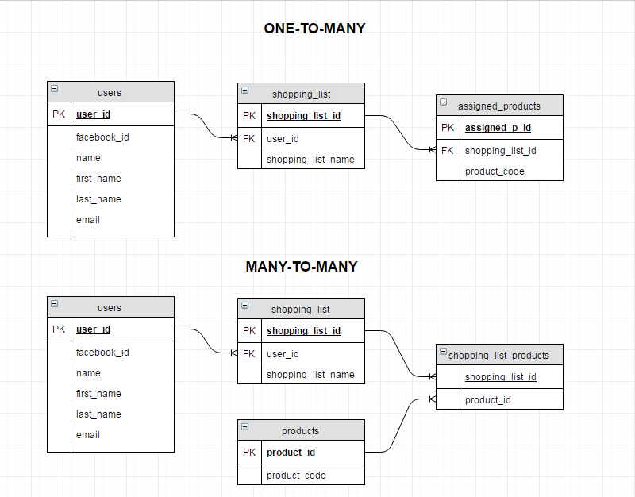

편의를 위해 아래와 같은 ER 다이어그램 웹사이트 툴을 사용할 것을 권장함. 

- [Lucidchard](https://www.lucidchart.com/pages/)

## ER 모델과 Relationship의 이해
ER 모델은 Entity-Relationship 모델의 줄임말이다. 

- Entity : an independent existence in a real world. an object.
1. strong entity : not dependent on other entities in schema, always having a primary key. represented by a single rectangle.
2. weak entity : dependent on string entity, having a partial discriminator key. represented by a doulbe rectangle. 
3. relationship between strong entity and weak one is represented with doulbe diamond.

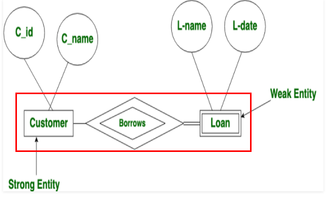

- Relationship : association between enitities. For example, User ===(typing[relationship])===> keyboard.

### Degree of Relationship
1. Unary : one entity => e.g) PERSON => name
2. Binary : two entities => e.g) USER => typing => KEYBOARD
3. Tenary : three entities => USER => turning on => KEYBOARD, MONITOR

### Relationship constraint
서로 다른 개체들은 일정 제약 조건 아래에서 관계를 맞게 된다. 예륻 들어, 

- 카디널리티 제약 : 카디널리티 제약 조건은 1:1, N:1. M:M 등으로 개체 간 서로 맺을 수 있는 관계의 수를 지정하는 것을 의미한다.  

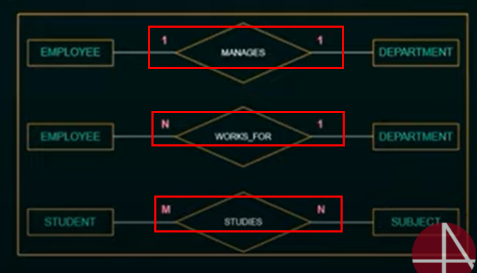

- 참가 제약 : 개체는 관계에 전체 참여 또는 일부 참여할 수 있다. 예를 들어 PERSON 개체와 APARTMENT 개체는 LIVES 관계로 정의된다고 하면, PERSON 개체는 LIVES 관계에 일부 참여하지만(모든 사람이 아파트에 살지는 않으므로) APARTMENT 개체는 LIVES 관계에 전체 참여하게 된다.

ER 다이어그램은 min-max 표기법을 통해 참가 제약을 표시할 수도 있다. 

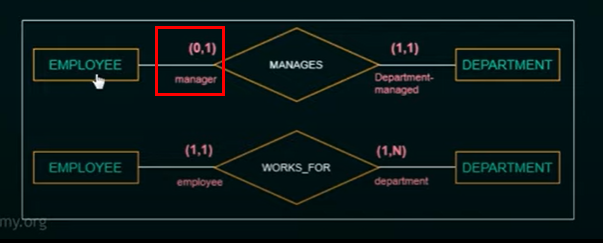

### ER 다이어그램 Exercise 
#### Exercise 1
Exercise 1 CONDITIONS : 
- Every customer must have at least one account
- Every customer must have at best two loans
- Bank branch cannot have more than 1000 loans

Execise 1 REQUIREMENTS :
1. Answer with your min-max constraint

    
solution 1(펼쳐보기)
 

- CUSTOMER (1, N) ===== OWNS ===== ACCOUNT (1, N)
- LOAN (1, N) ===== OWNS ===== CUSTOMER (0, 2) 
- LOAN (1, 1) ===== OWNS ===== BANK-BRANCH(0, 1000)

#### Exercise 2
Exercise 2 CONDITIONS : 
- An employee may work in upto two departments or not assigned to any.  
- Each department must have one and may have up to three phone numbers. 

Execise 2 REQUIREMENTS : 
1. Answer with your own min-max constraint with assumption
2. Under what conditions would the relationship HAS_PHONE be redundant? 

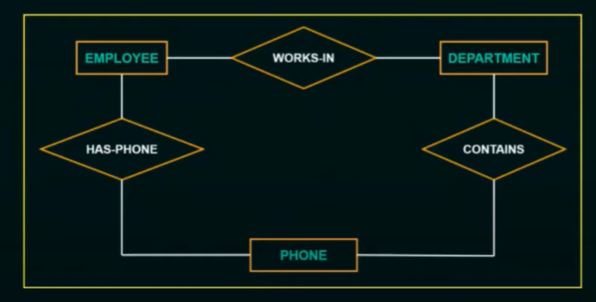

requirement 1 
1. DEPARTMENT must have one and may have up to five employees.
- EMPLOYEE (0, 2) ===== WORKS-IN ===== DEPARTMENT (1, 5)

2. PHONE may have up to one DEPARTMENT.
- DEPARTMENT (1, 3) ===== CONTAINS ===== PHONE (0, 1)

3. EMPLOYEE must have one and may have up to 2 phones. PHONE may have up to one EMPLOYEE 
- EMPLOYEE (1, 2) ===== HAS_PHONE ===== PHONE (0, 1)

requirement 2 : 
Relationship between EMPLOYEE and PHONE will be unnecessary if 
1. each employee in department must have phone and all of the phones should be given to employee. 
2. employee only have phones from inside the department

#### Exercise 3
Exercise 3 CONDITIONS :
- COURSE may or may not use a textbook. 
- COURSE may use up to five books.
- TEXT is a book used in some course.
- INSTRUCTOR teaches at least two and up to four courses

Exercise 3 REQUIREMENTS : 
1. Answer with your own min-max constraints. Clarify your assumptions. 
2. If relationship ADOPTS between INSTRUCTOR and TEXT, how would you make min-max contstraints? 

requirement 1 
1. COURSE must have one INSTRUCTOR. 
- INSTRUCTOR (1, 4) ===== TEACHES ===== COURSE (1, N)
2. TEXT may be used or not used in COURSE.
- COURSE (0, 5) ===== USES ===== TEXT (0, N)

requirement 2 
1. INSTRUCTOR may or may not adopt TEXT
- INSTRUCTOR (0, N) ===== ADOPTS ===== TEXT (0, N)

## 관계형 데이터 모델의 이해
- 관계형 데이터 모델은 1970년대 Ted Codd에 의해 처음 도입되었다. 
- 모든 데이터를 행과 열로 분리해 테이블로 표시하는 것이 주된 특징이다. 테이블은 relation으로 불리기도 한다. 

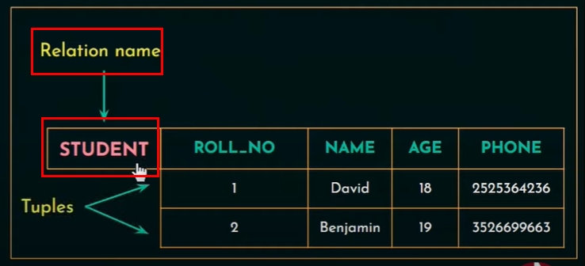

- SQL은 관계형 데이터베이스 매니지먼트 시스템의 표준이 되었다. 

### RDB 테이블(relation)의 이해

- 테이블은 순서가 상관없는 튜플의 모임이다. 예를 들어, 아래의 테이블 PEOPLE은

|ID    |이름|나이| 
|:----:|:--:|:--:|
|11    |Jake|28  |
|22    |Elly|29  |
|33    |Paul|30  |

아래의 테이블 PEOPLE_2와 동일하다. 

|ID    |이름|나이| 
|:----:|:--:|:--:|
|22    |Elly|29  |
|33    |Paul|30  |
|11    |Jake|28  |

그러나, 튜플 내에서의 순서는 중요하다. 예를 들어, 아래의 PERSON 테이블과 

|ID    |이름|나이| 
|:----:|:--:|:--:|
|22    |Elly|29  |

아래의 테이블 PERSON_2는 동일하지 않다.

|ID    |이름|나이| 
|:----:|:--:|:--:|
|Elly  |29  |22  |

- 튜플 내의 값들은 atomic 해야 한다. 예를 들어, 아래의 테이블 STUDENT는

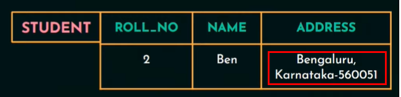

아래의 STUDENT_ATOMIC 으로 변경되어야 한다. 

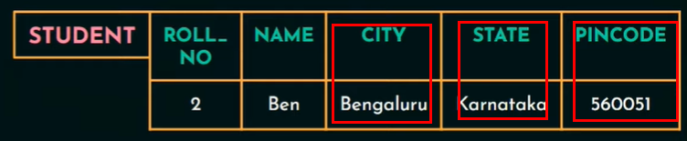

### 관계형 모델 제약 조건
Domain constraints
- relation 내 값들은 atomic 해야 한다. 
- relation 내 값들은 미리 정해진 데이터 형이 지켜져야 한다. 

#### Understanding keys in relation
RDB에서 사용되는 키를 이해하는 것은 중요하다. 아래 내용을 참조할 것.

- [Various Types of Key in Relational DBMS](https://medium.com/swlh/various-types-of-key-in-relational-dbms-f413e0b13b6)

RDB에서 사용되는 key의 종류는 대략적으로 아래와 같다. 

- super key : a set of attributes which can uniquely identify every row in a table. a super set of the candidate key. 
- candiate key : uniquely identify every row in a table. could be multiples.
- primary key : uniquely identify every row in a table. a sub set of candidate key, only one. 
- foreign key : creates a relationship between two tables. acts as a cross-reference between two tables by referencing the primary key.

대략적인 키간 포함 관계는 다음과 같다 : super key > candidate key > primary key + foreign key.

foreign key의 primary key과 반드시 같은 칼럼이어야 하며, FK 값은 PK 값과 동일하거나 null 이어야 한다. 

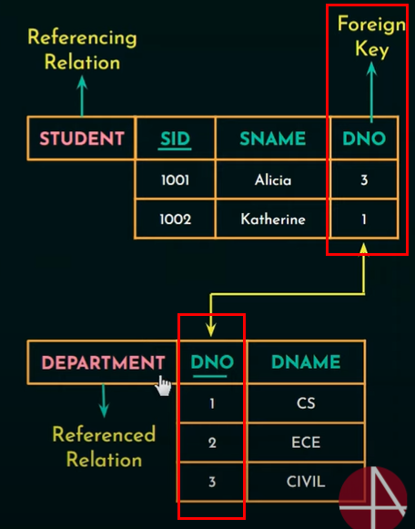

### 업데이트 오퍼레이션
RDB의 레코드를 업데이트 하는 활동은 크게 3가지로 나뉘어진다. 

1. INSERT : relation에 새롭게 record를 삽입할 때, 기존 컬럼들에 대한 제약 조건이 지켜져야 한다. 예를 들어, 새롭게 삽입하는 record의 PK가 1) 중복되거나 2) null인 경우, FK값이 매칭되지 않는 경우 업데이트가 불가하다. 

2. DELETE : 삭제하고자 하는 record의 PK가 다른 relation에서 PK 또는 super key의 일부로 사용되고 있을 경우 업데이트가 불가하다. 예를 들어, 아래의 이미지에서 Employee ID가 1330인 record를 Employee relation에서 삭제하고자 할 경우 DELETE 오퍼레이션은 거절되거나 (Employee ID, PNo는 WORKS_ON relation에서 PK로 활용 중), 해당 record는 레퍼런싱 되고 있는 relation에서도 사라진다. 

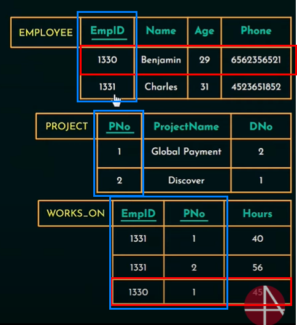

3. UPDATE/MODIFY : 업데이트 하고자 하는 record의 FK값이 레퍼런싱하고 있는 relation의 PK값에서 벗어나는 경우 업데이트가 불가하다. 예를 들어, 아래의 이미지에서 Employee relation의 두 번째 record의 DNo를 1 => 9로 변경하는 업데이트 요청은 거절된다(Department relation에서 PK로 활용되는 DNo값에서 9가 존재하지 않으므로). 

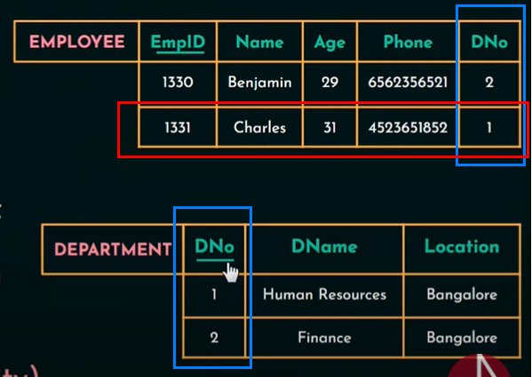

### 관계형 모델 Exercise 1
1. 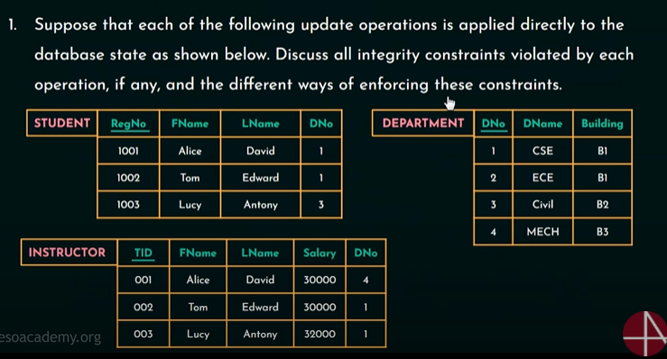

제시된 업데이트 목록과 해결 방안

- Insert (1004, 'Peter', 'Weston', 2) into STUDENT => 정상 업데이트 됨. 

- Insert (004, 'Mark', 'Stevens', 28000, 5) into INSTRUCTOR => INSTRCUTOR의 DNo가 DEPARTMENT의 DNo의 범위를 벗어남. 따라서 1) 업데이트를 거절하거나 2) DEPARTMENT의 DNo에 5를 추가하거나, 3) DNo를 5가 아닌 1~4 값으로 변경해야 한다. 

- Insert (4, 'EEE', B4) into DEPARMENT => PK 값이 중복되므로 1) 업데이트를 거절하거나 2) 1~4가 아닌 다른 값으로 변경한다. 

- Insert (null, 'Anna', 'Smith', 7) into STUDENT => PK 값은 null이 될 수 없고, FK 값인 DNo가 1~4 의 범위여야 하므로 1) 업데이트를 거절하거나 2) PK값에 1001~1003이 아닌 다른 값을 삽입하고, STUDENT DNo을 1~4의 범위로 변경한다. 3) PK값에 1001~1003이 아닌 다른 값을 삽입하고, DEPARTMENT의 DNo에 7을 삽입한다. 

- Delete the INSTRUCTOR tuples with TID = 002 => 정상 업데이트 됨.

- Delete the DEPARTMENT tuple with DNo = 1 => INSTRUCTOR와 STUDENT relation에서 DNo를 FK로 참조하고 있기 때문에 1) 업데이트를 거절하거나 2) DNo = 1 를 참조하는 레코드를 모두 삭제한다.

- Update the DNo of STUDENT tuple with RegNo = 1002 to 3 => 정상 업데이트 됨

- Update the DNo attribute of the INSTRUCTOR tuple with TID = 003 to 8 => DEPARMENT의 PK인 DNo의 범위가 1~4이므로 1) 업데이트를 거절하거나 2) DNo 값을 8에서 1~4의 범위로 변경하거나 3) DEPARTMENT에 DNo = 8 인 record를 새롭게 삽입한다. 

### 관계형 모델 Exercise 2
2. 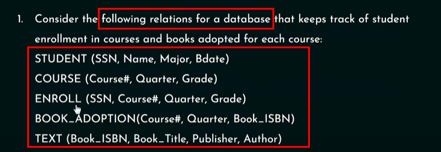 

제시된 문제 목록과 답안

- Specify the foreign keys for this schema, stating any assumptions you make.
1. ENROLL - SSN from STUDENT
2. BOOK_ADOPTION - Course# from COURSE
3. TEXT - Book_ISBN from BOOK_ADOPTION
4. ENROLL - Course# from COURSE

### 관계 대수 
> Relational Algebra is procedural query language, which **takes Relation as input and generate relation as output**. Relational algebra mainly provides theoretical foundation for relational databases and SQL.

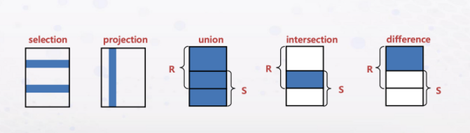 

- Unary relational operation : 단일 관계 연산, 즉 SELECT(δ)를 의미.

<!-- δ === SELECTION operator : a horizontal partionting of relation -->
<!-- Select the EMPLOYEE tuples whose DEPARTMENT number is 2. -->
δ(DNo=2)(EMPLOYEE)

<!-- Select the EMPLOYEE tuples whose DEPARTMENT number is 2 and Salary is greater than 30000 -->
δ(DNo=2 AND Salary > 30000)(EMPLOYEE)

<!-- Select the EMPLOYEE tuples whose DEPARTMENT number is 3 and Salary is greater than 35000 or is 2 and greater than 25000 -->
δ(DNo=3 AND Salary > 35000) OR (DNo=2 AND Salary > 25000)(EMPLOYEE)

> Projection is used to project required column data from a relation.
<!-- π : PROJECTION operator : a vertical partionting of relation -->
<!-- List the EMPLOYEE's First name, last name, and salary. -->
π(Fname, LName, Salary)(EMPLOYEE)

<!-- ρ(rho) : RENAME operator :  -->
> The RENAME operation  returns an existing relation under a new name. ρA(B) is the relation B with its name changed to A.
> The AS keyword in SQL is the equivalent of the rename operator in relational algebra. The following SQL example creates a relation with one tuple and one attribute, which is renamed PI: SELECT 3.14::real AS PI;

## 레퍼런스 
- [위키피디아 - 추상화](https://ko.wikipedia.org/wiki/%EC%B6%94%EC%83%81%ED%99%94_(%EC%BB%B4%ED%93%A8%ED%84%B0_%EA%B3%BC%ED%95%99))
- [데이터베이스 시스템의 구성 - 3단계 데이터베이스 구조](https://m.blog.naver.com/PostView.naver?isHttpsRedirect=true&blogId=k97b1114&logNo=140153781324)
- [Describing access path for database files](https://www.ibm.com/docs/en/i/7.2?topic=files-describing-access-paths-database)
- [Encyclopedia of Database Systems - Access Path](https://link.springer.com/referenceworkentry/10.1007%2F978-0-387-39940-9_866)
- [Incremental backup and recovery](https://www.ibm.com/docs/en/db2/11.5?topic=recover-incremental-backup-recovery)
- [Chen ERD notation](https://vertabelo.com/blog/chen-erd-notation/)
- [Good database design](https://www.dbdesigner.net/what-you-need-to-know-about-good-database-design/)
- [Difference between SQL Keys :Primary Key, Super Key, Candidate Key, Foreign Key](https://www.analyticsvidhya.com/blog/2020/07/difference-between-sql-keys-primary-key-super-key-candidate-key-foreign-key/)
- [Various Types of Key in Relational DBMS](https://medium.com/swlh/various-types-of-key-in-relational-dbms-f413e0b13b6)
- [Introduction of Relational Algebra in DBMS](https://www.geeksforgeeks.org/introduction-of-relational-algebra-in-dbms/)
- [Relational Algebra - Example](https://db.grussell.org/section011.html)
- [Learning PostgreSQL 10 - Second Edition by Salahaldin Juba, Andrey Volkov](https://www.oreilly.com/library/view/learning-postgresql-10/9781788392013/e5b4388d-f35d-45d8-9d1e-33c1f424d358.xhtml)