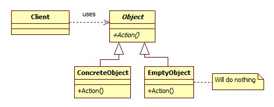
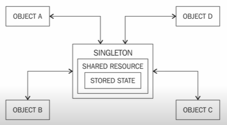
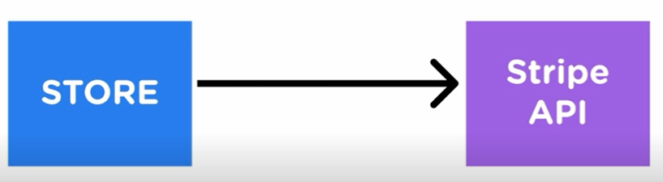
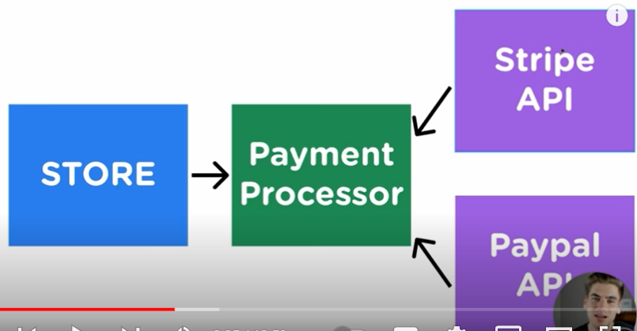

# Content editor : @developerasun
# 디자인 패턴
아래 강좌를 듣고 중요 내용을 요약함. 
[Design patterns (영문)](https://www.youtube.com/watch?v=BWprw8UHIzA&list=PLZlA0Gpn_vH_CthENcPCM0Dww6a5XYC7f&index=1&t=1s)

<p>
디자인 패턴이란 흔히 찾아볼 수 있는 문제들에 대해 일반적이고 재사용 가능한 모범 사례(best practice)를 적용하여 해결책을 제시하는 것. 디자인 패턴을 익힌 후 문제 해결에 적합한 패턴이기만 하다면 플랫폼에 구애받지 않고 여러 소프트웨어에 적용이 가능하다는 장점이 있음. 패턴을 익히는 것보다 패턴을 언제 사용할지 결정하는 것이 어려움.
</p>

# 목차
- Null object
- Builder
- Singleton
- Facade
- Command 
- MVC
- SOLID

# Null object 패턴
아래 코드 블록과 같이 유저가 직접 null/nil 체크를 하는 것이 아니라 아무 처리를 하지 않는 null object(빈 객체)를 생성하고 리턴해줌으로써 예외 처리를 피하는 방식의 프로그래밍 패턴이다.



<span>널 오브젝트 패턴 이전 코드</span><br/>

```Go
name := "jake"
var myError error
if (myError != nil) {
    fmt.Println("error occured") // define what has to occur imperatively
    log.Fatal(myError)
}
```

<span>널 오브젝트 패턴 적용 코드</span><br/>

```Go
type NullObj struct { }
func (n nullObj) ReturnNullObj() string {return "your name should be in English" }

if (reflect.TypeOf(yourName) != reflect.TypeOf("")) {
     newNullObj := new(NullObj)
     message := newNullObj.ReturnNullObj()
     return  message // return nullObj
} else {
   // do something else
}

```

# Builder 패턴
하나의 객체 안에 많은 정보를 담아야 할 때 사용되며 객체의 생성 과정과 표현 방법을 분리하여 코드를 작성하는 패턴을 말한다. 객체의 정보들을 여러 갈래(메소드)로 나누고, 모든 정보를 입력한 후 마지막 단계에 Builder 메소드로 종합/객체 생성/리턴하는 패턴을 의미함. 

```Javascript:builder.js
// 빌더 패턴을 적용하지 않는 경우
class User {
    constructor(name, age, country) { 
        this.name = name;
        this.age = age;
        this.country = country;
    }
}

// 이름과 나이는 필수 입력, 국적이 필수 입력이 아닐 경우를 가정
const user_jake = new User("jake", 27, undefined) // 유저가 파라미터 중 하나를 입력하지 않은 경우, 파라미터들의 순서가 바뀌는 경우가 있을 수 있음. 

// 빌더 패턴을 적용하는 경우
class UserBuilder {
    constructor() {
        this.user = new User(); 
    }
    setName(name) {
        this.user.name = name;
    }
    setAge(age) {
        this.user.age = age;
    }
    setCountry(country) {
        this.user.country = country;
    }
    build() {
        return this;
    }
}

```

<details>
    <summary>오버로딩과 오버라이딩이란? (펼쳐보기)</summary>    

- 오버로딩 : 같은 이름을 가진 메소드/생성자들을 매개변수의 타입과 개수로 구분하는 것. 생성자도 오버로딩이 가능하다(여러 개를 선언할 수 있다). 
- 오버라이딩 : 부모 레벨에서 상속받은 메소드를 자식 레벨에서 재정의 하는 것. 
</details>

# 싱글톤 패턴
여러 리소스에서 공통적으로 사용되는 하나의 객체를 생성하는 패턴. 예를 들어, 아래 그림에서 객체 A,B,C,D는 싱글톤 객체에서 정의된 내용을 모두 공통적으로 사용함. 어플리케이션 전역에서 사용되므로 커플링 되는 사이드 이펙트를 만들어낼 수 있어 일부 개발자들은 싱글톤 패턴을 지양해야한다고 주장하기도 함. 



```Python
# time module has everything wrapped in a file and is being 
# used here as a single instance.  
import time 

time.sleep(3)
print("Module is a singleton instance.")

```

# 파사드(Facade) 패턴
파사드 패턴은 코드 재사용성과 리팩토링을 용이하게 만드는 객체 지향 프로그래밍 디자인 패턴 중 하나이다. 파사드 객체는 A 소프트웨어의 일부 코드 부분에 대한 간략화된 인터페이스를 제공한다. 여러 곳에서 공통적으로 사용되는 코드 라인을 뽑아 인터페이스 B로 만들고 수정/개선할 일이 있을 경우 인터페이스 B만을 수정한다. 


```Python :facade.py
'''
파이썬 파사드 디자인 패턴 
'''
class TypewriterKOR :
    @staticmethod # staticmethod does not have a self argument.
    def write() : # classmethod takes a cls argument, which points to a current class
        return "일"

class TypewriterJPN :
    @staticmethod
    def write() : 
        return "いち"
    
class TypewriterCHN :
    @staticmethod
    def write() : 
        return "一"

class Facade : 
    def __init__(self) :
        self.korText = TypewriterKOR()
        self.jpnText = TypewriterJPN()
        self.chnText = TypewriterCHN()
    def write(self) : 
        result = self.korText.write()
        result += self.jpnText.write()
        result += self.chnText.write()
        return result

myFacade = Facade()
result = myFacade.write()
print(result)


```

<details>
    <summary>파사드 패턴 + 정적메소드</summary>

[파사드 패턴 알아보기(영문)](https://www.youtube.com/watch?v=VrRDami28N0)

[파이썬 : 정적메소드와 클래스메소드](https://hckcksrl.medium.com/python-%EC%A0%95%EC%A0%81%EB%A9%94%EC%86%8C%EB%93%9C-staticmethod-%EC%99%80-classmethod-6721b0977372)

</details>

# 커맨드 패턴
실행될 명령들을 추상화/캡슐화하고 여러 부가 기능을 실행할 수 있도록 재사용성이 높은 클래스로 설계하는 패턴을 말한다. 특정 기능을 수행하는 메소드를 실행/실행 취소하는 커맨드를 만들어 사용할 수 있다.단순한 문제에 커맨드 패턴을 적용하며 오히려 코드가 길고 복잡해지지만, 잘 설계된 커맨드 패턴일 수록 단 하나의 명령어로 하위 복잡한 실행들을 실행할 수 있다는 장점이 있다. 

```Python 
class Command : 
    def execute() : 
        pass 

class GreetingCommand(Command) :
    def __init__(self, cmd) : # __init__ : constructor in Python
        self.cmd = cmd
    def execute(self) : 
        print(self.cmd)

class SingCommand(Command) : 
    def __init__(self, cmd) :
        self.cmd = cmd
    def execute(self) : 
        if (self.cmd == "Beyonce") : 
            print("Start song : Beyonce - Listen")
        else : 
            print("Only Beyonce available for now")
        
# Group of commands
firstCommand = GreetingCommand("Hello World")
secondCommand = SingCommand("Beyonce")
thirdCommand = SingCommand("50 Cent")
fourthCommand = GreetingCommand("Goodbye World")

# Invoker : store commands and trigger all commands.
class Invoker :
    def __init__(self) : 
        self.commands = []
    def addCommand(self, command) : 
        self.commands.append(command)
    def runCommands(self) :
        for command in self.commands : 
            command.execute()

# Invoke all the commands
invoker = Invoker()
invoker.addCommand(firstCommand)
invoker.addCommand(secondCommand)
invoker.addCommand(thirdCommand)
invoker.addCommand(fourthCommand)
invoker.runCommands()

```

# MVC(Model, View, Controller) 패턴
<p>
MVC 패턴은 비교적 단순한 구조로 대중적으로 널리 쓰이며 가장 많은 프레임워크에서 사용됨. 각각의 영역이 종속성이 낮으므로 코드 재사용성이 좋아지나, 컨트롤러에 소스 코드가 집중되는 경향이 있음. 
</p>

- View(UI) : 웹 개발에서 HTML, CSS과 같은 화면 구성을 의미. 사용자들이 직접적으로 볼 수 있는 화면. 
- Model(비즈니스 로직) : 화면에 사용할 데이터들이 저장되어 있는 메모리들을 의미. 사용자가 편집하길 원하는 모든 데이터들을 가지고 있어야 함. 
- Controller : 뷰와 모델을 변화시키는 알고리즘/코드들이 위치한 곳. 1) 모델을 호출하여 데이터를 조작하거나 2) 뷰에서 배경 색상을 변경하는 등의 역할을 담당.

<details>
    <summary>MVC 패턴 도표 (펼쳐보기)</summary>
    
</details>

<details>
    <summary>MVP, MVVM 패턴이란? (펼쳐보기)</summary>

- MVC : Model, View, Controller
- MVP : Model, View, Presenter
- MVVM : Model, View, View model


</details>

# SOLID 디자인 패턴
SOLID란 객체 지향 프로그래밍 및 설계의 5가지 기본 원칙을 정리한 것이다. 유지 보수와 확장성이 좋은 코드를 쓰기 위한 원칙으로 이해하면 된다. 

- S (Single responsibility) : 단일 책임의 원칙. 하나의 모듈은 하나의 기능을 수행하는 것이 원칙. 
- O (Open/closed): 개방 폐쇄의 원칙. 기존 요소는 수정하지 않아야 하면서도(closed) 확장성이 좋아야 함(open). 기존 코드를 바꾸지 않고, 새로운 코드를 추가함. 추가된 코드에서도 기존 코드는 정상 작동해야 함. 
- L (Liskov substitution) : 리스코프 치환 원칙. 부모 클래스(상위 클래스)가 잘 작동하는 곳에 자식 클래스(서브 클래스)로 바꿔서 넣어도 코드가 정상적으로 작동해야 함.
- I (Interface segregation) : 인터페이스 분리 원칙. 인터페이스(추상 클래스)를 구현하는 각각의 객체/클래스는 실제로 사용할 수 있는 기능/정보만을 실행해야 함. 하나의 인터페이스에 너무 많은 기능이 들어있을 경우 인터페이스를 사용하는 객체 또는 클래스는 필요 없는 기능/정보를 구현해야할 수 있기 때문.
- D (Dependency inversion) : 의존관계 역전 원칙. 상위 개념의 기능이 하위 개념 기능에 의존하지 않고 독립적으로 구현되는 것. 

<span>상위 기능이 하위 기능이 종속됨</span><br/>


결제 모듈을 바꾸려면 Stripe API와 관련된 모든 코드를 변경해야함. 

<span>상위 기능이 하위 기능과 관계없이 기능함</span><br/>


결제 모듈을 변경하기 위해 Payment Processor(Wrapper API)에서 Stripe API => Paypal API로 변경함. 