# Content editor : @developerasun

# 목차
- [운영체제의 이해]()
- [운영체제의 이해]()
- [운영체제의 이해]()
- [운영체제의 이해]()
- [운영체제의 이해]()
- [운영체제의 이해]()
- [운영체제의 이해]()

# 운영 체제의 이해
아래 강좌를 듣고 핵심 내용을 요약함. 대부분의 설명은 한국어이나 편의상 영문으로 기술한 부분이 있음. 

- [Operating System by Neso Academy](https://www.youtube.com/playlist?list=PLBlnK6fEyqRiVhbXDGLXDk_OQAeuVcp2O)

# 서문
운영체제란 컴퓨터 하드웨어를 관리하는 소프트웨어를 의미한다. 운영체제는 사용자와 컴퓨터 하드웨어의 중간자로서 응용 프로그램의 기반이 된다. 

- 운영 체제의 종류 : Windows, Linux, Ubuntu, Mac OS, Android

<span>System/Application - OS - Hardware</span><br/>
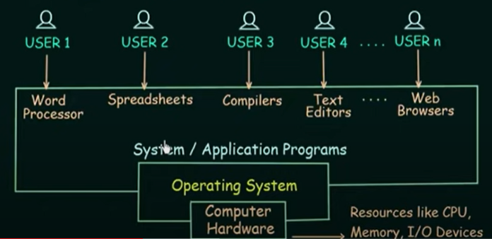

<p>
만약 운영체제가 없다면 Excel과 같은 응용 프로그램을 실행시킬 때, 유저가 직접 하드웨어에게 코드를 작성하고 명령을 내려 저장, 연산 등을 수행해야 한다. 운영체제의 핵심은 <strong>인터페이스로서 사용자를 대신해 하드웨어에게 명령을 내리고, 사용자는 응용 프로그램의 사용에 집중</strong>할 수 있도록 만들어주는 것에 있다. 
</p>

- 인터페이스 : 유저 - 운영체제 - 하드웨어
- 자원 관리 및 분배 : CPU 자원, 메모리, 입출력 기기 등

<details>
    <summary>시스템/응용 프로그래밍이란? </summary>

- 시스템 프로그래밍 : hardware related. : OS, Network
- 응용 프로그래밍 : user related. e.g : Excel, Web, Compiler
</details>

<p>
운영체제의 핵심은 1) 입출력 기능을 관리하고 2) 멀티프로그래밍을 지원하는 것에 있다. 
</p>

# 컴퓨터 시스템 실행의 이해
컴퓨터에 입력되는 명령/프로그램들이 실행되기 위해서는 메인 메모리에 적재(load)되어야 한다. 각각의 명령/프로그램들은 동시에 실행되어((concurrently) 메모리에 접근하고자 하고, 이는 메모리 컨트롤러에 의해 싱크/순서가 맞추어진다.

<span>컴퓨터 시스템 구조</span><br/>
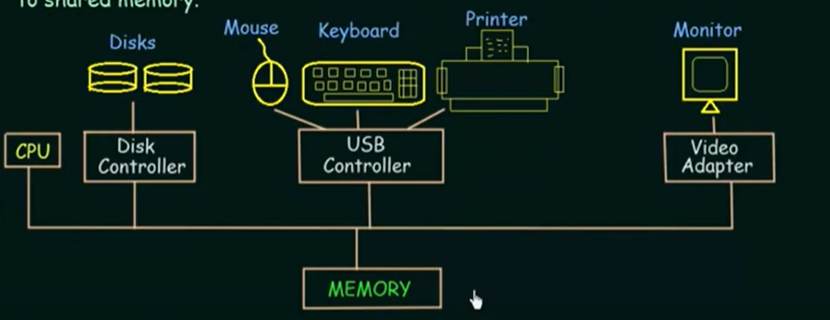

각각의 섹션은 버스(bus)로 연결되어 있고, 공유된 메모리(shared memory)에 접근하기 위해 서로 경쟁한다. 

## 알아둬야할 부수 개념
- 1. Bootstrap program : 컴퓨터가 켜졌을 때 가장 먼저 실행되는 프로그램으로써 1) OS를 실행시키고 2) OS 커널을 메모리에 적재시키는 역할을 한다. 
- 2. Interrupt : 하드웨어가 모종의 이유로 연산 중인 CPU의 작업을 중단시키고, 다른 작업을 먼저 처리해줄 것을 요구하는 것. 하드웨어의 경우 시스템 버스(system bus)를 통해 언제든지 intercept를 발생시킬 수 있음. 
- 3. System call(monitor call) : 소프트웨어가 interupt를 발생시킬 경우 system call이라고 부름. 

Interrupt 또는 system call이 발생했을 경우 CPU는 기존의 연산을 멈추고 연산 중인 작업을 특정 장소로 옮겨둔다. 이때, ISR(Interrupt Service Routine)의 시작 주소가 해당 장소에 기록되어진다. 

영문이 문맥 이해가 쉬우므로 해당 프로세스를 아래 영문으로 작성함.
- 0. CPU working on something
- 1. CPU gets interrupted
- 2. CPU moves what it was workin on to a fixed location with ISR starting address 
- 3. ISR gets executed
- 4. Once the ISR done, CPU resumes the work

# 저장 구조 계층(Stroage structure)
Excel과 같은 응용프로그램은 Secondary storage에 저장되어 실행되기를 기다리고, 유저가 실행 시킬 때 메인 메모리에 적재된다. 이는 메인 메모리(RAM)의 용량이 제한되어 있어 한꺼번에 모든 프로그램을 실행시킬 수 없기 때문이다.

<span>저장 구조 계층(상단 최소 => 하단 최대)</span>
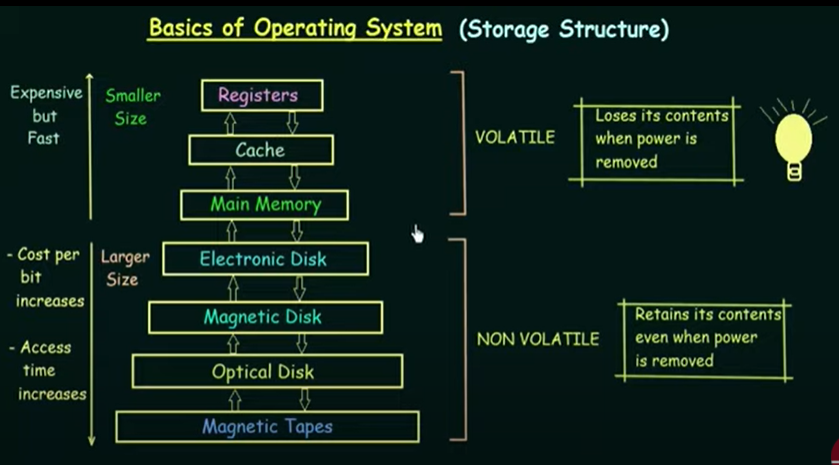

RAM이 커질 수록 적재할 수 있는 응용 프로그램의 크기가 커지므로 컴퓨터의 실행 속도가 빨라진다.  

직관적인 이해를 위해 영문으로 아래 내용을 작성함. 
1. Application is inactive and stored in secondary storage(got big space to store and data is retained).
2. User executes(double clicks) the application. 
3. Main memory(RAM, got relatively smaller space to store and data is not retained) loads the active application.
4. If the RAM was bigger, it would've loaded faster. Even if the secondary storage is super big, the application loads slower if the RAM is super small.

# 입출력 구조(I/O structure)
컴퓨터의 입출력을 관리하는 기능은 운영 체제의 코드 베이스 중 큰 부분을 차지한다.   

Device controller는 입출력 기기의 한 부분으로서 소켓을 통해 기기와 연결되고 1) Local buffer storage 와 2) Speical purpose registers를 유지함으로써 기기를 관리한다. 

- 입출력 기기 <=> 소켓 <=> device controller <=> device driver(OS)

운영체제는 device driver(인터페이스)를 통해 device controller와 소통한다.

<details>
    <summary>입출력 기기 살펴보기</summary>
    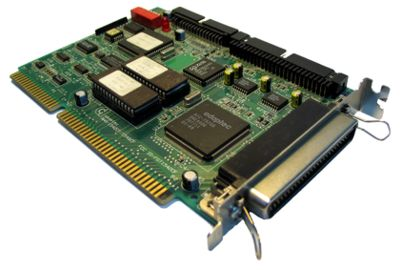
</details>

## 입출력 실행 이해하기
1. device driver loads proper registers in device controller. 
2. device controller decides which action needed to perform.
3. device controller moves data to local buffer storage.
4. device controller finished the transfer and invoke an interrupt to the device driver. 
5. device driver returns the control to OS. 

### Direct Memory Access(DMA)
<p>
위와 같은 입출력 실행은 입출력 발생시마다 CPU interrupt를 발생시키므로 대용량의 데이터 전송에는 적합하지 않다. 
</p>

<p>
대용량 입출력 데이터를 관리해야하는 경우 버퍼, 포인터, 카운터를 이용해 기기 <=> 메모리로 데이터를 직접 전송하는 방식을 사용한다. 
</p>

<p>
DMA의 경우 데이터 블록을 기준으로 device driver에게 1번의 interrupt가 발생하며 CPU는 interrupt 없이 수행하던 작업을 계속 수행할 수 있다.
</p>

# 컴퓨터 시스템 구조
## 컴퓨터 시스템의 종류 
1. Single processor system : having one general purpose processor, dealing with only one process froom ready queue at a time.

2. Multiprocessor system(parallel system) : having two or more general purpose processors, addressing multiple processes at the same time. Bus, clock, or memory can be shared. 

<details>
    <summary>Advantages of Multiprocessor system</summary>

- Higher throughput(measuring performance)
- Economy of scale
- Highr reliability => if one of the processors fails, other will function still. 
</details>

Types of multiprocessors is as follows : 1) symmetric multiprocessor 2) asymmetric multiprocessor
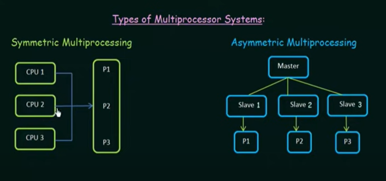

3. Clustered system : having multiple CPUs for caculation, composed of two or more <strong>individual systems</strong> combined.

# 운영체제 구조
윈도우, 맥, 우분투 등 각각의 운영체제의 내부 구조는 많은 차이점을 가지고 있으나, 공통/핵심적으로 1) 멀티 프로그래밍 2) 멀티 태스킹을 수행한다. 멀티 프로그래밍과 멀티 태스킹은 운영체제의 핵심 역할이라 할 수 있다. 

## 멀티 프로그래밍(Multiprogramming)
<p>
멀티 프로그래밍의 목적은 CPU의 효용성을 증가시켜 여러 가지 프로그램을 동시에 실행하는 것에 있다. 

메인 메모리 RAM은 Job pool에서 수행해야 할 작업 중 일부를 가지고 온다(RAM의 용량 한계로 인해 전체를 가지고 오지 않음).
</p>

- Job : code + data 
- Job pool : a place where a group of jobs are stored, awaiting main memory and CPU allocation. 
- OS fetches the some of the jobs into RAM, addressing multiprogramming. 

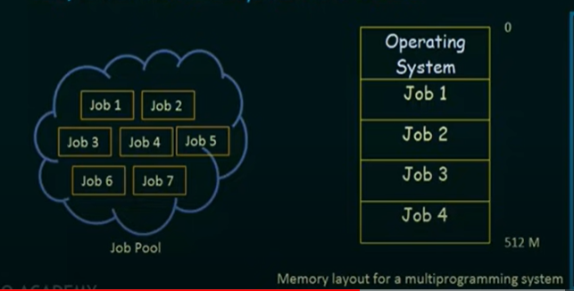

<p>
멀티 프로그래밍이 아닌 경우 CPU는 수행하던 job이 끝날 때까지 대기하고(CPU being idle), job이 끝난 것을 확인한 후에야 다음 job으로 넘어갈 수 있다.
<br> 
멀티 프로그래밍에서는 <bold>CPU는 항상 수행해야 할 job을 가지고 있으며</bold>, 수행하던 job이 끝날 때까지 대기하지 않고(CPU released) 다음 job을 수행한다(CPU not being idle). 
</p>

<p>
멀티 프로그래밍의 경우 컴퓨터 자원(CPU, RAM, Jobs...)이 효율적으로 관리되게 하나, 유저에게 컴퓨터 시스템에 대한 상호작용을 제공하지는 아니한다. 
</p>

## 멀티 태스킹(multitasking or time sharing)
<p>
멀티 태스킹의 주된 목적은 여러 프로그램을 실행하는 동시에 여러 유저에게 상호작용을 제공하는 것에 있다. CPU는 A=>B=>C=>A=>C=>B 등 프로그램 간의 전환(switch)을 매우 빠르게 제공하여 유저 입장에서는 동시에 모든 프로그램을 제어(상호작용)하는 것처럼 느끼게 된다. 
</p>

<p>
멀티 태스킹은 CPU 스케쥴링과 멀티프로그래밍을 통하여 유저에게 a time-share computer를 제공함으로써 이루어진다.  
</p>

<details>
    <summary>★★★ What is process and instance?</summary>

- A program loaded into memory and executing is called a process. 
- Instance in computer science refers to any running process or specifically object as an instance of a class. 

```Python
class MyClass : 
    def __init__(self, name) : 
        self.name = name

# myClass : an instance of MyClass
myClass = MyClass("Jake's class")
print(myClass.name) # result : "Jake's class"

```

</details>

# 운영체제 서비스 
운영체제는 프로그램 실행에 필요한 환경 구성을 유저에게 제공한다.

1. 유저 인터페이스 : CLI(Commnad Line Interface)와 GUI(Graphical User Interface). CLI는 텍스트 기반으로 운영체제에게 명령을 내리며, GUI는 그래픽 기반으로 유저<=>운영체제 상호작용을 돕는다. 
2. 프로그램 실행(program execution) : 운영체제는 아래와 같이 프로그램을 메모리에 로드하고, 프로세스를 실행시킬 수 있어야 한다. 
```
Source code => Compiler => Object Code => Executor => Output
```
3. 입/출력 실행 : 유저는 직접적으로 입출력 기기의 실행에 관여할 수 없다. 예를 들어, 유저가 키보드를 사용할 때 어떤 문자를 입력할지 결정한다고 생각할 수 있으나, 실제 키보드 입출력을 관리하는 것은 운영체제의 몫이다. 입출력 실행은 운영체제의 가장 중요한 역할 중 하나이다. 

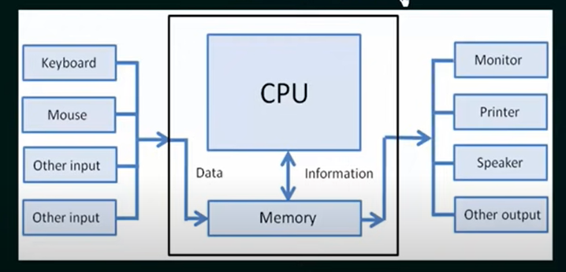

4. 파일 시스템 관리 : 운영체제는 파일 접근 및 CRUD 기능을 관장한다. 
5. 프로세스 커뮤니케이션 : 네트워크 상에서 프로세스 간 정보 교류가 필요할 경우 (교류가 같은 컴퓨터/서로 다른 컴퓨터 상에서 이루어져야 할 경우), 운영체제가 이를 관리한다.
6. 에러 감지 : 운영체제는 CPU, I/O, 하드웨어 등에서 발생할 수 있는 에러를 감지하고, 에러가 발생할 경우 전체 컴퓨터를 멈추는 것(cease)이 아니라 필요 기능만을 멈출 수 있도록 기능한다.  
7. 자원 분배(Resource allocation) : 자원 분배를 요구하는 프로세스/유저를 확인하고 필요 자원을 분배한다. 자원 분배는 운영체제의 중요 기능 중 하나이다.  
8. 감사(accounting) : 특정 유저가 사용한 자원의 양과 종류를 추적한다. 추적된 정보는 추후 컴퓨터 시스템의 구성에 참고될 수 있다. 
9. 보호 및 보안 : 보호 => 여러 프로세스가 한꺼번에 실행되고 있을 경우, 각각의 프로세스의 실행이 서로 영향을 주어서는 안된다. 운영체제가 이를 관리한다. 보안 => 기기에 대한 외부 접근을 제한하고 그 접근 시도를 기록한다. 

## 유저 인터페이스
1. CLI : 커맨드라인 인터페이스. 텍스트로 직접적으로 운영체제에게 명령을 내림. 커맨드 인터프리터(shells)는 커맨드가 떨어질 경우 1) 커맨드 자체를 코드로 저장하고 있거나 2) 커맨드에 해당하는 프로그램을 불러옴 

```
커맨드 라인 인터페이스 <=> 운영체제 커널(커맨드 인터프리터)
```

<details>
    <summary>커맨드라인 인터페이스, 인터프리터 예시</summary>
    
- 커맨드라인 인터페이스 : Windows PowerShell
- 커맨드라인 인터프리터 : UNIX Bourne shell
</details>

Windows PowerShell 실행 후 아래 실습을 진행
- pwd : print working directory
- ls : list what is in the pwd
- mkdir hello : make directory named 'hello'
- rm -rf hello or rmdir hello : remove the hello directory 

-r command deletes the folder recursively 
-f command removes 'Read only File' without asking

2. GUI : 그래피컬 인터페이스. 알아보기 쉬운 그래픽 요소를 활용해 운영체제에게 명령을 내림.

## 시스템 콜(System call) 
시스템 콜은 운영체제 서비스들에 대한 인터페이스를 제공한다. 보통 C나 C++로 작성된다. 시스템 콜에 대해서 알아보기 이전에, 프로그램 모드에 대한 이해가 선행되어야 한다. 

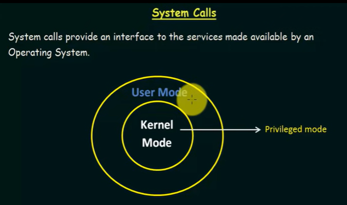

<ol> 
<span>프로그램 모드</span> 

<ul> 
    <span>유저 모드(User mode)</span>

- 메모리, 하드웨어와 같은 자원에 대한 직접 접근 권한이 없음. Safe mode
- 대부분의 프로그램은 유저 모드로 실행됨
- 유저 모드로 접근한 프로그램이 모종의 이유로 crash 될 경우에도 전체 시스템은 유지됨
- 메모리 등과 같은 자원에 접근해야 할 경우 <strong>시스템 콜을 요청해 커널 모드로 전환함(컨텍스트 스위칭, context switching)</strong>
</ul>

<ul>
<span>커널 모드(Kernel mode)</span>

- 직접 권한 있음. Previleged mode
- 커널 모드로 접근한 프로그램이 모종의 이유로 crash 될 경우 전체 시스템도 crash 됨
</ul>

</ol>

Let's see how often system call is used to copy some content from source file to destination file, which is a very simple task in file system. Each step needs a system call. 

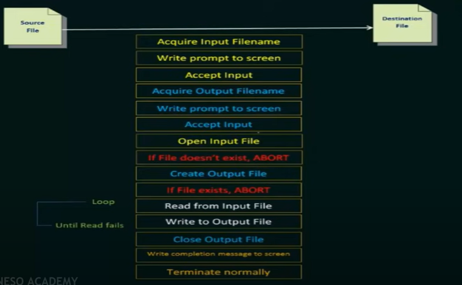

In execution of a program, the thousands of system call is run per second. Consider that system all is always running once a program is turned on.

## 시스템 콜의 종류

<ol>

<ul>
<span>프로세스 컨트롤</span>

- end, abort
- load, execite
</ul>

<ul>
<span>파일 컨트롤</span>

- create and delete file
- open and close file
- read and write file

</ul>

<ul>
<span>기기 컨트롤</span>

- request and release device
- read, write device
- logically attach and detach device

<details>
    <summary>Logially attach vs Physically attach</summary>

- Physically attach : device plugged into your computer 
- Logically attach : checking if the device should be connected or disconnected
</details>
</ul>

<ul>
<span>정보 유지 보수<span>

- get/set time and date
- get/set system data
- get/set process, file, and device attributes
</ul>

<ul>
<span>커뮤니케이션</span>

- create, delete communication connection between processes
- send, receive messages
- transfer status info 
</ul>
</ol>

## 시스템 프로그램
유저와 컴퓨터는 아래와 같은 구조로 서로 상호작용을 한다. 

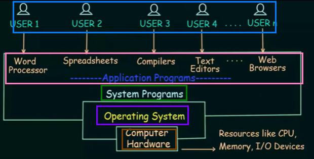

시스템 프로그램은 4가지 종류로 이루어진다. 

<ol>
<ul>
<span>파일 관리(file management)</span>

- Create, delete, read files 
- Print
- Rename
</ul>

<ul>
<span>상태 정보(status information)</span>

- Date, time 
- Memory, disk space
- Number of users 
- Detailed performance 
- Logging and debugging 
</ul>

<ul>
<span>파일 수정(file modification)</span>

- managets inner contents in a file 
- c.f file management : manages the file
</ul>

<ul>
<span>프로그래밍 언어 지원</span>

- compiler
- assembler 
- debugger
- interpreter

<span> C, C++, Java와 같은 프로그래밍 언어들은 운영체제를 통해서 유저에게 제공됨. </span>
</ul>

<ul>
<span>프로그램 로딩 및 실행</span>

- Absolute loaders
- Relocatable loaders
- Linkage editors 
- Overlay loaders 
<span>프로그램이 컴파일/어셈블 된 이후 실행되기 위해서는 메모리에 적재되는 과정이 필요하고, 위와 같은 운영체제의 시스템 프로그램이 이를 담당함. </span>

</ul>

</ol>

# 운영 체제 디자인 및 실행
## 디자인 
운영 체제를 디자인함에 있어서 고려해야 할 요소는 아래와 같다. 

- 어떤 하드웨어를 쓸 것인가
- 어떤 종류의 시스템을 쓸 것인가 : 멀티 프로세싱, 멀티 태스킹 등

### 메커니즘과 정책 
- 메커니즘 : determine how to do something
- 정책 : what should be done

메커니즘과 정책은 서로 분리되는 것이 중요 원칙이다. 

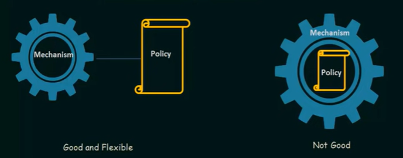

## 실행
운영 체제는 어셈블리어로 주로 작성이 되었으나 현대에는 아래와 같은 장점들로 인해 대개 C 또는 C++와 같은 higher-level language들로 작성된다. 

- Codes written faster
- More expandable
- Easier to understand

# 운영 체제의 구조
## Simple structure
Simple structure는 초기 운영 체제가 설계되었던 구조로, 응용 프로그램이 하드웨어 단에 직접적으로 접근할 수 있다는 점에서 우수한 구조로 평가받지는 않는다.


## Monolithic structure
Monolithic structure는 초기 UNIX가 설계되었던 구조로 simple structure의 일환이다.

시스템 콜 인터페이스가 하나의 레벨에서 너무 많은 기능을 담당하고 있어 확장성이 좋지 않다는 단점이 존재한다. 

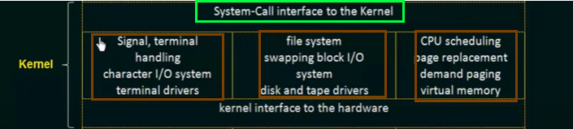

## Layered structure
Monolithic structure를 보완하기 위해 하나의 운영 체제를 여러 개의 레이어로 나누고 각기 다른 functionality를 위임함으로서 구조적 단점을 보완하려고 노력함. 레이어 배치가 어렵고, 레이어간 top-down 방식으로 인한 시스템 콜 전달 속도가 느릴 수 있다는 단점이 존재.

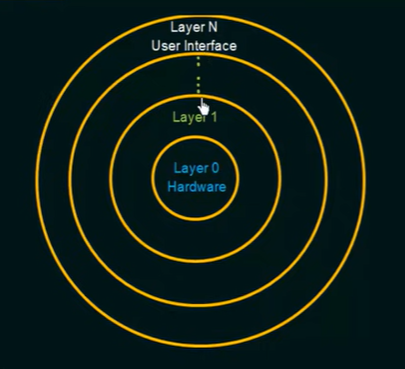

## Microkernels
마이크로 커널 구조는 유저 모드와 커널 모드를 분리하고, 대부분의 기능을 유저 모드에 분배함으로써 시스템의 안정성을 높였다는 장점이 있다. 그러나 프로세스 간 커뮤니케이션을 담당하는 마이크로커널이 메세지를 계속 전달해야하므로 전체 퍼포먼스가 느려질 수 있다는 단점이 존재한다. 

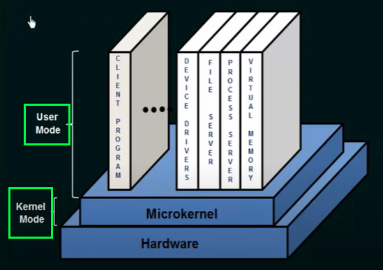

## Modules
모듈은 현재 운영 체제 구조 중에서 가장 적합하다는 평가를 받는다. 코어 커널은 가장 핵심 기능만을 수행하고, 다른 기능들은 코어 커널에 연결해서 사용할 수 있는 모듈로서 구현한다. Top-down 방식이었던 레이어 구조와 달리, 각각의 모듈은 서로 커뮤니케이션이 가능하여 효율이 좋다. 

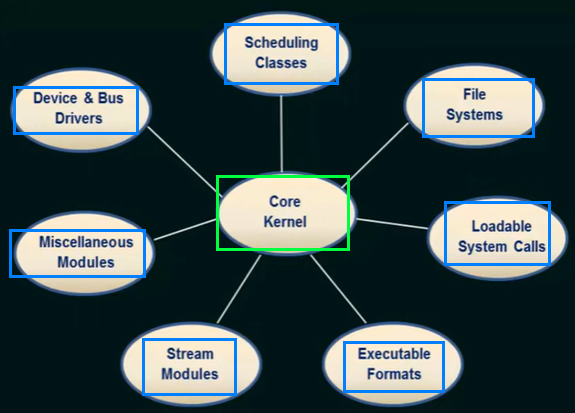

# 가상 머신(Virtual Machine)
가상 머신의 기본 논리는 다음과 같다. 하나의 컴퓨터에 있는 하드웨어 기기들을 <strong>추상화</strong>하여 서로 다른 영역에 넣어준다. 이런 방식을 통해 각각의 영역은 <bold>서로 다른 컴퓨터들을 가지고 실행되는 듯한</bold> 효과를 이룬다. 

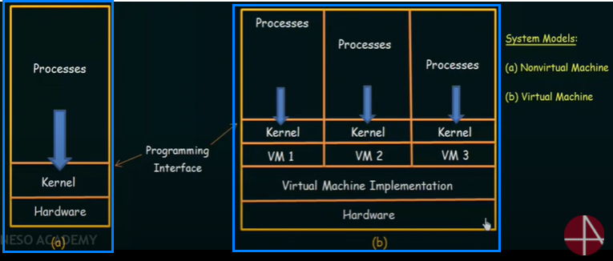

위 그림에서 (b)의 경우 하나의 하드웨어에서 가상 머신을 통해 여러 프로세스들에게 서로 다른 커널을 분배하지만 (a)의 경우 하나의 커널만이 제공된다. 

## 가상 머신 구조 
가상 머신은 실제 하드웨어(a whole disk)에서 일부 영역(mini disk)을 분배해 만들어진다. 각각의 가상 머신에 분배된 자원은 서로 독립적이고 공유될 수 없다. 실제 컴퓨터(Pysical machine)를 A라고 가정하고, 가상 머신 사용으로 인해 생겨나는 컴퓨터(Virtual machine)를 B라고 생각해보자.

<ol>

- 프로세스 ( B : 유저 모드)
===================================
- 가상 머신 커널 ( B : 커널 모드)
===================================
- 가상 머신(A : 유저 모드, B : B 또한 유저 모드와 커널 모드를 가져야 함)
===================================
- 가상 머신 소프트웨어(A : 커널 모드)
- 하드웨어 (A)
===================================

</ol>

# 운영 체제와 시스템 부팅
Sysgen(system generation)이란 특정 머신에 특정 운영 체제를 유저가 세팅한 설정과 하드웨어가 요구하는 세부사항들에 맞게 설치하도록 도와주는 프로그램을 의미한다. 시스젠 프로그램이 설정하는 값들은 아래와 같다. 

- CPU 종류
- 가용 가능 메모리 
- 가용 가능 기기
- 운영 체제 옵션

## 시스템 부팅
컴퓨터는 커널을 로딩함으로써 시작된다. 흔히 알려진 '시스템을 부팅한다'라는 개념은 커널이 로딩 중이라는 의미와 같다.

<p>
하드웨어가 커널을 로드하기 위해서는 부트스트랩(bootstrap) 프로그램이 필요한데, 이는 하드웨어가 커널을 찾아내고 로드하는 과정을 도와준다. 대부분의 컴퓨터 시스템에서 부트스트랩 로더가 설치되어 있다. 부팅 프로그램은 virus로 인한 mutation을 막고 컴퓨터 전원을 끄더라도 유지되어야 하므로 ROM(read only memory)의 형태로 저장된다. 
</p>

<p>
부트스트랩 프로그램이 완전히 로드되고 나면, 파일 시스템을 순회하며 운영 체제 커널을 찾기 시작한다. 커널이 로드되고 실행이 시작되는 순간을 가리켜 시스템이 부팅된다고 표현한다. 
</p>

# 프로세스 관리 : 프로세스와 쓰레드
프로세스와 쓰레드를 이해하기 전 어떻게 하나의 프로그램이 개발되는지를 알아보자. 

<ol>

- 하이 레벨 프로그래밍 언어로 코드 작성
- 컴파일러를 통해 코드를 기계어로 변환
- 운영 체제를 통해 프로그램을 메모리에 로드
- 운영 체제를 통해 자원을 프로그램에 분배  ======> Passive entity
- 프로그램 실행 ===========> Process(An instance of a program, meaning program in execution)
</ol>

프로세스란 프로그램이 인스턴스화 되면서 실행된 것을 가리킨다. 
쓰레드란 프로세스 내에서 실행되고 있는 작업들을 가리킨다. 

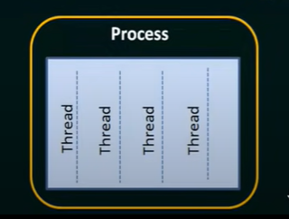

## 프로세스 상태(Process state)
프로세스 상태는 프로세스의 현재 활동 단계에 따라 정해진다. 

<ol>

- New : 프로세스가 만들어지는 단계
- Running : 프로그램이 로드되어 프로세스가 생성되고 실행됨
- Waiting : 입출력과 같은 이벤트로 인해 잠시 실행을 중단함
- Ready : 생성된 프로세스 또는 실행이 중단된 프로세스가 실행 준비를 마치고 대기함
- Terminate : 프로세스가  실행을 종료함
</ol>

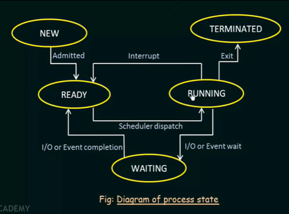

## 프로세스 컨트롤 블록(Process control block)
프로세스 컨트롤 블록이란 프로세스에 대한 정보를 항목별로 나타내어주는 것을 의미한다.  

- Process ID
- Process state
- Program counter
- CPU register
- CPU scheduling info
- Memory management info
- Accounting info
- Input/ouput status info

## 프로세스 스케쥴링
프로세스 스케쥴링을 이해하기 위해서는 1) 멀티 프로그래밍과 2) time sharing 개념을 다시 한 번 짚을 필요가 있다. 

1. 멀티 프로그래밍의 목적은 CPU를 최대한 활용하기 위해 항상 일정 수준의 프로세스를 작업하도록 유도하는 것이다. 
2. time sharing은 유저가 상호작용을 느낄 수 있도록 CPU가 작업 중인 프로세스들을 빈번하게 교체하는 것을 의미한다.

프로세스 스케쥴링이란 위의 두 가지를 만족시키기 위해 가용 가능한 프로세스들 중 적당한 프로세스를 골라 CPU에게 전달하는 것을 의미한다. 

### 스케쥴링 큐(Scheduling queue)
프로세스 스케쥴러는 상황에 따라 스케쥴링 큐에서 CPU에게 할당할 프로세스를 설정한다. 

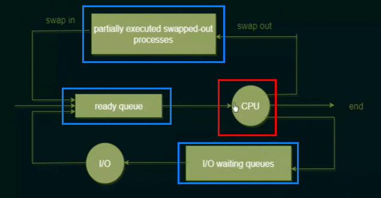

<details>
    <summary>프로세스 큐의 종류를 알아보자</summary>

1. Job queue란 운영 체제 내 모든 프로세스를 모아놓은 공간을 의미한다. 운영 체제가 프로세스 관리를 시작하면 job queue에 프로세스를 등록한다. 
2. Ready queue란 메인 메모리 내에서 실행을 기다리고 있는(CPU가 불러주기를 기다리고 있는) 프로세스를 모아놓은 공간을 의미한다. 
3. Input/Output queue란 입출력에 관련된 프로세스들을 모아놓은 공간을 의미한다.
</details>

## 컨텍스트 스위칭(context switching)
<p>
CPU가 기존에 실행 중이던 작업을 interrupt에 의해 멈추고, 우선 순위가 더 높은 작업을 실행해야 할 경우가 생긴다. 이때, 기존 작업 A에 대한 문맥(context, process state를 의미)을 PCB(Process control block)에 기록하고, 요청된 작업을 끝낸 이후 문맥을 참고해 다시 기존 작업 A를 실행한다. <strong>프로세스 상태를 저장하고 다시 불러오는 이러한 일련의 과정을 컨텍스트 스위칭</strong>이라 부른다.
</p>

- 컨텍스트 스위칭에 걸리는 시간은 pure overhead.
- 보통은 밀리 세컨드 단위로 걸리지만, 기기에 따라 걸리는 시간은 상이할 수 있음.

## 프로세스 운영
### 프로세스 생성(Process creation)
하나의 프로세스는 실행 과정 중에서 시스템 콜을 통해 여러 개의 새로운 서브 프로세스를 생성할 수 있다. 

- 프로세스 트리 : 부모 프로세스(parent process) ===(시스템 콜)===> 자식 프로세스(child process) ===> 자식 프로세스 ====> 자식 프로세스 ... 

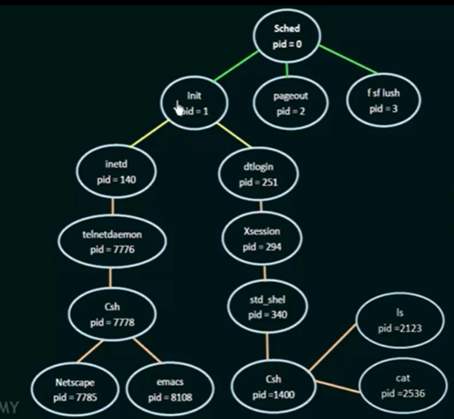

<p>
pid 는 process id를 의미한다. 자식 프로세스는 1) 부모 프로세스와 동시에 실행되거나 2) 부모 프로세스의 실행을 멈추고 기다리게 하는 2가지의 경우로 나뉘어진다. 또한, 자식 프로세스는 1) 부모 프로세스와 완전 동일하거나 2) 새로운 프로그램으로 실행될 수 있다. 
</p>

### 프로세스 종료(Process termination)
<p>
프로세스 종료는 프로그램의 마지막 구문이 실행된 뒤 운영체제에게 프로세스 종료를(즉, 메모리에서 unload 하기를) 요청하는 것을 의미한다. Exit system call로 프로세스 종료를 요청한다. 
</p>
<p>
프로세스 종료시, 정수 단위의 status value를 부모 프로세스에게 리턴한다. 프로세스의 물리/가상 메모리, 파일, 입출력 버퍼 등의 자원이 운영체제에 의해 할당 해제된다. 할당된 자원은 다른 프로세스에게 배분되어 다른 프로세스를 실행할 수 있게 한다. 
</p>
<p>
부모 프로세스의 경우 시스템 콜을 통해 자식 프로세스에게 할당된 자원의 사용량이 한계치를 넘어섰거나 자식 프로세스의 태스크가 끝났을 경우 자식 프로세스를 종료시킬 수 있다. 부모 프로세스는 이를 위해 자식 프로세스의 자원 상태를 파악할 수 있어야 한다. 
</p>
<p>
운영체제는 부모 프로세스의 종료시 자식 프로세스도 함께 종료시킨다. 
</p>

## 인터프로세스 커뮤니케이션(Interprocess communication)
운영체제 내에서 실행되는 동시 실행되는 프로세스의 종류는 아래와 같다. 

- Independent process : 다른 프로세스들에 의해 영향을 받지 않음
- Cooperating process : 다른 프로세스들과 상호 작용함(데이터를 공유함)

프로세스들이 서로 상호작용하는 것에는 아래와 같은 이유들이 존재한다. 

- 데이터 교환
- 연산 속도 향상(태스크 분할 => 서로 다른 프로세스에게 할당 => 연산)
- 모듈화

이러한 프로세스 상호 작용을 이루기 위해서는 아래와 같은 대표적 2가지 인터프로세스 커뮤니케이션(IPC) 메커니즘이 필요하다. 

1. Shared memory : 특정 메모리 영역이 프로세스들에게 공유되고, 프로세스들은 이 영역에 데이터 입/출력을 실행한다. 
2. Message passing : 프로세스들은 서로 메세지를 주고 받음으로써 상호작용한다. 

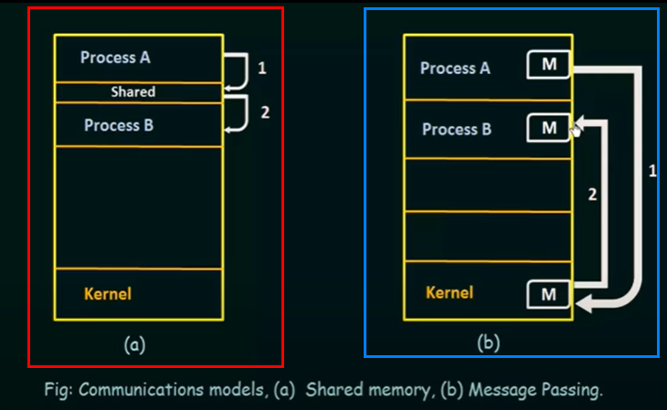

### Shared memory 시스템
IPC상에서 shared memory는 shared memory 섹션을 만드는 프로세스의 <bold>주소 공간</bold>에 존재한다.  

<details>
    <summary>컴퓨터의 주소 공간이란 무엇인가?</summary>
<p>
운영체제는 프로세스와 주소 공간간 일대일로 대응한다. 즉, 프로세스 하나당 하나의 주소 공간을 배정받는다. 그렇다면 주소 공간이란 무엇인가? 
</p>
<p>
주소 공간이란 메모리에 대응되는 주소 범위를 정의한 것을 의미한다. 즉, 프로그램이 실행된 후 메모리에 적재되고, 적재된 프로세스가 메모리에 할당되는 범위를 의미한다. 
</p>
</details>

<p>
따라서 상호작용, 즉 데이터 교환을 위해 the shared memory에 접근하고자 하는 다른 프로세스들을 해당 프로세스의 주소 공간(shared memory가 저장되어 있는 곳)에 자신의 주소 공간을 제공해야 한다.  
</p>

<p>
대부분의 상황에서 운영체제는 프로세스 간 메모리 접근을 금지한다. Shared memory model이 적용되어야 하는 경우 프로세스간 동의를 받아 접근 금지를 해제한다. 
</p>

#### 생산자/소비자 프로세스

생산자 프로세스는 소비자 프로세스가 사용할 자원을 생성한다. 예를 들면, 
- 컴파일러 ====(어셈블리어)===> 어셈블러 ===(오브젝트 모듈)===> 로더

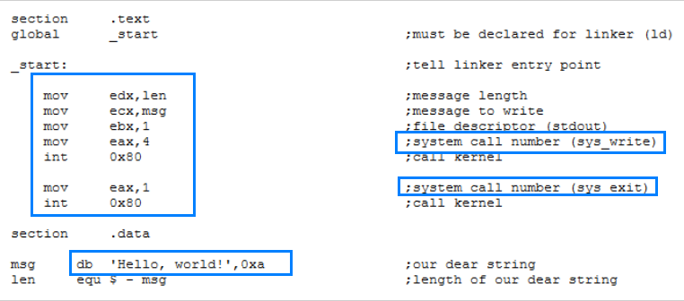

소비자 프로세스는 생산자 프로세스가 생산한 자원만을 사용해야 하는 것이 원칙이다(프로듀서/컨슈머 문제). 생산자/소비자 프로세스가 동시 실행되기 위해서 버퍼 아이템들(a buffer of items)이 생성되어져야 한다. 버퍼 아이템들은 shared memory상에 존재하고, 생성된 아이템들만을 사용하기 위해 생산자와 소비자간 싱크가 맞춰져 전달된다.  

- 생산자 프로세스 ===(a buffer of items in shared memory)===(synchronized)===> 소비자 프로세스

#### 버퍼의 종류
1. Unbounded buffer : 버퍼의 크기 제한이 없다. 생산자 프로세스는 항상 새로운 버퍼 아이템을 생산/추가할 수 있다. 
2. Bounded buffer : 버퍼 크기 제한이 있다. 생산자 프로세스는 버퍼가 가득 차 있을 경우 기다려야 하며, 소비자 프로세스는 버퍼가 비어 있을 경우 기다려야 한다.

### Message passing 시스템
<p>
메세지 패싱 시스템은 대표적인 IPC 모델 중 하나이다. 네트워크 상에서 서로 다른 컴퓨터간 프로세스 커뮤니케이션이 이루어지는 분산 환경에서 유리하며(e.g 채팅) 프로세스간 주소 공간 공유 없이도 싱크를 맞춰준다. 
</p>

<p>
Message-passing facility는 message send/receive 기능을 수행하며 the message는 크기에 따라 1) fixed 또는 2) variable로 구별된다. 
</p>

- fixed size message : 시스템 레벨에서의 태스크 수행이 쉬워짐, 프로그래밍 레벨에서의 태스크는 어려워짐(메세지 크기 제약이 있으므로)
- variable size message : 프로그래밍 레벨에서의 태스크가 쉬워짐, 시스템 레벨 태스크는 어려워짐(커버해야하는 메세지 크기가 늘어나므로)

#### Direct communication
<p>
프로세스간 메세지를 주고 받기 위해서는 1) <bold>논리적/물리적 커뮤니케이션 링크</bold>가 존재해야 하며 2) send/receive와 같은 operation이 필요하다.
</p>


<p> 
프로세스는 커뮤케이션을 위해 메세지를 주고/받을 다른 프로세스의 <bold>이름을 반드시 명명(naming)</bold>하는 것이 원칙이다. 예를 들어, 

- Q sends (P.message) => 프로세스 Q가 프로세스 P에게 메세지를 보냄 
- P receieves (Q.message) => 프로세스 P가 프로세스 Q에게 메세지를 받음 

이는 프로세스 간 링크는 오직 하나이며, 해당 링크는 P,Q만을 연결한다는 전제가 깔려있다. 이처럼 프로세스끼리 통신을 위해 서로의 아이덴티티를 이름으로 확인하는 특성을 <bold>symmetry in addressing</bold>이라 부른다.  
</p>

<p>
메시지 송신 프로세스에게만 네이밍이 요구될 경우를 asymmetry in addressing이라 부른다. 예를 들어,  

- Q sends (P.message) 
- P receives (id.message)
</p>

<p>
asymmestry와 symmetry 모두 프로세스 이름(아이덴티티)이 변경될 경우 기존 통신이 불가능해지므로 모듈화에 불리하다는 단점이 존재한다. 
</p>

#### Indirect communication
<p>
간접 방식 커뮤니케이션에서는 메일 박스/포트 개념이 활용된다. 메일 박스란 추상화된 객체로, 프로세스들이 주고 받을 메세지들이 저장되는 곳이다. 각각의 메일 박스는 유니크한 아이덴티티를 가지고 있으며, 각각 프로세스들은 공유된 메일 박스가 있을 경우만 커뮤니케이션이 가능하다.  
</p>

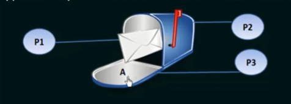

<p>
이 경우 직접 방식 커뮤니케이션에서 하나의 링크는 두 개의 프로세스에만 연결되어 있던 것과는 달리, 링크 하나가 여러 프로세스 쌍을 연결할 수 있다. 단, P1이 메세지를 보냈을 경우 P2, P3 모두가 수신하는 것이 아니라 상황에 따라 하나의 프로세스만이 메세지를 수신한다. 
</p>

<p>
메일 박스는 하나의 프로세스 또는 운영체제에 의해서 소유된다. 프로세스가 메일박스를 컨트롤 할 경우, 해당 프로세스가 종료될 때 메일 박스도 사라진다는 단점이 존재한다. 운영체제가 메일 박스를 가질 경우, 특정 프로세스 종료 이후에도 다른 프로세들에게 메일 박스를 공급할 수 있다. 
</p>

### Synchronous/Asynchronous communication
프로세스가 메세지를 주고(send) 받을 때(receive) 이를 동기(block, synchronous) 또는 비동기(non-block, asynchronous) 방식으로 처리할 수 있다. 

- 프로세스 A ====(send/asynchronously)===> 프로세스 B(receive/synchronous)

프로세스 간 주고 받는 메세지는 buffer라고 불리는 임시 큐에 존재에 존재한다.

- 프로세스 A ====(send/asynchronously)===><===(messages in buffer)===> 프로세스 B(receive/synchronous)

버퍼는 아래와 같은 3가지 타입이 있다. 

1. Zero capacity : 버퍼 공간의 최대 수용량이 0인 경우. 프로세스 A => B로 한 번에 하나의 메세지만 보낼 수 있으므로, 송신자 프로세스 A는 블록되어 기다려야 한다(수신자 프로세스 B가 메세지를 받을 때까지)
2. Bounded capacity : 버퍼 공간의 최대 수용량이 n인 경우. 최대 수용량까지는 비동기로 메세지를 보낼 수 있으나 버퍼가 꽉 찼을 경우 송신자 프로세스는 A는 블록되고 기다려야함. 
3. Unbounded capacity : 버퍼 공간의 최대 수용량이 potentially infinite한 경우. 송신자 프로세스 A는 블록되지 않고 계속해서 메세지를 보냄.

## Sockets
소켓은 클라이언트-서버 모델의 커뮤니케이션을 위해 사용된다. 프로세스 하나당 하나의 소켓을 가지며, 포트 번호와 결합된 아이피 주소(Internet Protocol address)로 구분된다. 예를 들어

```javascript
// socket format : (IP:port number)
146.86.5.20:1625

// server
const express = require('express')
cosnt app = express()

app.listen(3000, ()=>console.log("listening at port 3000"))
app.get('/', (req, res)=> {
    res.send("Hello Jake")
})

// client(browser)
// http://127.0.0.1:3000 => "Hello Jake" in screen
```

- Process A(endpoint) <========> (endpoint)Process B  

- Client===//socket//====(request, packet)===>//socket//===server(listening at port)
- Client===//socket//<====(response, packet)===//socket//===server(listening at port)

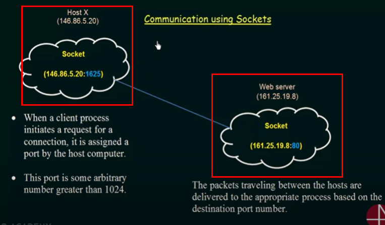

## Remote Procedure Call(RPC)
IPC 모델(shared memory, message passing)은 로컬 프로세스간의 커뮤니케이션, 즉 같은 시스템/네트워크 안의 커뮤케이션을 의미힌다. 서로 다른 네트워크 안의 프로세스들이 커뮤니케이션이 필요한 경우 RPC 프로토콜을 사용한다.  

- 프로세스 A in 네트워크 a <=====(메세지, RPC daemon waiting for upcoming requests)=====> 프로세스 B in 네트워크 b

이떄 각각의 프로그램은 각자의 네트워크에 대한 디테일을 알지 못해도 소통이 가능하다. RPC는 서로 다른 네트워크 간의 프로세스 통신을 처리해야 하므로 shared memory 모델은 사용할 수 없으며 반드시 message-based 커뮤니케이션(message passing)을 사용해야 한다.  

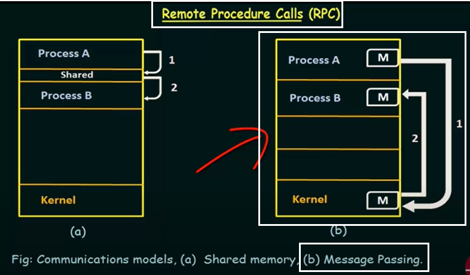

프로세스간 주고 받는 메세지는 RPC daemon이 처리하며, 각각의 메세지는 실행할 함수의 identifier(function name)와 그 함수에 전달할 parameter를 가지고 있다.

<details>
    <summary>stub이란 무엇인가? (펼쳐보기)</summary>
RPC에서의 stub은 원격 procedure call이 실행될 동안 클라이언트와 서버간 전달된 파라미터들을 전환하는 코드를 의미한다. 
</details>

- parameter marshalling : packaging parameters in message into an appropriate form for network transmission
- client ====(invokes a remote procedure)===> (stub in RPC doing parameter marshalling, transmitting a message to server) ====> server
- server ====> (stub in RPC returning values to client) ===> client

### RPC 한계점
1. 클라이언트와 서버 호스트 간 데이터 표시 방법이 다를 수 있다. 예를 들어, 클라이언트 측은 big-endian 표기를, 서버 측은 little-endian 표기를 사용하는 경우 발생할 수 있다.

2. 원격으로 이루어지므로 로컬보다 네트워크 통신이 실패할 가능성이 높다. 

3. 클라이언트 측에서 원격으로 실행할 procedure의 이름은 알고 있지만 해당 procedure의 서버 포트 번호 또는 주소를 알 수 없다. 

#### 극복 방안
1. 서로 다른 데이터 표기 방법을 통일하기 위해 RPC 시스템은 XDR(External Data Representation)을 이용한다. 

- 클라이언트 ===(invokes a remote procedure, data A)==>(parameter marshalling converts the data A into XDR, which is machine-independent)===> 서버(the XDR data are unmarshalled and converted to an appropriate data for server)

2. 네트워크 통신 실패를 막기 위해 운영체제는 전달되는 메세지들이 정확하게 한 번만 실행되도록 관리해야 한다. 

- 클라이언트 ====(request)===> 서버
- 서버 ====(acknowledge, meaning the request has been fulfilled)===> 클라이언트
- 클라이언트는 해당 request가 정상적으로 수행되었음을 acknowledgement를 받음으로써 확인하고 더 이상 request를 보내지 않음(메세지가 정확하게 한 번만 실행됨)

3. 방법 1) 포트 번호가 미리 정해지고, 컴파일 시 RPC는 해당 포트 번호를 사용한다. 컴파일 이후에는 서버가 해당 포트 번호를 바꿀 수 없게 된다. 방법 2) 랑데부 메커니즘 또는 매치메이커 활용(클라이언트가 request를 보내면 해당 request를 실행하는 포트 번호를 서버에서 찾고, 클라이언트에게 확인시켜줌.)

### RPC 구조

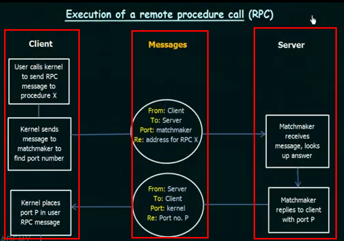
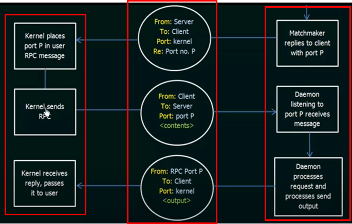

## 쓰레드
쓰레드는 메모리에 적재되어 실행되고 있는 프로그램, 즉 프로세스 내에서 실행되는 단위이다. 쓰레드는 다음과 같은 4가지 요소로 이루어진다. 

- thread ID
- program counter
- register set
- stack

동일 프로세스에 속해있는 쓰레드끼리는 아래와 같은 자원을 공유한다. 

- code section
- data section
- files and signals

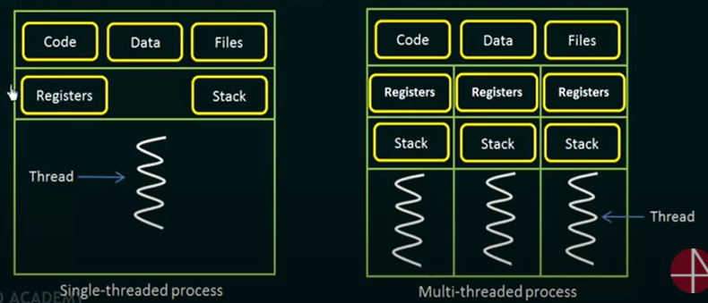

멀티 쓰레드 프로그래밍의 장점은 다음과 같다. 

- 서로 다른 쓰레드가 서로 다른 태스크를 수행하고, 이를 통해 유저 상호작용을 높인다. 
- 같은 주소 공간 내에서 하나의 어플리케이션이 여러 개의 쓰레드를 통해 여러 작업을 수행할 수 있게 된다.
- 프로세스의 자원을 공유함으로써 프로세스 추가 생성에 들어가야했을 메모리와 자원을 절약할 수 있다.  
- 멀티 프로세서 아키텍처를 활용할 수 있다. 

## 멀티 스레딩 모델과 하이퍼 스레딩
### 멀티 스레딩 모델
쓰레드는 크게 2가지 종류로 나뉜다. 

- 유저 쓰레드 : 유저 수준에서 관리되는 스레드
- 커널 쓰레드 : 운영체제에 의해 관리되는 스레드 

프로그램이 정상적으로 동작하기 위해서는 유저 쓰레드와 커널 쓰레드간 소통이 필요하다. 이는 1) many : one 2) one : one 3) many : many 와 같은 방법으로 이루어진다. 

- many(user threads) : one(kernal thread) => 유저 수준에서 쓰레드 관리가 용이하나, 쓰레드 중 하나가 blocking system call을 보낼 경우 전체 프로세스가 멈춘다는 단점이 존재. 
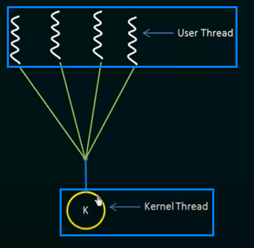

- one(user thread) : one(kenrnal thread) => 멀티 프로세서를 활용한 동시성 프로그래밍이 유리함. 하나의 쓰레드가 blockin system call을 보내도 전체 프로세스는 멈추지 않음. 하나의 유저 쓰레드가 반드시 하나의 커널 쓰레드를 요구하기 때문에 간접비용이 발생해 어플리케이션의 성능이 저하될 수 있다. 이 모델을 사용할 경우 시스템에 의해 제공되는 쓰레드 수는 제한되는 경우가 많다. 
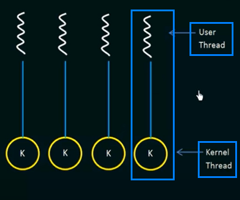

- many : many => 유저 쓰레드보다 적거나 같은 수의 커널 쓰레드가 유저 쓰레드와 짝지어지는 형태. 멀티 프로세서에 의해 커널 쓰레드가 병렬적으로 실행되고, 대부분의 멀티 쓰레딩 시스템에서는 적용되는 모델. 
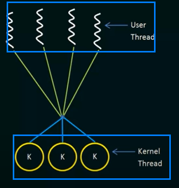

### 하이퍼스레딩
하이퍼스레딩(Hyperthreading) 또는 동시 멀티 스레딩(Simultaneous multithreading)을 이해하기 위해서 아래 코어 시스템 이론 예시를 살펴보자. 

- 싱글 코어 시스템 => 1 processor => 1 processing => 1 thread runs at a time
- 듀얼 코어 시스템 => 2 processor => 2 processing => 2 threads run at a time
- 쿼드 코어 시스템 => 4 processor => 4 processing => 4 threads run at a time

위 코어 시스템에서 물리적인 프로세서 개수는 각각 1개, 2개, 4개이다. 하이퍼스레딩이란 <bold>물리적인 프로세서를 논리적으로 추가 등분시켜</bold> 더 많은 프로세서를 돌리는 듯한 효과를 만드는 기법을 의미한다. 

- 하이퍼 스레딩 적용 싱글 코어 시스템 => 1 pysical processor => 2 logical processors => 2 processing => 2 thread runs at a time
- 하이퍼 스레딩 적용 듀얼 코어 시스템 => 2 pysical processor => 4 logical processors => 4 processing => 4 thread runs at a time
- 하이퍼 스레딩 적용 쿼드 코어 시스템 => 4 pysical processor => 8 logical processors => 8 processing => 8 thread runs at a time

터미널/파워쉘을 통해 실제 예시를 살펴보자. 터미널 접속 후 아래와 같은 명령어를 입력한다. 

```
wmic
```

WMIC란 Window Management Instrumentation Console의 약자로 컴퓨터 시스템에 대한 접근을 가능하게 해주는 콘솔창이다. 아래 명령어를 통해 자신의 컴퓨터의 CPU 코어 숫자를 확인해본다. 

```
CPU Get NumberOfCores
```
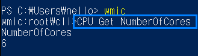

해당 노트북은 6개의 코어를 가지고 있으므로 6개의 물리적 프로세서를 가지고 있고, 6개의 쓰레드를 처리할 수 있다는 것을 확인할 수 있다. 하이퍼쓰레딩 여부를 확인하기 위해(논리적 프로세서 개수를 확인하기 위해) 아래 명령어를 입력해본다. 

```
CPU Get NumberOfCores, NumberOfLogicalProcessors
```

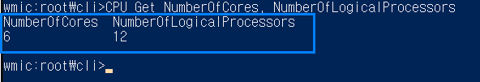

하이퍼쓰레딩이 적용된 컴퓨터임을 확인할 수 있다. 

<details>
    <summary>Instrumentation이란 무엇인가?(펼쳐보기)</summary>
컴퓨터 프로그래밍에서 인스트루먼테이션(instrumentation)은 오류를 진단하거나 추적 정보를 쓰기 위해 제품의 성능 정도를 모니터하거나 측정하는 기능을 가리킨다. 

- [위키피디아 - 인스트루먼테이션](https://ko.wikipedia.org/wiki/%EC%9D%B8%EC%8A%A4%ED%8A%B8%EB%A3%A8%EB%A8%BC%ED%85%8C%EC%9D%B4%EC%85%98)
</details>

## 시스템 콜의 종류 : fork and exec 
- fork : fork 시스템 콜은 기존 프로세스를 복사하여 새롭게 생성하는 역할을 한다. 새롭게 생성된 프로세스는 child prcoess가 되며, 새로운 프로세스 아이디가 생성된다.
fork 명령어로 통해 생성된 프로세스의 수는 2의 n제곱이며, n은 fork 시스템 콜이 실행된 횟수를 의미한다. 

```c
#include <stdio.h>
#include <sys/types.h>
#include <unistd.h>

int main() 
{
    fork(); // fork system call not availabe on Window
    fork();
    fork();
    printf("Hello Jake PID = %d\n", getpid());
    return 0;
}
```

- exec : exec 시스템 콜은 기존에 실행되던 프로세스를 대체하여 exec 시스템 콜을 사용한 프로세스를 실행시킨다. 


## 레퍼런스
- [Difference between Multiprogramming, multitasking, multithreading, and multiprocessing](https://www.geeksforgeeks.org/difference-between-multitasking-multithreading-and-multiprocessing/)

- [Instantiation](https://en.wikipedia.org/wiki/Instantiation)

- [An introduction to assembly language](https://medium.com/@jleveewhite/an-introduction-to-assembly-language-8144ce1dfb0e)
