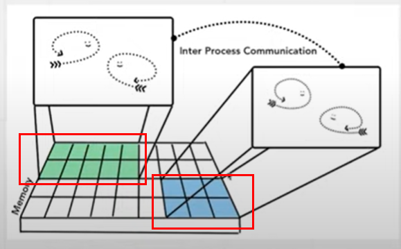
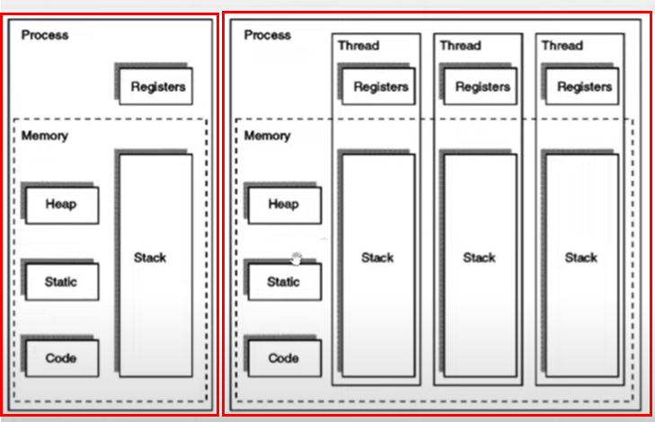
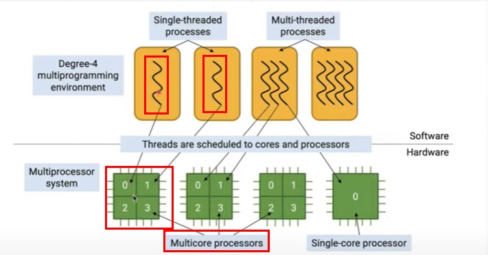

# 웹 브라우저에 대한 이해
웹 브라우저에 관련된 강좌와 기사를 학습한 후 주요 내용을 요약함. 

## 멀티 프로세스 브라우저의 아키텍처
**멀티 프로세스**를 이해하기 위해서는 **하드웨어와 소프트웨어의 연관성**에 대한 지식이 선행 요구된다. 

- 프로세스, 쓰레드 : 소프트웨어 영역
- 코어, 프로세서 : 하드웨어 영역

멀티 프로세스(소프트웨어)는 운영 체제에 의해 **서로 다른 메모리 영역에 할당(하드웨어)**되고, 이로 인해 IPC(Inter Process Communication)를 통한 소통이 요구된다. 복수 개의 프로세스를 생성할 경우 1) **메모리 점유율이 높아진다는 단점**과 2) 각각의 프로세스는 서로 다른 메모리 영역을 사용하고 있으므로 **보안성이 높아진다는 장점**이 존재한다. 

아래와 같은 멀티 프로세스 아키텍처를 선택할 경우 장단점을 이해하고 사용하는 것이 중요하다. 

코어(하드웨어)와 쓰레드(소프트웨어)는 일대일 대응한다. 즉 하나의 멀티 코어 프로세서가 4개의 코어를 가지고 있다면 4개의 싱글 쓰레드를 처리할 수 있다.

멀티 쓰레드 프로세스와 단일 쓰레드 프로세스란? (펼쳐보기)

- 멀티 쓰레드 프로세스의 경우 하나의 메모리에서 여러 개의 쓰레드가 자원을 공유하므로 데이터를 빠르게 처리할 수 있다는 장점이 있다. 

- 단일 쓰레드 프로세스의 경우 프로세스 동기화 문제를 고려하지 않아도 되며, context switch로 인한 CPU 전환 비용이 들지 않는다는 장점이 있다. 

## 크롬 브라우저 아키텍처의 이해
브라우저 아키텍처는 명확한 표준이 존재하지 않는다. 각 브라우저마다 아키텍처의 형태가 상이하게 나타날 수 있다.  

> The important thing to note here is that these different architectures are implementation details. There is **no standard specification on how one might build a web browser**. One browser’s approach may be completely different from another.

> Below is Chrome’s multi-process architecture. Multiple layers are shown under Renderer Process to represent Chrome running multiple Renderer Processes for each tab.

크롬 브라우저 아키텍처의 특장점은 높은 보안성에 있다. 각각의 브라우저 탭은 **각각의 Renderer Process에 의해 관리**되고, 이는 하나의 탭이 모종의 이유로 종료되어야 하더라도 나머지 탭들은 독립적으로 유지될 수 있다는 장점이 존재한다. 또한, 이는 탭에만 적용되는 것이 아니라 웹페이지 내의 iframe 태그에도 적용된다. 

> Even running a simple **Ctrl+F** to find a word in a page **means searching across different renderer processes**. You can see the reason why browser engineers talk about the release of Site Isolation as a major milestone!

> The **Same Origin Policy** is the core security model of the web; it makes sure one site **cannot access data from other sites without consent**. Bypassing this policy is a primary goal of security attacks. **Process isolation** is the most effective way to separate sites. 

단, Renderer process를 무한정으로 늘릴 수 없으므로(메모리가 제한되어 있기 때문에) 생성할 수 있는 프로세스의 수가 제한되어 있다. 메모리가 한계치에 다다르면 여러 개의 프로세스를 통합하여 하나의 메모리에 재할당하는 작업을 시행하여 기존 아키텍처의 단점을 보완했다. 

## 크롬 브라우저 URL 처리 과정
Jake는 고양이를 좋아한다. 만약 Jake가 고양이 밈 사진을 찾기 위해 Google에 "cat meme" 검색어를 입력했을 경우, 크롬 브라우저는 이를 어떻게 처리하는지 알아보자. 

### Handling inputs
Browser process의 UI thread가 유저가 입력한 텍스트 "cat meme"이 1) search query인지 2) URL인지 판단한다. 

- 1)의 경우 search engine으로 해당 쿼리를 전송하고, 
- 2)의 경우 Network thread에게 URL 값을 전달한다. 

### Start navigation
1. UI thread가 네트워크 콜을 시작한 후, loading spinner를 탭 왼쪽에 생성한다. 
2. Network thread가 DNS와 TLS에 연결하여 서버 호스트 서치 및 보안 체크를 실시한다. 
3. HTTP 301 응답이 올 경우, UI thread에게 redirect 시그널을 전달하고 UI thread는 새로운 네트워크 콜을 전송한다. 
4. Redirect 응답이 아닐 경우, 하단 Read response 단계로 넘어간다. 

> The HyperText Transfer Protocol **(HTTP) 301 Moved Permanently** redirect status response code indicates that the **requested resource has been definitively moved** to the URL given by the Location headers. A browser redirects to the new URL and search engines update their links to the resource.

### Read response
1. Network thread는 **서버의 response에서 header 값을 확인**하여 일차적으로 **content-type을 체크**한다. 추가적으로, 좀 더 정확한 type 체크를 위해 **MIME type sniffing**을 실시한다. 

이는 **content-type에 따라서 다음 스텝이 달라지기 때문**인데, 

2. 1) **HTML** 형식의 경우 safe browsing 및 CORB 체크를 거친 이후  **Renderer 프로세스**에게 파일을 전달하며 2) **HTML 형식이 아닐** 경우(.zip 또는다른 형식) **Download 매니저**에게 파일을 전달한다. 

> This is also where the SafeBrowsing check happens. If the domain and the response data seems to match a known malicious site, then the network thread alerts to display a warning page. Additionally, Cross Origin Read Blocking (CORB) check happens in order to make sure sensitive cross-site data does not make it to the renderer process.

Safe browing이란? (펼쳐보기)

> Google Safe Browsing **shows warnings** to users when they attempt to navigate **to dangerous sites or download dangerous files**. Safe Browsing also notifies webmasters when their websites are compromised by malicious actors and helps them diagnose and resolve the problem so that their visitors stay safer. **Safe Browsing protections work across Google products** and power safer browsing experiences across the Internet.

CORB란? (펼쳐보기)

> **Cross-Origin Read Blocking**, or CORB, is a new security feature that prevents the contents of balance.json from ever entering the memory of the renderer process memory based on its MIME type.

### Find Renderer Process
> Once all of the checks are done and **Network thread is confident that browser should navigate to the requested site**, the Network thread tells UI thread that the data is ready. UI thread then finds a renderer process **to carry on rendering of the web page**.

### Commit navigation
> Now that the data and the renderer process is ready, **an IPC is sent from the browser process to the renderer process** to commit the navigation. It also passes on the data stream so the renderer process can keep receiving HTML data. Once the browser process hears confirmation that **the commit has happened in the renderer process, the navigation is complete** and the document loading phase begins.

## 레퍼런스
- [Inside look at modern web browser - part 1](https://developers.google.com/web/updates/2018/09/inside-browser-part1)
- [Inside look at modern web browser - part 2](https://developers.google.com/web/updates/2018/09/inside-browser-part2)
- [프로세스와 쓰레드 : CS 기본기](https://youtu.be/T2WqQcqssoE)
- [멀티 프로세스 브라우저의 아키텍처](https://youtu.be/Nzjnbr7krQM)
- [크롬 브라우저 아키텍처의 이해](https://youtu.be/L5K5B7W50Iw)
- [브라우저와 URL, 그리고 유저](https://youtu.be/ipwfEUslfQA)
- [Mozilla Web Docs : HTTP response status code](https://developer.mozilla.org/en-US/docs/Web/HTTP/Status/301)