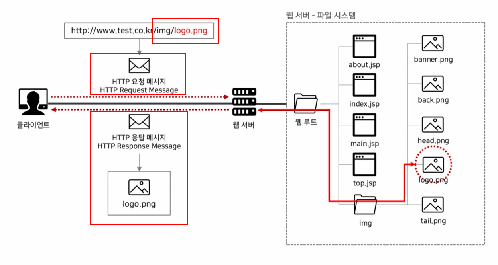
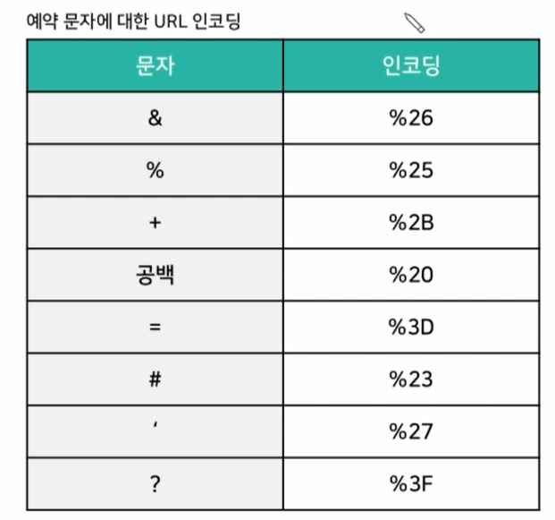
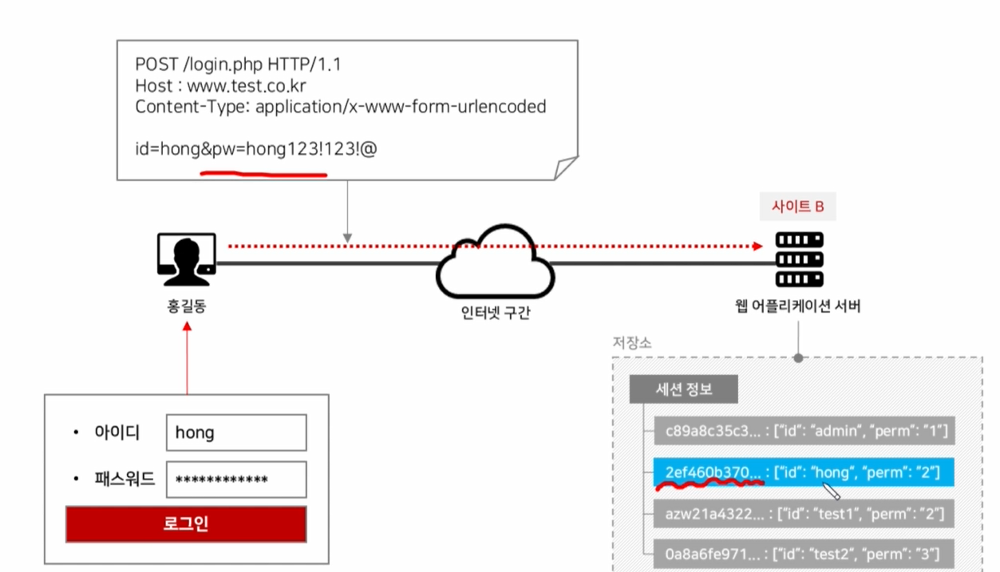
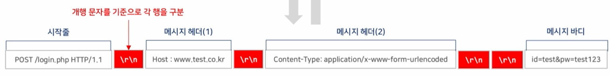
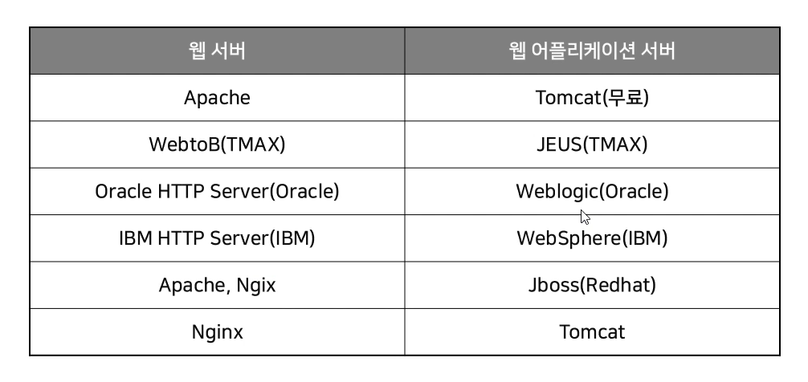

# Content editor : @developerasun

# 강의 콘텐츠 목록
<ol>
    <li>웹의 탄생 그리고 발전</li>
    네트워크 그룹 단위의 모임 === 웹
    <li>웹을 구성하는 3대 요소</li>
    <li>자원을 지정하는 URL</li>
    <li>웹의 핵심 기술 HTTP 프로토콜</li>
    <li>쿠키와 세션</li>
    <li>웹 아키텍처 분석</li>
</ol>

# 웹 기초 지식
## 웹 베이직
<ol class="web-basic">
    <li>http 메소드(get/post 등)</li>
    <li>세션</li>
    <li>쿠키</li>
</ol>

## 웹 애플리케이션 베이직
<ol class="web-application-basic">
    <li>게시판, 회원 관리(로그인, 로그아웃 등)</li>    
    <li>php</li>
    <li>jsp(java web application)</li>
    <li>asp(.net)</li>
</ol>

## 웹 애플리케이션과 보안
<ol class="web-application-logic">
    <li>보안</li>
    <li>취약점 이해</li>
    <li>대응책 수립</li>
</ol>

# 웹 기본 구조
웹이란 여러 네트워크, 즉 여러 통신망이 모여 정보를 주고 받는 곳이다. 

## 클라이언트와 서버
<li>클라이언트 : 웹브라우저를 사용해 서버에 서비스를 요구하는 주체</li>
<li>서버 : 웹 서버를 통해 클라이언트에게 서비스를 제공하는 주체</li>
<li>클라이언트(request message)와 서버(response message)는 HTTP 메세지를 통해 교류하게 된다.</li> <br/>

<b>HTTP 메세지 구조</b><br/>


## 웹의 3대 요소
<li>HTML : 웹 콘텐츠 정보 구성</li>
<li>HTTP : 웹 클라이언트와 웹 서버의 통신 규약</li>
<li>URL : 웹 클라이언트 => 웹 서버 자원 요청</li>
<br/>
<ol>
    <li>클라이언트의 http request 메세지 작성</li>
    <li>request 메세지가 URL을 통해 서버에게 전달됨(자원 요청)</li>
    <li>서버가 http response 메세지 작성</li>
    <li>response 메세지가 URL을 통해 클라이언트에게 전달됨(자원 전달)</li>
    <li>웹 브라우저가 response 메시지를 해석하여 유저에게 콘텐츠를 표시함(렌더링)</li>
</ol>

## URL(Uniform Resource Locator)
인터넷 리소스를 가리키는 표준 명칭. 서버의 자원을 요청할 때 사용되며 인터넷 상의 모든 리소스를 요청할 수 있다.
    <li> HTTP : Hyper Text Transfrer Protocol</li>
    <li> FTP : File system Transfer Protocol</li>
    <li> SMTP : Simple Mail Transfer Protocol e.g : smtp.google.com => 이메일이 보내질 때 SMTP 서버가 어느 서버로 해당 이메일을 전송할지 결정하고, 
    수신자의 inbox service provider가 해당 이메일을 다운로드 후 수신자의 inbox에 메일을 표시한다. SMTP 서버는 이메일을 받고, 보내는 기능에 특화된 서버이다. </li>

### 클라이언트 - URL - 서버 통신 예시
아래 이미지는 로고 이미지를 클라이언트 상에서 URL을 통해 요청(request)하고, 서버가 응답(response)하여 다시 클라이언트 측으로 로고 파일을 전달하는 과정을 도표로 나타낸 것이다.  


 클라이언트는 상태 코드(e.g. statusCode=200)를 통해 요청의 결과, 즉 서버의 응답 상태를 확인할 수 있다. 

<p>
클라이언트가 자원을 요청할 때 아래와 같은 데이터를 http 메세지 body 부분에 담아 서버로 보내게 된다.

- JSON
- Buffer
- String
- URL encoded data

서버는 이 body 데이터를 우선 분할(parse)하고 분석하여 클라이언트에게 응답한다.  
</p>

```JSON
// Node JS의 package.json의 의존성 관리
  "dependencies": {
    "body-parser": "^1.19.0",
    "ejs": "^3.1.6",
    "express": "^4.17.1",
    "mongoose": "^6.0.14"
  }
```

```Javascript 
// install body parser in terminal
npm install body-parser --save

// importing body parser node package to parse the data in HTTP.  
const bodyParser = require('body-parser')
```

### URL 구성 
Unique Resource Locator, 즉 URL의 구성요소는 아래와 같고 리소스 디렉토리 없이 도메인이 바로 불러졌을 경우 index.html과 같은 디폴트 값을 불러온다. 
<li>https://www.naver.com(포트 번호 생략, 리소스 디렉토리 생략) => index.html을 불러옴</li>
<li> (protocol name) + :// + (IP/domain, port number) + (resource directory) + (resource) </li> <br/>

대표적인 예약 URL 키워드는 아래와 같다. 

<li>? : 파라미터 시작점</li>
<li>= : 파라미터 값</li>
<li>& : 파라미터 식별자</li>
<li>(+) : 공백</li> <br/>

    
예를 들어, 구글에서 "귀여운 강아지"를 이미지 검색했다면 <br/>
www.google.com/search?keyword=dog&format=image&text=귀여운+강아지  <br/>
(도메인) + (리소스 디렉토리) + (파라미터 1과 그 값) + (파라미터 2와 그 값) + (파라미터3과 그 값과 공백) 와 같은 형식으로 표현될 수 있다. 위 URL은 이해를 위해 만든 예시일 뿐 실제 구글 검색의
URL과는 다를 수 있다. 

### URL 인코딩
&, #, ? 와 같이 예약 URL 키워드를 사용자가 URL 이외의 곳에서 입력했을 경우 데이터 전송 손실을 막기 위해서(예약 키워드를 <b>단순 데이터로 전송</b>하기 위해서) 그 값을 인코딩하여 전달하게 된다. 웹 브라우저 상에서는 URL 인코딩은 자동으로 지원한다. e.g. 공백 => %20, ? => %3F 으로 인코딩 후 서버에게 전달됨. 

<b>URL 인코딩 예시</b> <br/>


## 쿠키와 세션
<p>
최초의 웹은 정보 공유가 주된 목적이었으므로 상태 유지/관리의 필요성이 적었지만 현대의 웹은 이커머스가 확장됨에 따라 유저의 상태 정보를 관리해야할 필요성이 높아졌다(쇼핑, 장바구니, 결제, 배송일 체크 등 유저에 따라 달라지는 정보들이 많아졌기에).

쿠키는 사용자 식별 및 세션 유지를 통해 <b>클라이언트와 서버 간의 상태관리를 책임</b>지는 인증방식이다. 
서버에서 Set-Cookie 헤더를 통해 클라이언트의 쿠키 값을 세팅하고, 클라이언트는 세팅된 쿠키 값을 Cookie 헤더에 세팅한다. 
<p>

<span><b>HTTP 세션 동작 순서</b>
<ol>
    <li>클라이언트가 웹 브라우저에 접속</li>
    <li>클라이언트가 HTTP 메세지(request) 전송</li>
    <li>서버가 HTTP 메세지 헤더에서 쿠키 값을 확인</li>
    <li>서버가 HTTP 메세지(response) 헤더 필드값(set-cookie)으로 쿠키 발행</li>
</ol>

<ul>
 <li> 지속 쿠키(persistent cookie) : 클라이언트 하드 디스크에 텍스트 형태로 저장함. PC 사용자들은 해당 쿠키 정보를 열람할 수 있으나 오늘 날의 웹은 이러한 보안 문제를 고려하여 구조를 설계함. 사용자 식별 및 인증 관리를 위한 암호화 과정과 쿠키 유효기간 등을 검토하여 쿠키 발급 로직을 구현해야 한다. </li>
 <li>세션 쿠키(session cookie) : 클라이언트 웹 브라우저 캐시에 저장됨. 서버에서는 이 세션 정보를 메모리/파일시스템/데이터베이스에 저장한다(일반적으로는 *메모리에 저장함). 세션은 임의의 문자를 무작위로 나열하고, 나열된 문자들을 유저의 로그인 정보와 매핑시켜 특정 유저의 세션을 파악하기는 어렵다는 보안 상의 장점이 있음. </li>
</ul>

<b>로그인 폼과 세션 쿠키</b><br/>


세션 쿠키는 보안 상의 장점이 있으나, 세션 정보를 메모리에 저장하므로 대규모 웹 서비스에 적용할 경우 서버에 큰 부하를 가지고 온다는 단점이 존재한다. 반면 지속 쿠키 방식은 서버에 부담이 적은 편이므로 사용 유저가 많은 기업들의 경우 지속 쿠키 사용을 선호하는 편이다. 웹 서비스의 규모와 인프라 구성에 알맞게 쿠키 방식을 검토해야 한다. 

<li>편의성 : 지속 쿠키 < 세션 쿠키</li>
<li>서버 부하 : 지속 쿠키 < 세션 쿠키</li>
<li>유저 수 : 지속 쿠키 > 세션 쿠키</li>

# HTTP 프로토콜
Hyper Text Transfer Protocol은 하이퍼텍스트 문서(HTML)를 전송하기 위해 사용되는 <b>통신 규약으로, 웹의 핵심 기술</b>이다. 

## OSI 7계층
Open System Interconnection(OSI)이란 네트워크 통신이 일어나는 과정을 7단계 계층으로 나누어 설명한 모델이다. 각각의 하위 계층이 정상적으로 동작해야 상위 계층 역시 동작하므로, 네트워크 통신이 실패할 경우 어느 계층에서 실패했는지 파악하기 쉽다는 유지보수적인 장점을 가진다. HTTP 프로토콜은 응용 계층, 즉 가장 상단에 위치하며, TCP/IP 계층을 기반으로 동작한다.

<li>TCP/IP => HTTP</li>

<b>OSI 7 계층 구조</b><br/>


## TCP/IP 프로토콜
인터넷 상에서 식별된 컴퓨터간 데이터 패킷을 주고 받는 통신 규약을 일컬어 TCP(Transmission Control Protocol)/IP(Internet Protocol)라고 부른다. 데이터(패킷)를 주고 받는 규약을 TCP, 네트워크 상의 컴퓨터를 식별하는 규약을 IP로 이해하면 된다. TCP/IP 프로토콜은 아래와 같은 4계층으로 나뉘어진다. 

<li>애플리케이션 계층</li>
<li>트랜스포트 계층</li>
<li>네트워크 계층</li>
<li>링크 계층</li>

오늘날 대부분의 네트워크 통신은 TCP/IP 기반으로 이루어진다. TCP/IP에서는 IP를 통해 통신을 위한 물리적 호스트 대상을 찾으며, port를 통해 논리적 대상을 찾게 된다. 

예를 들어, 웹 브라우저 상에서 www.naver.com을 입력할 경우

<ol>
    <li>클라이언트 측에서 임의의 포트 번호를 할당</li>
    <li>통신을 위해 출발지&목적지 IP/port를 설정(디폴트 포트 번호는 80으로 세팅됨)</li>
    <li>서버에서 요청한 데이터를 처리 후 클라이언트에게 전달</li>
</ol>

### TCP/IP상에서의 3 way handshake
3 way handshake란 TCP 프로토콜 상에서 송/수신자 간의 연결이 원활하게 되어 있는지 확인하기 위해 클라이언트와 서버간 메세지를 주고 받는 작업이다. 

<li>SYN : synchronize sequence numbers</li>
<li>ACK : acknowledgment</li>

<b> 3 way handshake 프로세스 </b><br/>


## HTTP 메시지
HTTP 메세지는 1) 시작줄 2) 메시지 헤더 3) 메시지 바디로 나뉘어지고, 각 부분은 개행 문자(\n)를 기준으로 분류된다. 헤더의 끝나는 부분에 개행 문자 2개가 연달아 오고 메시지 바디 부분이 시작된다. 

<b>HTTP 메시지의 섹션 구분</b><br/>


## HTTP 메소드
HTTP 메소드 중 GET/POST 메소드가 가장 보편적으로 사용된다. GET 방식은 URL에 유저가 입력한 데이터가 표시되고, POST 방식은 HTTP 메시지 바디 부분에 그 값이 나타나게 된다. POST 방식의 경우 HTTP 메시지 헤더에 content-type을 명시해줘야 메시지 바디 부분을 정상적으로 동작시킬 수 있다는 점을 유의해야 한다. 

## HTTP 상태 코드
서버는 클라이언트의 요청에 대한 결과를 HTTP 상태 코드를 통해 알려준다. 상태 코드는 3자리 숫자와 응답 문구로 이루어지고, 상세 분류는 아래와 같다.

<ul>
    <li>1xx : 정보</li>
    <li>2xx : 성공 e.g 200 OK, 정상처리</li>
    <li>3xx : 리다이렉션</li>
    <li>4xx : 클라이언트 에러 e.g 404 Not Found, 존재하지 않음</li>
    <li>5xx : 서버 에러</li>
</ul>

사용하는 웹 서버의 종류에 따라 에러 페이지가 다르게 나타나므로 상태 코드를 통해 서버의 종류를 추측할 수 있다. 

# 웹 아키텍처
웹 아키텍처는 크게 클라이언트 - 웹 서버 - 데이터베이스의 형태로 간단화시킬 수 있다. 이러한 웹 아키텍처는 아래와 같은 방식으로 동작한다. 

<ol>
    <li>웹 사이트 접속 후 URL 입력</li>
    <li>도메인 -> IP 변환 작업(데이터 전송 전 필요 작업)</li>
    <li>HTTP 요청 메시지 작성 후 서버에게 전달(3 way handshake 선행)</li>
    <li>요청 메시지에 따라 데이터베이스 연결 및 질의</li>
    <li>HTTP 응답 메시지 작성 후 클라이언트에게 전달</li>
    <li>HTTP 응답 메시지를 웹 브라우저가 해석 후 유저에게 출력 </li>
</ol>

## 웹 사이트 구조 분석
<p>
일반적으로 웹 사이트와 서버는 1) HTML form 태그 2) javascript(Ajax, 페이지 비동기화)를 활용해 통신을 한다. Ajax는 백엔드의 부하를 낮추는 장점이 있으므로 트래픽이 많이 발생하는 웹사이트의 경우 Ajax를 많이 활용한다. 
</p>
<p>
페이지 동기화 방식의 경우 사용자가 버튼을 클릭 후 새로운 데이터를 불러와야 할 때 javascript뿐만이 아니라 html, css까지 서버 측에서 새롭게 불러오게 되므로 Ajax보다 백엔드에 부하를 많이 주는 단점이 존재한다. 
</p>

## 웹 디렉토리(웹 루트)
<p>
웹 서버는 파일 시스템과 데이터베이스를 참고하여 클라이언트가 URL을 통해 요청한 자원을 응답하게 된다. 웹 서버 설정 파일은 웹 서버 안에 있는 웹 루트를 통해 자원의 경로들을 설정하는 역할을 한다. 이 설정 파일은 파일 다운로드/업로드 상의 취약점을 공격할 때 자주 쓰이는 패턴이다. 
</p>
<li>e.g 웹 서버 아파치의 설정 파일 - httpd.conf</li>

## 웹 서버와 웹 애플리케이션 서버
<p>
사용자 측에서 정적 자원(e.g logo.png)을 요청할 경우 웹 서버 측에서 처리 후 응답 메시지를 보낸다. 반면 동적 자원(e.g 파일명.do)을 요청할 경우 웹 서버->웹 어플리케이션 서버-> (필요에 따라)데이터베이스를 거쳐 처리 후 응답 메시지를 보낸다. 
</p>
<p>
대부분의 회사에서는 가격, 유지 보수 측면의 장점으로 인해 웹서버와 웹 애플리케이션 서버를 페어로 사용한다. 웹서버는 정적 자원 처리에 최적화가 되어 있고, 웹 애플리케이션 서버는 동적 자원 처리에 최적화가 되어 있기 때문이다. 
</p>

<b>웹서버와 웹애플리케이션서버</b><br/>


## 웹 프록시 서버
클라이언트와 서버 사이에서 중계 역할을 하는 서버. 클라이언트 측에서는 보안 검증 절차가 구현되어 있다고 하더라도 개발자 도구와 웹 프록시 도구를 통해 데이터의 값을 변조할 수 있기 때문에 서버 측 보안 검증 로직을 반드시 구현해야 한다. 

# 추천 도서 목록 
<ul>
    <li>그림으로 배우는 HTTP & Network basic</li>
    <li>성공과 실패를 결정하는 1% 네트워크 원리</li>
</ul>

