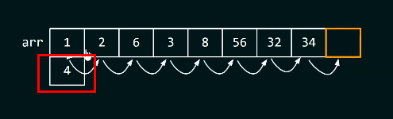
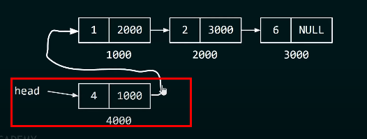
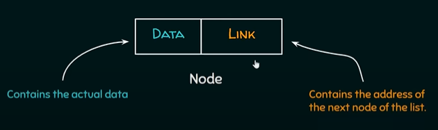
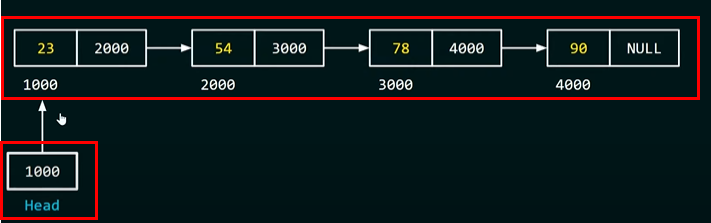

# 자료 구조 기초
아래 강좌들을 수강 후 중요 내용을 요약 및 정리함. 대부분의 요약은 한국어로 진행되나 편의상 영문으로 옮길 때가 있음. 

- [Neso academy - data structure](https://www.youtube.com/playlist?list=PLBlnK6fEyqRj9lld8sWIUNwlKfdUoPd1Y)
- [KodingKevin - Javascript Algorithms & Data Structures](https://www.youtube.com/watch?v=LuXCJxY7nPE&list=PLn2ipk-jqgZiAHiA70hOxAj8RMUeqYNK3&index=1)

## 자료 구조 실생활 활용 예시
자료 구조가 사용된 예시는 아래와 같다. 

- redo/undo feature (stack) => e.g Google Docs
- storing image as a bitmap format
- storing friendship information in social media(graph data strucuture) => e.g Facebook friends

## 자료 구조 종류
1. Linear type : a data structure where all the elements are arranged in a sequential order(**having one predecessor and successor**). e.g : 1) array 2) queue 3) stack 4) linked list
1. Non-linear type : 1) tree 2) graph
1. static type : 컴파일 타임에 메모리가 할당되는 자료 구조. 데이터 접근이 빠르나 삽입/삭제가 느리다는 단점이 존재함.
1. dynamic type : 런타임에 메모리가 할당되는 자료 구조. 삽입/삭제가 빠르나 데이터 접근이 느리다는 단점이 존재함.

## 자료 구조 효율성
데이터를 효율적으로 사용하기 위해서는 데이터가 효율적으로 저장되어야 한다. 자료 구조의 효율성은 시/공간을 최대한 적게 쓰는 것을 목표로 한다. 

배열에서 원소를 새롭게 삽입하는 경우, 



위 그림과 같이 모든 원소를 이동시켜야 한다. 반면, 링크드 리스트에서 원소를 새롭게 삽입하는 경우, 



head 부분만 새롭게 삽입된 원소를 가리켜 주면 된다. 이렇듯 자료 구조의 사용에 따라 operation의 효율성이 달라진다. 

## Pointers
### Void pointer
void pointer란 지정된 데이터 타입이 없고 어떤 데이터 타입이라고 가리킬 수 있는 포인터를 말한다. 

```c++
int main() {
    int n = 10; 
    void *ptr = &n;

    printf("%d", *(*int)ptr); // 정수형으로 타입 캐스팅
    return 0;
}
```

malloc과 calloc 함수는 void pointer를 리턴하므로 모든 데이터 타입에 메모리를 할당할 수 있게 된다. 

```c++
int main() {
  // allocate memory of int size to an int pointer
  int* ptr = (int*) malloc(sizeof(int));

  // assign the value 5 to allocated memory
  *ptr = 5;
}
```

### Null pointer
null pointer란 유효하지 않은 메모리 할당을 나타낼 때 사용하는 포인터로, 어떠한 메모리도 가리키지 않는다. 

```c++
// 포인터 초기화(아직 유효한 메모리에 할당되지 않은 상태)
// 포인터를 NULL로 초기화 하는 것은 best practice로 여겨진다.
int main() {
    int *ptr = NULL; 
    return 0;
}

// malloc 에러 핸들링(NULL check)
int main() {
    int *ptr;
    ptr = (int*)malloc(2*sizeof(int));
    if (ptr == NULL) 
        printf("Memory can't be allocated"); 
    else 
        printf("Memory allocated");
    return 0;
}
```

### Dangling pointer
dangling pointer란 메모리 할당 해제 이후 존재하지 않는 메모리 영역을 가리키는 포인터를 말한다. 예를 들어, 

```c++
int* fun() {
    int num = 10; 
    return &num; // this one doesn't exist(해당 함수 실행 이후 메모리 할당 해제됨)
}

int main() {
    int *ptr = NULL; 
    ptr = fun(); // dangling pointer
    printf("%d", *ptr); 
    return 0;
}
```

danling pointer는 메모리 할당 해제 후 포인터 초기화로 해결할 수 있다.

```c++ 
int main() {
    int *ptr = (int*)malloc(sizeof(int)); 

    // some operation here 

    free(ptr); // 메모리 할당 해제, but pointer still pointing to the memory

    ptr = NULL; // dangling pointer 해제를 위한 포인터 초기화

    return 0;
}
```

### Wild pointer
wild pointer란 초기화되지 않은 포인터를 의미한다. 초기화 되지 않은 포인터들은 program crash를 일으킬 수 있으므로 주의한다.

## 동적 메모리 할당
정적으로 메모리를 할당하는 것은 다음과 같은 위험이 있다.

1. 유저가 정적으로 할당한 메모리보다 데이터를 적게 입력했을 경우 => 메모리 낭비
1. 유저가 정적으로 할당한 메모리보다 데이터를 많게 입력했을 경우 => 프로그램 crash

**동적 메모리 할당**이란 컴파일 시점이 아닌 **실행 시점에 메모리를 할당**하는 것을 의미하며, 아래와 같은 **빌트인 함수들과 포인터**를 통해 이루어진다. 

### Malloc
Malloc(memory allocation)이란 동적 메모리 할당에 사용되는 C언어 계열의 빌트인 함수이다. Malloc은 heap에 메모리를 할당한다.

```
(void*)malloc(size_t size)
```

메모리 할당 성공 시 void pointer를 리턴하고, 실패시 NULL을 리턴한다. Malloc은 유저가 어떤 데이터를 메모리에 할당하고 싶어하는지 알 수 없으므로 void pointer를 리턴하고, 유저가 직접 type casting 실시한다. 

```c++
int main() {
    int *ptr = (int*)malloc(4) // 4바이트 메모리를 heap에 할당.
}
```

### Calloc
calloc(contiguous allocation, 인접 메모리 할당)은 malloc과 같은 동적 메모리 할당에 사용되는 C언어 계열의 빌트인 함수이다. 

```
(void*)calloc(size_t n, size_t size) 
```

단, malloc과 달리 2개의 인자를 가지며, calloc으로 할당된 메모리는 초기값으로 0을 가진다.

### Realloc
realloc 함수는 기존 데이터의 손상 없이 메모리 사이즈를 재할당할 수 있는 C언어 계열의 빌트인 함수이다. 단, 새롭게 할당된 메모리 사이즈가 기존보다 작을 경우 데이터를 잃을 수 있다. 

### Free
동적으로 할당된 메모리는 프로그래머가 직접 메모리 할당 해제를 해주어야 한다. 할당 해제되지 않은 메모리는 사용될 수 없다. 

```c++
int main() {
    int *ptr = (int*)malloc(3*sizeof(int));
    free(ptr); 
    ptr = NULL;
}
```

## 링크드 리스트
> Linked list is the linked representation of list.

링크드 리스트는 노드들이 모여서 이루어지며, 하나의 노드는 데이터와 링크로 이루어진다. 



첫 번째 노드에 포인터(Head)로 접근함으로써(첫 번째 노드의 주소를 저장) 노드 간의 연결과 시작점을 동시에 잡을 수 있다.



노드들은 서로 연결되어 있으나 각각의 노드는 서로 다른 메모리 주소에 흩어져 있음을 알 수 있다.

링크드 리스트의 종류는 아래와 같다. 

1. single linked list : navigation is forward only 
1. doubly linked list : navigation is forward/backward
1. circular linked list : last element is linked to the first element

## Reference
- [programiz - C++ malloc](https://www.programiz.com/cpp-programming/library-function/cstdlib/malloc)