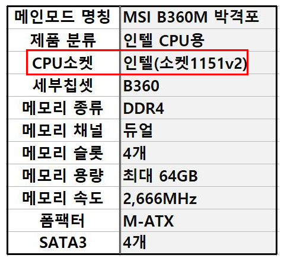
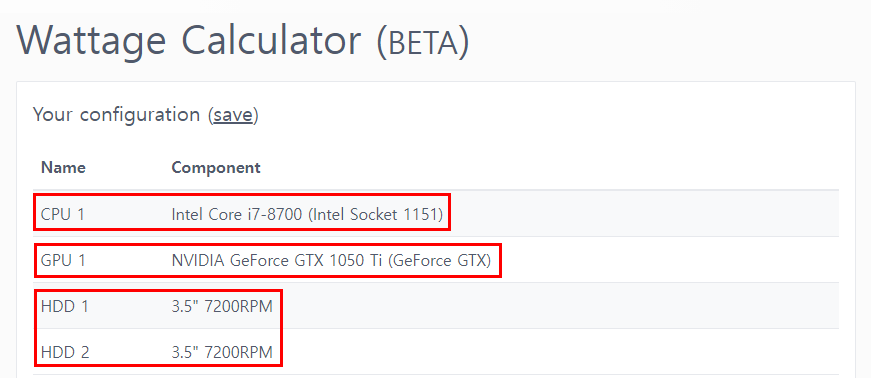
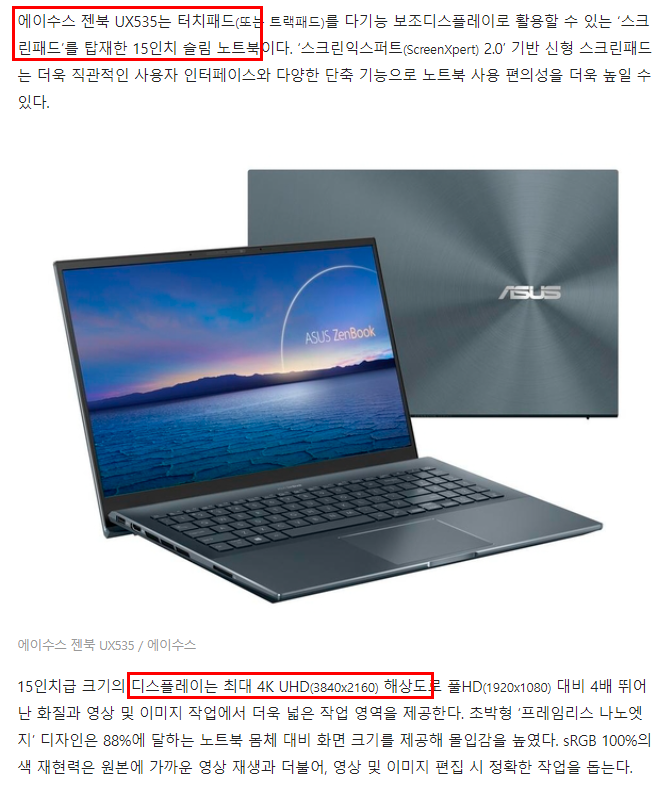

# 컴퓨터 하드웨어 기초
## 중앙처리장치(CPU, Central Processing Unit)
### CPU 코어
CPU 코어 - 중앙처리장치 중에서 핵심이 되는 부품으로 **기본 연산과 계산 작업**을 수행함. 코어의 성능(처리 속도)는 **클럭(clock)** 단위로 표현되며 클럭은 Hz(헤르츠, 초당 진동 횟수) 단위로 측정. 

단일 코어 성능 향상을 높이는 것보다 **다수의 코어를 조합**해 사용하는 것이 성능적으로 유리함. 일반적으로 CPU를 구매하는 경우 발열 수준을 낮추기 위해 쿨러(수냉 또는 공냉 방식)와 함께 사용한다.

- PC의 성능 == 코어의 성능(clock)
- Hz 수가 높다 == CPU 초당 명령어 처리 속도가 높다 == CPU의 성능이 높다

#### CPU 성능에 영향을 미치는 요소
<ul>
    <li>코어 개수</li>
    <li>*쓰레드* (코어의 작업 단위, 1 코어 1 쓰레드가 원칙)</li>
    <li>캐시 (빠른 데이터 로드를 위해 CPU내에서 데이터를 한시적으로 저장하는 곳)</li>
</ul>

#### CPU 코어 개수
<ol class="core-list">
    <li>싱글 코어</li>
    <li>듀얼 코어</li>
    <li>트리플 코어</li>
    <li>쿼드 코어 ==== 싱글 ~ 쿼드 : 일반인 PC 수준으로 부족함이 없는 정도</li>
    <li>헥사 코어</li>
    <li>옥타 코어</li>
    <li>데카 코어</li>
    <li>도데카 코어</li>
    <li>헥사 데시멀 코어</li>
</ol>

## 메인보드 (Main Board, Mother Board)
컴퓨터 부품들을 연결/조립하는 기판. 컴퓨터 성능과 직접적인 연관성은 없으나 CPU, 그래픽 카드, RAM 등 각 부품의 호환성과 연관된다. 

- CPU 소켓 : CPU와 메인보드의 접점. "CPU 소켓 규격 == 메인보드 소켓 규격"이 성립해야 CPU를 메인보드에 연결할 수 있다.

- RAM : 8GM * 4개를 메인보드에 연결할 경우 32GM RAM 성능을 수행한다.   

## 주기억장치 (RAM, Random Access Memory)
앞서 CPU가 처리했던 연산들의 결과를 임시로 저장하고, 향후 다시 그 결과를 다시 불러와야 할 경우가 생겼을 때 **재연산 하지 않고 이전 결과값을 빠르게 불러오는 역할**. 

RAM 성능이 좋을 수록 프리징 현상(길어지는 로딩) 없이 많은 프로그램을 한 번에 사용 가능함. **8~16GB 정도면 일반인 사용 범위 내에서 무리가 없고**, 발열이 생길 경우를 대비해 방열판을 장착할 수 있다. 

## 보조기억장치 (HDD & SDD)
HDD는 대용량 저장 장치를 의미한다. 전원이 꺼지더라도 저장된 데이터는 유지되며, RPM(분당 회전수, rotation per minute)이 높을 수록 성능이 좋지만 소음이 클 수 있다.

SSD는 하드디스크(HDD)를 대체안으로 제시된 보조기억장치로, 반도체를 이용해 데이터를 저장하는 저장 장소이다. HDD보다 빠른 속도로 데이터 읽기/쓰기가 가능하지만 상대적으로 용량이 작고 비싸다는 단점이 있다.  

<ul>
    <li>HDD - Hard Disk Drive : 동영상/이미지 저장용으로 세팅</li>
    <li>SSD - Solid-State Drive : 윈도우 설치용으로 세팅</li>
</ul>

### 데이터 로딩 및 연산 순서
1. 보조 기억 장치(HDD & SDD)
1. 주 기억장치(RAM)
1. 중앙 처리 장치(CPU)

## 전원 공급 장치 (PSU, Power Supply Unit)
흔히 PC 파워 서플라이라고 불리며 외부에서 전달되는 전압을 컴퓨터에 맞게 조정하고 PC 부품에 전달되는 전류를 일정하게 유지하는 역할을 수행함. 소음이 큰 편. 

대개 500 ~ 600W(와트) 수준에서 컴퓨터가 필요한 모든 전력을 공급할 수 있으나, 고사양 게임을 플레이 하기 위해 그래픽 카드를 사용할 경우나 작업용 PC는 파워 용량 계산을 통해 700W 이상의 파워를 사용할 것을 권장함.  

- 500W : 사무용 PC 수준
- 600W : 저사양 그래픽 카드 + 게임
- 700W : 고사양 그래픽 카드 + 고사양 게임
- 1600W ~ : 서버용, 특수 목적용

## 내 노트북의 파워 용량 계산하기
[파워 용량 계산 웹사이트](https://seasonic.com/wattage-calculator)

- 계산된 파워 용량 : 450W~750W

## 그래픽 처리 장치 (GPU, Graphic Processing Unit)
### 그래픽 칩셋 제조사와 대표 상품
- AMD - RX : 560 이상 - 가벼운 게임
- NVIDIA - GTX, RTX : 1000번대 미만은 사무용, 1060 & 1070ti - 가벼운 게임, 3070 - 최고사양 게임

## 모니터 (Monitor)
모니터의 화면 크기는 모니터 대각선의 꼭짓점과 꼭짓점 길이를 기준으로 하며 종류는 아래와 같다. 

### 데스크톱
<ol>
    <li>21인치 - 53.34cm</li>
    <li>23인치 - 58.42cm</li>
    <li>27인치 - 68.58cm</li>
    <li>32인치 - 81.28cm</li>
</ol>

### 노트북
<ol>
    <li>13.3인치 - 33.782cm</li>
    <li>14인치 - 35.56cm</li>
    <li>15.6인치 - 39.624cm</li>
    <li>16인치 - 40.64cm</li>
</ol>

## 해상도 (Resolution)
화면 크기와 해상도는 서로 다른 의미를 지닌다. 화면 크기는 PC/노트북이 가지는 물리적인 크기를 의미하는 반면, 해상도는 지원하는 픽셀의 개수를 의미한다. 

<ul>
    <li>1920*1080 : FHD</li>
    <li>2560*1440 : WQHD</li>
    <li>3840*2160 : UHD/4K - HDMI/DP 케이블 사용</li>
    <li>5120*2880 : UHD+/5K</li>
</ul>

15.6인치 화면을 가진 노트북이 1920x1080 FHD 해상도를 가질 수도 있고, 3840x2160(UHD/4K) 해상도를 지원할 수도 있는 것이다. **PPI(인치당 픽셀 밀도, Pixel per inch)가 높을 수록 좋은 해상도**를 가진다. 

그 외 주사율(헤르츠 단위, 높을 수록 화면이 부드러워짐), 명암비(높을 수록 화면이 선명함), 패널(액정의 배열 방식) 종류 등을 고려해 모니터를 고르는 것이 좋다. 개발자들의 경우 서브형 모니터로 피봇 모니터를 사용하는 경우도 있다.

## 키보드 및 마우스 (Keyboard, Mouse)
### 키보드
- 멤브레인 키보드 - 사무용, 대중적, 대량 생산 e.g 로지텍, 삼성전자 
- 펜타그래프 키보드 - 노트북용, 슬림함, 가위식(대중적) 또는 나비식(애플) 방식 제작
- 기계식 키보드 - 청축, 적축, 갈축 등 입력부 키스위치의 색에 따라 구분. 

<ul>
    <li>청축 : 소음 심함, 게임용</li>
    <li>적축 : 소음 적음, 사무용 </li>
    <li>갈축 : 중간 정도 소음, 게임/사무용</li> 
    <li>흑축 : 소음 적음, 사무용 </li>
</ul>

필요한 경우 키캡을 구매해 커스텀 할 수 있으며, 해피해킹/리얼포스/레오폴드와 같은 라인을 골라 구매하는 것을 권장함.

## 마우스
유선 마우스가 무선 마우스보다 감도가 좋음. 무선마우스도 편의성에서는 더 강점을 보임. 마우스를 장시간 사용하는 빈도가 많은 직업군이라면 버티컬 마우스 사용을 권장함. 

## 레퍼런스 
- [인프런 - 컴알못이 보는 컴퓨터 하드웨어 기초상식](https://www.inflearn.com/course/%EC%BB%B4%ED%93%A8%ED%84%B0-%ED%95%98%EB%93%9C%EC%9B%A8%EC%96%B4-%EA%B8%B0%EC%B4%88%EC%83%81%EC%8B%9D/dashboard) 
- [쓰레드 더 알아보기](https://militstory.com/2)
- [CPU GPU 그래픽 연산 속도 비교](https://www.youtube.com/watch?v=-P28LKWTzrI)
- [그래픽 카드 성능 체크 웹사이트](https://www.videocardbenchmark.net/)
- [매일 IT 밀릿 - CPU 코어 뜻 이해하기](https://militstory.com/1)