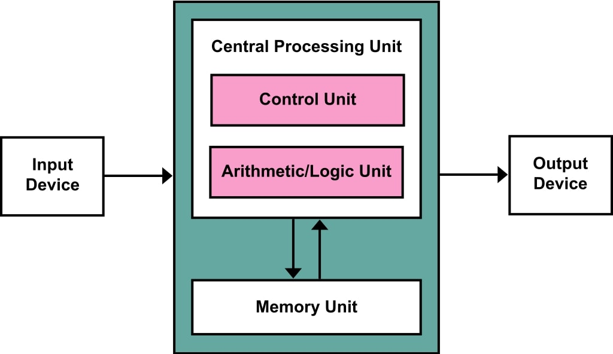
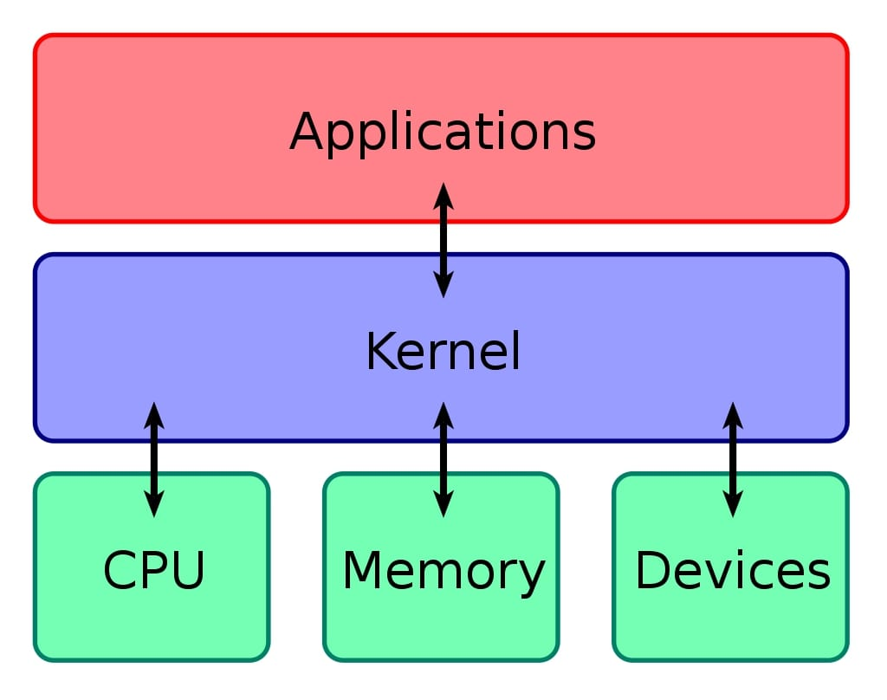

# Content editor : @developerasun

# 컴퓨터 구조부터 클라우드, 빅데이터까지

[강좌 바로가기](https://www.inflearn.com/course/%EA%B8%B0%EC%88%A0%EB%85%B8%ED%8A%B8-%EA%B5%AC%EC%A1%B0-%EB%B9%85%EB%8D%B0%EC%9D%B4%ED%84%B0/dashboard)

해당 강좌 전체 내용 중 꼭 필요하다고 생각되는 콘텐츠만을 집약해 아래 강의 노트를 작성함. 

<ol>
    <li>컴퓨터 구조 / 운영체제</li>
    <li>네트워크 / 서버 / 백엔드</li>
    <li>클라우드</li>
    <li>빅데이터</li>
    <li>보충 자료</li>
</ol>

## 컴퓨터 구조 
컴퓨터의 구조는 CPU, 메모리, 디스크, 입출력기기의 조합으로 이루어진 폰 노이만 구조를 따른다.

폰 노이만 구조 

개발자가 만든 소프트웨어가 컴퓨터 상에서 실행되는 순서는 아래와 같다. 실행 중인 프로그램을 프로세스라고 부른다.  

<ol>
개발자 -> 디스크 -> 메모리 -> CPU
    <li>소프트웨어 기능 개발 후 .exe 파일(코드+리소스) 실행</li>
    <li>디스크 상에서 코드/리소스 일부를 메모리에 전달</li>
    <li>메모리 상에서 연산을 위해 코드 일부를 CPU에 전달. 메모리에서 어떤 프로세스에 어떤 데이터를 할당할 것인지 결정함(메모리 관리 및 교체 알고리즘).</li>
    <li>CPU에서 실행되고 있는 프로세스에 얼마만큼의 시간을 할당할 것인지, 어느 프로세스를 우선시 할 것인지를 결정(시분할 및 스케쥴링). 현재는 우선 순위가 높은 프로세스를 우선 할당하는 선점형 스케쥴링이 대개 사용됨.</li>
</ol>

## 운영체제와 커널

CPU, 메모리, 디스크, 그리고 입출력 기기, 즉 폰 노이만 구조에서 컴퓨터의 하드웨어적 구성을 이해할 수 있다. 하나의 컴퓨터에서 여러 개의 프로그램이 실행될 수 있다. 개별적인 하드웨어들의 쓰임새를 이해한 후, 전체적으로 그 하드웨어들의 흐름을 제어하고, 여러 개의 프로세스를 관리하는 운영 체제를 이해할 필요가 있다.

폰 노이만 구조에서 버스(bus)는 CPU와 메모리 등을 연결하고 데이터가 송/수신되는 통로를 의미한다. 이러한 버스를 통해 CPU - 메모리 - 디스크 간 데이터(코드, 리소스)들이 이동하며 특정한 프로그램을 실행시킨다. 버스는 통상적으로 data highway라는 명칭으로 통한다. 

커널은 운영체제의 핵심으로 폰 노이만 구조(CPU + 메모리 + 입출력기기)와 응용 소프트웨어를 연결하는 역할을 한다. 일반적으로 커널은 하드웨어에 대한 인터페이스를 제공하는 추상화 기능과 시스템 자원을 관리하고 프로세스의 보안 유지를 수행한다. 

커널 구조 

## 클라우드 컴퓨팅
장점 : 비용 절감, 유틸리티성(사용한 만큼 과금)

## 보충 자료 - 알고리즘 책에 보면 꼭 나오는 트리

"hello world" 라는 문자열에서 두 번째 l을 삭제한 후 나머지 문자열을 저장하고 싶다고 해보자. 사용할 수 있는 자료 구조가 1) 배열 2) 연결 리스트 일 때, 좀 더 적절한 자료 구조는 무엇인가? 

배열의 경우 문자 l을 삭제한 후 나머지 문자열, 즉 o, 공백, w,o,r,l,d를 모두 배열 상에서 한 칸씩 당겨줘야 한다. 연결 리스트의 경우 나머지 문자열을 건드릴 필요 없이 첫 번째 l이 가리키는 문자만 o로 바꿔주면 된다. 이 문제의 경우 추가 및 삭제가 용이한 연결 리스트를 사용하는 것이 타당할 것이다.  

알고리즘 상에서 트리를 사용하는 이점은 여러 가지가 있다. 첫째로, 하위 노드들의 값들을 상위 노드들이 이미 가지고 있으므로 값을 빠르게 불러올 수 있다는 점이다. 1~10까지의 합을 구하는 문제에서 이진 트리를 사용한다고 가정해보자. 이진 트리의 구성이 하위 노드 1,2, 3,4, 5,6 중간 노드a 3,7,11, 중간 노드b 10, 18, 상위 노드 28과 같다면, 중간 노드 b의 10의 값을 가진 노드를 바로 불러올 수 있으므로 연산에 유리하다. 두번째로, 오름차순/내림차순으로 값을 정리하고 이 순서를 유지해야 할 경우 정렬에 유리하다. 

# 레퍼런스
[Bus - Wiki(Eng)](https://en.wikipedia.org/wiki/Bus_(computing))

[커널 - 위키백과](https://ko.wikipedia.org/wiki/%EC%BB%A4%EB%84%90_(%EC%BB%B4%ED%93%A8%ED%8C%85))
