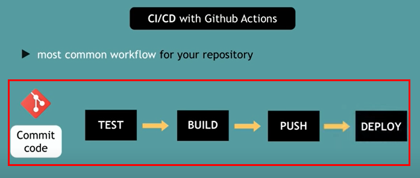

# Learning Github Actions

Took below course and summarized.

- [GitHub Actions Tutorial - Basic Concepts and CI/CD Pipeline with Docker](https://youtu.be/R8_veQiYBjI)

<p>
Github Actions is a platform helping developer to automate workflows. Ususally workflow means a types of work that is time-consuming or tedius. For example, CI/CD is one of the supported functions(workflows) in Github Actions.
</p>

- CI : continuous integration 
- CD : continuous development 

## Understanding workflows
Let's take a look at how a project is created and maintained in Github.

1. New repository is created
2. New contributors join
3. The contributors find issues and create pull requests
4. The issues and pull requests are reviewed
5. Merged to master branch 

<p>==== CI/CD ==== Comes in</p>

6. Write test codes towards the merged codes
7. Build the project and set the details(release notes, version number, etc)
8. Deploy the project


Github Actions is created to automate some of the parts in above process as much as possible so that developer can focus on more important task. Then how the platform is able to automate such process? 

## How Github Actions automation is done
When somehting happens in the repository, whether by you or the third party, this unit is called event. 

- Pull request created/merged
- Contributors joined
- Issue created/closed

<p>And Github Actions 1) listens to the events 2) creates/triggers a corresponding execution. The most common workflow to automate in repository is CI/CD, which is demonstrated by below screenshot. 
</p>



<p>
Choosing Github Actions over other CI/CD tools has an advantage that it is easier to set up. You can just adopt the same tool(Github) for workflow automation rather than having to learn/install all the different platforms and tool combination. 
</p>

## Example with repository
1. Go to your github repository and click action tab. 
2. Choose workflow template based on your needs
3. The template will automatically create related configs in yaml format. 

<details>
    <summary>What is yaml?</summary>
YAML is a superset of JSON with indentation. It is more human-friendly and easier to understand than JSON thus commonly used to write configuration files.

</details>

4. The config yaml will be executed and managed in Github. Each job in a workflow runs in a fresh virtual environment.

```yaml
name: CI

on:
  push:
    branches: [ master ]
  pull_request:
    branches: [ master ]

  workflow_dispatch:

jobs:

  build:

    runs-on: ubuntu-latest

    steps:

      - uses: actions/checkout@v2

      - name: Run a one-line script
        run: echo Hello, world!

      - name: Run a multi-line script
        run: |
          echo Add other actions to build,
          echo test, and deploy your project.

```

5. Check action status in your repository action tab like below. 

