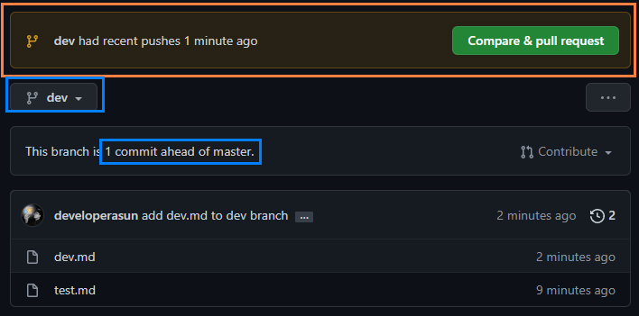
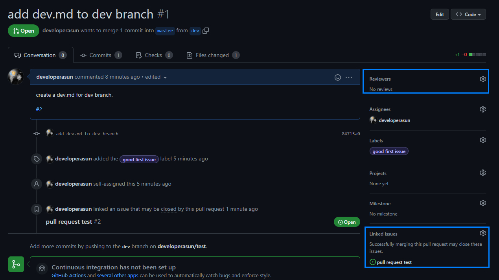
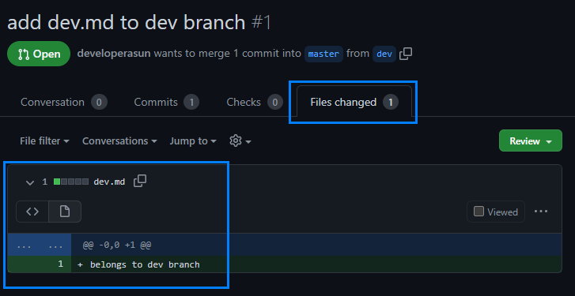
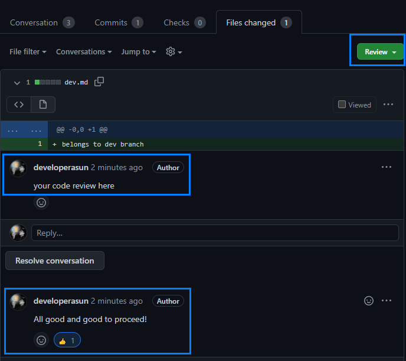
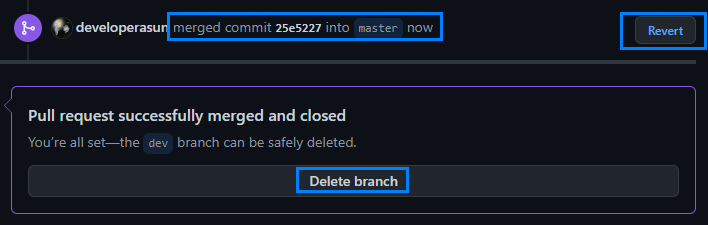

# Table of Contents
- [How to do git pull request]()
- [Undoing commit and push ]()
- [Changing directory name]()
- [Git non-fast-forward error]()
- [Git permission denied (publickey) error solution]()

# Learning Github Collaboration Essentials

## How to do git pull request
1. Check a task given and ellaborate in Github issue : set label and assignee
2. 

1. Create a branch and move to the branch with : git branch -b myBranch 
2. Add changes, commit, and push to the <strong>branch</strong>
3. Github will automatically sense the push and let you know about the change like below

4. Open a pull request and compare the two branches : 1) main 2) newly created branch. Explain why it should be merged with the main branch. 

5. Set other details such as assginee, label, reviewer, and linked issue before completing the pull request

6. Check what details have been made in Files changed tab.

7. Make a review on it. 

8. Once reviews done and your team members approve your contribution, merge the change and delete the branch. You can revert the merge commit. 

9. Check the result. The merge commit is on main branch now. 

## Undoing commit and push 
Troubleshoting <strong>done</strong> by  

Paragraph <strong>edited and translated</strong> by  

[See JS debugging tutorial in YouTube](https://www.youtube.com/watchv=eGpCdJ8DDaM&t=81s)

During this YouTube tutorial, I had encountered one github troubleshooting. A commit for image file had been placed in javascript code, not the original image one. Undoing a git push I made had always been a unwelcome guest so I decided to face it and figure out this time.

### How to undo git add
<ol>
  <li> git reset HEAD [file name] </li>
  <li> check result with git status </li>
</ol>

### How to undo git commit
<ol>
  <li>git log</li>
  <li>git reset --soft HEAD~1</li>
</ol>

In the below example, do __*git reset --soft HEAD~2*__ to undo the hightlighted commit fb43dd4.  
  

<ul>
  <li>HEAD~1 : one step before HEAD</li>  
  <li>HEAD~2 : two steps before HEAD</li>  
  <li>e.g. git reset --soft HEAD~2  : undo two commits(HEAD, HEAD~1)</li>  
</ul>

### How to undo git push 
<ol>
  <li>git log</li>
  <li>git revert [commit hash]</li>
  <li>git push [the repo where the misled commit was pushed] main</li>
</ol>

By following above instruction, the expected result is as follows : 
<ul>
  <li>Message that say [Revert "your mis-typed commit"] </li>
  <li>Github deleting the file you added with the wrong commit</li>
  <li>The file being deleted in your local</li>
</ul>

## Changing directory name
<ol>
  <li>git mv (current name) (change name)</li>
  <li>git add</li>
  <li>git commit</li>
  <li>git push</li>
</ol>

  Your folder name will be changed and the commits of the files belonging to the folder will be affected, meaning previous commits overwritten.    

## Git non-fast-forward error
Troubleshoting <strong>done</strong> by  

Paragraph <strong>edited and translated</strong> by  

### Problems happened
 
1. Git push rejected / git push 문제 발생

### Troubleshooting process
 
2. Trying to merge with pull keyword / pull로 먼저 병합 시도

 
3. Fixing repo mapping(occured because of branch rename) / branch --set-upstream-to=origin/main main 명령어 사용

 
4. Pull done(not clear) / 확실하지 않지만 pull이 진행된 것 같음

 
5. Push attempt and email error occured / push 시도 → email privacy restrictions 오류 발생

### Solution and result
 
6. Adjusting profile setting for the email error / 프로필 Settings → Emails에서 Block command line pushes that expose my email 체크 해제  
7. Push success / push 성공

## Git permission denied (publickey) error solution
Troubleshoting <strong>done</strong> by  

Paragraph <strong>edited and translated</strong> by  

issue : git permission denied (publickey). fatal: Could not read from remote repository. Please make sure you have the correct access rights and the repository exists

reason : Git is used based on SSH or http. If you an SSH key to connect, you need to register an ssh key for each PC.

1. Open the terminal and insert ssh key generate command.

2. Press Enter.  id_rsa file is generated path is C:\Users\[사용자]/.ssh/id_rsa 

3. If you want enter a password, enter the password  otherwise press enter

4. SSH KEY IS GENERATED

5. Move to Setting menu in Github.

6. if you press SSH keys in Settings The following screen appear.

7. if you open id_rsa.pub file in ssh folder using notepad you can see the key value.

Copy the entire file and paste it where you entered the SSH key value earlier.

8. After the generation is complete, check in the terminal whether it has been successfully generated on the PC.

result Now you can git push or git commit

# Contributors

# List of references
- [how to undo git commit](https://devconnected.com/how-to-undo-last-git-commit/)
- [how to undo git push](https://stackoverflow.com/questions/37606168/how-to-undo-a-git-push) 
- [git permission - tistory blog post](https://maliceit.tistory.com/51) 
- [git reset --hard, --soft](https://kyounghwan01.github.io/blog/etc/git/git-reset-revert/#reset) 
- [git name change](https://blog.naver.com/1740948/222102496323)
- [git pull request](https://youtu.be/9FZaYz0s8s4)
