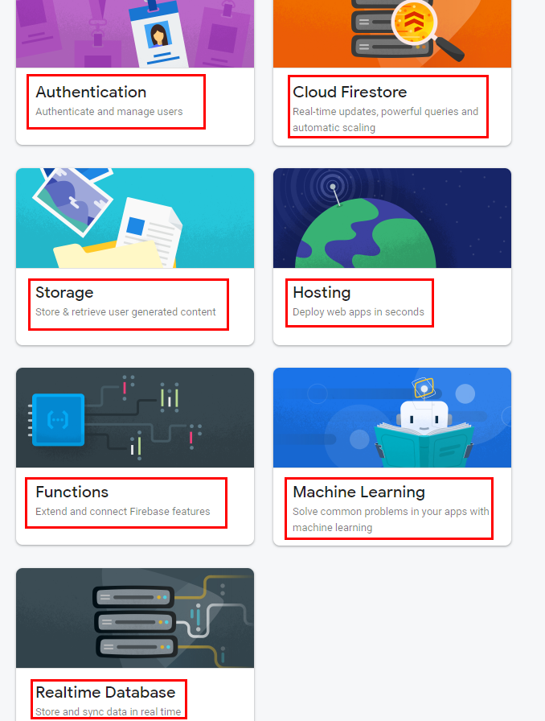

# Learning Firebase Functions Essentials
Took below course and summarized essentials. 

- [NetNinja Firebase functions](https://youtube.com/playlist?list=PL4cUxeGkcC9i_aLkr62adUTJi53y7OjOf)

## Understanding Firebase
Types of services that Firebase provides is as follows : 

- Firebase hosting : website deployment by Firebase
- Cloud Functions : hosting serside codes in Firebase. It runs in a Node js, meaning your codes should be JS/TS
- Cloud Firestore :  a real time database(NoSQL) in Firebase
- Authentication
- Cloud Storage

```
myproject
 +- .firebaserc    # Hidden file that helps you quickly switch between
 |                 # projects with `firebase use`
 |
 +- firebase.json  # Describes properties for your project
 |
 +- functions/     # Directory containing all your functions code
      |
      +- .eslintrc.json  # Optional file containing rules for JavaScript linting.
      |
      +- package.json  # npm package file describing your Cloud Functions code
      |
      +- index.js      # main source file for your Cloud Functions code
      |
      +- node_modules/ # directory where your dependencies (declared in
                       # package.json) are installed
```


## Creating a project
Go to offical Firebase homepage and create a project. And then choose some of the features you need for the project. 



Choose hosting and then install Firebase CLI. 

```javascript
npm install -g firebase-tools
```

Once installed, start initialization by following commands.
```
firebase login
firebase init
```

