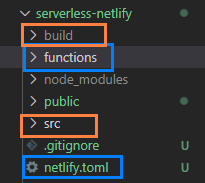
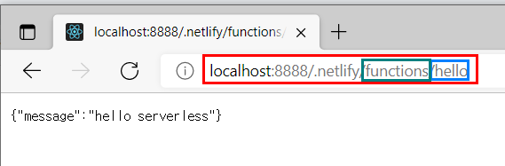
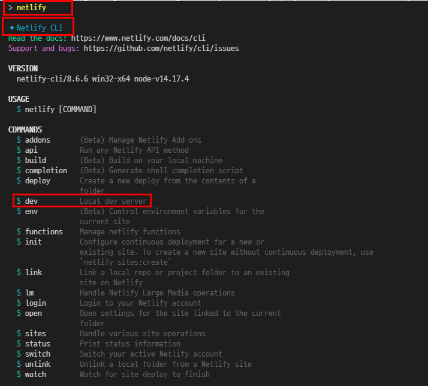

# Learning Netlify essentials
Took below courses and summarized essetials. 

## Table of contents
- [Create your first Netlify serverless function](https://youtu.be/n_KASTN0gUE)
- [Up and Running with Serverless Functions - Ben Hong](https://explorers.netlify.com/learn/up-and-running-with-serverless-functions/introduction-with-serverless-functions)


## Create your first Netlify serverless function
Serverless means that you write server side code and the third party will run the codes so that you don't have to care server management, which could be a tedius job. 

### Project folder map
- orange : React, blue : Netlify


1. Create a react app and install netlify-cli to deploy react app through serverless function. 

```
npm install -g netlify-cli
```

2. Each Javascript file to export, which will be asynchronous serverless lambda functions, should have a handler method following a pre-defined syntax. File should be in 'functions' folder and file name will be an endpoint in url like below. 



```javascript
// Netlify provides event/context parameters when event handler invoked
exports.handler = async function(event , context) {
    return { 
        statusCode : 200, // Netlify recommends to return http status code in your handler 
        body : JSON.stringify( { message : "Hello Serverless" })
    }
}

```

3. Create a Netlify toml file for configuration. Recommend to install toml support extension as well.

```toml
[build]
command = 'npm run build' // build setting
functions = 'functions' // where Netlify looks up your server side codes
publish = 'build'
```

And add a script in package.json file to execute. Check out below Netlify cli commands. 

```json
 "dev" : "netlify dev"
```



4. Execute your app and access to below url to check if it works. 
```
http://localhost:(PORT)/.netlify/functions/(YOUR_JS_FILE_NAME)
```

## Up and Running with Serverless Functions
contents will be added