# Learning Github actions essentials
## Basics
> GitHub Actions is a continuous integration and continuous delivery (CI/CD) platform that allows you to automate your build, test, and deployment pipeline. You can create **workflows that build and test every pull request** to your repository, or deploy merged pull requests to production.

> GitHub Actions goes beyond just DevOps and lets you run workflows when other events happen in your repository. For example, you can run a workflow to **automatically add the appropriate labels** whenever someone creates a new issue in your repository.

> GitHub provides Linux, Windows, and macOS virtual machines to run your workflows, or you can host your own self-hosted runners in your own data center or cloud infrastructure.

## Components
> You can configure a GitHub Actions workflow to be triggered when an event occurs in your repository, such as a pull request being opened or an issue being created. Your workflow contains one or more jobs which can run in sequential order or in parallel. **Each job will run inside its own virtual machine runner**, or inside a container, and has one or more steps that either run a script that you define or run an action, which is a reusable extension that can simplify your workflow.


## Workflows
> A workflow is a configurable automated process that will run one or more jobs. Workflows are defined by a YAML file checked in to your repository and will run when triggered by an event in your repository, or they can be triggered manually, or at a defined schedule.

> You can have multiple workflows in a repository, each of which can perform a different set of steps. For example, you can have one workflow to build and test pull requests, another workflow to deploy your application every time a release is created, and still another workflow that adds a label every time someone opens a new issue.

## Events
> An event is a specific activity in a repository that triggers a workflow run. For example, activity can originate from GitHub when someone creates a pull request, opens an issue, or pushes a commit to a repository. You can also trigger a workflow run on a schedule, by posting to a REST API, or manually.

## Jobs
> **A job is a set of steps in a workflow** that execute on the same runner. Each step is either a shell script that will be executed, or an action that will be run. Steps are executed in order and are dependent on each other. Since each step is executed on the same runner, you can share data from one step to another. For example, you can have a step that builds your application followed by a step that tests the application that was built.

> You can configure a job's dependencies with other jobs; **by default, jobs have no dependencies and run in parallel with each other**. When a job takes a dependency on another job, it will wait for the dependent job to complete before it can run. For example, you may have multiple build jobs for different architectures that have no dependencies, and a packaging job that is dependent on those jobs. The build jobs will run in parallel, and when they have all completed successfully, the packaging job will run.

## Actions
> **An action is a custom application** for the GitHub Actions platform that performs a complex but frequently repeated task. **Use an action to help reduce the amount of repetitive code** that you write in your workflow files. An action can pull your git repository from GitHub, set up the correct toolchain for your build environment, or set up the authentication to your cloud provider.

> You can write your own actions, or you can find actions to use in your workflows in the GitHub Marketplace.

## Runners
> **A runner is a server that runs your workflows** when they're triggered. Each runner can **run a single job at a time**. GitHub provides Ubuntu Linux, Microsoft Windows, and macOS runners to run your workflows; each workflow run executes in a fresh, newly-provisioned virtual machine. If you need a different operating system or require a specific hardware configuration, you can host your own runners. 

## Examples
> GitHub Actions uses YAML syntax to define the workflow. Each workflow is stored as a separate YAML file in your code repository, in a directory called .github/workflows.

> You can create an example workflow in your repository that automatically triggers a series of commands whenever code is pushed. In this workflow, GitHub Actions checks out the pushed code, installs the software dependencies, and runs bats -v.

```yml
# Optional - The name of the workflow as it will appear in the Actions tab of the GitHub repository.
name: learn-github-actions

# Specifies the trigger for this workflow. This is triggered by a push to every branch. 
on: [push]

# Groups together all the jobs that run in the learn-github-actions workflow.
jobs:
  # Defines a job named check-bats-version. The child keys will define properties of the job.
  check-bats-version:

    # Configures the job to run on the latest version of an Ubuntu Linux runner. This means that the job will execute on a fresh virtual machine hosted by GitHub. 
    runs-on: ubuntu-latest

    # Each item nested under this section is a separate action or shell script.
    steps:

      # You should use the checkout action any time your workflow will run against the repository's code.
      - uses: actions/checkout@v2 # action
      - uses: actions/setup-node@v2 # action
        with:
          node-version: '14'

      # The run keyword tells the job to execute a command on the runner.
      - run: npm install -g bats # shell script
      - run: bats -v # shell script
```

> In your repository, **create the .github/workflows/ directory** to store your workflow files. In the .github/workflows/ directory, create a new file called learn-github-actions.yml and add the following code.

> Your new GitHub Actions workflow file is now installed in your repository and will run automatically each time someone pushes a change to the repository. For details about a job's execution history, see "Viewing the workflow's activity."

## Visualizing the workflow file
> In this diagram, you can see the workflow file you just created and how the GitHub Actions components are organized in a hierarchy. Each step executes a single action or shell script. Steps 1 and 2 run actions, while steps 3 and 4 run shell scripts. To find more prebuilt actions for your workflows, see "Finding and customizing actions."

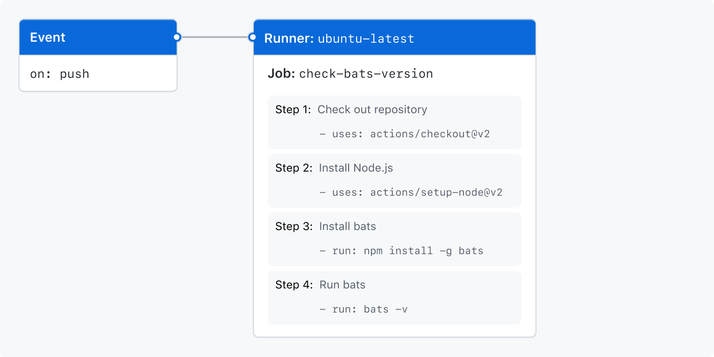

## Understanding the workflow file
> To help you understand how YAML syntax is used to create a workflow file, this section explains each line of the introduction's example:

## About YAML syntax for workflows
> Workflow files use YAML syntax, and must have either a .yml or .yaml file extension. If you're new to YAML and want to learn more, see "Learn YAML in Y minutes."

> You **must store workflow files in the .github/workflows directory** of your repository.

### Using filters
> Some events have filters that give you more control over when your workflow should run.

> For example, the push event has a branches filter that causes your workflow to run only when a push to a branch that matches the branches filter occurs, instead of when any push occurs.

```yml
on:
  push:
    branches:
      - main
      - 'releases/**'
```

## Essential features of GitHub Actions
> GitHub Actions are designed to help you build robust and dynamic automations. This guide will show you how to craft GitHub Actions workflows that include environment variables, customized scripts, and more.

### Using variables in your workflows
> GitHub Actions include default environment variables for each workflow run. If you need to use custom environment variables, you can set these in your YAML workflow file. This example demonstrates how to create custom variables named POSTGRES_HOST and POSTGRES_PORT. These variables are then available to the node client.js script.

```yml
jobs:
  example-job:
      steps:
        - name: Connect to PostgreSQL
          run: node client.js
          env:
            POSTGRES_HOST: postgres
            POSTGRES_PORT: 5432
```

### Adding scripts to your workflow
> You can use actions to run scripts and shell commands, which are then executed on the assigned runner. This example demonstrates how an action can use the run keyword to execute npm install -g bats on the runner.

```yml
jobs:
  example-job:
    steps:
      - run: npm install -g bats
```

### Sharing data between jobs : artifacts
> If your job generates files that you want to share with another job in the same workflow, or if you want to save the files for later reference, you can store them in GitHub as artifacts. Artifacts are the files created when you build and test your code. For example, artifacts might include binary or package files, test results, screenshots, or log files. Artifacts are associated with the workflow run where they were created and can be used by another job. All actions and workflows called within a run have write access to that run's artifacts.

> For example, you can create a file and then upload it as an artifact.

```yml
jobs:
  example-job:
    name: Save output
    steps:
      - shell: bash
        run: |
          expr 1 + 1 > output.log
      - name: Upload output file
        uses: actions/upload-artifact@v3
        with:
          name: output-log-file
          path: output.log
```

> To download an artifact from a separate workflow run, you can use the actions/download-artifact action. For example, you can download the artifact named output-log-file.

```yml
jobs:
  example-job:
    steps:
      - name: Download a single artifact
        uses: actions/download-artifact@v3
        with:
          name: output-log-file
```

## Advanced workflow features
> This guide shows you how to use the advanced features of GitHub Actions, with secret management, dependent jobs, caching, build matrices, environments, and labels.

### Storing secrets 
> If your workflows use **sensitive data**, such as passwords or certificates, you can **save these in GitHub as secrets** and then use them in your workflows as environment variables. This means that you will be able to create and share workflows without having to embed sensitive values directly in the YAML workflow.

> This example action demonstrates how to reference an existing secret as an environment variable, and send it as a parameter to an example command.

```yml
jobs:
  example-job:
    runs-on: ubuntu-latest
    steps:
      - name: Retrieve secret
        env:
          super_secret: ${{ secrets.SUPERSECRET }}
        run: |
          example-command "$super_secret"
```

### Creating dependent jobs
> By default, the jobs in your workflow all run in parallel at the same time. So if you have a job that must only run after another job has completed, you can **use the needs keyword to create this dependency**. If one of the jobs fails, all dependent jobs are skipped; however, if you need the jobs to continue, you can define this using the if conditional statement.

> In this example, the setup, build, and test jobs run in series, with build and test **being dependent on the successful completion of the job that precedes them**:

```yml
jobs:
  setup:
    runs-on: ubuntu-latest
    steps:
      - run: ./setup_server.sh
  build:
    needs: setup
    runs-on: ubuntu-latest
    steps:
      - run: ./build_server.sh
  test:
    needs: build
    runs-on: ubuntu-latest
    steps:
      - run: ./test_server.sh
```

### Using a build matrix
> You can use a build matrix if you want your workflow to run tests across multiple combinations of operating systems, platforms, and languages. The build matrix is created using the strategy keyword, which receives the build options as an array. For example, this build matrix will run the job multiple times, using different versions of Node.js:

```yml
jobs:
  build:
    runs-on: ubuntu-latest
    # use bulid matrix with strategy keyword
    strategy:
      matrix:
        node: [6, 8, 10]
    steps:
      - uses: actions/setup-node@v2
        with:
          node-version: ${{ matrix.node }}
```

### Caching dependencies
> GitHub-hosted runners are started as fresh environments for each job, so **if your jobs regularly reuse dependencies, you can consider caching these files** to help improve performance. Once the cache is created, it is available to all workflows in the same repository.

> This example demonstrates how to cache the ~/.npm directory:

```yml
jobs:
  example-job:
    steps:
      - name: Cache node modules
        uses: actions/cache@v2
        env:
          cache-name: cache-node-modules
        with:
          path: ~/.npm
          key: ${{ runner.os }}-build-${{ env.cache-name }}-${{ hashFiles('**/package-lock.json') }}
          restore-keys: |
            ${{ runner.os }}-build-${{ env.cache-name }}-
```

### Using databases and service containers
> If your job requires a database or cache service, you can use the services keyword to create an ephemeral container to host the service; the resulting container is then available to all steps in that job and is removed when the job has completed. This example demonstrates how a job can use services to create a postgres container, and then use node to connect to the service.

```yml
jobs:
  container-job:
    runs-on: ubuntu-latest
    container: node:10.18-jessie
    services:
      postgres:
        image: postgres
    steps:
      - name: Check out repository code
        uses: actions/checkout@v2
      - name: Install dependencies
        run: npm ci
      - name: Connect to PostgreSQL
        run: node client.js
        env:
          POSTGRES_HOST: postgres
          POSTGRES_PORT: 5432
```

### Using environments
> You can configure environments with protection rules and secrets. Each job in a workflow can reference a single environment. Any protection rules configured for the environment must pass before a job referencing the environment is sent to a runner. For more information, see "Using environments for deployment."

### Using starter workflows
> GitHub provides preconfigured starter workflow that you can customize to create your own continuous integration workflow. GitHub analyzes your code and shows you CI starter workflow that might be useful for your repository. For example, if your repository contains Node.js code, you'll see suggestions for Node.js projects. You can use starter workflow as a starting place to build your custom workflow or use them as-is.

## Finding and customizing actions
> Actions are the building blocks that power your workflow. A workflow can contain actions created by the community, or you can create your own actions directly within your application's repository. This guide will show you how to discover, use, and customize actions.

> The actions you use in your workflow can be defined in:

1. The same repository as your workflow file
1. Any public repository
1. A published Docker container image on Docker Hub


## Basic Concepts and CI/CD Pipeline with Docker
Github Actions is a platform helping developer to automate workflows. Ususally workflow means a types of work that is time-consuming or tedius. For example, CI/CD is one of the supported functions(workflows) in Github Actions.

- CI : continuous integration => the process of integrating code into a mainline code base. In almost all scenarios today, CI is done using platforms designed specifically for the purpose.


- CD :  continuous delivery / continuous development
- continuous delivery => automation coverage : development/local envivornment
- continuous development => automation coverage : operation envivornment

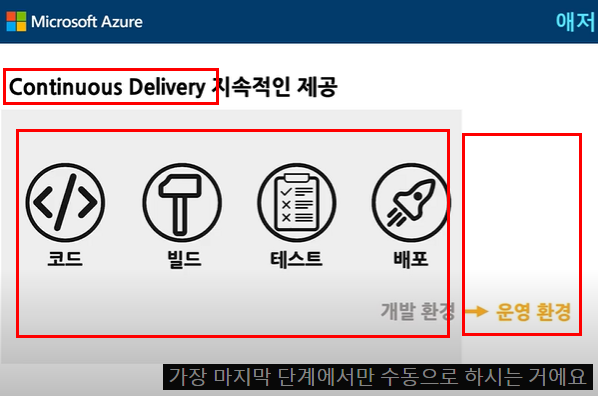

### Understanding workflows
Let's take a look at how a project is created and maintained in Github.

1. New repository is created
2. New contributors join
3. The contributors find issues and create pull requests
4. The issues and pull requests are reviewed
5. Merged to master branch 

<p>==== CI/CD ==== Comes in</p>

6. Write test codes towards the merged codes
7. Build the project and set the details(release notes, version number, etc)
8. Deploy the project
9. Return to 6 and start again. This is why CI/CD is needed to automate process 6 ~ 9. 

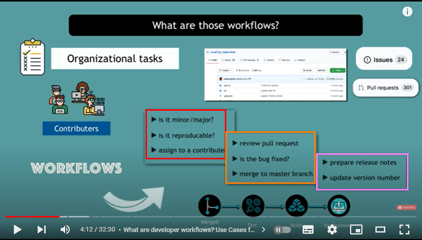

Github Actions is created to automate some of the parts in above process as much as possible so that developer can focus on more important task. Then how the platform is able to automate such process? 

### How Github Actions automation is done
When somehting happens in the repository, whether by you or the third party, this unit is called event. 

- Pull request created/merged
- Contributors joined
- Issue created/closed

And Github Actions 1) listens to the events 2) creates/triggers a corresponding execution. The most common workflow to automate in repository is CI/CD, which is demonstrated by below screenshot. 

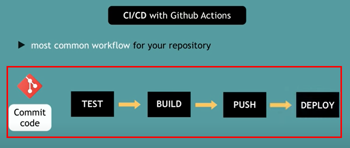

Choosing Github Actions over other CI/CD tools has an advantage that it is easier to set up. You can just adopt the same tool(Github) for workflow automation rather than having to learn/install all the different platforms and tool combination. 

### Example with repository
1. Go to your github repository and click action tab. 
2. Choose workflow template based on your needs
3. The template will automatically create related configs in yaml format. 

<details>
    <summary>What is yaml?</summary>

YAML is a superset of JSON with indentation. It is more human-friendly and easier to understand than JSON thus commonly used to write configuration files.
</details>

4. The config yaml will be executed and managed in Github. Each job in a workflow runs in a fresh virtual environment.

```yaml
name: CI

on:
  push:
    branches: [ main ]
  pull_request:
    branches: [ main ]

  workflow_dispatch:

jobs:

  build:

    runs-on: ubuntu-latest

    steps:

      - uses: actions/checkout@v2

      - name: Run a one-line script
        run: echo Hello, world!

      - name: Run a multi-line script
        run: |
          echo Add other actions to build,
          echo test, and deploy your project.

```

5. Check action status in your repository action tab like below. 


## GitHub Actions for development cycle automation
Topics covered by this tutorial are as follows : 

- Selecting OS/Node js version for github actions
- Test automation
- Approach to build artifact

- Node version changes and maintenance
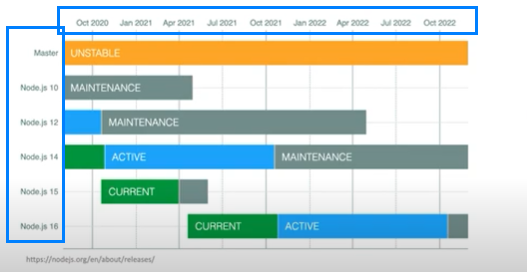

- matrix build(build several versions at the same time)


```yml
name : My workflow

on : 
    push : 
        branches : [main]
    pull_reques : 
        branches : [main]

jobs : 
    build : # job 1 : build => host machine A
      runs-on : ubuntu-latest # virutal machine 
      strategy : 
          maxtrix : 
              os : [ubuntu-latest, window-2020]
              node-version : [12.x, 14.x] # two nodes will be built
      steps : 
        - uses : actions/checkout@v2 # copy your codes and paste to the virtual machine
        - name : npm install and build
        - run : | 
              npm install
              npm run build
    test : # job 2 : test => host machine B
      runs-on : ubuntu-latest
      strategy : 
          maxtrix : 
              os : [ubuntu-latest, window-2020]
              node-version : [12.x, 14.x]
      steps : 
        - uses : actions/checkout@v2
        - name : npm install and test
        - run : | 
              npm install
              npm test

```

### Understanding basic terms
The main terms of Github actions are as follows.

1. Workflows : Workflow consists of a few actions.
2. Job : a task to do
3. Step : a process to do the task
4. Action : copy your codes and paste to a virtual machine

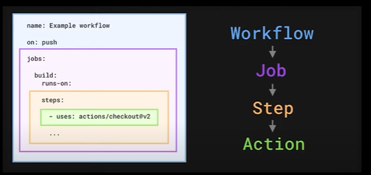

### Tackle three issues
- managing main branch ====> setting a branch policy
- merging pull request at a proper timing ====> forcing pull request reviews
- managing issues and pull requests ====> labeling them with custom actions

#### Setting a branch policy
1. Go to your repository and click settings. 
2. Select Branches tab and click add rule in Branch protection rule. Check these rules 

- Require a pull request before merging ====> setting a number of reviewers
- Require status checks to pass before merging
- Include administrators ====> even administarators should follow the branch policy 

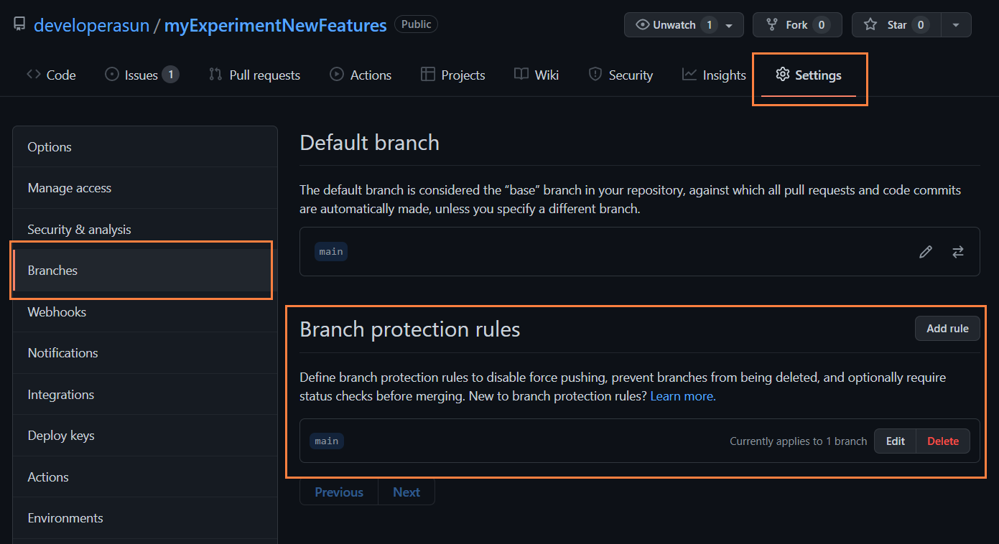

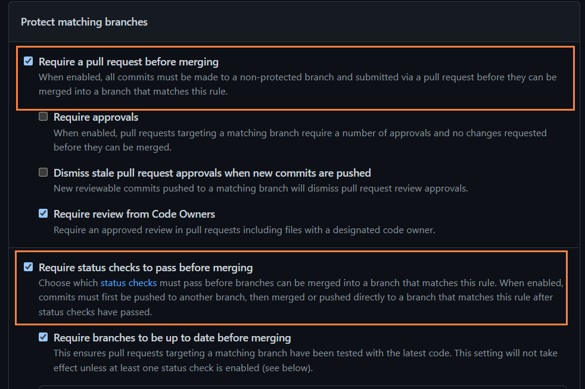

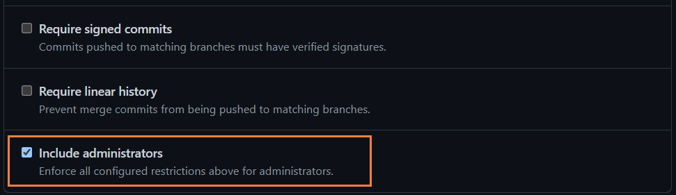

You can check direct commit to main branch is blocked now. 

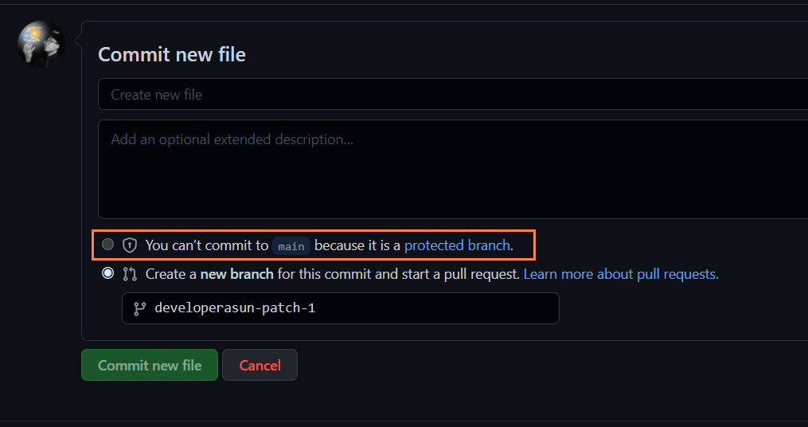

#### Managing issues and pull requests
1. Go to Github marketplace to use customized actions created by users. 

2. Search and find what you feel like. In this tutorial, we will use 'Label approved pull requests'.

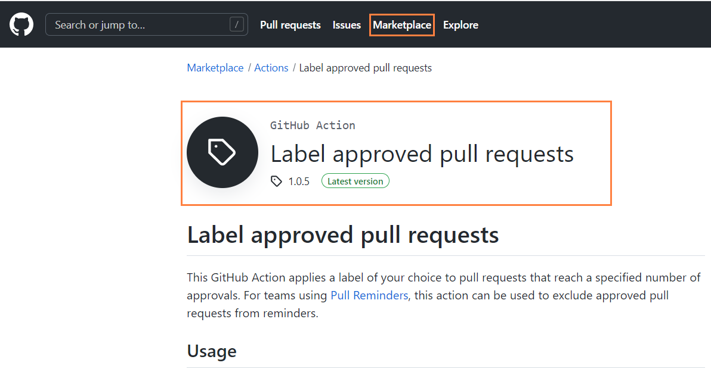

## Reference
- [GitHub Actions Tutorial - Basic Concepts and CI/CD Pipeline with Docker (ENG)](https://youtu.be/R8_veQiYBjI)
- [GitHub Actions for development cycle automation (KOR)](https://youtu.be/MhGpFunlmMQ)