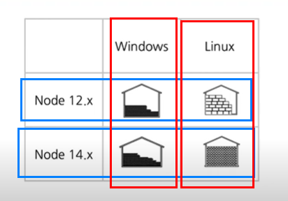

# Learning Github actions essentials
## Basics
> GitHub Actions is a continuous integration and continuous delivery (CI/CD) platform that allows you to automate your build, test, and deployment pipeline. You can create **workflows that build and test every pull request** to your repository, or deploy merged pull requests to production.

> GitHub Actions goes beyond just DevOps and lets you run workflows when other events happen in your repository. For example, you can run a workflow to **automatically add the appropriate labels** whenever someone creates a new issue in your repository.

> GitHub provides Linux, Windows, and macOS virtual machines to run your workflows, or you can host your own self-hosted runners in your own data center or cloud infrastructure.

## Components
> You can configure a GitHub Actions workflow to be triggered when an event occurs in your repository, such as a pull request being opened or an issue being created. Your workflow contains one or more jobs which can run in sequential order or in parallel. **Each job will run inside its own virtual machine runner**, or inside a container, and has one or more steps that either run a script that you define or run an action, which is a reusable extension that can simplify your workflow.


## Workflows
> A workflow is a configurable automated process that will run one or more jobs. Workflows are defined by a YAML file checked in to your repository and will run when triggered by an event in your repository, or they can be triggered manually, or at a defined schedule.

> You can have multiple workflows in a repository, each of which can perform a different set of steps. For example, you can have one workflow to build and test pull requests, another workflow to deploy your application every time a release is created, and still another workflow that adds a label every time someone opens a new issue.

## Events
> An event is a specific activity in a repository that triggers a workflow run. For example, activity can originate from GitHub when someone creates a pull request, opens an issue, or pushes a commit to a repository. You can also trigger a workflow run on a schedule, by posting to a REST API, or manually.

## Jobs
> **A job is a set of steps in a workflow** that execute on the same runner. Each step is either a shell script that will be executed, or an action that will be run. Steps are executed in order and are dependent on each other. Since each step is executed on the same runner, you can share data from one step to another. For example, you can have a step that builds your application followed by a step that tests the application that was built.

> You can configure a job's dependencies with other jobs; **by default, jobs have no dependencies and run in parallel with each other**. When a job takes a dependency on another job, it will wait for the dependent job to complete before it can run. For example, you may have multiple build jobs for different architectures that have no dependencies, and a packaging job that is dependent on those jobs. The build jobs will run in parallel, and when they have all completed successfully, the packaging job will run.

## Actions
> **An action is a custom application** for the GitHub Actions platform that performs a complex but frequently repeated task. **Use an action to help reduce the amount of repetitive code** that you write in your workflow files. An action can pull your git repository from GitHub, set up the correct toolchain for your build environment, or set up the authentication to your cloud provider.

> You can write your own actions, or you can find actions to use in your workflows in the GitHub Marketplace.

## Runners
> A runner is a server that runs your workflows when they're triggered. Each runner can run a single job at a time. GitHub provides Ubuntu Linux, Microsoft Windows, and macOS runners to run your workflows; each workflow run executes in a fresh, newly-provisioned virtual machine. If you need a different operating system or require a specific hardware configuration, you can host your own runners. 

## Examples
> GitHub Actions uses YAML syntax to define the workflow. Each workflow is stored as a separate YAML file in your code repository, in a directory called .github/workflows.

> You can create an example workflow in your repository that automatically triggers a series of commands whenever code is pushed. In this workflow, GitHub Actions checks out the pushed code, installs the software dependencies, and runs bats -v.

```yml
# Optional - The name of the workflow as it will appear in the Actions tab of the GitHub repository.
name: learn-github-actions

# Specifies the trigger for this workflow. This is triggered by a push to every branch. 
on: [push]

jobs:
  check-bats-version:
    runs-on: ubuntu-latest
    steps:
      - uses: actions/checkout@v2
      - uses: actions/setup-node@v2
        with:
          node-version: '14'
      - run: npm install -g bats
      - run: bats -v
```

> In your repository, create the .github/workflows/ directory to store your workflow files. In the .github/workflows/ directory, create a new file called learn-github-actions.yml and add the following code.

> Your new GitHub Actions workflow file is now installed in your repository and will run automatically each time someone pushes a change to the repository. For details about a job's execution history, see "Viewing the workflow's activity."

## Understanding the workflow file
> To help you understand how YAML syntax is used to create a workflow file, this section explains each line of the introduction's example:


## About YAML syntax for workflows
> Workflow files use YAML syntax, and must have either a .yml or .yaml file extension. If you're new to YAML and want to learn more, see "Learn YAML in Y minutes."

> You **must store workflow files in the .github/workflows directory** of your repository.

### Using filters
> Some events have filters that give you more control over when your workflow should run.

> For example, the push event has a branches fiM~lter that causes your workflow to run only when a push to a branch that matches the branches filter occurs, instead of when any push occurs.

```yml
on:
  push:
    branches:
      - main
      - 'releases/**'
```

> 


## Basic Concepts and CI/CD Pipeline with Docker
Github Actions is a platform helping developer to automate workflows. Ususally workflow means a types of work that is time-consuming or tedius. For example, CI/CD is one of the supported functions(workflows) in Github Actions.

- CI : continuous integration => the process of integrating code into a mainline code base. In almost all scenarios today, CI is done using platforms designed specifically for the purpose.

<ul>

  - CD :  continuous delivery / continuous development

  <ul>

  - continuous delivery => automation coverage : development/local envivornment
  - continuous development => automation coverage : operation envivornment
  </ul>
</ul>


### Understanding workflows
Let's take a look at how a project is created and maintained in Github.

1. New repository is created
2. New contributors join
3. The contributors find issues and create pull requests
4. The issues and pull requests are reviewed
5. Merged to master branch 

<p>==== CI/CD ==== Comes in</p>

6. Write test codes towards the merged codes
7. Build the project and set the details(release notes, version number, etc)
8. Deploy the project
9. Return to 6 and start again. This is why CI/CD is needed to automate process 6 ~ 9. 


Github Actions is created to automate some of the parts in above process as much as possible so that developer can focus on more important task. Then how the platform is able to automate such process? 

### How Github Actions automation is done
When somehting happens in the repository, whether by you or the third party, this unit is called event. 

- Pull request created/merged
- Contributors joined
- Issue created/closed

And Github Actions 1) listens to the events 2) creates/triggers a corresponding execution. The most common workflow to automate in repository is CI/CD, which is demonstrated by below screenshot. 


Choosing Github Actions over other CI/CD tools has an advantage that it is easier to set up. You can just adopt the same tool(Github) for workflow automation rather than having to learn/install all the different platforms and tool combination. 

### Example with repository
1. Go to your github repository and click action tab. 
2. Choose workflow template based on your needs
3. The template will automatically create related configs in yaml format. 

<details>
    <summary>What is yaml?</summary>
YAML is a superset of JSON with indentation. It is more human-friendly and easier to understand than JSON thus commonly used to write configuration files.

</details>

4. The config yaml will be executed and managed in Github. Each job in a workflow runs in a fresh virtual environment.

```yaml
name: CI

on:
  push:
    branches: [ main ]
  pull_request:
    branches: [ main ]

  workflow_dispatch:

jobs:

  build:

    runs-on: ubuntu-latest

    steps:

      - uses: actions/checkout@v2

      - name: Run a one-line script
        run: echo Hello, world!

      - name: Run a multi-line script
        run: |
          echo Add other actions to build,
          echo test, and deploy your project.

```

5. Check action status in your repository action tab like below. 


## GitHub Actions for development cycle automation
Topics covered by this tutorial are as follows : 

- Selecting OS/Node js version for github actions
- Test automation
- Approach to build artifact

- Node version changes and maintenance


- matrix build(build several versions at the same time)


```yml
name : My workflow

on : 
    push : 
        branches : [main]
    pull_reques : 
        branches : [main]

jobs : 
    build : # job 1 : build => host machine A
      runs-on : ubuntu-latest # virutal machine 
      strategy : 
          maxtrix : 
              os : [ubuntu-latest, window-2020]
              node-version : [12.x, 14.x] # two nodes will be built
      steps : 
        - uses : actions/checkout@v2 # copy your codes and paste to the virtual machine
        - name : npm install and build
        - run : | 
              npm install
              npm run build
    test : # job 2 : test => host machine B
      runs-on : ubuntu-latest
      strategy : 
          maxtrix : 
              os : [ubuntu-latest, window-2020]
              node-version : [12.x, 14.x]
      steps : 
        - uses : actions/checkout@v2
        - name : npm install and test
        - run : | 
              npm install
              npm test

```

### Understanding basic terms
The main terms of Github actions are as follows.

1. Workflows : Workflow consists of a few actions.
2. Job : a task to do
3. Step : a process to do the task
4. Action : copy your codes and paste to a virtual machine


### Tackle three issues
- managing main branch ====> setting a branch policy
- merging pull request at a proper timing ====> forcing pull request reviews
- managing issues and pull requests ====> labeling them with custom actions

#### Setting a branch policy
1. Go to your repository and click settings. 
2. Select Branches tab and click add rule in Branch protection rule. Check these rules 

- Require a pull request before merging ====> setting a number of reviewers
- Require status checks to pass before merging
- Include administrators ====> even administarators should follow the branch policy 


You can check direct commit to main branch is blocked now. 


#### Managing issues and pull requests
1. Go to Github marketplace to use customized actions created by users. 

2. Search and find what you feel like. In this tutorial, we will use 'Label approved pull requests'.


## Reference
- [GitHub Actions Tutorial - Basic Concepts and CI/CD Pipeline with Docker (ENG)](https://youtu.be/R8_veQiYBjI)
- [GitHub Actions for development cycle automation (KOR)](https://youtu.be/MhGpFunlmMQ)