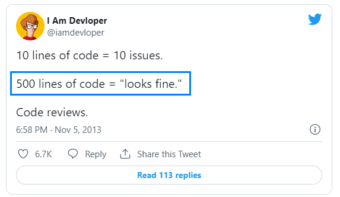

# Learning github branch strategy

> Git and other version control systems give software developers the power to track, manage, and organize their code.

> In particular, Git helps developers collaborate on code with teammates; combining powerful features like commits and branches with specific principles and strategies helps teams organize code and reduce the time needed to manage versioning.

> Of course, every developer and development team is different, with unique needs. Here is where a Git branching strategy comes in.

### Git Flow Branch Strategy

> The main idea behind the Git flow branching strategy is to isolate your work into different types of branches. There are five different branch types in total:

1. Main
1. Develop
1. Feature
1. Release
1. Hotfix

> The two primary branches in Git flow are main and develop. There are three types of supporting branches with different intended purposes: feature, release, and hotfix.

### The Challenges of Git Flow:

> Depending on the complexity of the product, the Git flow model could overcomplicate and slow the development process and release cycle.

> Because of the long development cycle, Git flow is historically not able to support Continuous Delivery or Continuous Integration.

### Git Flow with GitKraken

> The legendary cross-platform GitKraken Git GUI for Windows, Mac, & Linux helps simplify and visualize Git at a high-level, and supports the Git flow branching strategy.

> To initialize Git flow with GitKraken, open your repo and then navigate to Preferences → Gitflow to set your preferred branch naming conventions. GitKraken will then help you start and finish feature, release, and hotfix branches.

> GitKraken offers incredible GitHub integrations, GitLab integrations, Bitbucket integrations, and Azure DevOps integrations to make it easy to work with hosted repositories. 

### GitHub Flow Branch Strategy

> The GitHub flow branching strategy is a relatively simple workflow that allows smaller teams, or web applications/products that don’t require supporting multiple versions, to expedite their work. In GitHub flow, **the main branch contains your production-ready code**.

> The other branches, feature branches, should contain work on new features and bug fixes and will be merged back into the main branch when the work is finished and properly reviewed.

### GitHub Flow Consideration

> While working with the GitHub flow branching strategy, there are six principles you should adhere to to ensure you maintain good code.

1. Any code in the main branch should be deployable.
1. Create new descriptively-named branches off the main branch for new work, such as feature/add-new-payment-types.
1. Commit new work to your local branches and regularly push work to the remote.
1. To request feedback or help, or when you think your work is ready to merge into the main branch, open a pull request.
1. After your work or feature has been reviewed and approved, it can be merged into the main branch.
1. Once your work has been merged into the main branch, it should be deployed immediately.

### The Benefits & Challenges of GitHub Flow

> Of the three Git branch strategies we cover in this post, GitHub flow is the most simple. Because of the simplicity of the workflow, this Git branching strategy allows for Continuous Delivery and Continuous Integration. This Git branch strategy works great for small teams and web applications.

> This Git branch strategy is unable to support multiple versions of code in production at the same time.
The lack of dedicated development branches makes GitHub flow more susceptible to bugs in production.

## Pull request

> Writing clean code is just one of the many factors to care about when creating a pull request. Large pull requests cause a significant overhead during the code review and facilitate bugs introduction in the codebase.

> That's why you need to care about the pull request itself. It should be short, have a good title and description, and do just one thing.

> The first step to identify complex pull requests is to look out for big diffs. Several studies are showing that it's harder to find bugs when reviewing a lot of code.

> In addition, large pull requests will block other developers who may be depending on the code. But how can we determine the perfect pull request size?

> A study of **a Cisco Systems programming team revealed that a review of 200–400 LOC over 60 to 90 minutes should yield 70–90% defect discovery**.

> With this number in mind, a good pull request should not have more than 250 lines of code changed.

### Spliting pull request example

> Let’s say that you need to create a subscribe feature on your app. It's just a form that accepts an email address and saves it. Without knowing how your app works, I can already break it into eight pull requests.

1. Create a model to save emails
1. Create a route to receive requests
1. Create a controller
1. Create a service to save it in the database (business logic)
1. Create a policy to handle access control
1. Create a subscribe component (frontend)
1. Create a button to call the subscribe component
1. Add the subscribe button in the interface
1. As you can see, we broke this feature into many parts, and most of these tasks can be done simultaneously by different developers.

## Reference
- [What is the best Git branch strategy?](https://www.gitkraken.com/learn/git/best-practices/git-branch-strategy#:~:text=The%20Benefits%20of%20Git%20Flow,multiple%20versions%20of%20production%20code.)
- [The anatomy of a perfect pull request](https://hugooodias.medium.com/the-anatomy-of-a-perfect-pull-request-567382bb6067#:~:text=Pull%20request%20size,-It%20should%20be&text=The%20pull%20request%20must%20have%20a%20maximum%20of%20250%20lines%20of%20change.)