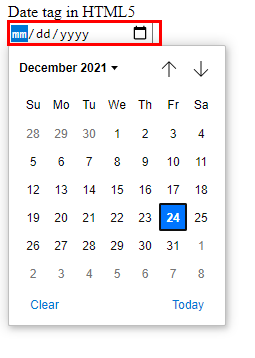
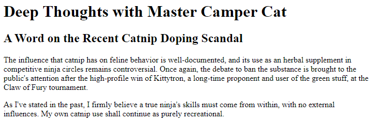
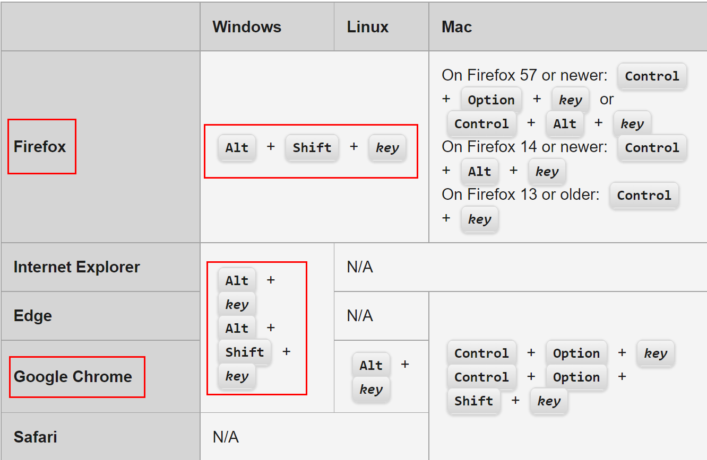
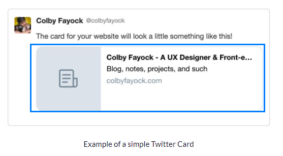
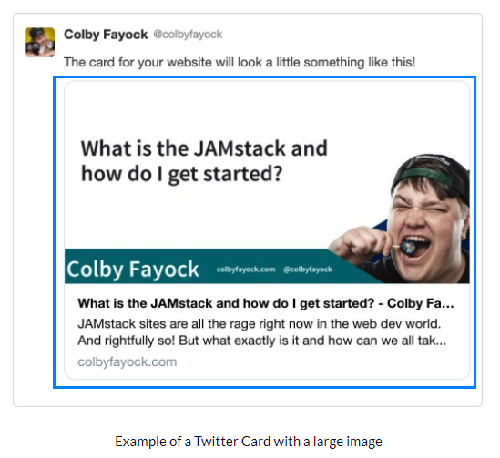

# Learning HTML5 Essentials
Took the below course summarized important topics. 

- [Free code camp : Basic HTML and HTML5](https://www.freecodecamp.org/learn/responsive-web-design/)
- [Free code camp : Applied accessibility](https://www.freecodecamp.org/learn/responsive-web-design/applied-accessibility/)

HTML is constantly updated, which latest one is HTML5. **Declare HTML version** like below so that brower understands that it is dealing with a specific HTML version.

```html
<!-- HTML5 uses !DOCTYPE html. -->
<!DOCTYPE html>
<html>
    <!-- your code here -->
</html>
```

## Basic HTML and HTML5
As a convention, all HTML tags are lowercases. Creating **a logical document with sematic tags** should be done before creative and nice web design. **Web standard** should be adhered for improving several types of platforms and devices. HTML matters in terms of **SEO** since **web browser** bots are collecting HTML documents when searching.

- Markup(HTML) 
- Style(CSS) 
- Script(Javascript) 

```html
<!-- Declare HTML version with !DOCTYPE -->
<!DOCTYPE html>
 <!-- html tag covers all the sub-tags. lang attribute is for web accessibility, which automatically pops translation interface in browser -->
<html lang="en">
    <!-- Head section is about the meta tags and title of the document. This is for browsers. -->
    <head>
        <!-- meta tag here -->
    </head>
</html>
```

All html tags are either block tag or in-line tag. 

- **block** tag : always take a **whole width** 
- **in-line** tag : always take a **self-width** width

HTML5 supports many types of tags.

```html
<p class="b-and-string">
        <b>b tag is only to highlight visual display</b> <br/><br/>
        <strong>strong tag let browser know that this text is important in this document</strong>
    </p>

    <p class="i-and-em">
        <i>i tag is only to highlight visual display </i> <br/><br/>
        <em>em tag let browser know that this text is important in this document</em>
    </p>

    <p class="ins-and-del">
        <ins>ins tag draws a line below text</ins> <br/> <br/>
        <del>del tag shows a cancel line in text</del>
    </p>

    <p class="q-and-blockquote">
        <q>q tag is for a short quote</q>
        <blockquote>blockquote is for a long quote. Lorem ipsum dolor sit amet consectetur adipisicing elit. Distinctio dolores incidunt qui! Qui in consequatur voluptate! Quos facere saepe hic quam pariatur voluptatem consequatur possimus molestiae ipsam? Recusandae, quas pariatur.</blockquote>
    </p>
```

## Headings
**Heading elements** let browser know your **website's structure**. This means that they **must have a semantic meaning** and relate to each other. Choosing headings based on only size is a big mistake. Use CSS for resizing your elements. 

- h1 : main heading 
- h2~h6 : sub heading

**Each page must always have one h1 tag**, which is your main content of that page. The main heading and sub headings are used by search engines.

```html
<main>
    <!-- Include h1 tag in main -->
    <h1>Jake's Cat Gallery</h1>
    <h2> Find out world most beautiful cats </h2>
    <h3> Cats in United State </h3>
    <h3> Cats in Canada </h3>

    <h2> Why cat sleeps so much <h2>
    <h3> Psychology </h3>
    <h3> Biology </h3>
</main>
```

## Descriptive tags
HTML5 adopts more SEO-friendly and developer-friendldy tags for website. Tags such as main, header, nav have a built-in landmark feature for assistive devices used by visually impaired user. For example, 

- main : the main content of your webpage. **should have only one**.
- header : grouping introductory and repeated contents
- footer
- nav : the main navigation links
- video
- article : grouping the independent contents. **Deciding whether or not element is an article is usually a judgement call**.
- section : grouping thematically related contents. Use div element if there is no relationship between groups of content. 

These tags are **similiar to div tag** but they are differentiated by the fact that it **can indicate information** it contains. 

<deails>
    <summary>What are screen readers?</summary>

Screen reader is a software program that helps blind/visually impaired web users to read web contents, using speech synthesizer or braille display.
</details>

## Img and alt
**All img elements in HTML5 must have an alt attribute**. The alt attribute is used in screen reader and is displayed even when the image is not loaded. 

## Internal link with a tag
Internal links in webpage allows us to move around in the webpage. Give **an id to HTML element** and then give **the id as href** in anchor tag.

```html
<!-- Create an internal link -->
<a href="#contact">Move to Contact</a>
<li id="contact">Contact</li>
```

Internal link is usually **used to move down to some point in a webpage**. One step further, you can can create a dead link with the hash symbol. 

## Form
Create a form to send data to server. 
```html
<form action="https://www.freecatphotoapp.com/submit-cat-photo">
    <input type="text" placeholder="enter your cat name" required/>
    <button type="submit">Submit</button>
</form>
```

### Fieldset
The **fieldset** tag surrounds a **group inputs**(checkboxes, radios ...) to provide a better accessibility. For example, 

```html
<fieldset>
    <legend>Difficulty Choice</legend>
        <label for="easy">Easy</label>
            <input type="radio" name="choice" id="easy" />
        <label for="intermediate">Intermediate</label>
            <input type="radio" name="choice" id="intermediate" />
        <label for="hard">Hard</label>
            <input type="three" name="choice" id="hard" />
</fieldset>
```

The **legend** tag describes the inputs, **as title**.

## Label and input
### Radio input
Radio button is a type of input. An input that is inside label will be automatically matched with the label. If the radio input's name is the same with other radio inputs, **the inputs will be grouped**. The for attribute in label tag is used by screen readers. 

```html
<form action="your_url">
    <label for="cat">Cat
        <input type="radio" id="cat" name="animal" value="cat" checked>Cat
    </label>
    <label for="dog">Dog
        <input type="radio" id="dog" name="animal" value="dog">Dog
    </label>
    <label for="hamster">Hamster
        <input type="radio" id="hamster" name="animal" value="Hamster">Hamster
    </label>
</form>

```
**value attribute is the one that is actually being sent to server**. If omitted, default value "on" is sent. Use the label text in lowercase as value. 

### Checkbox input
Related checkbox inputs should have the same name as related radio inputs had.

```html 
<label for="cool">Cool
    <input type="checkbox" id="cool" name="personality" value="cool" checked>
</label>
<label for="funny">funny
    <input type="checkbox" id="funnt" name="personality" value="funny">
</label>
<label for="loving">loving
    <input type="checkbox" id="loving" name="personality" value="loving">
</label>
```

## Division element
div is **a general purpose container** for other elements. 

## Applied accessibility
### Alt
Alt helps visually impaired users by providing **text alternative to image**. The users only get understanding of your webpage by **screen reader, which is audio-based**. Adding alt attribute is considered mandatory in HTML5.


## Audio
Multimedia content, meaning having image and audio, requires web developer to know how to **add transcript and caption** in markup. This is for visually or auditory impaired users. 

```html
<audio controls>
    <source src="reference/screen-reader-example.mp3" type="audio/mpeg" />
</audio>
```

## Figure and figcaption
Figure and figcaption improves data visualization accessiblity like chart.

```html
<section>
    <figure>
        
        <figcaption> Empty pie chart example</figcaption>
    <figure>
</section>
```

## Date and datetime 
HTML5 provides a date attribute, which shows a date format. It will be 'text' by default in old browser.

```html 
<label for="date">Date tag in HTML5</label>
<input type="date" id="date" name="date" />
```



Time can be represented with time tag and datetime attribute. For example, 

```html
<p> Today is <time datetime="2021-12-23">Thursday</time></p>
```

This value is read by assistive devices, helping to clarify a standardized time.

## CSS for accessibility
CSS can be used to improve accessibility by moving screen-reader-only elements far outside browser viewport. For example, 

```css
.screenReaderOnly {
    position : absolute;
    left : -10000px; 
    width : 1px;
    height : 1px; 
    top : auto;
    overflow : hidden;
}
```

### High contrast ratio
Recommended contrast ratio for your text is at least 4.5 to 1. Let's take a look at contrast range and its readability below. 

- 1 : 1 => no contrast, low readability
- 4.5 : 1 => recommended minimum contrast by WCAG(Web Content Accessibility Guidelines)
- 21 : 1 => full contrast, black and white.




## Color
**Color standalone should not be an important matter to deliver information** since it can't be seen by screen reader user. Also, background and foreground should have a high contrast color combination for colorblind user.

### Avoid colorblindness
Colorblindness ranges from a decreased awareness to a certain wavelength of light to can't see color at all. **The most common example of colorblindness** is to less be sensitive about **color green**. 

```css
/* avoid these */
.item1 { 
    color : green;
}
.item1-background {
    color: lightgreen;  
}
```

## Accesskey
accesskey in HTML5 allows us to add **a shortcut key** to an element. This can be useful for interactions with link, button, and form control. 

```html
<a href="https://www.google.com" accesskey="b">Move to Google</a>
```

Activating the attribute can be different based on OS and browser. Take a look at below image. Use Alt+key in Chrome/Window. 



## Tabindex
Use tabindex to add keyboard focus to an element. It has a three status as follows :

1. Negative value(-1, usually) : **focusable with Javascript but not reachable by keyboard**. Used in Javascript widget or window pop-up. 
2. 0 : Make element keyboard focusable. For example, make div tag focusable.
3. Positive value(1, 2, ... ) ~ : tab order defined by the number. 

Setting tabindex overrides default HTML focus order. Thus should be applied in care. **Note that some browsers already have tab orders defined** so that you need add your own buffer to make sure your tab order start right. For example, 

```html
<div class="buffer" taborder="1"></div>
<input type="email" taborder="1"/>
<input type="password" taborder="2"/>
```

## HTML and SEO
Required SEO data for a typical website is as follows :
- Title
- Description
- Keywords
- Alt 
- Heading
- **Canonical : html element that solve duplicated content issues**. For example, 

```html
<link rel="canonical" href="a_preferred_version_of_your_page_url" />
```

Setting a canonical tag is simliar to **redirecting many your urls**, which are not a canonical version of your web pages, to the canonical one.  

- **OpeanGraph** : a protocol created by Facebook, used to **standardize meta data** usage within a webpage. The four basic og tags(open graphic tags) are required for each page.

<ul>

- og:title => a title of your page
- og:type => a type of your website. Typically "website"
- og:image => a link to an image
- og:url => a current page url
</ul>

When og tags not applied, 

- 

when og tags applied, 

- 

OpenGraph tags should be head section in HTML. For example, 

```HTML
<head>
    <meta property="og:title" content="Learning HTML5 essentials" />
    <meta property="og:description" content="HTML5 is a markup language that structures a document." />
    <meta property="og:type" content="website" />
    <meta property="og:image" content="reference/dummy-image.jpg" />
    <meta property="og:url" content="https://github.com/developerasun/mySideProject/tree/master/myHTML" />
</head>
```

## Learing by doing
Summarized previous HTML codes in a blockquote format. 

> Web browser : download 2.jpg file from web server and display it to user. Server : store and save 2.jpg file. Network tap in Chrome developer tools : checking if the image download fails or finishes. 
> File upload using form tag : enctype="multipart/form-data" (consider it a convention). 

## Reference
- [Free code camp : Basic HTML and HTML5](https://www.freecodecamp.org/learn/responsive-web-design/#basic-html-and-html5)
- [Free code camp : Applied accessibility](https://www.freecodecamp.org/learn/responsive-web-design/#applied-visual-design)
- [What are screen readers?](https://equalizedigital.com/what-are-screen-readers/)
- [What is Open Graph and how can I use it for my website?](https://www.freecodecamp.org/news/what-is-open-graph-and-how-can-i-use-it-for-my-website/)