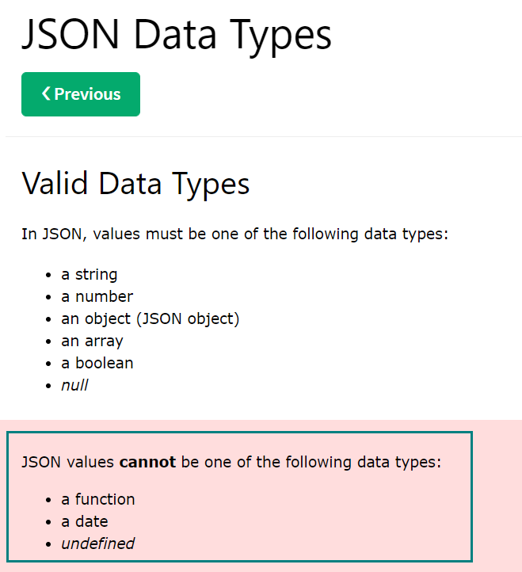
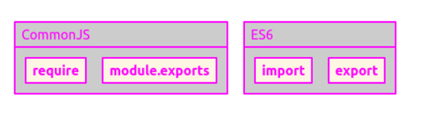
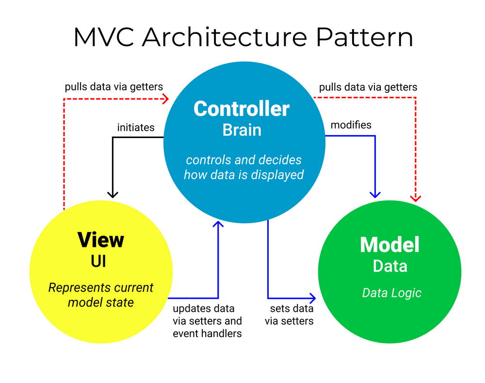

# Learning Backend Development With Javascript
## Node JS basics
- [Understanding how Node.js is invented]()
- [Node Package Manager]()
- [Node Package Manager]()
- [Node Package Manager]()
- [Node Package Manager]()

## Express JS basics
- [Node Package Manager]()
- [Node Package Manager]()
- [Node Package Manager]()
- [Node Package Manager]()
- [Node Package Manager]()

## Node JS basics
### Understanding how Node.js is invented
Javascript had been used client side mostly but nowadays it can be used server side language as well. But why was it not possible then but now is good to go? 


V8 engine compiles Javascript into machine code, which is the only language computer understands. The engine was only inside browser, making the Javascript available only in browser. 


<details>
    <summary>What is V8? (tap to unfold)</summary>
    V8 is Google’s open source high-performance JavaScript and WebAssembly engine, written in C++. It is used in Chrome and in Node.js, among others. It implements ECMAScript and WebAssembly ... V8 can run standalone, or can be embedded into any C++ application.

- [See here for more](https://v8.dev/)

</details>

<p>
Node js solves this problem by wrapping the engine, which was written in C++, making Javascript available in server with more features. You can tackle both front end and backend with only one language. Node js has a big community and third party packages as well. 
</p>

- Read and write files
- Connect to a database 
- Act as a server

### Client and Server 
At the end of the day, what we are trying to achieve with Node.js is to create a website run by Node.js. Server, Node js in this case, sends whatever browser requests : JSON, html pages ... 

1. When a user requests something in webpage, a browser tries to look up a host having an associated IP address with the webpage. 
2. And then, the browser connects with a server/host using the IP address.
3. Server responds with the resources requested(html pages in picture)


### Interaction
|Front End|Interaction|Backend|
|:-------:|:-------:|:-------:|
|event, DOM, template, routing|HTTP, Ajax, JSON, RESTful|Web server, template, routing, database, APIs|

There a few tech combinations for Node JS, MERN stack for example.
- MongoDB : database
- Express : server framework
- React : view library
- Node JS : server

### Localhost and port number
Localhost is <bold>a domain name</bold> for a IP address : 127.0.0.1, meaning one's own computer. If Localhost used, browser points to directly back to your own computer as a host.

- Request coming out of my computer => Listening the request in my own computer(localhost)

Then what about port number? Port is a way for information/program can be plugged into your computer. Server also needs the port to communicate with others. Port 3000 is pre-set for web development.

- localhost:3000 ===> 1) one's own computer 2) route to communicate

### Createing a server
In Node.js, we create a server manually. And the server lives in a backend of website, listening to browser requests and sending resources to it.

#### Basic routing without framework
When user makes a request, Node.js as a backend will send a response that mathces the request using router. 

```javascript
const server = http.createServer((req, res)=>{

    console.log(req.url) // check request endpoint 
    console.log(req.method) // check request http method

    // addressing basic routes
    let path = './views/'
    switch (req.url) { 
        case '/' : // endpoint
            path += 'index.html' // corresponding page
            res.StatusCode = 200
            break; 
        case '/about' : 
            path += 'about.html'
            res.StatusCode = 200
            break;
        default : 
            path += 'page404.html' // non-existing endpoints
            res.StatusCode = 404  // bad request 
            break; 
    }
    
    // set HTTP message header 
    res.setHeader('Content-Type', 'text/html')
    // reading file is asynchronous
    fs.readFile(path, (err, data)=> {
        if(err) {
            res.end()
            console.log(err)
        }
        res.end(data)
    })
})

// open up the server
server.listen(8000, ()=>console.log("app listening at port 8000"))

```

Once your server is up, you can check what request with http method has been made like below


Managing routes like above can be messy when there are <bold>too many routes to handle</bold>. Use express, which is a third party app, to tackle this problem. <bold>Understanding what is going on in behind scene is important </bold> before you start using and learning framework like express. 

### Status codes
Status codes describes the type of responses sent to the browser. 

- range 200 : success code 
- range 400 : client/user fail
- range 500 : server fail 

### Stream and Buffer
<bold>Reading, deleteing, creating file is usually asynchronously done</bold> since it might take long time to perform. To go furthermore with addressing large data/file, understanding streams and buffers is essential. 

- Streams : starting using data <bold>before</bold> fully read
- Buffer : delivering a small chunk of data package


Waiting till a source of data gets fully filled is way slower than fetching a split data and starting using it. 

```javascript
// way 1 : create streams and buffer
const fs = require('fs')
const readStream = fs.createReadStream('./myPath/myFile.txt', { encoding : 'utf-8' })
const writeStream = fs.createWriteStream('./myPath/myNewFile.txt')

readStream.on('data', (smallData)=>{
    writeStream.write(smallData)
} )

// way 2 : pipe : passing data from readable stream to writable stream right away
readStream.pipe(writeStream) 
```

### Node Package Manager
One of the advantages to use npm is dependency control. Through package.json file, npm automatically install everything you need. Since node modules are usually massive, installing dependency through package.json is recommended.

- npm install => project dependency installed based on package.json
- sharing node_modules => not recommended

```
npm install A -g : install A package globally, works in PC anywhere
npm install A --save : install A package and save its info in package.json for future reuse.
```

* update : as of npm 5.0.0, packages installed are added to package.json without the flag --save.

### Package.json
Package.json file is placed in a center of any Node JS project, storing the project information in a single JSON object. The information displayed is as follows

- dependency
- author
- version
- license, and many more.

<details>
    <summary>Note</summary>
    all field names and values in JSON <bold>should be in double quotes("")</bold> and separated by comma(,). Number and boolean are okay to be not in double quotes. 

```json
{
    "name":"Jake", 
    "age" : "27", 
    "handsome" :true
}
```



</details>

Beside package.json file, there is also a package-lock.json. This file is to track every package version so that anyone can reproduce the project in future.

### .env file
.env is a hidden file that you can store data that needs to be hidden such as API keys and database URI. Only you can access to this file with below syntax.

```javascript
process.env.variableName
```

processs.env is a global Node object that defines environment variables. 

- No white space in .env file
- Variable name is in uppercase(convention)
- Put each variable on a seperate line
- .env is a shell file, <bold>requiring no quotes</bold> in variables and values.

Install dotenv package through npm to use .env file. The dotenv package <bold>loads your .env files to Node process.env global object</bold>.

```javascript
// npm install dotenv --save
require('dotenv').config() // dotenv.config methods loads your .env to global Node object.

```

### Semantic Vesioning
Package.json file follows Semantic Versioning, which is a industry standard for software versioning. Libraries and frameworks published through npm should follow below standard.

```Javascript
"package":"MAJOR.MINOR.PATCH"
```

- MAJOR : new features added, incompatible with previous features
- MINOR : new features added, compatible with previous features. Use <bold>caret character</bold> to get latest MINOR & PATCH => e.g. "^1.3.8"
- PATCH : bug fixes. Use <bold>tilde character</bold> to get latest PATCH => e.g. "~1.3.8"

### Require and Import
- require : synchronous, selective
- import : asynchronous, nonselective



## Learning Express basics
Handling simple and few routes with Node.js can be done without Express. However, as <bold>application gets complicated</bold> framework such as Express becomes handy to handle server side logics since Express automatically does jobs like <bold>setting http header</bold> and such. 

### View(Template) engine
Instead of static assets, sometimes we want to add <bold>dynamic contents to HTML</bold> such as saved data from database. View/template engine is a great way to achieve this. 

Types of view engines are : 
- EJS
- Express HandleBars
- Pug.js

### EJS
EJS helps us to render dynamic data in HTML. EJS templates are addressed on server by EJS view engine.

<span>EJS + HTML ===(EJS view engine)====> Browser</span> <br/>


Above process is called server side rendering. Install EJS with below command 

```javascript
npm install ejs 
```

and then use it as a middleware in Express like below. You can give the second parameter(object) and call it in ejs file to render HTML dynamically. 

```javascript
app.set('view engine', 'ejs')
app.get('/', (req, res)=>{
    res.render('index', { title: 'sweet' }) 
})
```

#### Default Directory in Express & EJS
'views' is a default directory where Express and EJS engine will look for resources. If you want to rename it, follow below instruction

```javascript
app.set('views', 'myNewViews')
```

### Understanding middleware
Middleware is a function that takes route handlers and adds information. To simply put, middle is just codes between request and response. Middleware function takes three arguments : 1) request object 2) response object 3) next function, addressing the tasks like below. 

- add information to request/response object
- end cycle by sending a response or start next function in stack, calling the next. 


Express evaluates functions in the order they appear in the code. Middleware should also be placed before all the routes depending on it.

```javascript
function (req, res, next) { 
    console.log("I am a middle ware")
    next()
}
```

If the next function is not properly called in middleware, your browser will get stucked.

#### Express middleware for static asset
Serving static webpages and assets could be simpler with express since it provides a middleware to manage static assets. Without this middleware, all the static assets would require corresponding routes. 

```javascript
// syntax : express.static(root + endpoint)
// Normal usage
app.use(express.static(__dirname + "/public")) // directory 'public' is a convention where static assets are kept. 

// Assets at public dir
app.use('/public', express.static(__dirname + "/public"))
```

Basically, <bold>server automatically protects assets/files from browser</bikd>. You have to specify which assets the browser can access and acquire, meaning public assets.

#### Middleware chaining
Middleware can be chained inside route definition. Chaining middleware is useful to <bold>divide server operaions</bold> into more smaller units, increasing code reusuability.

For example, 
```javascript
app.get('/user', function(req, res, next) {
    // do something here
    console.log(req.user)
    next()
}, function(req, res) {
    res.send(req.user)
})

```

### Basic server development with Express
### Express router
As routings gets more added, your codes might get become fat and messier. Use Express router, which is a built-in, to make the routes tight and handy. 

- route in Express : app.method(path, handler)
- app : Express object(conventionally)
- path : relatvie path on the server
- handler : function(req, res). A function called when the route is matched

Without router, 

```javascript
app.get('/', function(req, res){
    res.sendFile(__dirname + '/views/index.html'); 
});
app.get('/json', function(req, res) {
    res.json( { "message" : "Hello json" } ) // This method closes the request-response loop, returning the data. 
    // then sets the appropriate headers to tell your browser that you are serving JSON, and sends the data back.
    // Note that despite the method being named json(), the result is not JSON but is instead the result of taking JSON as input and parsing it to produce a JavaScript object.
})
```

With router, 

```javascript 
// In your router.js file, 
const express = require('express')
const myRouter = express.Router()

myRouter.get('/', (req, res)=>{
    // do something here
})

// Once done with routing, export your router. 
module.exports = myRouter

// In your main server javascript file, like app.js, import the module and use it as a middleware.
app.use("your_basic_route_for_router", myRouter)
```

<details>
    <summary>What is __dirname?(tab to unfold)</summary>
__dirname is your <bold>project root path</bold>, provided by Node.js. It is a string that can be concatenated with other directory resources. 
</details>

### Getting inputs from user in Express
There are several ways to get inputs from user in Express. 

1. Router parameter => request.params
2. Query paramter => request.query

#### Route parameter
Getting route parameter is one way to <bold>get inputs from user</bold>. Route paramters are named segments of the URL, differentiated by slash. Each segment holds an actual value of the URL. For example, 

```md
> route_path: '/user/:userId/book/:bookId'
actual_request_URL: '/user/546/book/6754'
req.params: {userId: '546', bookId: '6754'}
```

Approach route parameter for user input with <bold>request.params</bold>
```javascript
app.get('/:userId/location', function(req, res){
    const { userId } = req.params
    res.json( { location : userId } )
})
```

#### Query parameter
Encoding data with query string is also a way to get inputs from user. Query string is differentiated with question mark in the format of field and value.

``` md
route_path: '/library'
actual_request_URL: '/library?userId=546&bookId=6754'
query string : '?userId=546&bookId=6754'
req.query: {userId: '546', bookId: '6754'}
```

Express breaks down the data from the query string and fills with req.query.
For example,  

```javascript
app.get('/library', function(req, res){
    const userId = req.query.userId // find the 'userId' in HTTP GET request body 
    const bookId = req.query.bookId // find the 'bookId' in HTTP GET request body 

    res.json( { library : `${userId} ${bookId}` } )
})
```

### Understanding Body Parser for post request
HTTP Post method is a default method used to send client data with HTML form. It is conventioinally used <bold>to create a new record in database</bold>. 

- Front End ===(send a encoded data with HTTP POST method) ==>
- ====> Backend ===(decoding the data in request body with body parser)===>
- ========> Database(saving the data)

These types of request, sending information to the database, the information should not be presented in URL since it can contain user password or such things. Instead, the data is hidden in HTTP request body, which is a called payload, also.

<details>
    <summary>What is a payload?</summary>

Quoted from [Wikipedia - payload](https://en.wikipedia.org/wiki/Payload_(computing))

```md
> In computing and telecommunications, the <bold>payload is the part of transmitted data</bold> that is the actual intended message. Headers and metadata are sent only to enable payload delivery. In the context of a computer virus or worm, the payload is the portion of the malware which performs malicious action. The term is borrowed from transportation, where payload refers to the part of the load that pays for transportation.
```
</details>

Http <bold>request body by default is encoded with urlencoded</bold>, which looks like the above query string. You can also implement this with Ajax in JSON format.  <br/>


<bold>To parse the data from HTTP request body, install body parser</bold> with npm package. It allows to use middleware to decode the data in many formats. 

```javascript
const bodyParser = require('body-parser')

// case 1 : parse urlencoded data sent by POST request
app.use(bodyParser.urlencoded({ extended : false })) // configuration option. If false, use querystring library by default, when true, use qs library for parsing.

app.post('/name', function(req, res){
    const firstName = req.body.first // find the 'first' in HTTP POST request body 
    const lastName = req.body.last // find the 'last' in HTTP POST request body 
    res.json( {name : `${firstName} ${lastName}`} )
})

// case 2 : parse JSON data sent by POST request
app.use(bodyParser.json())

```

### Request Types
Types of request are as follows : 

- GET : get resources from ( A = database/web page )
- POST : create a new data to A
- DELETE : delete the data in A
- PUT : update the data in A

You can use the same route for different requests. Server deals with it. For example, 

- localhost:8080/dog => GET request
- localhost:8080/dog => POST request
- localhost:8080/dog/:id => GET request
- localhost:8080/dog/:id => DELETE request
- localhost:8080/dog/:id => PUT request

### Workflow
1. User fills out a form at webpage
2. User submits the form
3. Front end sends a POST request to server
4. Backend handles the request, creating an instance corresponding to the form and saving the instance to database.

First of all, let's see HTML form. 
```html
<!-- the form sends a POST request to the action(server route)  -->
<form action="/blogs" method="POST">
    <!-- add name attribute to let server know what form element it is -->
    <input type="text" name="title" />
</form>
```

Note that the input tag's name will be used in request body object property in backend. Let's take a look at server.
```javascript
// saving the request in database
app.post('/blogs', (req, res)=> {
    const newBlog = new Blog(req.body)
    newBlog.save()
           .then((result)=> {
               res.redirect('/blogs')})
           .catch((err)=> console.log(err))
})

// delivering the data to front end
app.get('/blogs', (req, res)=>{
    Blog.find()
        .sort(-1)
        .then((result)=> {
            // do something with the result to display the data
            // varies depending front end 
        })
})
```

### MVC pattern
MVC model stands for model, view, and controller.

- Model : database
- View : front end
- Controller : connecting the Model and View. server. 

Below you can check how a project directory is constructured by MVC pattern.



Let's spread those source folders to see more details.


## Reference
- [NetNinja Node,js crash course](https://www.youtube.com/watch?v=zb3Qk8SG5Ms&list=PL4cUxeGkcC9jsz4LDYc6kv3ymONOKxwBU&index=1&t=1s)
- [Free code campe - ENG](https://www.freecodecamp.org/learn/back-end-development-and-apis/)
- [Inflearn - KOR](https://www.inflearn.com/course/node-js-%EC%9B%B9%EA%B0%9C%EB%B0%9C#)