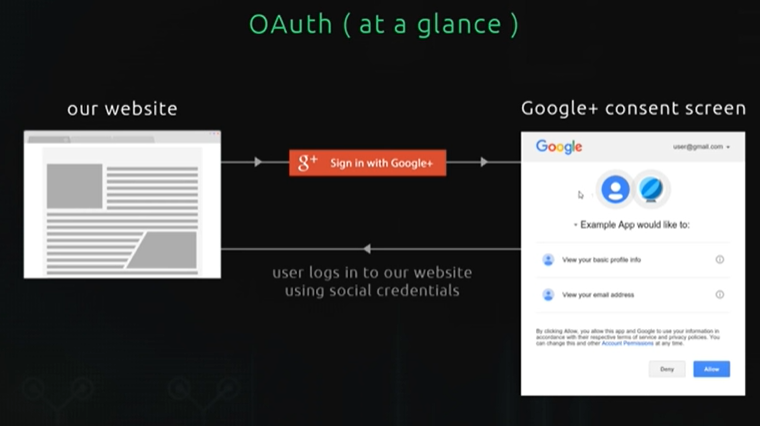

# Learning Oauth essentials
Took below course and summarized essentials. 

- [NetNinja Oauth login tutorial](https://www.youtube.com/watch?v=sakQbeRjgwg&list=PL4cUxeGkcC9jdm7QX143aMLAqyM-jTZ2x&index=1)

## Understanding open authorization

Oauth is to exploit third party services for user login. From user side, the third parties are trusted one such as Facebook and Google so less security issues. From developer side, implementing login can be complex but delegate all the burdens to the thrid parties. 

## Understanding Passport js
Let's take a look what passport js is. Below is from Passport JS offical homepage. 

Passport is <bold>authentication middleware</bold> for Node.js. Extremely flexible and modular, Passport can be unobtrusively dropped in to any Express-based web application. A comprehensive set of strategies support authentication using a username and password, Facebook, Twitter, and more.

So, basically Passport is just a middleware. 

## Serialization and Deserialization

## Reference
- [Understanding and Implementing OAuth2 In Node.js](https://www.honeybadger.io/blog/oauth-nodejs-javascript/)
- [Alternative to Passport](https://stackshare.io/passport/alternatives)