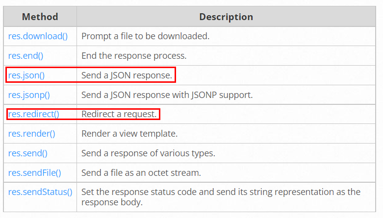

# Express
> Express is a minimal and flexible Node.js **web application framework** that provides a robust set of features for web and mobile applications.

> The **Express** philosophy is to provide small, robust tooling for HTTP servers, making it a great solution for **single page applications**, websites, hybrids, or public HTTP APIs.

> Express does not force you to use any specific ORM or template engine. With support for **over 14 template engines** via Consolidate.js, you can quickly craft your perfect framework.

Based on NPM Express docs, Express package features are, 

> Robust routing
> Focus on high performance
> Super-high test coverage
> HTTP helpers (redirection, caching, etc)
> View system supporting 14+ template engines
> Content negotiation
> Executable for generating applications quickly

<details>
<summary>Caution as to req.body</summary>

> As **req.body’s shape is based on user-controlled input**, all properties and values in this object are untrusted and **should be validated before trusting**. For example, req.body.foo.toString() may fail in multiple ways, for example foo may not be there or may not be a string, and toString may not be a function and instead a string or other user-input.

</details>

#### Routing

> In fact, the routing methods can have more than one callback function as arguments. With multiple callback functions, it is **important to provide next as an argument** to the callback function **and then call next()** within the body of the function to hand off control to the next callback.

> There is a special routing method, **app.all()**, used to load middleware functions at a path for **all HTTP request methods**. For example, the following handler is executed for requests to the route “/secret” whether using GET, POST, PUT, DELETE, or any other HTTP request method supported in the http module.

```js
app.all('/secret', function (req, res, next) {
  console.log('Accessing the secret section ...')
  next() // pass control to the next handler
})
```

> This route path will match butterfly and dragonfly, but not butterflyman, dragonflyman, and so on.

```js
app.get(/.*fly$/, function (req, res) {
  res.send('/.*fly$/')
})
```

> The methods on the response object (res) in the following table can send a response to the client, and **terminate the request-response cycle**. If none of these methods are called from a route handler, the client request will be left hanging.



> You can create **chainable route handlers** for a route path by using **app.route()**. Because the path is specified at a single location, creating modular routes is helpful, as is reducing redundancy and typos. 

```js
app.route('/book')
  .get(function (req, res) {
    res.send('Get a random book')
  })
  .post(function (req, res) {
    res.send('Add a book')
  })
  .put(function (req, res) {
    res.send('Update the book')
  })
```

#### Middleware
> To load the middleware function, call app.use(), specifying the middleware function.

> Middleware functions are functions that have **access to the request object (req), the response object (res), and the next function** in the application’s request-response cycle. The next function is a function in the Express router which, when invoked, executes the middleware succeeding the current middleware.

> The next() function is not a part of the Node.js or Express API, but is the third argument that is passed to the middleware function. The next() function could be named anything, but by convention it is always named “next”. To avoid confusion, always use this convention.

> The **order of middleware loading is important**: middleware functions that are loaded first are also executed first. If myLogger is loaded after the route to the root path, the request never reaches it and the app doesn’t print “LOGGED”, **because the route handler of the root path terminates the request-response cycle**.

> Use the cookie-parser middleware to parse incoming cookies off the req object 

>  If you pass anything to the next() function (except the string 'route' or 'router'), Express **regards the current request as being an error** and will skip any remaining non-error handling routing and middleware functions.

> If you need your middleware to be configurable, export a function which accepts an options object or other parameters, which, then returns the middleware implementation based on the input parameters.

```js
module.exports = function (options) {
  return function (req, res, next) {
    // Implement the middleware function based on the options object
    next()
  }
}
```

## Reference
- [Express.js](https://expressjs.com/)