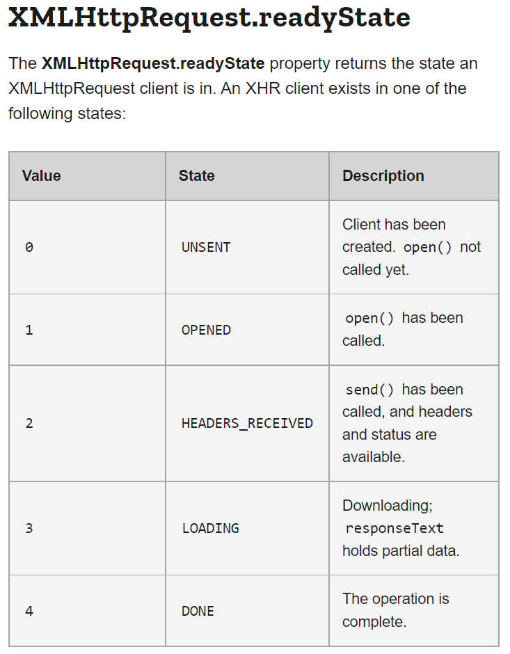
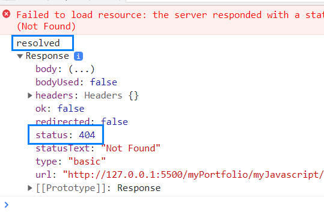

# Understanding asynchronous Javascript
Asynchronous Javascript is very important topic since it controls a work flow that takes long time to finish. For example, 

- saving model as an instance in database
- fetching external data from APIs in server

This markdown docs summarizes below to lectures about asynchronous Javascript and JSON APIs.

- [NetNinja : Asynchronous Javascript](https://www.youtube.com/watch?v=ZcQyJ-gxke0&list=PL4cUxeGkcC9jx2TTZk3IGWKSbtugYdrlu&index=1&t=63s)
- [Free code camp : JSON APIs and Ajax](https://www.freecodecamp.org/learn/data-visualization/#json-apis-and-ajax)

# Asynchronous Javascript
Javascript is a synchronous language/single threaded by default, meaning executing one statement at a time. Once async applied, the async function will be taken out of the single thread and will be addressed in somewhere else in browser while other functions are still being executed in the single thread. 

<br/>

## Non-blocking
The async function is non-blocking, meaning it does not interfere/intercept other functions getting executed. 

```javascript
console.log(1)
console.log(2)
setTimeout(()=>{ console.log(55) }, 2000)
console.log(3)
console.log(4)

// result : 1, 2, 3, 4, 55 (o)
// result : 1, 2, 55, 3, 4 (x)
```

## XMLHttpRequest And Fetch 
Asynchronous Javascript can be achieved with two ways : 1) XMLHttpRequest 2) Fetch. The former requires a bit more complex writing and the latter is a built-in in all browser. XMLHttpRequest is a great to be familiar with what is going on in behind scene while Fetch is handy to write actual code since it has a simpler syntax. 

# HTTP Request
Http request is about getting data from another server, which is made towards API endpoints(url). Use below website to test your code. 
 
- [JSON placeholder - Fake API for testing](https://jsonplaceholder.typicode.com/)

# API, AJAX, and JSON
<p>
API stands for application programming interface. APIs are tools to send and receive data through computers, helping programs communicating with other ones. Usually, API is used to get data from external source. 
</p>

<p>
Ajax is asynchronous javascript and XML, making asynchronous request to server to move data. The moved data is often JSON format. Most modern web browsers transfer data in JSON format.
</p>

<p>
The data, meaning JSON, are sent as bytes and your application takes it as a string. 
</p>

## Data Transmission : Web API to Application
When server receives data, it receives JSON in string. In order for us to address this JSON easily, it needs to be converted to Javascript object with JSON.parse method. 


- Web API ===(send JSON in bytes)===> Application(server receives JSON in string) ===(parse JSON)===> Javascript object constructed and can be used. 
- Front end ====(POST request)====> Server(receives JSON in string)

## Request External Data with Ajax

- XMLHttpRequest.open(http method, url, async flg) : initialize a request with url
- XMLHttpRequest.send : send the request
- XMLHttpRequest.onload : once response received, convert it to 1) Javascript object 2) string for display


```javascript
document.addEventListener('DOMContentLoaded', function(){
document.getElementById('getMessage').onclick = function(){
    // Add your code below this line

    // Use XMLHttpRequest (XHR) objects to interact with servers. 
    // You can retrieve data from a URL without having to do a full page
    // refresh. This enables a Web page to update just part of 
    // a page without disrupting what the user is doing.
    // XMLHttpRequest.open(http method, url, async flag)
    const req = new XMLHttpRequest()
    req.open('GET', '/json/cats.json', true)
    req.send()
    req.onload = function() {
        const json = JSON.parse(req.responseText) // JSON.parse : makes a javascript object
        document.getElementsByClassName("message")[0].innerHTML = JSON.stringify(json) // JSON.stringify : makes a string from javascript object. 
    }

    // Add your code above this line
};
});

```

## Send Data To External Source With Ajax

- XMLHttpRequest.open(http method, url, async flag)
- XMLHttpRequest.setRequestHeader(name, value)
- XMLHttpRequest.onreadystatechange : checks if 1) readyState === 4 2) status === 201
- XMLHttpRequest.send(body)

```javascript
const userName = document.getElementById('name').value;
const xhr = new XMLHttpRequest()
xhr.open('POST', url, true)

// XMLHttpRequest.setRequestHeader should be called after open before send.
xhr.setRequestHeader('Content-Type', 'application/json; charset=UTF-8') 

// handles a change in the state of the request
xhr.onreadystatechange = function() {

    // XMLHttpRequest.readyState : Returns client's state.
    // A readyState of 4 means the operation is complete, and a status of 201 means it was a successful request
    if(xhr.readyState === 4 && xhr.status === 201) {
        const serverResponse = JSON.parse(xhr.response)
        document.getElementsByClassName('message')[0].textContent = serverResponse.userName + serverResponse.suffix
    }
}
const body = JSON.stringify( { userName : userName, suffix: ' loves cats!' } )
xhr.send(body) // send the Http message body in string format
```

<details>
    <summary>XMLHttpRequest.readyState in browser</summary>

- 
- 

</details>

### Checking XHR.readyState And XHR.status
Even when an endpoint url is incorrect, XHR.readyState gets to 4, which means that its operation is done. Check XHR.status as well to get appropriate response from API. 


## Request External Data With Fetch
Fetch performs the same action as the above XMLHttpRequest with easier syntax. Fetch returns a Promise and built in all browsers. 

- Fetch, first then, second then
- Fetch : returns a resolved Promise
- First then : returns a Promise
- Second then : taking Javascript object as argument

```javascript
fetch(url).then(
    response => response.json() 
).then(
    data => { // this argument is javascript object
        something.innerHTML = JSON.stringify(data) // display the data
     }
)
```

# Fetch 
Fetch is a built-in function in Javascript, meaning you can call it right away.

One thing to remember, Fetch returns a resolved Promise, which only gets rejetced in the case of network failure.




## Async and Await
async and await is a relatively modern feature used to make Promise chains in a cleaner way. Whenver asynchronous function gets called, it always returns a Promise regardless of what's inside. If a function is asynchronous, which is non-blocking, the whole operation is non-blocking even when inside codes are blocking(waiting for Promise get asserted)

- async : all the needed asynchronous codes
- await : Stops Javascript from assigning value to the variable until the Promise is resolved. Chains Promises.

```javascript

const getTodos = async () => {
    // async and await is useful to chain Promises without callback hell 
    const response = await fetch('routes/test2.json')

    if (response.status !== 200) {
        // Use throw new Error to create your own error object
        throw new Error('cannot fetch the data') // c
    }

    const data = await response.json()
    console.log(response)
    console.log(data[0].text)
    return data // remember that asynchronous function always returns a Promise
    // which means async function needs a then method
}

console.log(1)
console.log(2)
getTodos()
        .then(data=>{console.log(data)})
        .catch(err=>{console.log(err.message)}) // non-blocking
console.log(3)
console.log(4)

```