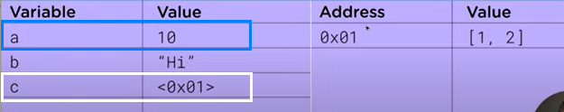

# Understanding call by value and call by reference in Javascript
Call by value and call by reference is the one of the most important topics in programming since they can cause unintended bugs in code.  

Primitive values in Javascript : call by value
For example,
1. string
2. number 
3. bigint 
4. boolean
5. undefined
6. symbol : newly added in ECMA 2015(ES6). Used to create an unqiue property key
7. null

All primitives are immutable.

## Reference
- [Reference vs Value in Javascript](https://youtu.be/-hBJz2PPIVE)