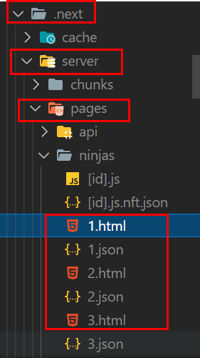

# Learning  Next.js essentials
Took below course and summarized essentials. 

- [NetNinja Next.js for beginners](https://youtube.com/playlist?list=PL4cUxeGkcC9g9gP2onazU5-2M-AzA8eBw)

- [NetNinja Next.js and Netlify](https://youtube.com/playlist?list=PL4cUxeGkcC9ig-veuRaLI4QB0Ws8xMzjv)

## What is Next.js? 
Next.js is a React framework.

> Next.js gives you the best developer experience with all the features you need for production: hybrid static & server rendering, TypeScript support, smart bundling, route pre-fetching, and more. No config needed.

> Next.js has all the tools you need to make the Web. Faster.

It is developed to solve problems like, 

> Code has to be **bundled** using a bundler like webpack and transformed using a compiler like Babel.
> You need to do **production optimizations** such as code splitting.
> You might want to statically pre-render some pages for **performance and SEO**. You might also want to use server-side rendering or client-side rendering.
> You might have to write some server-side code to connect your React app to your data store.

Create Next.js app with below command

```shell
$npx create-next-app (app-name) 
```

And then run below command to execute next app. 

```shell
$npm run dev
```

## Project directories 
1. Next js automatically creates routes based on React components in pages directory.

- pages : React components
- public 
- styles

2. Next js automatically loads a corresponding js bundle for each page(React component), meaning faster performance.

## Adding styles
Next js provides a default global css file which decides whole application's style. If you want to apply an unique style to each component, create a class/id selector in filename.module.css. 

```css : Home.module.css
.myComponent { 
    background-color : black;
    color : white;
}
```

And then use the selector in the component you want to apply style. 

```js
import styles from 'some/path/here/Home.module.css'

const MyComponent = () => {
    return ( 
        <div className={styles.myComponent}>
        Hello world
        </div>
    )
}
```

## Adding page not found
Create a file named 404.js. The name is pre-defined, meaning you have to follow it. 

## Images in Next.js application
Static images are served in public directory, which is similar to Express.js application. Use Image component from Next js to place the static image file in component. 

```js
import Image from 'next/image'

<Image src="/your-image.jpg" width="100" height="100" />
```

## Metadata with Head component
Use Head component from Next to inject metadata to the app. 

```js
<Head>
    <title>Ninja Blog</title>
    <meta name='keywords' content='cool next js blog'/>
</Head>
```

## Dynamic routes
Create a file name like below for dynamic routes in Next.js. Square bracket in file name tells Next.js that it is route parameter. 

```
[filename].js
```

## Build and deploy
Run below command and check result .next directory. Note that static html files are generated based on the fetched data.

```shell
$npm run build
```



Go visit Vercel and sign up to deploy your Next app. Connect your Git repository and deploy the project from the Git. 

## Reference
- [Next.js](https://nextjs.org/)