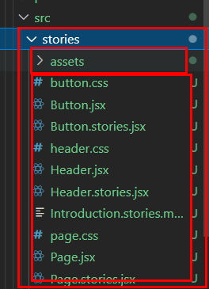
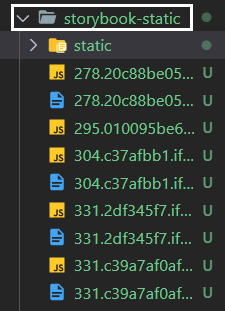

# Learning Storybook Essentials
Took below course and summarized essentials. 

-[Code evolution React Storybook Tutorial](https://www.youtube.com/watch?v=BySFuXgG-ow&list=PLC3y8-rFHvwhC-j3x3t9la8-GQJGViDQk&index=1&t=2s)

## Storybook
Playground for UI components, meaning the components will be showcased in independent environment. There are several merits to use Storybook. 

- displaying components and corresponding props all at once 
- dynamically changing props
- analyzing accessibility score

Start storybook with below command. It will sense your project type and automatically configurate it.

```shell
$npx sb init
```

Once installed, you can check it in package.json as developer dependency(only needed during development)

```json
  "devDependencies": {
    "@storybook/addon-actions": "^6.4.14",
    "@storybook/addon-essentials": "^6.4.14",
    "@storybook/addon-links": "^6.4.14",
    "@storybook/builder-webpack5": "^6.4.14",
    "@storybook/manager-webpack5": "^6.4.14",
    "@storybook/node-logger": "^6.4.14",
    "@storybook/preset-create-react-app": "^4.0.0",
    "@storybook/react": "^6.4.14",
    "webpack": "^5.67.0"
  }
```



Check out premade components in stories directory and then run below command to execute Storybook. 

```shell
$yarn storybook
```

Then, Storybook will check main.js file and start to match storybook files.

```js
module.exports = {
  "stories": [
    "../src/**/*.stories.mdx",
    "../src/**/*.stories.@(js|jsx|ts|tsx)"
  ],
  "addons": [
    "@storybook/addon-links",
    "@storybook/addon-essentials",
    "@storybook/preset-create-react-app"
  ],
  "framework": "@storybook/react",
  "core": {
    "builder": "webpack5"
  }
}
```

The merits of Storybook is that you can develop UI components independently from business logic, app requirement. **Creating components can be done and finished even before project starts**. 


### Writing Stories
Provide metadata to Storybook if you are using React.

```js
export default {
    // label your storybook file
    title : 'Button',
    component : Button, 
}
```

You can label each story to group them up. 
```js
export default {
    // label your storybook file
    title : 'Forms/Button',
    component : Button, 
}
```

Add control to Storybook app like below. 

```js
    argTypes : {
        variant : {
            options : ['primary', 'secondary', 'success', 'danger'],
            control : { type : 'select' }
        }
    }
```

### Stories within stories
Import a few stories and then group them in one story. Then updates in the stories will be reflected to the one upper story. For example, 

```js
import React from 'react';
import { Primary } from '../button/button.stories';
import { Large } from '../input/input.stories';

export default { 
    title : 'form/Subscription', 
}

export function PrimarySubscription() {
    return (
    <>
        <Large />
        <Primary />
    </>
    )
}
```

Nesting stories improves code reusability thus increases productivity.

### Args mechanism
In Storybook version 6, there is a important concept 'Args'. 

> A **story** is a component with a set of arguments that define** how the component should render**. **“Args”** are Storybook’s mechanism for defining those arguments in **a single JavaScript object**. 

```js
// Args mechanism 
const Template = (args) => <Button {...args} />

export const PrimaryA = Template.bind({}) // pass empty object
// define the empty object
PrimaryA.args = {
    variant : 'primary', 
    children : 'Primary Args'
}

// LongPrimaryA extends PrimaryA with different children
export const LongPrimaryA = Template.bind({}) 
LongPrimaryA.args = {
    ...PrimaryA.args,
    // overwriting children
    children : 'Secondary Args'
}
```

### Decorators
> When writing stories, decorators are typically used to wrap stories with extra markup or context mocking.
> A **decorator** is a way to **wrap a story in extra “rendering” functionality**. Many addons define decorators to augment your stories with extra rendering or gather details about how your story renders.

```js
export default {
  title : "My Story", 
  component : MyComponent, 

// Note that decorators property takes an array.
  decorators : [story => 
  <OtherComponentForExtraMarkup>{story()}</OtherComponentForExtraMarkup>]
}
```

Or, you can import addDecorator function in preview.js file.

```js : preview.js
// version 5
import { addDecorator } from '@storybook/react'
import OtherComponentForExtraMarkup from 'some/path/here'

addDecorator((story) => 
<OtherComponentForExtraMarkup>
{story()}
</OtherComponentForExtraMarkup>)
```

In Storybook version 6, adding decorators is slightly changed. 

```js
// ver 6
export const decorators = [
  (Story) => (
    <ThemeProvider theme={theme}>
      <CSSReset/>
      <Box m={'4'}>
        <Story />
      </Box>
    </ThemeProvider>
  )
]
```

### Build Storybook Application
Run below command to build Storybook.

```shell
$npm yarn build-storybook
```

And then, static website will be generated. 



## Reference
- [Storybook.js](https://storybook.js.org/docs/react/writing-stories/args)