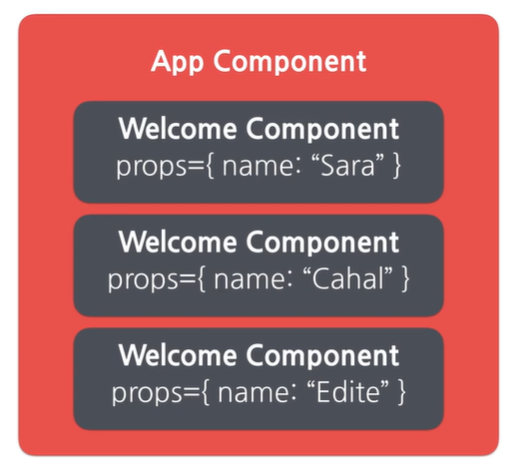
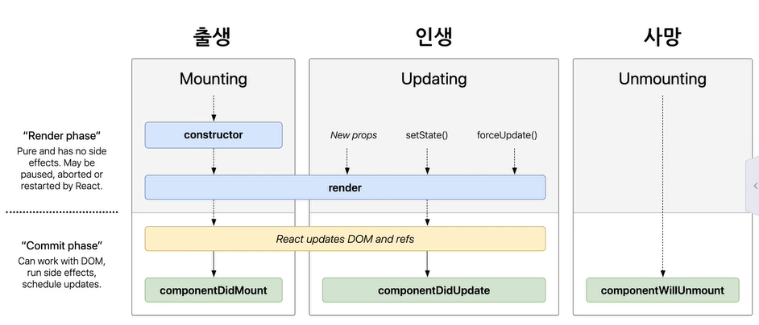
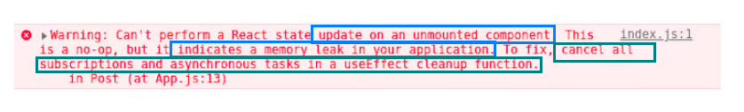
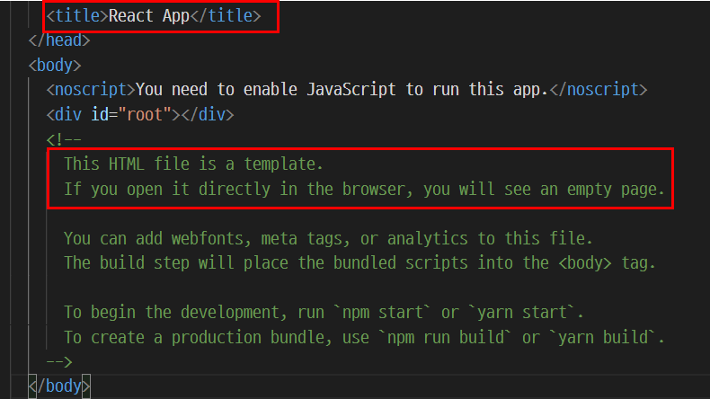
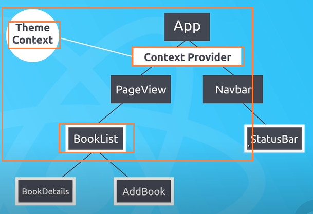
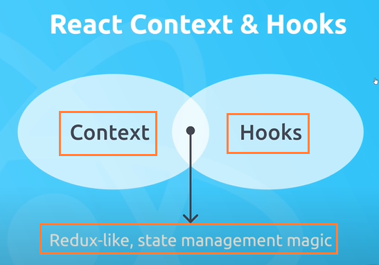
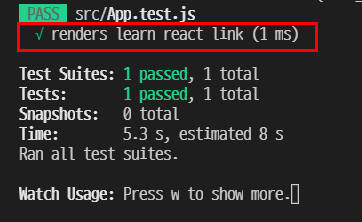
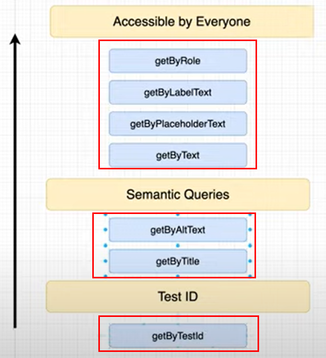
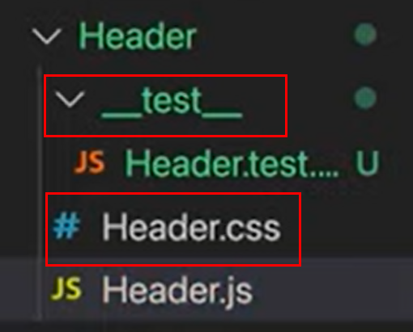
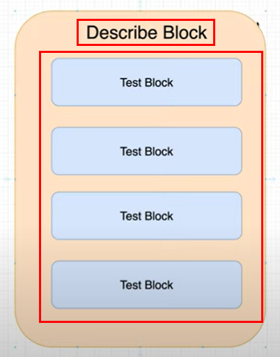

# Learning React essentials
- What is it : Javascript UI library
- Why learn : is one of the core skill set of front end developer
- What to learn : React, JSX, Redux, React-Redux, React with typescript
- Runtime : Node JS
- Rivals : Vue, Angular, Svelt
- Goal : PawCon rebuilding with React/TS 

Check your React version with below command
```Javascript
npm view react version
```

## Contents included
- myComponents : exercise my own React codes (JS/TS)
- myFreeCodeCamp : basic React and Redux
- net-ninja : React tutorials (Query, Material UI, Testing, Context)
- React docs summarization

## Table of Contents
- [Create a React app]()
- [Components and Props]()
- [State and Lifecycle]()
- [Unidirectional data flow in React]()
- [Styling in React]()
- [React with Redux]()
- [Reference]()

### Create a React app
```Javascript
npx create-react-app
```

Once you create a react app, look at the directories to get more understanding of React. 
- /public : index.html => root div
- /src : React codes contained
- /src/App.js : Updates and compile React codes
- /src/index.js : Imports React, ReactDOM, reportWebVitals, and css files
- Everything loads into App component and export the App component into index.js
- class component : (constructor) + render(required). A class component must include render method and return statement only can return one parent element. 
- functional component : does not use class keyword 

<details>
    <summary>What is reportWebVitals in React?</summary>
    A built-in tool to measure your React app performance.

    ```javascript
    import reportWebVitals from './reportWebVitals'; 
    reportWebVitals(console.log);
    ```
</details>

### Element in React
the smallest unit in React codes. It shows what is displayed in screen. 

- Immutable, meaning can't add or change once react element is created. 
- Updated in virtual DOM and reflected to actual DOM. 
- [What is Virtual DOM in React?](https://www.codecademy.com/articles/react-virtual-dom)

<details>
    <summary>DOM comparison(click to unfold) </summary>
    
</details>

React has its own strength in performance since it updates HTML DOM where only update needed by exploiting virtual DOM. 

- State changes (update needed)
- Render virtual DOM
- Updates the actual DOM

```JSX
// element in react
const element = <h1> Hello React </h1>

// Root DOM node : one and only. manages all the child elements
<div id="root"></div>

// ReactDom.render(element, container) - renders a React element and returns a reference to that. Only mutate partial DOM if the previous element needs an update. 
ReactDom.render(
    element, 
    document.getElementById('root')
); 

```

### Components and Props
Component and props(properties) is the building blocks of React.
- Javascript : input => function => output
- React : property => component => element

#### Component 
<p>
Component is an important subject in React since React is component-based. Think of it as class in Python, function in Javascript, meaning it is a template used to make objects. Component should act like pure functions, maintaining props. <strong>Component name should always start with Capital.</strong> 
</p>

- name starts with lower case => tag 
- name starts with upper case => component

Types of React components is as follows : 
- Stateless functional component : Pure function. If take the same input, returns the same output. Does not use internal state. 
- Stateful class component : Use internal state. 

<p>
A common practice is to minimize statefulness and exploit stateless functional component whenever possible. It improves apllication development/maintenance. Stacking too many elements in a component is a overkill. By spliting elements in a component, a reusuable UI component can be made. Classify related elements and make them a component for future reuse. 
</p>

If a component returns null, it won't be rendered. For example, look at below codes.

```JSX
function MyComponent(props) { 
    // Javascript value here
    if (!props.shouldRender) {
        return null;
    } 
    return ( // parenthesis() are used to return an object. not required to express a single line. curly braces {} are used to evaluate JS expression. 
        <h1>Component rendered!</h1> // JSX value here
        <h2>Try again!</h2>
    );
}
```

<details>
    <summary>What is a super in class component? (tab to unfold)</summary>

```jsx
// initialize state
constructor(props) {
    //  Must call super constructor in derived class
    //  before accessing 'this' or returning from derived constructor
    // super is a parent class contructor, which defines 'this' keyword.
    // without super(props) defined, 'this' keyword won't be available below codes.
    // see here for more details : https://overreacted.io/why-do-we-write-super-props/#:~:text=In%20JavaScript%2C%20super%20refers%20to,ve%20called%20the%20parent%20constructor.
    super(props);
    this.state = {
      btnName : "hello react"
    };
  }
```
</details>

##### Controlled Input
Form elements that are controlled by React, meaning that the state of the elements is stored in a state and only can be changed with setState method(in class component). It has a merit that a developer can control user input with the setState method. 

```JSX
handleChange(event) {
    this.setState( {
        value: event.target.value.toUpperCase() // change what user typed into uppercase. 
    });
}
``` 

HTML file tag is an uncontrolled component since it is read-only. 
```HTML
<form action="http:localhost/example.html" method="post" enctype="multipart/form-data" >
    <input type="file" />
</form>
```

#### Property
Props are inputs to the components. They are read-only and pure. 

<details>
    <summary>React components in website (click to unfold)</summary>

- 
- 
    
</details>

##### Default Props and Props Type Check
You can set default prop in React. React assigns default props if the props are undefined. When null passed, it will remain null. Note that propTypes and defaultProps is set through object.

```Javascript
function MyComponent() {
    return <p>Hello React</p>
}
MyComponent.defaultProps = { author: "Jake Sung" }
```

Also, prop type checking is supported with PropTypes.type. 

```Javascript
function MyComponent() {
    return <p>Hello React</p>
}
MyComponent.propTypes = { myFunc : PropTypes.func.isRequired }
// As of React v15.5.0++, PropTypes is independently imported.
import PropTypes from 'prop-types' 
```

### State and Lifecycle
#### State
State is a very important concept in React. State is the state of React component, meaning the component's data(the object in Javascript). It is <strong>defined by developer</strong> and should only include the data related to rendering. When state is defined in a class component, it is <strong>fully encapsulated and local.</strong> No other components are aware of the state. 

<details>
    <summary>setState method in React(tab to unfold)</summary>
React manages the state thus state should only be changed with a setState method, meaning that developer should not change the state directly. 

```JSX
// Define Door component
class Door extends React.Component {
    constructor(props){
        super(props);

        // Javascript object in React
        this.state = {
            opened: true
        };
    }
}

// Rendering
render() {
    return (
        <button onClick={() => this.setState( !this.state.opened )}>
            {this.state.opened ? "Close door" : "Open door"}
        </button>
    )
}

```
</details>

##### Shared state
<p>
A state that is shared with various sub-components, removing possible duplicates of state. For example, if a person component has a name state, sub-components German and Russian do not have to have the name state in their components. Sharing state is done by moving the state up to the closest common ancestor of the components that need it - which is called lifting state up. 
</p>

```JSX

// shared state not lifted up. 
class Russian extends React.Component {
    // ~
    this.state = { name:"", bear : ""}; 
    // ~ 
}
class German extends React.Component {
    // ~
    this.state = { name:"", beer : "" }; 
    // ~ 
}

// shared state lifted up
class Person extends React.Component {
    this.state = { name : "" }
}
class Russian extends Person {
    this.state = { bear : "" }; 
}
class German extends Person {
    this.state = { beer : "" }; 
}

```

#### Lifecycle
React component's lifecycle and React's corresponding lifecycle method is as follows.
- mounting(create) : componentDidMount
- updating(update) : componentDidUpdate
- unmounting(delete) : componentWillUnmount
- 

<details>
    <summary>Lifecycle code example (tab to unfold)</summary>

```JSX
    // Best practice : placing API calls in componentDidMount.
    // Any calls to setState here will cause a re-rendering of your component. 
    componentDidMount() {
        setTimeout(()=>{
            this.setState({name : "Jake"})
        }, 2000)
    }

    // componentDidUpdate : Called immediately after updating occurs. 
    // Not called for the initial render.
    componentDidUpdate() {
        console.log(`${this.props.id} componentDidUpdate() called`);
    }

    // Called immediately before a component is destroyed. 
    // Perform any necessary cleanup for component in this method. e.g : removing eventListener
    componentWillUnmount() {
        document.removeEventListener("click", this.handleClick)
    }

```

</details>

when components created, the order of a list of methods called is as follows. 
- 

when components deleted, the order of a list of methods called is as follows.
- 

Note that every componentDidUpdate method is called right after a new component is created/deleted.

<details> 
    <summary>React Dev Tool</summary> 

- [Download React dev tools here](https://chrome.google.com/webstore/detail/react-developer-tools/fmkadmapgofadopljbjfkapdkoienihi)

And then, follow below instructions to set Chrome browser for npm start. 

<ol>
    <li>Create a new file named .env in your project folder</li>
    <li>Type followings and save it : BROWSER=chrome</li>
    <li>npm start</li>
</ol>


Most web developers handle API endpoint call to fetch data. In React, best practice of this is to place the API calls in componentDidMount method(in class component). The component will automatically re-render.

</details>


### Conditional rendering
Depending on control logic, what is rendered would vary.  

```JSX
// greeting message for a signed up user 
function UserGreeting(props) { // the first letter of component name should be in captial
    const userName = props.username;
    return <h1>Welcome back, {userName}</h1>
} 

// greeting message for a new guest 
function GuestGreeting(props) {
    const guest = props.guest;
    return <h1>Welcome, {guest}</h1>
} 

function Greeting(props) {
    const isLoggedIn = props.isLoggedIn;

    if (props.isLoggedIn) {
        return <UserGreeting userName="jake"/>
    } else {
        return <GuestGreeting guest="guest" />
    }
}

```

### Element variable
Assign element to a variable like below. 

```JSX
    const isComputerOff = this.state.isComputerOff;
    let action;
    
    if (!isComputerOff) {
        action = <TurnOff onclick={this.handlerTurnOff} />
    } else {
        action = <TurnOn onclick={this.handlerTurnOn} />
    }
    
```

### Array and key
<p>
Array is a variable that contains a bunch of object in Javascript. Using array and provided array methods, reproducing a component can be easily done.Indices in array can distinguish each item in the array but recommend to use an unique and not-easily-changable value as key in React. Be aware of assigning key value to array items to avoid errors like below
</p>


<details>
    <summary>One more thing about the Key(tap to unfold)</summary>
    Key is not deliverable as props. Meaning, this.props.key does not exist and developer should manage this key property separately. 
</details>

### Composition
Composition means that a lot of components are gathered together to make a new component. Types of composition techinques is as follows :  

- containment : children props used in a component when sub-components are not decided yet. Props in a top component are delivered to a bottom component as children prop in the bottom component.  

For example, 

```JSX
// Bottom component
function FancyBorder(props) {
    // props.children => MyBox component
    // In React with Typescript, the children is typed as : React.ReactNode
    return (
        <div className="myFancyBorder">
            {props.children} 
        </div>
        );
}

// Top component
function MyBox() { 
    // JSX(h1, p) => FancyBorder component's props.children
    return (
        <FancyBorder>
            <h1>Hello Box</h1> 
            <p>Do you want to open this box?</p>
        </FancyBorder>
    );
}

```

- Specialization : a common concept in object-oriented programming, implemented with inheritance. For example, in Python : 

```Python
class Animal :
    def __init__(self, habitat) : 
        self.habitat = habitat
    def walk(self) : 
        return f"it is walking in {self.habitat}" 

class Dog(Animal) : 
    def __init__(self, habitat) : 
        self.habitat = habitat
    def bark(self) :
        return "bark bark"

myDog = Dog("London")
print(myDog.walk())
print(myDog.bark())

```

<p>
In React, specialization is implemented with composition. Facebook engineers recommend to not use inheritance in React but should be done in a composition manner.
</p>

### Unidirectional data flow in React
<p>
React has a unidirectional data flow, meaning that data only flows from parent component to child one. The chilld component only receives the state data they need. State management is done in one part of codes and UI rendering is done in another part(separation)
</p>

```JSX
class MyApp extends React.Component { 
    constructor(props) { 
        super(props)
        this.state = { 
            name: "Jake"
        }
    }
    // class component must have a render method
    render() { 
        return (
            <Person name={this.state} />
        )
    }
}

class Person extends React.Component {
    constructor(props) { 
        super(props)
    }
    render() { 
        return (
            <h1>My name is : {this.props.name}</h1> // passing state as props
        )
    }
}
```

<p>
You can also pass function, method. This is React way of communicating between parent component and child component. The passed state/function can be accessed like below.
</p>

```
this.props.(its name)
```

```JSX
// delivering 'input', 'handleChange' attributes to custom HTML tag GetInput */}
<GetInput input={this.state.inputValue} handleChange={this.handleChange}/>
```

### Styling in React
Inline styles is very common in React development. Set property and value in Javascript object form with camel case naming. Any hyphenated style properties should be converted to camel case in JSX.

```JSX
class Colorful extends React.Component {
    render() {
      return (
        <div style={
            {
                color: "red",
                fontSize: 72 // unit px is omitted
            }
        }>Big Red</div>
      );
    }
  };

```

For a large set of styles, create a style object in a global constant variable to manage that.

```JSX
const styles = {
    color : "red",
    fontSize : 40, 
    border : "2px solid yellow" // do not add comma between.
}
```

### React with Redux
Connecting React with Redux is done like below. 

- 1. Creates a React component 
- 2. Creates a Redux store
- 3. Connect the component with the store using react-redux package

- React : Javascript view library
- Redux : State management framework. developed by React developers
- Redux => creates a single Redux store, managing application state
- React => subscribes to some of the store's data. If <bold>action dispatched, the React component gets updated</bold>
- When application gets <bold>bigger and complicated, using Redux is recommended</bold>
- Use react-redux package and pass Redux state/dispatch to React as props

#### Provider
Provider is essential for React-Redux app. Provider is a wrapper component wrapping React app, accessing Redux store.

```JSX
<Provider store={store} > 
    <App/> 
</Provider>
```

#### Connect
Connect is a method that connects React component with Redux, taking two optional arguments like below. It allows you to provide state and dispatch. Clarify what state and action you need so that component only approaches to the state it needs.

```javascript
connect(mapStateToProps, mapDispatchToProps)(MyComponent) // replace argument with null if needed
```

- mapStateToProps : provide a specific state to Redux store
- mapDispatchToProps : provide a specific action creator to dispatch action against Redux store

State and dispatch passed by mapStateToProps and mapDispatchToProps can be accessed as props in the MyComponent. 

### React Hooks
Hooks are added in React 16.08. Hooks API are useful to 

- make stateless components with function
- do easier state management without Redux/Mobx 

<bold>Hooks do not work inside class</bold>, meaning hook and class is incompatiable. You either use hook or class. 

<p>
Before the hook is introduced, if you want to add some state but you were working on function component, you had to re-write class component to add the state. Once hook is introduced, adding state in functional component becomes available. <strong>Hook names always start with "use"</strong> and embraces clousure in Javascript.
</p>

#### Types of Hooks
- useState(initial state) : declare a state variable with initial state. Returns a current state and a function to update.
- useEffect(effect function)
- useContext
- useReducer : similar to Redux usage, used when states get complicated.
- useCallback .. and many more

#### useState and useEffect
##### useState
Let's see how useState hook is defined in React offical homepage. 

``` markdown
> useState is a new way to use <bold>the exact same capabilities that this.state</bold> provides in a class. Normally, variables “disappear” when the function exits but <bold>state variables are preserved by React</bold>. ... React will remember its current value between re-renders, and provide the most recent one to our function.
```

```javascript

// class component with 'this' : A 
class MyComonent extends React.Component { 
    constructor(props) { 
        super(props)
        this.state = { 
            count : 0
        }
    }
}

// function component with 'hook' : B 
import { useState } from "react"
const MyComponent = () => {
    const [count, setCount] = useState(0) // declare a state variable. 
}

// Component A and B is the same. 
```

##### useEffect 
useEffect lets you perform side effects(listed below) in function components. By default, <bold>it runs both after the first render and after every update</bold>. It is similar to componentDidMount and componentDidUpdate. 

```
React updates DOM => React calls useEffect
```

- data <bold>fetching</bold> or other API
- <bold>changing DOM</bold>
- setting up a subscription

By using useEffect hook, your components will <bold>do something else additionally after render</bold>. Every time we re-render, we schedule a different effect replacing the previous one.

```javascript
import { useState, useEffect } from "react"
const MyComponent = () => {
    const [count, setCount] = useState(0)

    // useEffect by default runs on first render and every update.
    useEffect(()=>{ // pass a function to useEffect
        document.title = `You clicked ${count} times` // in useEffect, you can access to the count in useState.
    })
}

```

###### useEffect dependency
Dependency of useEffect decides when the useEffect hook runs based on the depenedency.

```javascript
const MyComponent = () => { 
    const [count, setCount] = useState(0)
    useEffect(()=>{
        console.log(`${count} is increased by 1`)
    }, [count]) // [count] is a dependency of useEffect. If dependency given, useEffect would run only in the case of the dependency. If given emtpy array as a dependency, it will re-render at first time(initial render).
    handleClick(
        setCount(count + 1) //
    )
    return ( 
        <div>
            <button onclick={handleClick}>Click Me</button>
            <p>Increased count : {count}</p>
        </div>
    )
}
```

###### useEffect Cleanup Function
As the name implies, cleanup function is a function inside the useEffect hook. Cleanup function prevents application from unintended results such as <bold>memory leaks, improving the application's performance</bold> by removing what is not necessary before the component unmounts. 



Without the cleanup function, an error like the above one could happen. As the error log suggests, 1) cancel subscriptions 2) cancel asynchronous tasks not to update React state on components unmounted. 

```javascript

// useEffect hook takes two argument : 1. callback 2. dependency(array)
useEffect(()=>{
    // Create a AbortController instance
    const abortCtrl = new AbortController()

    // Connect the AbortController with fetch
    fetch(myUrl, { signal : abortCtrl.signal }) { 
        // do some operation
    } 

    // Create a cleanup function to prevent side effect once fetch is finished
    // When abort() is called, the fetch() promise rejects with a DOMException named AbortError.
    return () => { abortCtrl.abort() }

}, [myUrl])

```


#### Custom hooks
To increase code reusability, you can create your own hook and import the hook in different components. Consider <bold>custom hook</bold> nothing more than importing <bold>a new module</bold> in Javascript. You write a function, export it, and import it in another file. Remember that <bold>hook's name should start with 'use'</bold>.

```javascript 
// useMyHook.js
export const useMyHook = () => { 
    return <div>I am a custom hook!</div>
}

import { useMyHook } from './useMyHook'
function MyComponent() { 
    return (
        <div>
            <h1>My First Hook</h2>
            {useMyHook()}
        </div>
    )
}
```

### How website works
#### Non-React Website
1. Web browser sends an initial request to server
2. Server responds with index.html 
3. The browser sends a new request based on what user did
4. Server responds with it.
5. Continues over and over

#### React Website(Single Page Application)
The website built with React do not act like the above websites. React application delegates all the routings and resources to browser only.

1. Web browser sends an initial request to server
2. Server responds with index.html <strong>and React Javascript bundle</strong>
3. React/React router takes a full control of the application

<span>Empty HTML page of React app</span><br/>


4. React fills the empty HTML with components we created. 
5. If user did something thus a request is generated, React prevents to deliver the request to server and lock it.
6. React instead <strong>dynamically fills the content</strong> the user wanted into the HTML. 
7. This React work flow leads to <bold>less requests to a server, making the website faster</bold>. 

### React Router
Install React router with npm to control routing.

```javascript
npm install react-router-dom
```

React router package consists of : 1) Router 2) Switch 3) Route

- Router : a whole routing
- Switch : contains multiple route components, making sure only one route component is shown in browser at one time. Find the route and render a component that is inside the route component.
- Route : a single route component. Takes exact path or path parameter.

* update : React router has been updated from v5 to v6 with major changes. Check below code first and find out difference in offical github repo.

- https://github.com/remix-run/react-router/blob/main/docs/upgrading/v5.md

```jsx
import {
  BrowserRouter,
  Routes,
  Route,
  Link,
  Outlet
} from "react-router-dom";

function App() {
  return (
    <BrowserRouter>
      <Routes>
        <Route path="/" element={<Home />} />

        // Route nesting feature adopted in v6
        <Route path="users" element={<Users />}>
          <Route path="me" element={<OwnUserProfile />} />
          <Route path=":id" element={<UserProfile />} />
        </Route>

      </Routes>
    </BrowserRouter>
  );
}

```

#### React Route Parameters
We really can't hard-code route parameters since user request changes. For example, asking blog posts by posting number could be 

- /blogs/123
- /blogs/456 <===== Can't hard-code this
- /blogs/789

So we can set a <bold>dynamic route paramter</bold> with colon in React like below

```jsx

import { useParams } from "react-router-dom";
import { useState } from "react";

const Details = () => {
    // Import route parameter hook for dynamic routing
    const { title } = useParams() // the endpoint is set in Route component path parameter 

// Set a route parameter and devlier it as props in Link component. 
<Route path="/blogs/:postingNumber">
<Link to={`/blogs/${props.postingNumber}`}>Check the post</Link>

```

#### React Router Link
To avoid React application sends a request to server when link clicked, React router link should be used instead of html a tag. 

```javascript
// Without React Router Link => Still send requests to server 
const Navigation = () => {
    return (
        <div>
            <a href="/">Main</a>  
            <a href="/contact">Contact</a>  
        </div>
    )
}

// With React Router Link : not sending requests to server
import { Link } from 'react-router-dom'
const Navigation = () => { 
    // Note that a href attribute is changed to Link 'to' props. 
    return ( 
        <div>
            <Link to="/"> Main </Link> 
            <Link to="/create"> Create </Link>
        </div>
    )
}

```

### SEO for React
React has its weakness at SEO(search engine optimization) and tackles the issue in its own way. 

Required SEO data for a typical website is as follows :
- Title
- Description
- Keywords
- Alt 
- Heading
- Canonical : html element that solve duplicated content issues. For example, 
- OpeanGraph : a protocol created by Facebook, used to standardize meta data usage within a webpage. Refer HTML lectures to find out more.  

You can try below to improve SEO in React is : 
- Server side rendering : mainly used but might be challenging to migrate. Use framework like Next.js for the migration, which helps SEO in React.


---------------------------------------------------
### Get familiar with React apis/hooks

Took below courses and summarized essentials. 

- [NetNinja - React Query](https://www.youtube.com/watch?v=x1rQ61otgtU)
- [NetNinja - Context and Hooks](https://www.youtube.com/watch?v=6RhOzQciVwI&list=PL4cUxeGkcC9hNokByJilPg5g9m2APUePI&index=1&t=1s)

### React Query
React query is a React library that provides state management for asynchronous data. Required to be familiar with React Hooks before this tutorial. 

<p>Install React query like below through npm and install React simple snippiets in extension. </p>

```javascript
npm install react-query
```

content will be added

### React Context and Hooks
- Context API : sharing state between components/within component tree. As application gets bigger, sharing state becomes more difficult. Context API puts every state in a central place to store them thus not having to pass props between components. This is a Redux-like approach.



In the above component tree, all the components can access to the theme context, meaning having a shared state. Then when should you use the context? Think through if the state should be global so that other components can access. The example of context by React offical homepage is : 1) current authenticated user 2) theme 3) preferred language. 

- Hooks : adding state in functional component with easier management



#### Understanding context proivder
1. Create context and context provider like below
```jsx
import React, { createContext } from 'react';

// create a context
export const ThemeContext = createContext()

// create a context provider
class ThemeContextProvider extends React.Component {
    // global state that will be shared
    state = {
        isLightTheme : true,
        light : { syntax : '#555', ui : "#ddd", bg : "#eee" }, 
        dark : { syntax : "#ddd", ui : "#333", bg: "#555"}
    }
    render() { 
        return (
            <ThemeContext.Provider value={{...this.state}}>
            {this.props.children}  // wrapped components here : Navbar 
         </ThemeContext.Provider>   
        );
    }
}
```

2. Then make the global state accessible from children component like below, using static contextType property(method 1) or Context.Consumer(method 2)

```jsx
import React from 'react';
import { ThemeContext } from './context/themeContext'

// Way 1
class Navbar extends React.Component { 
    // If set, this.context will be set at runtime to the current value of the given Context.
    // now Navbar context type is set to the ThemeConext, meaning that
    // this component can access to ThemeContextProvider's state.
    static contextType = ThemeContext 
    render() {
        console.log(this.context) // will log the global state in browser
        const { isLightTheme, light, dark } = this.context
        return( 
            <ul>
                <li>Home</li>
                <li>About</li>
                <li>Contact</li>
            </ul>
        )
    }
}

// Way 2 : can be used in functional component, too.
class BookList extends React.Component { 
    render() {
        return( 
            // You can use Context.Consumer instead of the static contextType.
            // The Context.Consumer takes a function with a context parameter, which is 
            // a global state from its context provider.
            <ThemeContext.Consumer>{(context)=>{
                const { isLightTheme, light, dark } = context
                const theme = isLightTheme ? light : dark
                return (
                    <ul style={{"backgroundColor" : theme.bg, "color" : theme.syntax, "padding": "1rem"}}>
                        <li style={{"backgroundColor" : theme.ui}}>my book</li>
                        <li style={{"backgroundColor" : theme.ui}}>your book</li>
                        <li style={{"backgroundColor" : theme.ui}}>his book</li>
                    </ul>
                )
            }}</ThemeContext.Consumer>
        )
    }
}

```


-------------------------------------------------

### React docs summarization
React elements are recommended to create with JSX. JSX is a syntactic sugar to omit calling following methods. 

- React.createElement()
- React.createFactory()

#### Handling events
You cannot return false to prevent brower default behavior in React like below. 

```html
<!-- preventDefault -->
<form onsubmit="return false"> 
    <input type="text">
    <button type="submit">Submit</button>
</form>
```

Instead, you have to explicitly say it. 

```jsx
const MyForm = () => { 
    const handleSubmit = (event) => event.preventDefault()
    return (
        <form onSubmit={handleSubmit}>
            <button type="submit">Submit</button>
        </form>
    )
}
```

The above event parameter in React handles cross-browser compatibility. Let's take a look at below short quote. 

```md
>Your event handlers will be passed instances of SyntheticEvent, a cross-browser wrapper around the browser’s native event. It has the same interface as the browser’s native event, including stopPropagation() and preventDefault(), except the events work identically across all browsers.
```

Adding eventListener in React is done in useEffect hook(function component) or componentDidMount(class component). 

```md 
> When using React, you generally don’t need to call addEventListener to add listeners to a DOM element after it is created. Instead, <bold>just provide a listener when the element is initially rendered</bold>.
```

```jsx
const MyFunc = () => {
    const handleClick = () => { } // do something  
    useEffect(()=>{ 
        window.addEventListener("click", handleClick)
        
        // cleanup
        return () => { 
            window.removeEventListener("click", handleClick)
        }
    }, [])
}

class MyClass extends React.Component { 
    // stuff here
  componentDidMount() {
      window.addEventListener('resize', this.handleResize);
  },
} 
```

#### React API reference
'React' is a global object that contains top-level APIs, which can be called like below. 

```jsx
import React from 'react' // ES6 
const React = require('react') // ES5
```

types of top-level APIs are as follows : 
- Fragment
- Component
- Transforming Elements
- Refs
- Suspense
- Hooks

<details>
    <summary>React.Component and React.PureComponent</summary>

- React.Component : a base class for a component. used with ES6 class. 
- React.PureComponent : similar to React.Component but implements shouldComponentUpdate metho with shallow prop/state comparison.

```md
>If your React component’s render() function renders the same result given the same props and state, you can <bold>use React.PureComponent for a performance boost</bold> in some cases. Only extend PureComponent when you expect to have simple props and state.
```
</details> 

<details>
    <summary>React.memo</summary>

React.memo is a higher order component for improving performance, only checking props changes. If used, React skips rendering component and reuse the lastly rendered one.
</details>

<details>
    <summary>React.Fragment</summary>
React.Fragment is a first-class component. 

```md
> The React.Fragment component lets you return multiple elements in a render() method without creating an additional DOM element.
> Using a pair of empty tags for shorthand is meant to represent the idea it won’t add an actual element to the DOM.
```

```jsx
render() {
    return ( 
        <React.Fragment>
            <p>shorthand for this : <>, </>
            no need to create more DOMs.
        </React.Fragment>
    )
}
```

</details>
<details>
    <summary>React.memo</summary>
</details>
<details>
    <summary>React.memo</summary>
</details>


##### ReactDOM
content will be added


##### DOM element in React
HTML DOM and React DOM is different. React engineers refines some of the browser DOM's aspect for performanc purpose. 

```md 
> React implements a browser-independent DOM system for performance and cross-browser compatibility.
```

###### onChange
Fired whenever a form field is changed, taking user input. 

>  We intentionally do <bold>not use the existing browser behavior</bold> because onChange is a misnomer for its behavior and React relies on this event to <bold>handle user input in real time.</bold>


##### Style
 using the style attribute as the primary means of styling elements is generally not recommended. In most cases, <bold>className should be used</bold> to reference classes defined <bold>in an external CSS stylesheet</bold>. 


### Advanced guide
#### Refs and the DOM
React is an uni-directional data flow, meaning that sharing props is only done from parent component to child one. Refs provide a way to escape that for some cases. 

> Refs provide a way to access DOM nodes or React elements created in the render method.
>Your first inclination may be to use refs to “make things happen” in your app. If this is the case, take a moment and think more critically about where state should be owned in the component hierarchy.


------------------------------------------------------


### React testing library
Took below course and summarzied essentials. 

- [Net ninja - react testing library](https://www.youtube.com/watch?v=tit8PecSH70&list=PL4cUxeGkcC9gm4_-5UsNmLqMosM-dzuvQ&index=2)

The reason of test is needed as follows : 
1. easy to catch bugs 
2. increase trusts in application
3. speeds up QA time
4. serve as documentation

> Projects created with Create React App have out of the box support for React Testing Library. If that is not the case, you can add it via npm (npm install --save-dev @testing-library/react)

Types of common tests are as follows : 
1. unit test : alone component should work fine => React testing library
2. integration test : componenets related should work together fine => React testing library
3. end to end test(e2e) : testing every single feature from user persepctive. => usually done with tools like cypress.

Note that files in the form of (filename).test.js will be considered as test files by React testing library.

#### Understanding test block
Test code block consist of like below. 

1. Render a component that you want to test
2. Find elements that you want to interact with 
3. The component and element interact
4. Assert if result comes out as expected

```js
import { render, screen } from '@testing-library/react';
import App from './App';

test('renders learn react link', () => {
    render(<App />);
  const linkElement = screen.getByText(/learn react/i);
  expect(linkElement).toBeInTheDocument();
});

// test and it is interchangable.
it('renders learn react link', () => {
    render(<App />);
  const linkElement = screen.getByText(/learn react/i);
  expect(linkElement).toBeInTheDocument();
});

```



#### Understanding screen methods
Most of time, you will utilize get methods over than find/query ones.  

- getBy : sync, 1 match
- findBy : async, 1 match
- queryBy : sync, 1 match 

- getAllBy : sync, 1+ matches
- findAllBy : async, 1+ matches
- queryAllBy : sync, 1+ matches

The point in choosing test methods is to mimic user interaction as much as possible. Method priority is as follows. 



Typical directory convention for testing files as follows. 



#### Test code examples
When writing tests, try to isolate each test so that responsibility of each test can be clear. And testing is done in isolated environment. For example, when react-router or other tools is used in development, a similar requirement should be done(mocking) in testing environment as well. 

```js
import { BrowserRouter } from 'react-router-dom'
const MockRouterComponent = () => {
    return (<BrowserRouter>
                <ComponentHere>
            </BroswerRouter>)
}
```

#### Better way to manage test blocks
Use describe block to group the same type of test blocks.



## Reference
- [React.org](https://reactjs.org/docs/hooks-effect.html)
- [Free code camp - Front End Development Libraries](https://www.freecodecamp.org/learn/front-end-development-libraries/)
- [Goorm Edu - my first React (KOR)](https://edu.goorm.io/learn/lecture/12976/%EC%B2%98%EC%9D%8C-%EB%A7%8C%EB%82%9C-react-%EB%A6%AC%EC%95%A1%ED%8A%B8)
- [LogRocket - understanding React useEffect cleanup](https://blog.logrocket.com/understanding-react-useeffect-cleanup-function/)
- [NetNinja - Full modern React](https://youtube.com/playlist?list=PL4cUxeGkcC9gZD-Tvwfod2gaISzfRiP9d)
- [Codedamn - SEO For React Developers](https://youtu.be/j8OUmE4Vj3M)
- [Free code campe : What is Open Graph and how can I use it for my website?](https://www.freecodecamp.org/news/what-is-open-graph-and-how-can-i-use-it-for-my-website/)