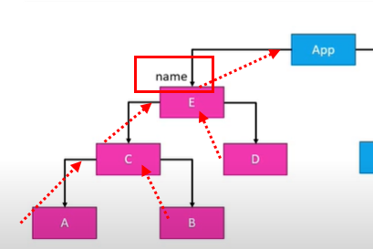
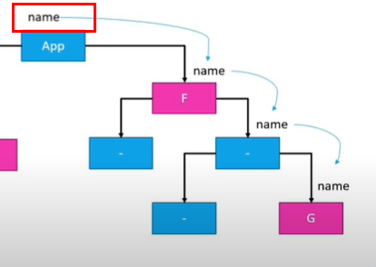
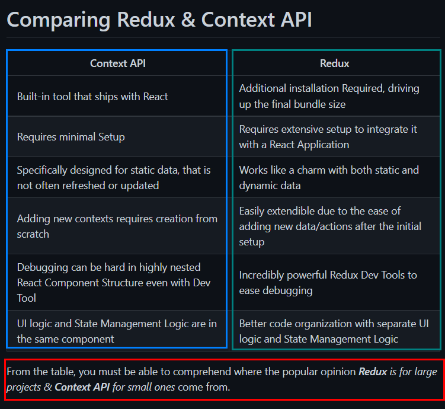
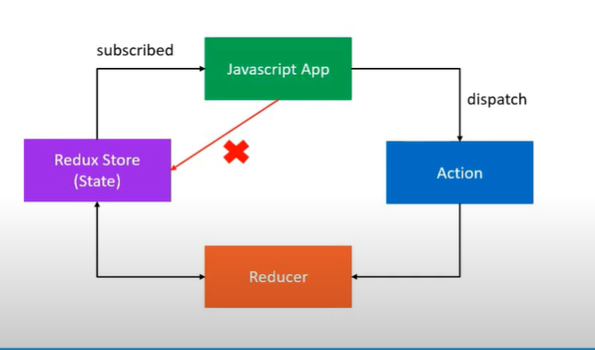
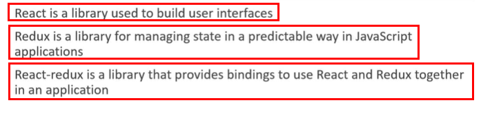

# Learning Redux Essentials
Took below courses and summarized essentials.

- [Code Evolution - React Redux Tutorial](https://www.youtube.com/playlist?list=PLC3y8-rFHvwheJHvseC3I0HuYI2f46oAK)
- [Free code camp - Redux](https://www.freecodecamp.org/learn/front-end-development-libraries/#redux)

## Understanding Redux
Redux is a library for Javascript applications. 

> As applications grow in size and scope, **managing shared data** becomes much more difficult. Redux is defined as a **"predictable state container for JavaScript apps"** that helps ensure your apps work predictably, and are easier to test.

> While you can use **Redux with any view library**, we introduce Redux here before combining it with React in the next set of courses.

Without Redux, a predictable state container, below two cases would happen.  

1. lifting state all the way up in component tree


2. lifting state all the way down in component tree


> The simplest way to pass data from a parent to a child in a React Application is by passing it on to the child's props. But an issue arises **when a deeply nested child requires data from a component higher up in the tree**. If we pass on the data through the props, every single one of the children would be required to accept the data and pass it on to its child, leading to **prop drilling**, a terrible practice in the world of React.

<details>
<summary>Comparison with Context API</summary>


</details>

### Principals of Redux
Below, there are three core principals of Redux. 

1. Maintain **whole application state in a single object**, managed by Redux store
2. **The state only can be changed by dispatching an action**, which is an object describing what happened. 
3. **Reducers** specify how the state should be changed.



- JS app =====(dispatch actions)====> Reducer
- Reducer =====(update state)=====> Redux store
- Redux store =====(reflect the update)====> Js app

### Contents covered
- Creating a Redux.createStore
- Creating action/actionCreator
- Dispatching action to store
- Updating store with Reducer
- Multiple Reducers
- Handling asynchronous actions
- First Redux App

### Redux Store
is a single state object **that manages a whole application's state**. The state must not be directly modified(immutable state, enabling time-travel debugging)

- State update in the application should only be done with **Redux store**, which is the single object **created with createStore method**.
- createStore methods takes a reducer function, which takes/returns a state.
- All state update get triggered by action dispatch.

store.subscribe calls a listener function that gets triggered every time the store is updated. 

- Redux.createStore(*callback) => store.dispatch(state) => store updated => store.subscribe(**callback) 
- *callback : reducer(state, *action) => state case specified with switch/case statement
- *action : an object with <bold>type property</bold>
- **callback : listener function, executed every time the store is updated

To keep the state's immutability, exploit spread operator, concat, slice in array and Object.assign in object.

### Action 
An action in Redux is **a Javascript object carrying event information. Actions must have a 'type' property**, which documents what type of action has occured. Declare Redux action by creating an object with type property like below

```js
const action = { type : "LOGIN" }; 
```

<ol>

- Redux action ===(events info)===> Redux store
- Redux store updates a state
</ol>

A common practice in Redux is to **assign action types as read-only contant variables**, rather than string values. Oftentimes, action comes with data and Redux needs to handle it. 

### Action creator
Action is delivered to Redux store by action creator. Action creator in Redux is a simply Javascript **function that returns an action(object)**. 

```js
  function actionCreator() { 
      return action;
  }
```

## Action dispatch
Action is sent to Redux.store by dispatch method like below. 

```js
Redux.store.dispatch(actionCreator()); // actionCreator returns an action(object with type property)
Redux.store.dispatch({ type:"LOGIN" }); // same result with above
```

## Asynchronous action
<bold>Asynchronous actions</bold> are essential parts of web development. Redux provides a middleware called <bold>Redux Thunk.</bold> 

- Redux.applyMiddleware method provides a second parameter to Redux.createStore method. 

<ol>

- Requesting data with dispatch
- API calls
- Receiving data with dispatch
</ol>

## Reducer
Reducer is a function that is responsible for changing a state, corresponding delivered actions by dispatch method. 
The only job of the reducer takes state and action as arguments and <bold>returns a new state</bold>. The new state <bold>must be a copy of the original state</bold> and the reducer should not touch it in any way. 

- when appliction is relatively simple : one reducer
- when complicated : multiple reducers, combineReducer method provided by Redux.

```js
const rootReducer = Redux.combineReducers({
  auth: authenticationReducer, 
  notes: notesReducer
})
```

Once rootReducer, which contains multiple Reducers, is created, it will be delivered to Redux.createStore method as a callback.

## First Redux App
```js
// goal : to create a simple counter app with Redux that increases/decreases by 1

const INCREMENT = "INCREMENT"; // Define a constant for increment action types
const DECREMENT = "DECREMENT"; // Define a constant for decrement action types

const counterReducer = function( state=0 , action ) {
    switch(action.type) {
        case INCREMENT : 
            return state+1;
        case DECREMENT : 
            return state-1;
        default : // don't forget to return default
            return state;
    }
}; // Define the counter reducer which will increment or decrement the state based on the action it receives

const incAction = () => { 
    return {
        type: INCREMENT
    }
}; // Define an action creator for incrementing

const decAction = () => {
    return { 
        type: DECREMENT
    }
}; // Define an action creator for decrementing

const store = Redux.createStore(counterReducer); // Define the Redux store here, passing in your reducers
```

## Reference
- [Free code camp - Redux](https://www.freecodecamp.org/learn/front-end-development-libraries/#redux)


## React-Redux
Redux is not directly implemented in React, rather it uses React-React library to connect with React. React-Redux is the official Redux UI binding library for React.



## Reference
- [Redux vs Context API: When to use them](https://dev.to/ruppysuppy/redux-vs-context-api-when-to-use-them-4k3p)