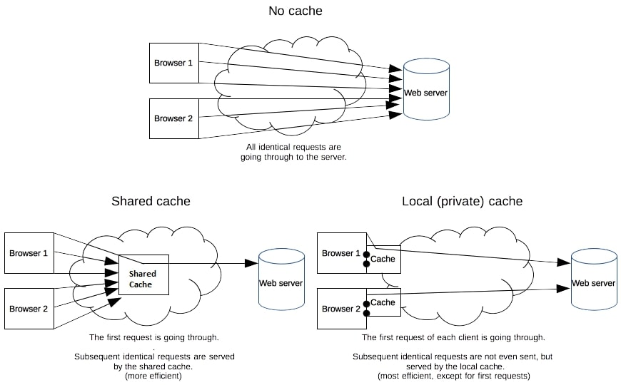
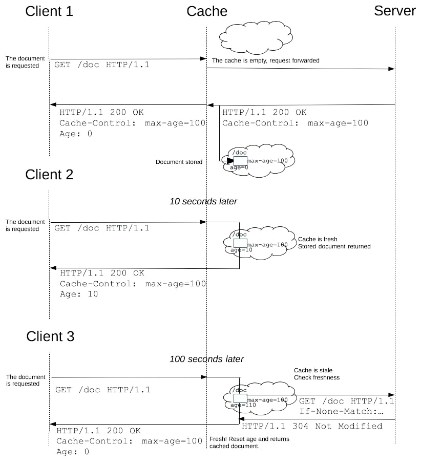

# Modern Web At Glance
Summarized what I learned about webs. 

## Document Object Model
**Document Object Model** is an **interface of a web page** with object model perspective so that programming language can manipulate the web page. 

- Web page(document) <====== DOM <===== Javascript

Note that DOM is not a programming language but rather **a web API** to create websites. **DOM is programming-language-independent**, meaning it can be built with any language. 

```python 
import xml.dom.minidom as myDOM
doc = myDOM.parse(r"C:\Projects\Py\chap1.xml"))
# do something else 
```

- document object : a web page itself
- table object : implements HTMLTableElement DOM interface

### Understanding DOM data types
1. Document : any web page loaded in a browser. For example, HTML, XML, SVG, and more. APIs are available based on their document type.

- HTML implements HTMLDocument interface.
- XML/SVG implements XMLDocument interface. 

A document is created with Document constructor. 
- document = new Document()

2. Node : Every object within a document is the one type of Node. 

- Element Node
- Text Node
- Attribute Node

3. Element is based on the Node. An element object implements DOM Element interface and the primitively, Node interface. 

- element object <==== Element interface <====== Node interface <==== Document interface 

4. NodeList : an array of elements. Nodelist has a single method called item. For example, list.item(1)

5. Attr : a special interface for attributes. Commonly referred as an attribute. 

### Understanding DOM interfaces
Since the hierarchy of the DOM data types is inter-related, **meaning one object in DOM can implement several types of DOM interfaces**, there may have been confusions. For example, 

- HTML **form** element implements **HTMLFormElement**, getting its **name** property 
- HTML **form** element implements **HTMLElement**, gettting its **className** property.

### DOM parser
> The DOMParser interface provides the ability to parse XML or HTML **source code from a string into a DOM Document**. You can perform the opposite operation—converting a DOM tree into XML or HTML source—using the XMLSerializer interface.

> In the case of an HTML document, you can also replace portions of the DOM with new DOM trees built from HTML by setting the value of the Element.innerHTML and outerHTML properties. **These properties can also be read to fetch HTML fragments corresponding to the corresponding DOM subtree**.

## Web bundling
Spliting big code lines into modules gives us convenience to manage but it trades off multiple requests for the files from browser.


In addition, features such as module in ES6 is not fully supported old browser.


Web bundlers, such as webpack and parcel, combat this by bundling them into one file, making even old browser approachable.

### HTML document life cycle
Types of events involved in HTML document life cycle are as follows : 

1. **DOMContentLoaded** : happens as soon as browser finishes reading HTML document. Javascript will manipulate DOM after this event happens. **Does not wait for img or style sheet resource**, meaning they still can be in the process of fetching.
2. load : happens when all **resources including style sheets fetched**. Can take a while so not usually used. 
3. beforeunload : when user about to leave a page. Browser will ask something like : "we have unsaved changes…"
4. unload : when user leaves a page.

## HTTP caching
>  For a web site, web caching is a major component in achieving high performance. ... it's important to cache a resource only until it changes, not longer.

> HTTP caching is optional but usually desirable. HTTP caches are **typically limited to** caching responses to the **request method GET**;

> **The performance of web sites** and applications can be significantly improved by reusing previously fetched resources. **Web caches reduce latency and network traffic** and thus lessen the time needed to display resource representations. HTTP caching makes Web sites more responsive.

> For the files in the application that will not change, you can normally **use aggressive caching**. This includes **static files such as images, CSS files, and JavaScript files**.

> When a **web cache** has a requested resource in its store, it **intercepts the request** and returns a copy of the stored resource instead of redownloading the resource from the originating server. ... improves performance by being closer to the client.

 

- Private browser caches
> **Dedicated to a single user**. 
> A browser cache holds all documents the user downloads via HTTP. This cache is used to make visited documents available for back/forward navigation, saving, viewing-as-source, etc. **without requiring an additional trip to the server**.

- Shared proxy caches : 
> **Dedicated to more than one user**.
> Example usage : a web proxy as part of its local network infrastructure to serve many users so that popular resources are reused a number of times, **reducing network traffic and latency**.

### Controlling caching
> The Cache-Control HTTP/1.1 general-header field is used to specify directives for caching mechanisms in both requests and responses. **Use this header to define your caching policies with the variety of directives it provides**.

- Cache-Control: max-age=31536000 : the maximum amount of time in which a resource will be considered fresh. in seconds. 
- Cache-Control: no-store
- Cache-Control: no-cache : A cache will send the request to the origin server for validation before releasing a cached copy.

 

> The freshness lifetime is calculated based on several headers. If a "Cache-Control: max-age=N" header is specified, the freshness lifetime is equal to N. If this header is not present, which is very often the case, the cache checks whether an Expires header is present. If an Expires header exists, its value minus the value of the Date header determines the freshness lifetime.


## Web socket
1. Websocket is a protocol between client(browser) and server, which is differentiated from HTTP protocol. **Both protocols are at OSI model layer 7 and rely on TCP at layer 4**. Since it is always open and bidirectional flow, it allows us to interact in real time. 

> WebSocket was first referenced as **TCPConnection in the HTML5** specification, as a placeholder for a TCP-based socket API.[9] In June 2008, a series of discussions were led by Michael Carter that resulted in the first version of the protocol known as WebSocket.

2. For example, Let's imagine different users from different browsers login in your chat application and send a message. Then the message is updated on other browsers(clients) through server. Unlike Ajax in HTTP, **clients in websocket do not have to make a request to server**. Uses of websockets are as follows :

- multiplayer games
- online drawing canvas
- real-time apps
- collaborative code editings

### Socket.io
Install socket.io library in both backend and front end. First, install it through npm.

```shell
$npm install socket.io -D
```

And then, require it in Node.js/Express

```javascript
const express = require('express')
const app = express()
const server = app.listen(3000, ()=>console.log("listening at port 3000"))
const socket = require('socket.io')
const io = socket(server)
```

#### Reserved events
On each side, the following events are reserved and should not be used as event names by your application:

- connect
- connect_error
- disconnect
- disconnecting
- newListener
- removeListener 

### Advantages and cautions
- the browser supports WebSocket (97% of all browsers in 2020)
- there is no element (proxy, firewall, ...) preventing WebSocket connections between the client and the server

- Socket.IO is NOT a WebSocket implementation.
- Socket.IO is** not meant to be used** in a background service, **for mobile applications**.

> The Socket.IO library keeps an **open TCP connection to the server**, which may result in **a high battery drain** for your users. Please use a dedicated messaging platform like FCM for this use case.

### How does socket io work?
> The client will try to establish a WebSocket connection if possible, and will fall back on HTTP long polling if not.

> WebSocket is a communication protocol which provides a full-duplex and low-latency channel between the server and the browser. More information can be found here.

> you can consider the Socket.IO client as a "slight" wrapper around the WebSocket API. 

### Understanding socket


A Socket is the fundamental class for interacting with the server. A Socket belongs to a certain Namespace (by default /) and uses an underlying Manager to communicate.

A **Socket is basically an EventEmitter** which sends events to — and receive events from — the server over the network.

```js
socket.emit("hello", { a: "b", c: [] });

socket.on("hey", (...args) => {
  // ...
});
```

### Rooms 
> A room is an arbitrary channel that sockets can join and leave. It can be used to broadcast events to a subset of clients:


#### Joining and leaving
You can call join to subscribe the socket to a given channel:

```js
io.on("connection", (socket) => {
  socket.join("some room");
});
```

And then simply use to or in (they are the same) when broadcasting or emitting:

```js
io.to("some room").emit("some event");
```

To leave a channel you call leave in the same fashion as join.

## CORS policy
### Understanding Cross origin resource sharing
CORS : Cross Origin Resource Sharing 

1. CORS is simply meaning **HTTP header**
2. which allows a server to indicate a browser **safe places to load resources**
3. cross origin means that you are making requests from different websites

For example, **XMLHttpRequest and Fetch API follows the same-origin policy**. You have to add CORS headers if you are going to get some data from different websites.

### solution
1) Importing modules with file:// is not supported
2) install npm cors package and set origin(url) and methods like below in your server 


### Access-Control-Allow-Origin
> response header indicates whether the **response can be shared** with requesting code from the **given origin**

```js
// A response that tells the browser to allow code from any origin to access a resource 
Access-Control-Allow-Origin: *

// A response that tells the browser to allow requesting code from the origin https://developer.mozilla.org to access a resource
Access-Control-Allow-Origin: "https://developer.mozilla.org"

// Any origin can create a hostile document with a "null" Origin. Should be avoided
Access-Control-Allow-Origin: null
```

## Reference 
- [Access control allow origin](https://developer.mozilla.org/en-US/docs/Web/HTTP/Headers/Access-Control-Allow-Origin)
- [Socket.IO](https://socket.io/)
- [Wikipedia - WebSocket6](https://en.wikipedia.org/wiki/WebSocket)
- [MDN Web Docs](https://developer.mozilla.org/en-US/docs/Web/API/Document_Object_Model)
- [NetNinja - typescript](https://www.youtube.com/watch?v=EpOPR03z4Vw&list=PL4cUxeGkcC9gUgr39Q_yD6v-bSyMwKPUI&index=14&t=1s)
- [NetNinja - ChatApp Ninja](https://www.youtube.com/watch?v=vQjiN8Qgs3c&list=PL-tV1f9Asb4giyEr2-LlLrsEHTkf0Geyr&index=1&t=11s)
- [Javascript.info - DOMContentLoaded, load, beforeunload, unload](https://ko.javascript.info/onload-ondomcontentloaded)
- [MDN web docs - HTTP caching](https://developer.mozilla.org/en-US/docs/Web/HTTP/Caching#targets_of_caching_operations)