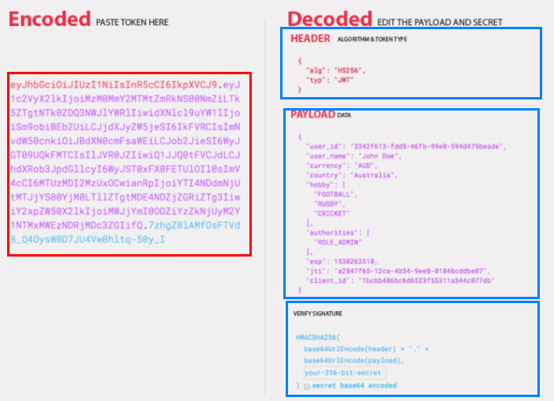

# Learning Node js Authentification

Took below course and summarized essentials. 

- [NetNinja - Node js Auth tutorial](https://www.youtube.com/watch?v=SnoAwLP1a-0&list=PL4cUxeGkcC9iqqESP8335DA5cRFp8loyp&index=1&t=20s)
- pre-requirement : Node.js, Express, MongoDB, Asynchronous Javascript, Middleware

## Understanding authentification
Authentification can be a very complex topic. The way authentification is done can be many ways other than JWT, like sessions, but here JSON web token(JWT) will be used. 

## Understanding JSON Web Token
In web service, one of the most important things is authentification method. 

types of authentification methods
- OpenID
- SAML
- Kerberos
- OAuth2 

JSON format has been popular in transferring data format since it is easy to use and to contain many infos in it. Besides,  many programming language provides JSON parsers. It means that the data can be easily converted to object. 

JWT also can be combinated with OAuth2, which is a favored authorization of big IT companies such as Microsoft, Facebook, and Google. 

## Hash and password
Password should not be stored in database in a form of what user just had typed. If the database gets hacked, the passwords would be compromised easily. 

## Reference
- [App Security: Why is it worth it to implement JWT based authentication in your app?](https://espeo.eu/blog/app-security-jwt-based-authentication/)
