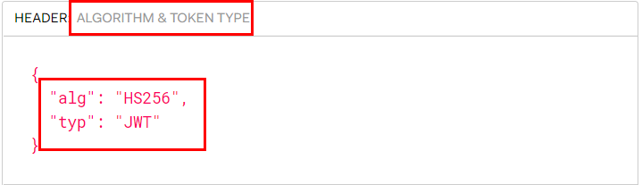
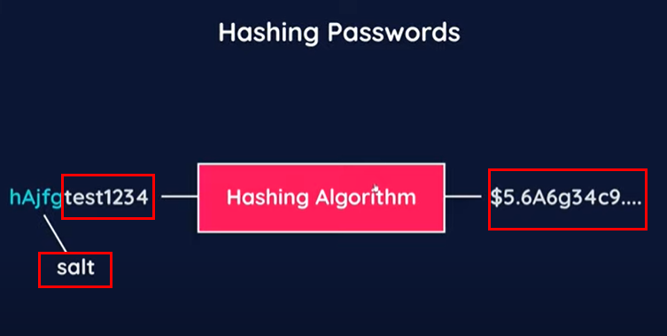

# Learning Node js Authentification

Took below course and summarized essentials. 

- [NetNinja - Node js Auth tutorial](https://www.youtube.com/watch?v=SnoAwLP1a-0&list=PL4cUxeGkcC9iqqESP8335DA5cRFp8loyp&index=1&t=20s)
- pre-requirement : Node.js, Express, MongoDB, Asynchronous Javascript, Middleware


## Understanding authentification
Authentification can be a very complex topic. The way authentification is done can be many ways other than JWT, like sessions, but here JSON web token(JWT) will be used. 

## Understanding JSON Web Token
In web service, one of the most important things is authentification method. 

types of authentification methods
- OpenID
- SAML
- Kerberos
- OAuth2 

<p>
JSON format has been popular in transferring data format since it is easy to use and to contain many infos in it. Besides,  many programming language provides JSON parsers. It means that the data can be easily converted to object. 
</p>
<p>
JWT also can be combinated with OAuth2, which is a favored authorization of big IT companies such as Microsoft, Facebook, and Google.
</p>


JWT consists of three parts : 1) headers 2) payload 3) signature

- 

- 

- 

The header and payload in JSON web token is hashed together with a secret string in the server side. The result, which is the three things combined header, payload, and secret string, is called JSON web token signature. 

- The created JSON web token looks like this : header.payload.signature, and is sent to browser to store in cookie. When a wrong header/payload is delivered(when user type them wrong in login form, for example) a newly created signature will be different from an originally hashed signature. Thus, authtication fails. 

## Understanding hasing password Process
Password should not be stored in database in a form of what user just had typed. If the database gets hacked, the passwords would be compromised easily. 

1. Attach a salt to a plain text(user password)
2. Hash algorithm creates a hashed password with result of 1
3. When use re-logins, it will compare the combination(user password + salt => hashed password).
4. If correct, user logs in.



## Understanding login process
1. User enters info(email/password) in web browser through login form.
2. Server check the info. If correct, server creates JSON web token for the user.
3. Server sends the token to browser and browser stores it in a cookie.
4. The cookie is sent to server per every request a browser sends. 
5. Sever gets takes JSON web token out of the cookie and identify user. 
6. If identified, server sends a user info to browser. If not, sends an error.

### JWT security caution
When using JWT for authentication, you have to be aware of Cross Site Request Forgery(CSRF). The attack is target state changes on server by taking advantage of the fact that when user is in an authenticated status, there is no way to distinguish forged request by attacker and a normal request by user. 

Read below article to find out more. 

- [Cross site request forgery](https://owasp.org/www-community/attacks/csrf)

## Understanding cookie
Let's take a look what Wikipedia has defined about cookie. 

```
HTTP cookies (also called web cookies, Internet cookies, browser cookies, or simply cookies) are small blocks of data created by a web server while a user is browsing a website and placed on the user's computer or other device by the user’s web browser. Cookies are placed on the device used to access a website, and more than one cookie may be placed on a user’s device during a session.
```

So, basically cookie is a data stored in web browser/user device. It is created in server and stored in browser. It is also a place where above JSON web token is stored. 


## Reference
- [App Security: Why is it worth it to implement JWT based authentication in your app?](https://espeo.eu/blog/app-security-jwt-based-authentication/)
