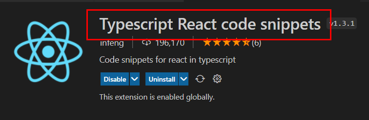

# React with Typescript
Writing React codes by typescript has a few advantages. 

- Figuring out potential bugs as writing codes rather than at browser/runtime
- Describing an object shape in advance with autocomplete thus easier to documentation
-  Easier maintenance

Note that component is defined with .tsx extention and the app will break if .js or .jsx exists. 

- TypeScript : (.ts)
- TypeScript React : (.tsx)

Install below extension for code snippets.



## Child props
The content between open/closing tag is considered as child in React with Typescript. For example, 

``` typescript
// Normall we do this
type HeadingProps = { title : string }
const Heading = (props) => {
    return <h2>{props.title}<h2>
}

<Heading title={"hello React"} />

// Advanced props 1
type HeadingProps = { 
    children : string
}

// the 'Hello React' is considered a child(Use React.ReactNode for setting a type for this or you can specify a coressponding one)
<Heading>Hello React</Heading> 

// Advanced props 2
type HeadingProps = { 
    children : React.ReactNode
}

const Heading = (props:HeadingProps) => { 
    <h2>{props.children}</h2>
}

// Passing a React component as a children prop is very common in React/TS
<Heading>
    <PlainText /> // props.children, a type of this can be : React.ReactNode
</Heading>
```

## Event props
Setting a Event prop in React/TS is done like below. 

```typescript
// React.(event here)<element here> => React.MouseEvent<HTMLButtonElement>
<MyButton addColor={(event)=> console.log("color changed")}>
```

## Input props
(will be added)

## Reference
- [React Typescript Tutorial For Beginners](https://www.youtube.com/watch?v=xNSIHFi8o2M&list=PLC3y8-rFHvwi1AXijGTKM0BKtHzVC-LSK&index=6)