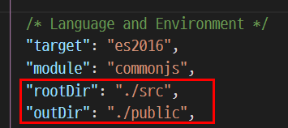
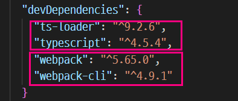
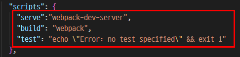

# Learning Typescript Essentials
Took below courses and summarized essentials. 

- [NetNinja - Typescript](https://www.youtube.com/playlist?list=PL4cUxeGkcC9gUgr39Q_yD6v-bSyMwKPUI)
- [Groom Edu - Typescript at a glance](https://edu.goorm.io/learn/lecture/22106/%ED%95%9C-%EB%88%88%EC%97%90-%EB%B3%B4%EB%8A%94-%ED%83%80%EC%9E%85%EC%8A%A4%ED%81%AC%EB%A6%BD%ED%8A%B8)

## Table of Contents
- [NetNinja - Typescript]()
- [NetNinja - Typescript with webpack]()
- [Groom Edu - Typescript at a glance]()

## NetNinja - Typescript
### Understanding Typescript
Typescript is a Javascript superset coming with extra features and syntax. Since browser does not understand typescript, it needs to be complied to Javascript to be used in web. 

- Strict types
- Extra features : generics, interface, tuples

Once you are done writing typescript codes, compile it like below

```typescript
tsc (your_file.ts) (your_file.js) // your_file.js can be omitted if output file name is the same

tsc helloWorld -w // compile helloWorld.ts into helloWorld.js and reflect changes automatically(flag -w)
```

### Prerequisite
- Understanding Javascript essentials : arrow function, DOM, ES6, ... etc
- Understanding Node js basics to install and compile typescript

Install Typescript with below npm command

```javascript
npm install -g typescript
```

### Typescript config
Make a Typescript config file in your project root so that you can adjust setting. 

```javascript
tsc --init
```



- target clarifies which JS version it targets to.
- module clarifies what module is generated.
- rootDir is a place where your whole typescript code will be contained. 
- outDir is a place where the compiled typescript files(JS) will be contained

<p>
Note that if there is a ts file outside of the rootDir, ts config will fire an error. 'rootDir' is expected to contain all source files.
</p>

<p>
Add include property to tsconfig if some ts files need to be outside the rootDir. 
</p>

```json
  "include":["src"] // specify a directory where compiler will compile
```

Once all things set, you can just type 'tsc' to compile without specifying path and file names. Add -w flag to 'watch' your ts continued changes.


### Basic Types
Typescript does a type inference. Once a variable has a type, the language will keep the type. For example, 

```typescript
let myNumber = 4
myNumber = 'four' // can't do this 
```

Typescript lets us check a type <strong>before runtime in browser</strong> unlike Javascript, making less errors.

```javascript
// javascript 
const myMath = (diameter) => { 
    console.log(Math.PI * diameter)
}

myMath('hello math') // do not throw error before runtime

// In typescript, this is incorrect
const myMath = (diameter) => { 
    console.log(Math.PI * diameter)
}

myMath('hello math') // can't compile, throwing error before compile

// do this instead
const myMath = (diameter: number):number => {
    return diameter * Math.PI
}

```


### Explicit types
```typescript
let name : string
let age : number
```

You can also take class as variable type. 

```typescript 
class Bird {
    name : string
    canFly : boolean
    wing : number
    
    // save below variables to class instance
    constructor(name:string, canFly:boolean, wing:number) {
        this.name = name
        this.canFly = canFly
        this.wing = wing
    }
    fly(){
        console.log(`${this.name} has ${this.wing} wings and can fly : ${this.canFly}`)
    }
}

const birdOne = new Bird("jake", true, 3)
const birdTwo = new Bird("elly", false, 2)
let CanadaBird : Bird[] = [] // CanadaBird is an array containing Bird object

```

### Function
In Typescript, setting parameter/return types is possible. If a function does not return anything explicitly, it can be written as it returns 'void'. Typescript will infer what types of return will be returned even when you didn't clarify.

```typescript
function myTypescript(name : string, age: number):string {
    return `${name} is ${age}` // return type will be inferred
}

function myVoid():void { 
    console.log("hello void")
}
```

### Type casting
```typescript

const anchor = document.querySelector("a")! // ! let Typescript knows this value is not null

if (anchor) { 
    console.log(anchor.href)
}

// type casting in typescript : making sure an element has a specific type
const form = document.querySelector('form') as HTMLFormElement
// checks if the form variable exists
if (form) {
    console.log(form)
} else { 
    console.log("no form")
}
```

### ES6 with Typescript
- spread operator
```typescript
// spread operator in typescript
let bowl: [number, number, number] = [1,2,3]
let newBowl = [...bowl]
console.log(newBowl)
```

### Access modifier
Access modifier sets a boundary how user can apporach to properties and class. Understanding access modifier provides a great way for encapsulation. 

- public : can access outside the class, can change value
- readonly : can access outside the class, can't change value
- private : can't access outside the class, can't change value

```typescript
// way 1 : shorter
class Account {
    constructor(
        readonly name : string
        readonly amount : number
        public signedDate : string
        private status : string
    ){} // shorthand for writing typesript constructor => this way only works with access modifier
}

// way 2 : more descriptive
class Account { 
    readonly name : string
    readonly amount : number
    public signedDate : string
    private status : string

    constructor(name: string, amount: number, signedDate:string, status :string) {
        this.name = name
        this.amount = amount
        this.signedDate = signedDate
        this.status = status
    }
}

```

### Interface
Interface is an extended feature available Typescript. The abstract class(interface) enforces concrete class to follow a certain form(variables, methods). 

```typescript
// Create an abstract class : parent class 
interface Animal { 
    age : number, 
    walkOn(road: string):string
}

// Create a concrete class : child class
// Jake_human is an instance of the Animal class
const Jake_human : Animal = {
    age : 27, 
    walkOn(road = "London"):string {
        return `Jake is walking on ${road}`
    } 
}

console.log(Jake_human.walkOn("Tokyo"))

const Roads = (entity : Animal):string => {
    return entity.walkOn("Seoul")
}

console.log(Roads(Jake_human))

```

Compare above Typescript interface usage with below Go interface one. 

```Go
package main

import "fmt"

type magicStore struct {
	value interface{}
	name  string
}

func (ms *magicStore) SetValue(v interface{}) {
	ms.value = v
}

func (ms *magicStore) GetValue() interface{} {
	return ms.value
}

func NewMagicStore(nm string) *magicStore {
	return &magicStore{name: nm}
}

func main() {
	IntStore := NewMagicStore("Integer Store")
	IntStore.SetValue(4.2)
	if v, ok := IntStore.GetValue().(float64); ok {
		v += 100
		fmt.Println(v)
	} else {
		fmt.Println("not correct type assertion")
	}

	StringStore := NewMagicStore("String Store")
	StringStore.SetValue("my string: ")
	if v, ok := StringStore.GetValue().(string); ok {
		v += "yes, this is mine"
		fmt.Println(v)
	} else {
		fmt.Println("not correct type assertion")
	}

}

```

How is interface different from type? The interface can be used to extend something and most of time used to set an object. And type is used when primitive types are combined and usually with function component. For example, 

```typescript
// Interface
interface Person { 
    name : string
    age : number
}

// declaration extended
interface Jake extends Person { 
    gender : string
}

// instance created
const jake : Jake = { 
    name: "Jake", 
    age: 27, 
    gender: "male" // gender property also required
}

```

```typescript
type stringOrNumber = string | number // union type, string and number is primitive
type myFunc = (name: string) => string // type is used to define a function  
```

Thus, main difference between interface and type can be as follows : 

- interface : object, call by reference, declaration extension
- type : primitive, call by value, function

### Generic
Generic allows us to change types flexibly or follow a certain form so that we can re-use some codes. 

1. the generic implicitly be constrained by unknown, the "top type" to which all types are assignable.

2. "T extends { }" means that nearly all types are assignable, except for <bold>null and undefined<bold>. Combined with Typescript compiler option "strctNullChecks": true.

#### Generic in function
Flexible type casting with generic
```typescript
// generic <T> accepts all types
const Dog = <T>(name : string, age: T): void => { 
    console.log(`dog ${name} is ${age} this year`)
}

const myDog = Dog("butter", "two") 
const yourDog = Dog("fly", 2)

```

Followable type casting with generic
```typescript
// generic <T> accepts an object type with { id : number, origin : string }
// Generic in fuction
const Cow = <T extends { id : number, origin : string }>(identity : T, age : number):void => {
    console.log(`Cow id : ${identity.id}, from ${identity.origin}, ${age} years old`)
}

// Generic in interface
interface Cat<T> {
    name : string
    age : T
}
const myCat = Cat( { name : "butter", age : 5 })
const yourCat = Cat( { name : "fly", age : ["five years old"] })

```

## Enum(enumeration)
A special type in Typescript, allowing <bold>to store a group of constants</bold> associated with numerical value. See a quote that explains why we use enum(site link on refererence)

``` markdown
Using <bold>enums increase the level of abstraction</bold> and lets the programmer think about what the values mean rather than worry about how they are stored and accessed. This <bold>reduces the occurrence of bugs</bold>.
```

Example of enum is as follows : 

In Java, 
```Java
enum Volume {
    LOW, 
    MEDIUM, 
    HIGH
}
Volume myVar = Volume.HIGH; 
```

In Go, 
```Go
const (
    LOW = iota
    MEDIUM
    HIGH
)
fmt.Println(LOW) // 0 
```

In Typescript, 
```Typescript
enum CountryCode {
    KOR, 
    JPN,
    CHN
}

const flags = <T extends CountryCode>(country: T) => {
    console.log(country)
}
//Differentiate flag by country code
flags(Resource.KOR)
flags(Resource.JPN)
flags(Resource.CHN)
```

## Net Ninja - Typescript with webpack 
Topics covered in this tutorial are as follows :

- Complie Typescript into Javascript using webpack
- Bundle Typescript codes to one-single-optimized-for-web Javascript file
- Access to webpack dev server
- ES6 modules and source maps

### Understanding webpack
Webpack helps developer's workflow by <bold>bundling stuff and making them distributable</bold> in web. For example, Webpack compiles 1) Typescript => Javascript 2) Sass => Css. It <bold>decreases a number of network requests</bold> by bundling all the needed files into one file thus increasing performances.

### Installation
Install webpack, webpack cli, and typescript loader like below. 
```
npm install webpack webpack-cli ts-loader -D
```
ts-loader is a tool that allows webpack to compile Typescript into Javascript. Install Typescript as dev dependency as well so that webpack can execute normally. 



Install webpack dev server so that webpack will automatically re-run whenever changes made. It is similar to nodemon package in Node.js

```
 npm i webpack-dev-server -D
```

### Webpack configuration
Webpack files will be <bold>read by Node js</bold>. Types of configuration for webpack are as follows : 

- mode : 
    1. development (for local) 
    2. production (publish your project) 
    3. none (opts out of any default optimization options)
- entry : An entry point indicates which module webpack should use to begin building out its internal dependency graph, set by relative path. By default its value is ./src/index.js


- module : webpack rules such as
    1. test : finding file names (with regular expression)
    2. use : setting typescript compiler
    3. include : where webpack compiles your typescript codes. Absolute path here. 
- output : 
    1. publicPath : relative path letting webpack-dev-server know where to serve(build) codes. Set to use <bold>live re-loading</bold>.
    2. filename : your bundled js code file name
    3. path : output is an absolute path
- resolve : leaving off .extension in file name for webpack. 

```typescript
const path = require('path')

module.exports = {
    mode: 'development',
    entry : './src/webpack/index.ts',
    devtool: 'eval-source-map', // use 'eval-source-map' for local dev debugging, use 'source-map' for production
    module : {
        rules : [
            {
                test : /\.ts$/, // find a file that its name ends with .ts
                use : 'ts-loader', // ts complier for webpack
                include : [path.resolve(__dirname, 'src/webpack')]
            },
        ]
    },
    output: {
        publicPath : '/public/webpack/', 
        filename : 'dist.js',
        path: path.resolve(__dirname, 'public/webpack')  // ts output directory(js files), absolute path 
    },
    resolve : {
        extensions: ['.ts', '.js', '...']
    }
}

```

### Implementation
1. Develop a project in local environment mode with webpack-dev-server : npm run (your_webpack_dev_server_script_here)
2. Once done, publish the project in production mode : npm run (your_webpack_build_script_here) 



## GroomEdu - Typescript at a glance
Typescript si a open source library with  developed by Miscrosoft. Advantages of using Typescript are as follows : 

- easier bug fixes : not in runtime but in compile time
- high code readability : with types
- object-oriented : comes with extra features such as interface
- editor-friendly : VScode and Webstorm supported, only need to install typescript compiler

You can combine Typescript with any project using Javascript. For example, React with Typescript and Node.js with Typescript.

### Configuration 
```json
{
   // included for compile
  "include": [
    "src/**/*.ts"
  ],
  // not included for compile
  "exclude": [
    "node_modules"
  ]
}
```

### Type setting
variables, parameter, property and others can set a type for themseleves in a form of : TYPE.  

```
Variable : TYPE
Paramter : TYPE
```

For example,

```typescript
const myFunc = (myParam : number) => console.log(myParam)
const myVar : string = "hello"
const notFixed : any[] = [5, {}, [], "bye"]
const readThis : readonly string[] = ["for read", "only"]
const readThat : ReadonlyArray<number> = [1,2,3]
```

### Reverse mapping in Enum
Enum is a type that attaches a name for a set. 

```typescript
enum Times {
    "morning", // 0
    "afternoon" = 10, // 1
    "evening" // 2
}
```

Enum in typescript supports a reverse mapping when value are in number. For example, 
```typescript
Times.morning // 0
Times[10] // afternoon
```

### Any and Unknown in typescript
Any and Unknown can be useful when external resources have not defined exact types. 

#### Any
Type 'any' means all types. When type assertion can't be decided for some reason, you can use any. 

```typescript
let cantDecide : any = 555
cantDecide = "to string!"
```

Restirct to the any type in compiler option if storng type restriction is needed.
```json
{ 
    "noImplicitAny": true
}
```

#### Unknown
Unknown type is the uppermost type for all types just like 'any'. You can set all types. 

```typescript
let yetUnknown : unknown = 555
yetUnknown = "now known"
```

### Null and Undefined
Null and Undefined is the lowermost type for all types, which can be set to all types. 

```typescript
let num: number = undefined;
let str: string = null;
let obj: { a: 1, b: false } = undefined;
let arr: any[] = null;
let und: undefined = null;
let nul: null = undefined;
let voi: void = null;
// ...
```

Set complier option like below so that null and undefined can't be set to other types.

```json
{ 
    "strictNullchecks": true
}
```

### Void
Type void is used as function return type, when the functions returns nothing. 

```typescript
const myFunc = ():void => console.log("hello")
```

When the function explicitly returns nothing, actually it returns undefined type. 

### Understanding Never
Never is a value that will never exist. None of types applied to this type.

```js
function error(message: string): never {
  throw new Error(message);
}
```

### Union and Intersection
Union(|) allows more than two types and intersection(&) cobines existing types to create a new type. 

#### Union
```ts
type goodOrBad = {
    status :'good' | 'bad'
}
```

#### Intersection
```ts
type goodOrBad = {
    status :'good' | 'bad'
}
type newOrOld = {
    fresh : 'new' | 'old' 
}
const myItem : goodOrBad & newOrOld = {
    status : 'good', 
    fresh : 'new'
}
```

### Understanding type inference and assertion
#### Interference
Typescript infers a type automatically in followin circumstances. 

1. initiazlied variable
2. function paramter
3. function return value

```ts
let num = 12;
function add(a: number, b: number = 2): number {
    return a + b;
}
```
#### Interference
Programmar sets a type by oneself rather than typescript does. 

```ts
function someFunc(val: string | number, isNumber: boolean) {
    if (isNumber) {
        (val as number).toFixed(2); // assertion
  }
}
```

Also, non-null operator ! can be useful to manipulate DOM, which can be tricky to check in compile time. 

```ts
// Error - TS2531: Object is possibly 'null'.
document.querySelector('.menu-item').innerHTML;

// Type assertion method 1
(document.querySelector('.menu-item') as HTMLDivElement).innerHTML;

// Type assertion method 2
(<HTMLDivElement>document.querySelector('.menu-item')).innerHTML;

// Type assertion method 3 : non-null operator
document.querySelector('.menu-item')!.innerHTML;

```

### Understanding type guards
Type guard is used to ensure that a certain value is a certain type in a scope. Use type guard to avoid duplicated type assertions. Types of type guards are as follows : 

1. Predicate : NAME is TYPE
2. typeof 
3. in 
4. instanceof

<details>
    <summary>What is a Predicate?(tab to unfold)</summary>
A predicate is a function of a set of parameters <bold>that returns a boolean</bold> as an answer.

```java
// Predicate
boolean checkTemperature(int temperature) {
    return temperature > 25;
}
```
</details>


```ts
// duplicated type assertions
(val as string).split('');
(val as string).toUpperCase();
(val as string).length;

// Type guard : Predicate
function isNumber(val: string | number): val is number {
    return typeof val === 'number'; // returns bool value
}

// Type guard : typeof
function someFuncTypeof(val: string | number) {
    if (typeof val === 'number') {
        val.toFixed(2);
    isNaN(val);
  } else {
      val.split('');
    val.toUpperCase();
    val.length;
  }
}

// Type guard : in
function someFuncIn(val: any) {
    if ('toFixed' in val) {
        val.toFixed(2);
    isNaN(val);
  } else if ('split' in val) {
      val.split('');
    val.toUpperCase();
    val.length;
  }
}

// Type guard : instanceof
class Cat {
  meow() {}
}
class Dog {
  woof() {}
}
function sounds(ani: Cat | Dog) {
  if (ani instanceof Cat) {
    ani.meow();
  } else {
    ani.woof();
  }
}
```

### Understanding interface 
#### interface and function
When a function is defined with interface, call signature is used, which set function parameter/return value type.

```ts
interface IMyCallSiganture {
   // Call signature : (PARAMETER: PARAM_TYPE): RETURN_TYPE
    (name : string) : string
}

const MyFunc : IMyCallSignature = (myName: stirng) =>{
    return myName
}
```

#### interface and class
When a class is defined with class, implement keyword is used.

```ts 
interface IMyClass { 
    name : string
    age : number
    getAge():number
}

class Jake implements IMyClass {
    constructor(
        readonly name : string,
        readonly age : 28
    ){}
    getAge(){
        return this.age
    }
}

const jake = new Jake("Jake Sung", 28)
console.log(jake.getAge())
```

##### Construct signature
Construct signature can be used with new keyword in constructor interface with call signatue to create an instance. For example, 

```ts
interface ICat {
    name : string, 
}

interface ICatConstructor {
    new (name : string) : ICat
}

class Cat implements ICat { 
    constructor(public name : string) {}
}

function makeKitten(c : ICatConstructor, name : string) {
    return new c(name)
}

const kitten = makeKitten(Cat, 'Jake')
console.log(kitten)
```

##### Index signature
Just like call signature, which was used in function with interface, index siganture can be used like below. Indexer type only can be either string or number. 

```ts
// index signature : [INDEXER_NAME : INDEXER_TYPE] : RETURN_TYPE
interface IItem { 
    [itemINDEX : number] : string
}

let item: IItem = ['a', 'b', 'c']; // Indexable type
console.log(item[0]); // 'a' is string.
console.log(item[1]); // 'b' is string.
console.log(item['0']); // indexer type should be a number


// Note that indexer type is converted to string even if they were nubmers when assigned.
interface IToString {
    [ToStringINDEX : string] : string
}

let myItem :IToString = { 0: "wow", "greetings" : "hello" } 
console.log(myItem[0]) // possible, result is "wow"

```

You can extract a key value of an interface using keyof. For example, 

```ts
interface Cats {
    Ragdoll : 'cute', 
    Bengal : 'cuter',
    Siamese : 'cutest'
} 

const catNames : keyof Cats = "Ragdoll"
console.log(catNames)
```

### Understanding Generics
Generic is for runtime type declaration, improving code reusability. The type is set by user. Consider type variable T is an extra paratmer for function. 

```ts
// <T> : type variable. 
function takeAllTypes<T>(first : T, second : T) {
    console.log[first, second]
}

takeAllTypes<number>(5,10) // provide type
takeAllTypes<string>("hello"," world") // provide type
takeAllTypes("type"," inference") // using type inference, not providing type

```

#### Generic constraint
You can use genenric with more restriction with extends keyword. The keyword restricts what types the generic can accept.

```ts
function takeNumberAndString<T extends string | number>(first : T, second : T) {
    console.log[first, second]
}
takeNumberAndString(5,"five") 
```

When generic extends an empty object, it excludes null and undefined values.

```ts
// <T extends {}> : accpeting all types except null and undefined
export type ListProps<T extends {}> = {
    items :T[]
    onClick : (value: T) => void
}
```

### Understanding this
One of the most important topic in dealing with function is 'this'. The this loses its meaningful context in circumstances like below.

- sloppy mode : refers to a global object 
- strict mode : refers to a undefined
- when used with callback

For example, 

```ts
const jake = {
    greetings : "hi jake", 
    sayHi(){ console.log(this.greetings) } // jake.greetings
}

const notJake = jake.sayHi
notJake() // error => undefined.greetings. sayHi method lost its context. 
```

Bind the method with the initial object so that this can have a meaningful context. 

```ts
const notJake = jake.sayHi.bind(jake)
notJake() // "hi jake"
```

Or, you can use arrow function. The arrow function takes 'this' from where the method was created(intial object). 

```ts
const notJake = ()=> jake.sayHi()
notJake() // "hi jake"
```

#### Explicit this
In strict mode enabled from typescript compiler, 'this' needs to be explicitly declared. For example, 

```ts
interface ICat {
  name: string
}

const cat: ICat = {
  name: 'Lucy'
};

function someFn(greeting: string) {
  console.log(`${greeting} ${this.name}`); // Error - TS2683: 'this' implicitly has type 'any' because it does not have a type annotation.
}
someFn.call(cat, 'Hello'); // Hello Lucy
```

Thus, you have to add one more parameter for the this. 

```ts
interface ICat {
    name: string
}

const cat: ICat = {
    name: 'Lucy'
};

function someFn(this: ICat, greeting: string) {
    console.log(`${greeting} ${this.name}`);
}
someFn.call(cat, 'Hello'); // Hello Lucy
```

### Class modifier
- class member : 1) property 2) method
- Access modefiers :
<ul>

- public : accessible from anywhere 
- protected : accessible from oneself and inherited classes
- private : accessible from only oneself
</ul>

- modefier 
<ul>

- static : property-and-method range
- readonly : property-range
</ul>

```ts
class Animal {
  name: string;
  protected constructor(name: string) {
    this.name = name;
  }
}

// can't access from instance
const cat = new Animal('Dog'); // Error - TS2674: Constructor of class 'Animal' is protected and only accessible within the class declaration.

```

Static property in class can't be initialized in class body, thus have to be initialized in constructor. 

```ts
class Cat {
    static legs: number;
  constructor() {
      Cat.legs = 4; // Init static property.
  }
}
console.log(Cat.legs); // undefined
new Cat();
console.log(Cat.legs); // 4
```

Static method can be initialized in class body

```ts
// not static method
class Dog {
    getLegs() {
        return 4;
  }
}

const dog = new Dog() // create an instance
console.log(dog.getLegs()); // 4

  // Init static method.
class Dog {
  static getLegs() {
    return 4;
  }
}
console.log(Dog.getLegs()); // 4, call it right away without creating an instance
```


## Reference
- [What is an Enum in programming language](https://www.thoughtco.com/what-is-an-enum-958326)
- [Webpack Offical - Entry](https://webpack.js.org/concepts/#entry)