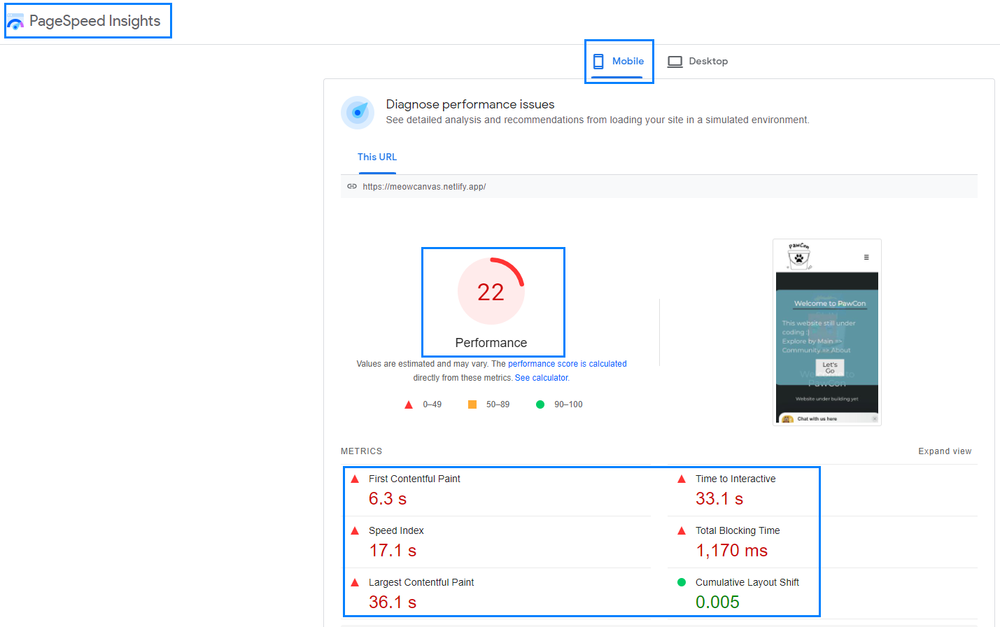

# Understanding website loading speed 

Visit below website to find out how your website is doing in terms of loading speed. 

- [PageSpeed Insight](https://pagespeed.web.dev/)

## Understanding metrics 
Here are some jargons to understand to improve your website performances. 

- First Contentful Paint : when the browser renders the first bit of content from the DOM, providing the first feedback to the user that the page is actually loading

- Largest Contentful Paint : a metric that measures the time a website takes to show the user the largest content on the screen, complete and ready for interaction

- Speed Index : a page load performance metric that shows you how quickly the contents of a page are visibly populated.

- Time to Interactive : a performance metric that measures a page's load responsiveness and helps identify situations where a page looks interactive but actually isn't.

- Total Blocking Time : Total Blocking Time (TBT) is the amount of time, during which Long Tasks (all tasks longer than 50ms) block the main thread and affect the usability of a page. It shows how unresponsive a page is before it becomes fully interactive.

For example, 

## Reference
- [15 To 98 On Mobile On Google PageSpeed Insights - Speed Up Elementor](https://youtu.be/vrzz7NY42dQ)
