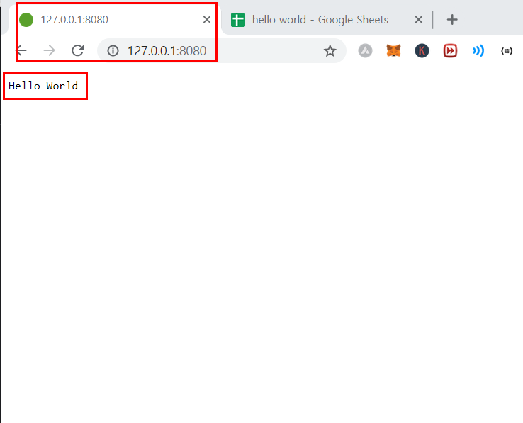
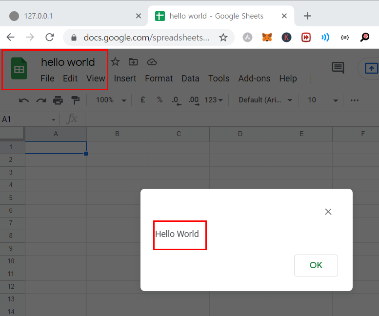

# Javascript
Javascript has been evolving to take care of not only front-side tasks but also server-side and app. 

Below you can find 
<ol>
    <li> a hello world web server created with Javascript </li>
    <li> a hello world app script created with Javascript </li>
</ol>

  

Today, as of 2021, Javascript can be used in 
<ul>
    <li>Web browser</li>
    <li>Web server</li>
    <li>App script</li>
</ul>
Thus, what Javascript developer should do is to be able to write codes that work well in all the above environments. 
